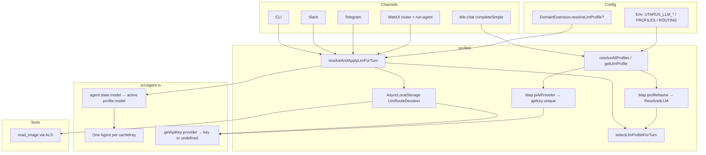

# Multi-LLM Task Routing for Utarus

| Field | Value |
| --- | --- |
| **Title** | Multi-LLM task routing (named profiles + deterministic router) |
| **Author** | _(TBD)_ |
| **Date** | 2026-07-19 |
| **Status** | Approved for implementation (design review consensus, 2026-07-19) |
| **Scope** | Design only — no implementation in this document |
| **Permanent home** | `docs/multi-llm-routing-design.md` (utarus repo, alongside `docs/tasks-framework-design.md`, `docs/paywall-stripe-design.md`) |
| **Codebase verified against** | `/Users/zhengqingqiu/projects/utarus/src/` (standalone; prefer over `invage/node_modules/utarus`) |

---

## Overview

Utarus today resolves a **single process-global LLM** via `getAgentLLM()` in `src/llm/index.ts`, driven by `UTARUS_LLM_PROVIDER` (`deepseek` \| `kimi` \| `generic`). That model is fixed at Agent construction in `src/agent.ts` (`initialState.model` + a single-key `getApiKey`), and every call site — WebUI chat (`run-agent.ts` / `router.ts`), Telegram, Slack, CLI, title generation (`title-chat.ts`), hydrate (`hydrate-agent.ts`), system prompt (`framework.ts` `buildSystemPrompt`), and vision gates (`getAgentLlmCapabilities().imageInput`) — assumes one provider/model for the whole process.

Operators want **task-shaped model selection** without forking the framework or switching the entire deployment: e.g. **DeepSeek** for ordinary daily chat, **Kimi K3** for image/vision turns and heavier reasoning. This design makes multi-LLM routing a **framework feature** in utarus. Domain agents (Invage, Binary, Marie, …) consume it through config and an optional DomainExtension hook; they must not reimplement routing.

**Recommended approach:** **named LLM profiles + a deterministic, fail-fast router** that selects a profile **once per user turn** (before `agent.prompt()`), mutates `agent.state.model`, installs the decision into **AsyncLocalStorage** (concurrent-safe active route for tools/usage), and dispatches API keys via multi-provider `getApiKey` that **must not throw**. Backward compatible: hosts that only set `UTARUS_LLM_PROVIDER` keep today’s single-LLM behavior.

---

## Background & Motivation

### Current state (code-backed)

| Concern | Location | Behavior today |
| --- | --- | --- |
| LLM factory | `src/llm/index.ts` | `getAgentLLM()` reads `config.llm.provider`; module-level `let cached: ResolvedLLM \| null`; `PROVIDER_DEFAULTS` for deepseek / kimi / generic with `capabilities.imageInput` |
| Capability resolution | `resolveCapabilities()` | provider default → per-model delta → `UTARUS_LLM_IMAGE_INPUT` (`true`/`false` only) |
| Config | `src/config.ts` `llm` | `provider` (`UTARUS_LLM_PROVIDER ?? 'deepseek'`), `model`, `baseUrl` — single slot. **Note:** the `?? 'deepseek'` legacy default already exists; multi-LLM PRs must not “clean it up” without a separate migration (see Non-Goals). |
| Agent construction | `src/agent.ts` `getOrCreateAgent` | `model = getAgentModel()`, `apiKey = getAgentApiKey()`, `getApiKey: () => apiKey` **ignores provider arg** |
| System prompt | `src/framework.ts` `buildSystemPrompt` | Hardcodes `You are powered by **${modelLabel}**` and vision section from **one** `getAgentLLM().capabilities.imageInput` |
| Boot validation | `src/index.ts` `validateConfig` | Validates **one** provider’s keys from `config.llm.provider`; logs `LLM ready: provider=… model=…` |
| Framework create | `src/framework.ts` `createFramework` | Billing assert only; does **not** pre-resolve LLM (first `getAgentLLM` may throw later). `buildSystemPrompt` already calls `getAgentLLM()`. |
| WebUI vision gate | `src/webapp/chat/router.ts` `visionEnabled()` | `getAgentLlmCapabilities().imageInput` inside **try/catch → false** (soft-fail). Photo attach + `/messages` with attachments rejected if false. `GET /agent` also constructs an agent for streaming status. |
| Photo path | `attachments.ts` + `router.ts` + `run-agent.ts` | Base64 upload → `data/chats/<slug>/attachments/`; turn passes `images[]` into `agent.prompt(message, images)`. Attachments validated **before** busy/steer branch. |
| Mid-turn vision tool | `src/tools/read-image.ts` | Process-wide tool factory; **no Agent ref**. Fails if `getAgentLlmCapabilities().imageInput` is false |
| Slack ALS pattern | `src/interfaces/slack/run-context.ts` | `AsyncLocalStorage<RunContext>` + `runWithContext` / `getRunContext` — tools read per-run context without threading params |
| Hydrate | `src/webapp/chat/hydrate-agent.ts` | Rebuilds history with `getAgentModel()` provider/id on assistant stubs; reloads attachments as image parts |
| Titles | `src/webapp/chat/title-chat.ts` | `completeSimple(getAgentModel(), …, { apiKey: getAgentApiKey() })` — not the agent pool |
| Usage | `src/usage/usage-file.ts`, `agent-tracking.ts` | Aggregate `period_llm` / `lifetime_llm`; month rollover resets `period_llm` + `period_tools` only; version 1 |
| Caps | `src/usage/caps.ts` | `llm_total_tokens` / `llm_cost_usd` aggregate only |
| DomainExtension | `src/extension.ts` | purpose, tools, skills, channel commands, `enrichMessage`, webUi, billing — **no LLM hook** |
| pi-agent-core | Agent API | `AgentState.model` is mutable; `AgentOptions.getApiKey?: (provider: string) => …` — **must not throw or reject; return `undefined` when no key** |
| Compaction | — | **None** in utarus today (no context-compaction LLM path) |

### Pain points

1. **All-or-nothing provider switch** — enabling WebUI photos forces the whole deployment onto Kimi (cost + latency for every daily chat turn).
2. **Capability gates are global** — `visionEnabled()`, system-prompt vision section, and `read_image` all bind to one process-wide `imageInput`.
3. **Spend opacity** — usage YAML cannot attribute tokens to DeepSeek vs Kimi, so operators cannot tune routing or caps by model.
4. **Domain reimplementation risk** — without a framework router, each host invents its own dual-agent or env hacks; history and usage diverge.

### Product intent (examples)

1. Default daily chat → cheap/fast **DeepSeek**.
2. Message with images → **Kimi K3** (vision).
3. “Complicated” / heavy reasoning → stronger model (explicit operator rules + optional domain hook — **not** opaque auto-magic).

---

## Goals & Non-Goals

### Goals

1. **Multiple named LLM profiles** resolvable from env/config, reusing `PROVIDER_DEFAULTS` + fail-fast key/model/baseUrl rules.
2. **Deterministic per-turn routing** before `agent.prompt()` / `completeSimple`, with an ordered rule table and optional domain override.
3. **Hard vision correctness**: image attachments never hit a non-vision model (no silent pi-ai placeholder downgrade).
4. **Backward compatibility**: unset multi-profile config ⇒ today’s single-LLM path (`UTARUS_LLM_PROVIDER` / legacy `getAgentLLM` semantics).
5. **Multi-provider `getApiKey`** so one Agent instance can alternate models across turns while keeping shared history.
6. **Usage attribution** by profile/provider/model (while keeping aggregate counters for existing caps).
7. **Boot-time validation** of every referenced profile (keys, model id, base URL, vision route capability).
8. **UI capability aggregation** so the SPA photo button reflects *whether a validated vision route exists*, not only the default profile.
9. **Framework-owned**: domains configure profiles/routes and optional `resolveLlmProfile`; they do not fork agent construction.
10. **Incremental PR plan** mergeable against current patterns.
11. **Concurrent-safe active route** for tools (`read_image`) and usage tracking under multi-user runs (AsyncLocalStorage).
12. **Single shared helper** for “resolve domain vote → select profile → apply to agent → enter ALS” so channels do not diverge.

### Non-Goals

1. Implementing production code in this document.
2. **LLM-as-router** (classifier model every turn) as the primary v1 mechanism.
3. **Separate Agent instances per model** that split conversation history (rejected as default).
4. Mid-tool-loop model switching (e.g. upgrade to Kimi *after* `read_image` returns mid-turn) in v1.
5. **Separate** per-model monthly budgets (e.g. “100k DeepSeek + 50k Kimi”). Caps stay **one** unified limit; optional **weights** only (K21). Stripe price-by-model is still out of scope for v1.
6. User-facing model picker UI / SPA active-model chip (explicitly declined 2026-07-19).
7. Caching for performance beyond the existing correctness-oriented resolve-once profile map (same class of cache as today’s `cached: ResolvedLLM`).
8. Changing provider wire formats, pi-ai streaming, or adding new well-known providers beyond extending `PROVIDER_DEFAULTS` as today.
9. Context compaction / summarization LLM path (does not exist; when added, must pick a profile — see Side paths).
10. **Removing or changing the legacy `UTARUS_LLM_PROVIDER ?? 'deepseek'` default** in multi-LLM PRs. That default predates this feature; cleaning it up needs its own migration plan and is explicitly out of scope here.
11. Stripping historical image parts from hydrate when the next model is text-only (optional v2; v1 accepts pi-ai placeholders for *past* turns).

---

## Key Decisions

| # | Decision | Rationale |
| --- | --- | --- |
| **K1** | **Named profiles + deterministic router** (not dual agents, not LLM-as-router) | Explicit operator control, fail-fast validation, shared history on one Agent, low latency/cost. Matches “prefer explicit configuration over clever auto-routing.” |
| **K2** | **Two modes**: *legacy single-LLM* when multi-profile env is absent; *routing mode* when `UTARUS_LLM_PROFILES` is set | Preserves `UTARUS_LLM_PROVIDER=deepseek` (or omit) deployments without migration. |
| **K3** | **Route once per turn, before `prompt()`** — set `agent.state.model`; never switch mid-tool-loop in v1 | pi-agent-core runs a multi-step tool loop on one model; mid-loop switch risks partial tool results and inconsistent vision. |
| **K4** | **Rule order (fixed)**: (1) images on this turn → vision profile, (2) domain `resolveLlmProfile` if set, (3) built-in optional heavy rules, (4) `default` profile | Images are a hard capability requirement; domain intent outranks heuristics; default is last. |
| **K5** | **No silent fallback** to another profile if the selected profile’s key/model is missing or a rule names an unknown profile — **throw** (boot or turn) with clear message; map to HTTP per § HTTP status table | Project rule: fail fast, no fallback defaults for required multi-route config. |
| **K6** | **`getApiKey(provider)` multi-dispatch must not throw** — return registered key or `undefined` per pi-agent-core contract. Keys resolved fail-fast at **profile resolve / boot / route time**. | Library contract: throwing from `getApiKey` can break the agent loop without a normal event sequence. |
| **K7** | **Profile cache is a `Map<profileName, ResolvedLLM>`** resolved/validated at boot (or first assert) — same correctness class as today’s single `cached` | Not a performance optimization; env changes still require process restart. |
| **K8** | **System prompt**: multi-mode uses **neutral multi-model wording** + per-turn **`[Active model: …]`** prefix on the agent-facing message; single-mode keeps current `You are powered by **${modelLabel}**` | Avoids lying about identity after a mid-conversation switch; mirrors existing `WEB_CHANNEL_HINT` injection in `router.ts`. |
| **K9** | **UI `capabilities.imageInput`** = whether a **validated vision route** exists (`routing.has_images` → profile with `imageInput: true`), not merely the default profile, and **not** “any profile that happens to have vision” | Enables photo attach while default stays DeepSeek; avoids advertising photos when no route would accept them. |
| **K10** | **Active turn model for tools/usage via AsyncLocalStorage** (`src/llm/run-context.ts`, same pattern as Slack `run-context.ts`). `read_image` and usage read ALS; fail-fast tool result if missing mid-tool. **Reject** process-global last-profile. | Concurrent multi-user runs; process-wide tools have no Agent ref. |
| **K11** | **Side paths** (title summarization): use routing profile `utility` if set, else `default` | Titles are cheap text tasks; must not require vision keys when unnecessary; still fail-fast if utility profile is misconfigured. |
| **K12** | **Usage**: keep aggregate `period_llm` for caps; add `period_llm_by_profile` / `lifetime_llm_by_profile`; **on calendar period rollover reset `period_llm_by_profile` to `{}`** (lifetime map kept). **Cap check is unified** across models; optional **per-profile weight** multiplies tokens/cost only at check time (raw counters stay unweighted). See K21. | One user budget; expensive models can burn the budget faster without separate per-model caps. |
| **K21** | **Unified caps with optional weights** (product 2026-07-19): one `llm_total_tokens` / `llm_cost_usd` cap per user. If weight config is **absent**, every profile has weight **1**. If weight config is **present**, every **declared** profile must list an explicit positive weight — missing profile = boot fail (no silent 1). | Matches “unified cap, different weight”; no silent partial weight maps. |
| **K22** | **No SPA active-model chip** (product 2026-07-19). **No sticky vision session** — re-evaluate each turn. **Telegram/Slack images are on the roadmap** and must use the same `hasImages` + helper path when built. | Closes open questions 1, 2, 4. |
| **K23** | **Task runs use the same auto-router** as interactive turns (product 2026-07-19). Task runner **must** call `resolveAndApplyLlmForTurn` (not `getAgentModel()` / forced profile). No special-case “tasks always heavy.” | One routing brain; scheduled work inherits vision/heavy/domain rules from the turn context. |
| **K13** | **Persist route metadata** on **all** assistant appends after a routed turn (`llm: { profile, provider, model, reason? }`), including error/empty text | Audit “which model failed?”; hydrate honesty. |
| **K14** | **Complex-task detection v1** = explicit, optional, operator-configured rules (min chars / keyword list) + **DomainExtension.resolveLlmProfile** — **no** ML classifier | Predictable, testable, no hidden model spend. |
| **K15** | **When `hasImages === true`, do not call `resolveLlmProfile`** (domain cannot force a non-vision model for image turns) | Hard capability constraint; avoids wasted async domain work. |
| **K16** | **Boot validation**: standalone `validateConfig` + `createFramework` both call `assertLlmConfig()` **before** `buildSystemPrompt`. Routing mode: **resolve and validate every declared profile** in `UTARUS_LLM_PROFILES` (keys, model, baseUrl, capabilities); assert every routing target exists in that set; assert `has_images` vision; assert K17 on the full set. Do **not** skip unused declared profiles. Ignore legacy `UTARUS_LLM_PROVIDER` key checks in routing mode. | Dead misconfigured profiles fail boot (fail-fast); domain hosts never hit standalone main; prompt build already calls LLM resolve. |
| **K17** | **One secret per pi-ai provider wire name**: at boot, build `Map<piAiProvider, apiKey>`; **throw** if two profiles register **different** non-empty keys for the same `model.provider` (e.g. two generics with different keys). Same key twice is OK. | `getApiKey(provider)` is keyed only by pi-ai provider string; silent wrong-key is forbidden. |
| **K18** | **One framework helper** `resolveAndApplyLlmForTurn` (or equivalent name) is **mandatory** for all interactive channels; titles use a small utility resolver only | Prevents divergent order (domain hook / ALS / model set / prefix) across WebUI/Telegram/Slack/CLI. |
| **K19** | **Capability resolution never catch-to-false**. WebUI maps throws via **route-local try/catch** to **500 JSON** (`llm_config_error`) — no global Express error middleware. `400 vision_disabled` only when config is valid and UI vision is intentionally false. | Soft-fail `visionEnabled()` today hides routing misconfig; chat router has no global error handler for stable JSON. |
| **K20** | **PR2 split**: core router+agent (2a) → WebUI (2b) → Telegram/Slack/CLI (2c) | Independently reviewable merges; WebUI is highest-value vision path. |

---

## Terminology

| Term | Definition |
| --- | --- |
| **Profile** | Named, fully resolved LLM binding: provider kind, model id, base URL, api key, capabilities. e.g. `daily`, `vision`. |
| **Route / routing table** | Maps selection reasons (`default`, `has_images`, `utility`, `heavy`) to profile names. |
| **Turn** | One user→agent invocation: from selection through `prompt()` + tool loop until idle. |
| **Active model** | `agent.state.model` for the current turn after routing. |
| **Active route (ALS)** | `LlmRouteDecision` stored in AsyncLocalStorage for the duration of the turn/run. |
| **Legacy mode** | Multi-profile env absent; behavior identical to today’s single `getAgentLLM()`. |
| **Routing mode** | `UTARUS_LLM_PROFILES` present; `UTARUS_LLM_ROUTING` **required** (missing/invalid → throw). |

---

## Proposed Design

### Architecture



### Per-turn sequence (WebUI)

```mermaid
sequenceDiagram
  participant SPA as WebUI SPA
  participant R as chat/router.ts
  participant H as resolveAndApplyLlmForTurn
  participant ALS as Llm ALS
  participant A as Agent cache
  participant U as usage-file

  SPA->>R: POST /messages {text, attachments?}
  R->>R: load attachments / enrichMessage / caps
  alt isStreaming and queue and images and active model text-only
    R-->>SPA: 409 steer_images_unsupported
  end
  R->>H: agent + FrameworkHandle + ctxBase
  H->>H: skip domain hook if hasImages else await resolveLlmProfile
  H->>H: selectLlmProfileForTurn
  H->>A: agent.state.model = resolved.model
  H->>ALS: enter decision for run scope
  H-->>R: decision + prefixActiveModel helper
  Note over R: Prefix agent text with Active model line
  R->>A: agent.prompt inside ALS scope
  A->>A: tool loop; read_image reads ALS
  A-->>U: message_end usage from ALS + message
  R->>R: appendMessage assistant + llm metadata always
```

### Mode selection

```text
if process.env.UTARUS_LLM_PROFILES is unset or empty-string:
  → LEGACY MODE
    - Single synthetic profile name: "default"
    - Built from UTARUS_LLM_PROVIDER / MODEL / BASE_URL / keys (today’s getAgentLLM)
    - Router always returns "default"
    - Public getAgentLLM() / getAgentModel() / getAgentApiKey() unchanged semantically
else:
  → ROUTING MODE
    - Parse UTARUS_LLM_PROFILES (JSON object) — empty {} throws
    - Parse UTARUS_LLM_ROUTING (JSON object) — REQUIRED
      * missing, empty, or invalid JSON → throw at assertLlmConfig / boot
      * NO “profiles-only / implicit default-only routing” path
    - Resolve + validate **every declared profile** in UTARUS_LLM_PROFILES (keys, model, baseUrl, capabilities) — unused entries still fail boot if broken (K16)
    - Assert every UTARUS_LLM_ROUTING target name exists among declared profiles
    - Assert has_images (if set) is vision-capable; assert K17 key uniqueness on the full set
    - Ignore UTARUS_LLM_PROVIDER / config.llm.provider|model|baseUrl for agent resolution
      (document: operators must not expect legacy env to select the default profile)
```

**Fail-fast:** In routing mode, incomplete JSON, unknown provider, missing key env, missing model/baseUrl for generic, unknown profile name in routing, conflicting keys for the same pi-ai provider, or `has_images` → non-vision profile → **throw with the exact missing/conflicting symbol** (no silent “use deepseek anyway”).

### Profile resolution

Reuse the internals of today’s factory (`PROVIDER_DEFAULTS`, `resolveCapabilities`) but parameterize by profile config rather than only `config.llm`.

```ts
/** Operator-facing profile config (one entry in UTARUS_LLM_PROFILES). */
export interface LlmProfileConfig {
  /** Well-known provider kind — same union as config.llm.provider. */
  provider: 'deepseek' | 'kimi' | 'generic';
  /** Override default model id for this provider. */
  model?: string;
  /** Override OpenAI-compatible base URL. */
  baseUrl?: string;
  /**
   * Env var name holding the API key for this profile.
   * Defaults to PROVIDER_DEFAULTS[provider].apiKeyEnv
   * (DEEPSEEK_API_KEY / KIMI_API_KEY / UTARUS_LLM_API_KEY).
   */
  apiKeyEnv?: string;
  /**
   * Optional strict override for imageInput: true | false only.
   * When omitted, use provider/model defaults (same as resolveCapabilities
   * without a process-global UTARUS_LLM_IMAGE_INPUT).
   */
  imageInput?: boolean;
}

export interface LlmRoutingConfig {
  /** Profile for ordinary turns. Required in routing mode. */
  default: string;
  /**
   * Profile for turns with user image attachments (and any future channel
   * image inputs). Required for photo UI: getUiLlmCapabilities().imageInput
   * is true only when this is set and the profile has imageInput.
   */
  has_images?: string;
  /**
   * Profile for non-agent side LLM calls (title generation).
   * When omitted, uses `default`.
   */
  utility?: string;
  /**
   * Profile for optional heavy/complex turns (rules + domain hook target).
   * When omitted, heavy rules are disabled (domain may still return any
   * configured profile name).
   */
  heavy?: string;
}

export interface ResolvedLLM {
  model: Model<'openai-completions'>;
  apiKey: string;
  capabilities: LlmCapabilities;
  /** Profile name; "default" in legacy mode. */
  profileName: string;
}
```

**Legacy synthesis** (no `UTARUS_LLM_PROFILES`):

| Field | Source |
| --- | --- |
| provider | `config.llm.provider` (`UTARUS_LLM_PROVIDER ?? 'deepseek'`) — **leave this default alone** |
| model / baseUrl | same as today |
| apiKeyEnv | `UTARUS_LLM_API_KEY_ENV` or provider default |
| imageInput override | process `UTARUS_LLM_IMAGE_INPUT` (legacy only) |

**Routing-mode imageInput:** per-profile `imageInput` field only (plus provider/model defaults). Do **not** apply process-global `UTARUS_LLM_IMAGE_INPUT` to every profile (that would re-introduce all-or-nothing). If operators need a global override, set it on each profile explicitly.

### API key registry (K6, K17)

At profile resolution / `assertLlmConfig`:

1. For each profile, resolve `apiKey` from `apiKeyEnv` (fail if missing).
2. Build `Map<string /* piAiProvider */, string /* apiKey */>`:
   - If the provider is not yet registered → set.
   - If already registered with the **same** key → OK.
   - If already registered with a **different** key → **throw**:
     ```
     Conflicting API keys for pi-ai provider "openai": profiles "a" and "b"
     register different secrets. One secret per pi-ai provider wire name is required.
     ```
3. **Constraint for operators:** two profiles that share the same `PROVIDER_DEFAULTS[kind].piAiProvider` (e.g. two `generic` profiles, or two `kimi` profiles) **must** use the same API key. Different base URLs with the same key are allowed; different keys are not.

**`getApiKey` on Agent (must not throw):**

```ts
getApiKey: (provider: string) => {
  // Prefer active route's key when ALS is set and model.provider matches —
  // same secret as registry when boot constraints hold.
  const active = getActiveLlmRoute(); // ALS
  if (active && active.resolved.model.provider === provider) {
    return active.resolved.apiKey;
  }
  return getApiKeyForPiProvider(provider); // string | undefined — never throw
},
```

- Missing key at stream time → return `undefined` (pi-ai handles absence). With boot asserts + route-time resolved profiles, this path should be unreachable in production.
- **Do not** throw inside `getApiKey`. Misconfig is surfaced earlier via `assertLlmConfig` / `selectLlmProfileForTurn` / `getLlmProfile`.

### Env surface (concrete)

```bash
# ── Legacy (unchanged) ──────────────────────────────────────────
# UTARUS_LLM_PROVIDER=deepseek|kimi|generic
# UTARUS_LLM_MODEL=…
# UTARUS_LLM_BASE_URL=…
# DEEPSEEK_API_KEY / KIMI_API_KEY / UTARUS_LLM_API_KEY
# UTARUS_LLM_IMAGE_INPUT=true|false

# ── Routing mode ────────────────────────────────────────────────
UTARUS_LLM_PROFILES='{
  "daily":  { "provider": "deepseek" },
  "vision": { "provider": "kimi" },
  "heavy":  { "provider": "kimi", "model": "k3" }
}'

UTARUS_LLM_ROUTING='{
  "default": "daily",
  "has_images": "vision",
  "utility": "daily",
  "heavy": "heavy"
}'

# Optional heavy heuristics (all optional; if heavy route unset, ignored)
UTARUS_LLM_ROUTE_HEAVY_MIN_CHARS=4000
UTARUS_LLM_ROUTE_HEAVY_KEYWORDS=deep dive,comprehensive analysis,step by step proof
```

**Parsing rules:**

- `UTARUS_LLM_PROFILES` / `UTARUS_LLM_ROUTING`: JSON objects only. Invalid JSON → throw with parse error.
- Profile names: `/^[a-z][a-z0-9_]*$/` (lowercase snake). Invalid → throw.
- Keyword list: comma-separated; `parseHeavyKeywords()` returns **lowercased**, trimmed, non-empty tokens; match against `text.toLowerCase()` (case-insensitive substring on **heuristic text** — see `LlmTurnContext.text`).
- Empty profiles object `{}` → throw (`at least one profile required`).
- Profiles set + routing missing/invalid → **throw** (no implicit default-only routing).

**Example Invage deployment:**

```bash
DEEPSEEK_API_KEY=sk-…
KIMI_API_KEY=sk-…
UTARUS_LLM_PROFILES='{"daily":{"provider":"deepseek"},"vision":{"provider":"kimi"}}'
UTARUS_LLM_ROUTING='{"default":"daily","has_images":"vision","utility":"daily"}'
```

Daily chat stays on DeepSeek; photo turns use Kimi; titles stay on DeepSeek.

### Router

```ts
export interface LlmTurnContext {
  /** True when this turn includes user image parts (WebUI attachments, future channel images). */
  hasImages: boolean;
  /**
   * Text used for heavy heuristics AND passed to domain resolveLlmProfile.
   *
   * Normative contents:
   *   - User-visible message text (the same string that would be stored as the
   *     chat bubble, before WEB_CHANNEL_HINT / Active-model prefixes).
   *   - PLUS optional domain enrich payload when the channel already applied
   *     enrichMessage for the agent (domains that enrich must accept that
   *     enrich can affect heavy_chars / keywords — document for domain authors).
   *   - NEVER include: WEB_CHANNEL_HINT, [Active model: …] prefix, or other
   *     framework injection lines.
   */
  text: string;
  userSlug: string;
  isAdmin: boolean;
  channel: 'web' | 'telegram' | 'slack' | 'cli' | 'title' | 'task' | 'other';
  conversationId?: string;
  /**
   * Domain vote already resolved by resolveAndApplyLlmForTurn.
   * selectLlmProfileForTurn itself does not call the domain hook.
   * Must be a configured profile name when non-empty.
   */
  domainProfile?: string | null;
}

export interface LlmRouteDecision {
  profileName: string;
  reason: 'has_images' | 'domain' | 'heavy_chars' | 'heavy_keyword' | 'default' | 'utility' | 'legacy';
  resolved: ResolvedLLM;
}

export function selectLlmProfileForTurn(ctx: LlmTurnContext): LlmRouteDecision {
  // 1. Images — hard
  // 2. domainProfile if non-null/non-empty string
  // 3. heavy heuristics if routing.heavy set
  // 4. default
  // utility is only selected by side-path callers (channel: 'title')
}
```

**Reason priority (interactive channels):**

| Priority | Condition | Profile | Fail if |
| --- | --- | --- | --- |
| 1 | `ctx.hasImages === true` | `routing.has_images` | `has_images` unset, unknown profile, or `!capabilities.imageInput` |
| 2 | `ctx.domainProfile` is non-empty string | that name | unknown profile |
| 3 | heavy rules match and `routing.heavy` set | `routing.heavy` | unknown profile |
| 4 | else | `routing.default` | missing default |

**Title / utility path:** callers pass `channel: 'title'`; router returns `utility ?? default` with reason `utility` (titles never have images).

### Shared helper: `resolveAndApplyLlmForTurn` (K18) — mandatory

All interactive channels **must** use this helper. Titles **must not** (they use `resolveUtilityLlm()` only — no Agent, no domain hook).

```ts
// src/llm/apply-route.ts (name flexible; module under src/llm/)

export interface ApplyLlmTurnParams {
  agent: Agent;
  /** For domain hook + isAdmin context. */
  extension: DomainExtension;
  userSlug: string;
  isAdmin: boolean;
  channel: Exclude<LlmTurnContext['channel'], 'title'>;
  conversationId?: string;
  hasImages: boolean;
  /**
   * Heuristic / domain text — see LlmTurnContext.text normative rules.
   * Channel builds this once and passes it here.
   */
  text: string;
}

export interface ApplyLlmTurnResult {
  decision: LlmRouteDecision;
  /**
   * Prepend to the agent-facing prompt string (not user-visible storage).
   * e.g. "[Active model: Kimi k3 | profile=vision | reason=has_images]\n\n"
   */
  activeModelPrefix: string;
  /**
   * Run async work (agent.prompt + waitForIdle, or channel equivalent) inside
   * ALS so read_image / usage / getApiKey see this turn's decision.
   * Always use this wrapper for the full agent run, not only the first tick.
   *
   * WebUI fire-and-forget: the HTTP handler may `res.json` without awaiting the
   * agent. ALS lifetime is the **promise** returned by runWithLlmRoute, not the
   * request. Anti-pattern (FORBIDDEN): enter ALS only for sync setup, then call
   * bare runAgent() outside runWithLlmRoute — tools/usage would see empty ALS.
   *
   * Normative WebUI pattern:
   * ```ts
   * const applied = await resolveAndApplyLlmForTurn({...});
   * const promptText =
   *   applied.activeModelPrefix + WEB_CHANNEL_HINT + '\n\n' + userTurn;
   * void applied
   *   .runWithLlmRoute(() =>
   *     runAgent({ messageId, userSlug, agent, message: promptText, images, onComplete }),
   *   )
   *   .catch((e) => { ... emit error/end ... });
   * res.json({ kind: 'run', messageId, conversationId, ... });
   * ```
   */
  runWithLlmRoute: <T>(fn: () => T | Promise<T>) => Promise<T>;
}

/**
 * 1. If !hasImages && extension.resolveLlmProfile → await hook
 *    If hasImages → do NOT call the hook (K15).
 * 2. selectLlmProfileForTurn({ …, domainProfile })
 * 3. agent.state.model = decision.resolved.model
 * 4. setWeakMap optional diagnostic; primary store is ALS inside runWithLlmRoute
 * 5. log [llm/route] …
 * 6. return decision + prefix + runWithLlmRoute
 */
export async function resolveAndApplyLlmForTurn(
  params: ApplyLlmTurnParams,
): Promise<ApplyLlmTurnResult>;

/** Titles / completeSimple side paths. */
export function resolveUtilityLlm(): LlmRouteDecision;
```

**ALS module** (`src/llm/run-context.ts` — parallel to Slack’s `interfaces/slack/run-context.ts`):

```ts
import { AsyncLocalStorage } from 'async_hooks';

const storage = new AsyncLocalStorage<LlmRouteDecision>();

export function runWithLlmRoute<T>(decision: LlmRouteDecision, fn: () => T): T {
  return storage.run(decision, fn);
}

export function getActiveLlmRoute(): LlmRouteDecision | undefined {
  return storage.getStore();
}

/** Fail-fast for tools that require an active turn. */
export function requireActiveLlmRoute(toolName: string): LlmRouteDecision {
  const d = getActiveLlmRoute();
  if (!d) {
    throw new Error(
      `${toolName}: no active LLM route in AsyncLocalStorage. ` +
        `Interactive agent runs must use resolveAndApplyLlmForTurn().runWithLlmRoute.`,
    );
  }
  return d;
}
```

**Rejected:** any process-global `let lastRoute` / “last profile name” variable for tools or usage.

**WeakMap&lt;Agent, decision&gt;** is optional for diagnostics only; **not** the source of truth for tools (multiple agents can run concurrently; tools lack Agent refs).

### Domain hook integration (`src/extension.ts`)

```ts
export interface ResolveLlmProfileContext {
  /** Same normative text as LlmTurnContext.text (no channel/Active-model prefixes). */
  text: string;
  /**
   * Always false when the hook is invoked: framework does not call the hook
   * when hasImages === true (K15). Field kept for a stable ctx shape / tests.
   */
  hasImages: boolean;
  userSlug: string;
  isAdmin: boolean;
  channel: LlmTurnContext['channel'];
  conversationId?: string;
}

export interface DomainExtension {
  // … existing fields …

  /**
   * Optional: vote for an LLM profile name for this turn.
   * Return null/undefined to abstain (framework continues with heavy/default).
   *
   * Framework **does not call** this when the turn has user images
   * (hasImages === true). Domain cannot force a non-vision model on image turns.
   * Unknown names fail the turn (no silent fallback).
   */
  resolveLlmProfile?: (
    ctx: ResolveLlmProfileContext,
  ) => string | null | undefined | Promise<string | null | undefined>;
}
```

**When the domain hook runs:** inside `resolveAndApplyLlmForTurn`, after access-gate / `enrichMessage` at the channel, only when `hasImages === false`. Async allowed; throw → fail the turn (HTTP 500 / channel error text).

**Complex-task / heavy rules (built-in, optional):**

| Rule id | Trigger | Notes |
| --- | --- | --- |
| `heavy_chars` | `text.length >= UTARUS_LLM_ROUTE_HEAVY_MIN_CHARS` | Integer ≥ 1; unset = disabled; `text` = normative heuristic string |
| `heavy_keyword` | any keyword from `UTARUS_LLM_ROUTE_HEAVY_KEYWORDS` is a case-insensitive substring of `text` | Unset/empty = disabled |

Both require `routing.heavy` to be set. First matching rule wins (chars before keywords for determinism). **Not** ML. Domains that need richer logic implement `resolveLlmProfile`.

### Agent wiring changes

**Today** (`src/agent.ts`):

```ts
const model = getAgentModel();
const apiKey = getAgentApiKey();
const agent = new Agent({
  initialState: { systemPrompt, model, tools },
  getApiKey: () => apiKey, // ignores provider
});
```

**Target:**

```ts
const seed = getDefaultLlm(); // routing.default or legacy
const agent = new Agent({
  initialState: { systemPrompt, model: seed.model, tools },
  // MUST NOT throw — pi-agent-core contract
  getApiKey: (provider: string) => {
    const active = getActiveLlmRoute();
    if (active && active.resolved.model.provider === provider) {
      return active.resolved.apiKey;
    }
    return getApiKeyForPiProvider(provider); // string | undefined
  },
});
```

**Before every interactive `prompt`:** call `resolveAndApplyLlmForTurn`, then `runWithLlmRoute(async () => { agent.prompt(...); await agent.waitForIdle(); })` (or channel equivalent).

Call sites (**only via helper**):

| Call site | File | Notes |
| --- | --- | --- |
| WebUI message | `webapp/chat/router.ts` + `run-agent.ts` | Helper in router; ALS scope must wrap entire `runAgent` body |
| Telegram | `interfaces/telegram.ts` `callAgent` | Helper before prompt |
| Slack | `interfaces/slack/app.ts` | Helper; may nest with existing Slack `runWithContext` (compose outer/inner ALS — both independent stores) |
| CLI | `interfaces/cli.ts` | Helper before prompt |
| Titles | `title-chat.ts` | `resolveUtilityLlm()` only — no Agent ALS required for titles; usage records utility profile from decision |
| Future task runs | tasks design | Same interactive helper with `channel: 'task'` |

### Steer / queue path (WebUI) — ordered checks

Today attachments are accepted whenever `visionEnabled()` is true **before** the busy/steer branch (`router.ts` ~424–546). v1 **must** re-check against the **in-flight** model after the agent is resolved:

```text
1. Parse body; if attachments present:
   a. If !getUiLlmCapabilities().imageInput → 400 vision_disabled
      (config valid, stack has no vision route)
   b. Load attachment files → images[]
2. Resolve conversation + getOrCreateAgent
3. If agent.state.isStreaming && queueFlag:
   a. If images?.length > 0 && !activeModelSupportsImage(agent):
        → 409 { error: 'steer_images_unsupported', message: '…' }
        Do NOT call agent.steer with images onto a text-only active run.
   b. Else agent.steer(...)  // steers inherit in-flight model; no re-route
4. Else (new run):
   a. await resolveAndApplyLlmForTurn({ hasImages: !!images?.length, … })
   b. void applied.runWithLlmRoute(() => runAgent(...)).catch(...)
      then res.json({ kind: 'run', ... }) without awaiting the agent
      — ALS covers the full detached promise, not the HTTP request lifetime
```

`activeModelSupportsImage(agent)` := `Array.isArray(agent.state.model?.input) && agent.state.model.input.includes('image')` **or** ALS decision if still in a prior run’s scope (prefer reading `agent.state.model` for steer because prior ALS may have exited).

Steers **do not** re-run the router (in-flight tool loop stays on one model). Rejecting image steers onto text-only runs is mandatory fail-fast (no silent image drop).

### Shared history across models

One Agent instance per `agentCacheKey` keeps `agent.state.messages` across turns. Implications:

| Topic | Behavior |
| --- | --- |
| Context window | Profiles may differ (DeepSeek 1M vs Kimi 256k in `PROVIDER_DEFAULTS`). **v1:** no automatic truncation; if a provider rejects oversized context, surface the error. |
| Vision parts in history | Hydrated user turns may include image parts. Text-only active model: pi-ai `transform-messages` / `downgradeUnsupportedImages` rewrites to placeholders — **acceptable for past turns** when the *current* turn has no new images. New image turns force vision profile. **v1 non-goal:** strip image parts from hydrate for text-only next model. |
| Thinking / reasoning formats | Each model carries its own `compat` / `thinkingLevelMap`. pi-ai `transformMessages` **drops redacted thinking and rewrites thinking** when `assistantMsg.provider/api/model` ≠ active model. Multi-step DeepSeek→Kimi conversations can **lose reasoning blocks** (usually OK for product). |
| Tool-call IDs | Cross-provider transcript transform may **normalize tool-call ids**. Not fully lossless; surface provider errors; **no silent repair** of history. |
| Tool results with images | `read_image` only succeeds when active route has vision (K10 + ALS). |

### System prompt identity

**Legacy mode** — keep current `buildSystemPrompt` behavior:

```text
You are powered by **${modelLabel}**. Never say you are Claude, GPT, …
```

**Routing mode** — at `createFramework` time (**after** `assertLlmConfig()`), build a multi-model section:

```text
You run on a multi-model stack. Configured profiles:
  - daily: DeepSeek deepseek-v4-pro (default chat; text-only)
  - vision: Kimi k3 (user photo turns; vision)
The active model for this turn is injected in the user message as
[Active model: <label>]. If asked which model you are *right now*,
answer with that active label. Never claim to be Claude/GPT unless that
is the active model.
```

Vision section becomes **capability-aware of the stack**, not a single boolean:

- If `getUiLlmCapabilities().imageInput` (validated `has_images` route): describe that photo turns and `read_image` work **only when the active model is vision-capable**; on text-only turns, say so and do not invent pixels.
- Else: keep today’s text-only vision section; photo API stays disabled.

**Per-turn injection** (agent-facing only, never stored as user-visible bubble text — same rule as domain enrich / `WEB_CHANNEL_HINT`):

```text
[Active model: Kimi k3 | profile=vision | reason=has_images]

[Channel: web …]

<user turn>
```

Produced by `ApplyLlmTurnResult.activeModelPrefix` inside channel handlers / `runAgent`, not inside `appendMessage`.

### Capability aggregation (UI + tools)

| Consumer | API | Semantics |
| --- | --- | --- |
| SPA photo button | `GET /api/chat/agent` → `capabilities.imageInput` | From **`getUiLlmCapabilities()` only** — pure config resolution, **no** `getOrCreateAgent` required for the capability field. (Agent may still be created for `isStreaming` / `hasContext` when a slug is present — capabilities stay independent.) |
| `POST /attachments` / message attachments | replace soft `visionEnabled()` | Same as `getUiLlmCapabilities().imageInput`; **no try/catch → false** |
| `read_image` tool | ALS active route | `requireActiveLlmRoute('read_image')`; if `!decision.resolved.capabilities.imageInput` → fail tool result with explicit message. Do **not** call `getAgentLlmCapabilities()` for the live check. |

**`getUiLlmCapabilities()` normative algorithm:**

```text
if legacy mode:
  return getAgentLLM().capabilities
if routing mode:
  if routing.has_images is unset:
    return { imageInput: false }
  resolved = getLlmProfile(routing.has_images)  // throws if broken
  return { imageInput: resolved.capabilities.imageInput }
```

**`visionEnabled()` must not soft-fail:**

```ts
function visionEnabled(): boolean {
  // No catch-to-false. Callers must map throws to JSON 500 (see below).
  return getUiLlmCapabilities().imageInput;
}
```

**WebUI error mapping — do not rely on global Express error middleware** (utarus chat router has none today). Every call site of `getUiLlmCapabilities` / `visionEnabled` / `resolveAndApplyLlmForTurn` **must** sit in the route’s own try/catch (or a shared helper) and return stable JSON:

```ts
function mapLlmConfigError(res: Response, e: unknown): void {
  const message = e instanceof Error ? e.message : String(e);
  console.error(`[chat/llm] ${message}`);
  res.status(500).json({ error: 'llm_config_error', message });
}

// Example: GET /agent capabilities (and similarly POST /attachments, /messages)
try {
  const capabilities = { imageInput: getUiLlmCapabilities().imageInput };
  // ... rest of handler
} catch (e) {
  mapLlmConfigError(res, e);
  return;
}
```

PR2b owns wiring `mapLlmConfigError` (or equivalent) on all WebUI capability/route call sites. Uncaught throws that become default Express HTML 500 are **not** acceptable.

Attachment rejection when config is **valid** and vision is off: **`400`** `{ error: 'vision_disabled', message: VISION_DISABLED_MESSAGE }`.

Optional v1 debug field on `GET /agent` (cheap, non-breaking):

```ts
routing?: { mode: 'legacy' | 'multi'; hasImagesProfile?: string }
```

SPA continues to use boolean `capabilities.imageInput` only.

**Export additions:**

```ts
/** Default / legacy single resolution — backward compatible. */
getAgentLLM(): ResolvedLLM;
getAgentModel(): Model<…>;
getAgentApiKey(): string;
getAgentLlmCapabilities(): LlmCapabilities; // default profile

/** Multi-profile API */
getLlmProfile(name: string): ResolvedLLM; // throw if unknown / unresolved
listLlmProfiles(): ReadonlyArray<{ name: string; capabilities: LlmCapabilities; modelId: string; provider: string }>;
isLlmRoutingEnabled(): boolean;
getUiLlmCapabilities(): LlmCapabilities; // SPA / attachment gates
selectLlmProfileForTurn(ctx: LlmTurnContext): LlmRouteDecision;
resolveAndApplyLlmForTurn(params: ApplyLlmTurnParams): Promise<ApplyLlmTurnResult>;
resolveUtilityLlm(): LlmRouteDecision;
assertLlmConfig(): void;
getActiveLlmRoute(): LlmRouteDecision | undefined;
requireActiveLlmRoute(toolName: string): LlmRouteDecision;
getApiKeyForPiProvider(provider: string): string | undefined;
```

`getAgentLLM()` in routing mode returns the **default** profile (not last-used). Call sites that need the active turn model use ALS / the helper decision.

### Boot validation (K16) — decision table

| Entry | Mode | What runs | Legacy `UTARUS_LLM_PROVIDER` key checks? |
| --- | --- | --- | --- |
| Standalone `validateConfig` | Legacy | Today’s single-provider checks + `getAgentLLM()` warm | **Yes** (driven by `config.llm.provider`) |
| Standalone `validateConfig` | Routing | `assertLlmConfig()` only: **all declared profiles** + routing targets exist + key uniqueness (K17) + has_images vision | **No — skip** (avoids demanding `DEEPSEEK_API_KEY` when only Kimi profiles exist) |
| `createFramework` | Legacy | `assertLlmConfig()` → resolves default once | N/A beyond assert |
| `createFramework` | Routing | `assertLlmConfig()` **before** `buildSystemPrompt` | **No** |

**Env precedence (routing mode):**

| Env | Used? |
| --- | --- |
| `UTARUS_LLM_PROFILES` | Yes — profile set |
| `UTARUS_LLM_ROUTING` | Yes — required |
| Per-profile `apiKeyEnv` / default key envs | Yes |
| `UTARUS_LLM_ROUTE_HEAVY_*` | Yes — optional heuristics |
| `UTARUS_LLM_PROVIDER` / `UTARUS_LLM_MODEL` / `UTARUS_LLM_BASE_URL` / process-global `UTARUS_LLM_IMAGE_INPUT` | **Ignored for resolution** (operator confusion risk — document in integration guide). Still present on `config.llm` for any external reader but agent code must not use them in routing mode. |

**`createFramework` order:**

```ts
setBillingExtension(extension.billing);
if (isBillingEnabled()) assertBillingConfig(extension);
assertLlmConfig(); // BEFORE buildSystemPrompt
const systemPrompt = buildSystemPrompt(extension, allSkills);
// …
```

Log at boot (routing mode):

```text
LLM routing ready: default=daily(deepseek/deepseek-v4-pro) has_images=vision(kimi/k3) utility=daily profiles=3
```

### HTTP status / error mapping (normative)

| Situation | Surface | Code / behavior |
| --- | --- | --- |
| Boot / `assertLlmConfig` failure | Process / `createFramework` throw | No HTTP; process exit on standalone; host fails to start |
| Valid config, UI vision false, client sends attachments / upload | WebUI | **`400`** `{ error: 'vision_disabled', message }` |
| Valid UI vision, but turn routing throws (e.g. `has_images` race after config hot-edit — should not happen without restart) | WebUI | **`500`** with error message (config/runtime bug) |
| Client sends attachments while `has_images` unset | Should not reach if UI gate correct; if it does | **`400 vision_disabled`** when `getUiLlmCapabilities().imageInput === false`; if UI said true but select fails → **`500`** JSON via route try/catch |
| Capability / config throw on GET /agent, POST /attachments, POST /messages | WebUI | **`500`** `{ error: 'llm_config_error', message }` from **route-local** try/catch (`mapLlmConfigError`) — not global middleware |
| Domain hook returns unknown profile name | WebUI | **`500`** `{ error: 'llm_route_error', message: 'Unknown LLM profile "…"' }` (domain bug) |
| Domain hook throws | WebUI | **`500`** JSON with message (route try/catch) |
| Steer images onto text-only active run | WebUI | **`409`** `{ error: 'steer_images_unsupported', message }` |
| Agent already busy, queue false | WebUI | **`409`** `{ error: 'busy', … }` (unchanged) |
| Telegram / Slack / CLI route failure | Channel reply | Surface error text to user; log error; do not silently use default profile |

### Side paths

| Path | Profile | Notes |
| --- | --- | --- |
| Chat title (`summarizeChatTitle`) | `resolveUtilityLlm()` → `utility` ?? `default` | `completeSimple` with that profile’s model + apiKey; record usage with profile metadata. No Agent ALS required. |
| Context compaction | N/A today | When/if added, design must pick `utility` or a dedicated `compact` route — **out of v1** but listed so implementers do not hardcode `getAgentModel()` again |
| Task scheduler agent turns (tasks design) | `resolveAndApplyLlmForTurn({ channel: 'task', text: taskPrompt, hasImages, … })` | **Same auto-router as chat (K23)** — not forced default/heavy. Domain hook + heavy heuristics apply when `!hasImages`. |
| `read_image` | Active ALS route | Not a separate profile |

### `read_image` (K10)

```ts
async execute(_id, raw) {
  try {
    const route = requireActiveLlmRoute('read_image'); // throws → catch → fail()
    if (!route.resolved.capabilities.imageInput) {
      return fail(
        'read_image failed: active model for this turn does not accept image input ' +
          `(profile=${route.profileName}, model=${route.resolved.model.id}). ` +
          'Image turns must use the vision route; mid-turn upgrade is not supported.',
      );
    }
    // … fetch URL, return image part …
  } catch (e) {
    return fail(`read_image failed: ${e instanceof Error ? e.message : String(e)}`);
  }
}
```

---

## API / Interface Changes

### Public exports (`src/index.ts` / `src/llm/index.ts`)

| Symbol | Change |
| --- | --- |
| `getAgentLLM`, `getAgentModel`, `getAgentApiKey`, `getAgentLlmCapabilities` | Remain; document as **default profile** in routing mode |
| `getDeepSeekModel` | Unchanged alias of `getAgentModel` |
| `ResolvedLLM` | Add `profileName: string` |
| **New** types | `LlmProfileConfig`, `LlmRoutingConfig`, `LlmTurnContext`, `LlmRouteDecision`, `ApplyLlmTurnParams`, `ApplyLlmTurnResult`, `ResolveLlmProfileContext` |
| **New** functions | listed under Capability aggregation exports |
| `DomainExtension.resolveLlmProfile` | Optional hook (not called when hasImages) |

### Config (`src/config.ts`)

Prefer **lazy parse** inside `src/llm/` modules — mirrors LLM factory’s process.env reads; tests use `vi.resetModules`. Keep `config.llm.provider|model|baseUrl` for legacy; do not remove `?? 'deepseek'`.

### Chat router

- Replace soft `visionEnabled()` with hard `getUiLlmCapabilities().imageInput`.
- Every WebUI capability/route call site uses **route-local try/catch** → **`500` JSON** (`mapLlmConfigError`); do not rely on global Express error middleware.
- Capabilities on `GET /agent` from config only; agent construction only for streaming status.
- New runs: fire-and-forget `void applied.runWithLlmRoute(() => runAgent(...)).catch(...)` then `res.json` — ALS lifetime is the **agent promise**, not the HTTP request (see helper contract).
- Steer path: **409** check after agent resolved (see ordered checks above).
- Persist `llm` on **all** assistant appends after a routed turn (success and error).

### Usage API

```ts
export interface LlmUsageDelta {
  input_tokens?: number;
  output_tokens?: number;
  cache_read?: number;
  cache_write?: number;
  total_tokens?: number;
  cost_usd?: number;
  /** Attribution — required from framework call sites after this feature. */
  profile?: string;
  provider?: string;
  model?: string;
}
```

`recordLlm` continues to update aggregate counters. When `profile` is present, also update:

```ts
period_llm_by_profile?: Record<string, LlmCounters>;
lifetime_llm_by_profile?: Record<string, LlmCounters>;
```

**Period rollover** (`loadUsage` when `state.period !== currentPeriod()`):

```ts
state.period = now;
state.period_llm = emptyLlm();
state.period_tools = {};
state.period_llm_by_profile = {}; // MUST clear — do not leave prior month’s map
// lifetime_llm and lifetime_llm_by_profile UNCHANGED
```

**`assertCoherent`:**

- Accept missing `period_llm_by_profile` / `lifetime_llm_by_profile` (treat as empty) for v1 files and partial v2.
- When present, each value must be a valid `LlmCounters`-shaped object; corrupt → throw (do not invent token counts).
- Bump `UsageState.version` to `2` when writing breakdown fields.

**Caps:** still use aggregate `period_llm` only (K12).

**Usage subscriber** (`attachUsageTracking`):

```ts
const route = getActiveLlmRoute(); // ALS — concurrent-safe
recordLlm(userSlug, {
  …tokens,
  profile: route?.profileName,
  provider: event.message.provider,
  model: event.message.model,
});
```

**Missing ALS on `message_end` (usage path):**

| Environment | Behavior |
| --- | --- |
| **Production** | Still record **aggregate** tokens (do not drop metering); **`console.error`** that profile attribution is missing. Treat as a bug signal, not a steady state. |
| **Test / CI** (`NODE_ENV=test` or equivalent vitest env) | **Throw** on missing ALS during interactive `message_end` so CI fails if a channel forgot `runWithLlmRoute`. Titles are exempt (they pass `profile` into `recordLlm` explicitly without ALS). |

Optional debug flag for local dev may also throw; default production remains log + aggregate.

### Stored chat messages

```ts
export interface StoredChatMessage {
  // … existing …
  /** Present on assistant turns after a routed turn — including errors. */
  llm?: {
    profile: string;
    provider: string;
    model: string;
    reason?: string;
  };
}
```

**Normative:** every `appendMessage` for an assistant role after `resolveAndApplyLlmForTurn` (or after a started run that had a decision) **must** include `llm`, including branches that set `error` / empty `text`.

Hydrate uses `m.llm` when present for assistant `provider`/`model` fields; falls back to default profile only when missing (legacy transcripts).

---

## Data Model Changes

### No change to user YAML / billing plans

Routing is process config, not per-user state.

### Usage file (`data/usage/<slug>.yaml`)

```yaml
version: 2
user_slug: alice
period: "2026-07"
period_llm: { calls: 10, input_tokens: …, … }
lifetime_llm: { … }
period_llm_by_profile:
  daily: { calls: 8, … }
  vision: { calls: 2, … }
lifetime_llm_by_profile:
  daily: { … }
  vision: { … }
period_tools: { … }
lifetime_tools: { … }
```

On month change: reset `period_llm`, `period_tools`, **`period_llm_by_profile`**; keep lifetime maps.

### Chat transcripts (`data/chats/<slug>/<id>.json`)

Assistant messages may include `llm` metadata (additive, backward compatible) on **success and error** turns.

### Migration

| Artifact | Strategy |
| --- | --- |
| Hosts on single LLM | No env change; zero behavior change |
| Hosts wanting multi | Set `UTARUS_LLM_PROFILES` + `UTARUS_LLM_ROUTING` + API keys for referenced profiles; restart |
| Usage files | Lazy upgrade to v2 on next attributed `recordLlm`; rollover clears period breakdown |
| Chat JSON | Additive field; old clients ignore |

No data migration script required.

---

## Alternatives Considered

### A1. Named profiles + deterministic router (**chosen**)

| Pros | Cons |
| --- | --- |
| Explicit, testable, fail-fast | Operators must configure JSON env |
| Shared conversation history | Context-window mismatch risk |
| Low latency (no classifier call) | Heavy heuristics are coarse |
| Fits existing Agent mutability | Mid-loop vision still limited |

### A2. Always-on dual agents (one Agent per model per user/conversation)

| Pros | Cons |
| --- | --- |
| Strong isolation of provider-specific state | **Splits history** |
| No mid-agent model mutation | 2× memory in agent pool (`MAX_AGENTS = 100`) |
| Simpler `getApiKey` (single key each) | Product confusion |

**Rejected as default.**

### A3. LLM-as-router (small classifier each turn)

| Pros | Cons |
| --- | --- |
| “Smart” routing without keywords | Extra latency + cost every turn |
| | Non-deterministic; hard to test |
| | Fail-open vs fail-closed policy ambiguity |

**Rejected for v1.** Domains may implement classifier logic inside `resolveLlmProfile` if they accept the cost.

### A4. User-selectable model only (manual picker)

| Pros | Cons |
| --- | --- |
| Maximum transparency | Does not meet automatic routing intent |

**Rejected as sole mechanism.**

### A5. Process-level “primary + overflow” without named profiles

**Rejected** in favor of uniform profiles.

---

## Security & Privacy Considerations

| Threat / concern | Severity | Mitigation |
| --- | --- | --- |
| API keys for multiple providers in one process | Medium | Env-only secrets; never log key values; `getApiKey` never throws secrets into stack traces |
| Conflicting keys same pi-ai provider | High (wrong vendor account) | Boot throw on different keys for same `piAiProvider` (K17) |
| Profile JSON in env may be logged | Low | Boot log prints profile **names** and model ids, not raw env blobs with keys |
| User images sent to vision provider | Medium (privacy) | Only vision profile receives image turns; document vendor boundary |
| Domain hook returns attacker-controlled profile name | Low | Names must exist in configured profiles |
| Prompt injection claiming “switch to GPT-4” | Low | Router ignores user text except operator keyword list; domain hook is host-trusted |
| Capability spoofing for photo upload | Low | Server-side `getUiLlmCapabilities`; no client force |

Authn/authz for chat routes unchanged (`requireAuth`).

---

## Observability

### Logging

| Event | Level | Example |
| --- | --- | --- |
| Boot routing summary | info | `LLM routing ready: default=daily(…) has_images=vision(…)` |
| Per-turn decision | info | `[llm/route] user=alice profile=vision reason=has_images model=k3` |
| Misconfig | error + throw | `UTARUS_LLM_ROUTING.has_images="vision" but profile has imageInput=false` |
| Key conflict | error + throw | `Conflicting API keys for pi-ai provider "openai"…` |
| Steer rejected | warn | `steer_images_unsupported` |
| Missing ALS on usage `message_end` | error (prod: log + aggregate; test: throw) | `[Usage Tracking] missing active LLM route for interactive message_end user=…` |
| Missing ALS in tool | tool fail / throw path | `read_image: no active LLM route…` |

### Metrics (optional process counters)

- `llm_route_total{profile,reason}` — increment in `selectLlmProfileForTurn`
- Usage YAML remains durable store for tokens/cost by profile

### `formatUsageReport`

Add a per-profile table when `period_llm_by_profile` is non-empty.

---

## Rollout Plan

### Feature enablement

| Stage | Action |
| --- | --- |
| 0 | Merge framework support; **default off** (no `UTARUS_LLM_PROFILES` → legacy) |
| 1 | Internal host staging: profiles daily+vision; soak photo + text turns |
| 2 | Verify usage breakdown + month rollover clears period map; confirm caps aggregate |
| 3 | Production enable per domain deployment |
| 4 | Optional: enable `heavy` rules after keyword tuning |

### Feature flag

**Presence of `UTARUS_LLM_PROFILES`** is the flag. If set, `UTARUS_LLM_ROUTING` is mandatory (fail-fast if missing).

### Rollback

1. Unset `UTARUS_LLM_PROFILES` and `UTARUS_LLM_ROUTING`; set `UTARUS_LLM_PROVIDER` as today; restart.
2. Code rollback: legacy functions remain entry points.

### Compatibility matrix

| Host config | Behavior |
| --- | --- |
| Only `DEEPSEEK_API_KEY` (+ default provider) | Legacy single DeepSeek |
| `UTARUS_LLM_PROVIDER=kimi` | Legacy single Kimi (photos on) |
| Profiles + routing | Multi-route |
| Profiles set, routing missing | **Boot fail** |
| `has_images` → deepseek text-only | **Boot fail** |
| Two generics with different keys | **Boot fail** (K17) |

### Temporary channel inconsistency during PR2 split

After PR2b (WebUI) and before PR2c (Telegram/Slack/CLI): WebUI applies multi-route; other channels still seed the default profile at Agent construction and **do not** call the helper yet. Documented temporary behavior: photo routing works on WebUI only; Telegram/Slack remain default-profile until 2c. Acceptable because vision attachments are WebUI-first today.

**Hard gates (normative):**

1. **Do not merge PR3** (`read_image` ALS hard-require) **before both PR2b and PR2c** are merged. PR3 Depends on **PR2b + PR2c**. Until every interactive channel wraps runs in `runWithLlmRoute`, hard-require would break `read_image` on Telegram/Slack/CLI even when the seed model is vision-capable.
2. **Do not enable `UTARUS_LLM_PROFILES` in production** until PR2c is live (all interactive channels ALS-wired). Staging may enable multi-route on a WebUI-only deployment only if bot channels are disabled for that process.
3. PR2c must land before advertising multi-route for bot channels.

---

## Risks

| Risk | Severity | Mitigation |
| --- | --- | --- |
| Context window exceeded after many turns when switching to smaller-window model | Medium | Document; surface provider error; future compaction profile |
| Historical image parts + text-only active model → placeholders | Low | Accept for past turns; new images force vision |
| Cross-model transcript transform strips thinking / normalizes tool ids | Medium | Document as non-lossless; no silent history repair; surface provider errors |
| Steer with images mid text-only run | Medium | **409** after agent resolved (ordered checks) |
| Domain hook async latency | Low | Fail-fast on throw; keep hook light; skip entirely when hasImages |
| Operators mis-configure JSON in shell | Medium | Validate at boot with precise errors; `.env.example` |
| `getAgentLLM()` callers assuming “the only model” | Medium | Document default-profile semantics; migrate internal call sites |
| Cost surprise if heavy keywords over-match / enrich inflates chars | Low | Keywords off by default; normative text rules; log reason |
| Soft-fail vision regresses | High | K19 — no catch-to-false; tests for throw path |
| Wrong API key via provider-key collision | High | K17 boot throw |
| Missing ALS under concurrent load | High | K10 + mandatory `runWithLlmRoute`; tests with parallel fake runs |

---

## Open Questions

*None remaining.* All product questions resolved 2026-07-19 — see table below.

### Resolved decisions (product owner, 2026-07-19)

| # | Question | Decision | Design impact |
| --- | --- | --- | --- |
| **1** | SPA chip showing active model? | **No** | No profile chip UI in WebUI. Optional server-side `routing` debug field remains allowed; transcript `llm` metadata is enough for audit. |
| **2** | Telegram/Slack image inputs? | **Yes** (on roadmap) | Photo turns on those channels **must** set `hasImages: true` and use `resolveAndApplyLlmForTurn` (same as WebUI). Channel image UX is a follow-up PR after core routing; design does not assume WebUI-only vision forever. |
| **3** | Per-model caps? | **Unified cap, weighted consumption** | One aggregate monthly cap (not separate DeepSeek vs Kimi budgets). Optional **per-profile weight** multiplies tokens/cost only at **cap-check time** (raw counters stay unweighted; breakdown stays for observability). **No weight config** → all profiles weight 1. **Weight config present** → every declared profile must have an explicit positive weight (boot fail if missing). See K21. Lands with PR4 / small follow-up. |
| **4** | Sticky vision profile after image turn? | **No** | Each turn re-evaluates rules independently (already K3/K4). No session sticky. |
| **5** | Task framework profile choice? | **Same auto-router as chat** | Scheduled/background task runs call `resolveAndApplyLlmForTurn` with the task prompt context (`channel: 'task'`). **No** forced `default`, **no** forced `heavy`, **no** separate `routing.task` override required. Rule order is identical: images → vision; domain hook (if `!hasImages`); heavy heuristics; else `default`. Domain may still vote `heavy` via `resolveLlmProfile` when the task prompt warrants it. See K23. |

*(Earlier: boot validates **all declared** profiles — see K16.)*

---

## References

| Doc / code | Relevance |
| --- | --- |
| `src/llm/index.ts` | Single LLM factory, `PROVIDER_DEFAULTS`, capabilities |
| `src/config.ts` | `config.llm` + legacy `?? 'deepseek'` |
| `src/agent.ts` | Agent cache, model + getApiKey |
| `src/framework.ts` | `buildSystemPrompt`, `createFramework` |
| `src/extension.ts` | DomainExtension contract |
| `src/index.ts` | Boot `validateConfig` |
| `src/webapp/chat/router.ts` | Vision gates (soft-fail), message path, steer branch order |
| `src/webapp/chat/run-agent.ts` | `agent.prompt(message, images?)` |
| `src/webapp/chat/title-chat.ts` | Side-path `completeSimple` |
| `src/webapp/chat/hydrate-agent.ts` | History rebuild |
| `src/tools/read-image.ts` | Mid-turn vision tool (no Agent ref) |
| `src/interfaces/slack/run-context.ts` | Existing ALS pattern to mirror |
| `src/usage/usage-file.ts`, `agent-tracking.ts` | Metering + period reset |
| `tests/llm.test.ts` | Factory/capability tests — extend `ENV_KEYS` |
| pi-agent-core types | `getApiKey` must not throw; mutable `state.model` |
| pi-ai `transform-messages` | Image downgrade; thinking rewrite across models |
| `docs/tasks-framework-design.md` | Sibling design; task channel for router |
| `docs/paywall-stripe-design.md` | Caps/entitlements remain aggregate |

---

## PR Plan

Incremental, each PR independently reviewable and mergeable.

### PR1 — Multi-profile resolution + boot validation (no behavior change when unset)

| Field | Content |
| --- | --- |
| **Title** | `llm: named profiles resolver, key registry, and boot assert (legacy default intact)` |
| **Files** | `src/llm/index.ts` (refactor resolve), `src/llm/profiles.ts` (optional split), `src/index.ts` `validateConfig` (routing skips legacy provider checks), `src/framework.ts` `assertLlmConfig()` **before** `buildSystemPrompt`, exports, `tests/llm.test.ts` |
| **Depends on** | — |
| **Description** | Parse optional `UTARUS_LLM_PROFILES`. **If set, `UTARUS_LLM_ROUTING` is required — throw if missing/invalid** (no profiles-only path). Build profile map + **pi-ai provider → key registry with conflict throw (K17)**. Public `getLlmProfile` / `listLlmProfiles` / `isLlmRoutingEnabled` / `assertLlmConfig` / `getApiKeyForPiProvider` (returns `string \| undefined`). Legacy path synthesizes `default`. **Do not** change `agent.ts` yet. **Do not** remove `?? 'deepseek'`. **Tests:** extend `ENV_KEYS` with `UTARUS_LLM_PROFILES`, `UTARUS_LLM_ROUTING`, `UTARUS_LLM_ROUTE_HEAVY_MIN_CHARS`, `UTARUS_LLM_ROUTE_HEAVY_KEYWORDS`; add fixture helper for multi-profile JSON; assert conflict keys throw; assert profiles-without-routing throws. |

### PR2a — Core router + ALS + Agent multi-getApiKey (channels still default)

| Field | Content |
| --- | --- |
| **Title** | `llm: selectLlmProfileForTurn, ALS run-context, Agent multi getApiKey` |
| **Files** | `src/llm/routing.ts`, `src/llm/run-context.ts` (ALS), `src/llm/apply-route.ts` (`resolveAndApplyLlmForTurn`), `src/agent.ts`, `tests/llm-routing.test.ts` |
| **Depends on** | PR1 |
| **Description** | Implement routing table, rule order K4, ALS enter/get/require, helper with domain-hook skip on images, Agent `getApiKey` **never throws**. Unit tests for rule order, hasImages skip hook, key registry used by getApiKey. **Channels not wired yet** — Agent still seeds default model; production behavior unchanged until 2b/2c call the helper. |

### PR2b — WebUI wiring (highest-value vision path)

| Field | Content |
| --- | --- |
| **Title** | `llm: WebUI per-turn routing, steer 409, hard vision gates` |
| **Files** | `src/webapp/chat/router.ts`, `src/webapp/chat/run-agent.ts`, related tests (`attachments`, chat integration if any) |
| **Depends on** | PR2a |
| **Description** | Wire `resolveAndApplyLlmForTurn` + **fire-and-forget ALS-wrapped** `runAgent` (promise lifetime, not request). Ordered steer checks (**409** `steer_images_unsupported`). Hard `getUiLlmCapabilities` (**K19**) with **route-local** `mapLlmConfigError` → JSON 500 (no global Express middleware). Active-model prefix on agent-facing text. Document temporary Telegram/Slack still on default until 2c; **do not enable production multi-route or merge PR3 until 2c**. |

### PR2c — Telegram / Slack / CLI wiring

| Field | Content |
| --- | --- |
| **Title** | `llm: apply resolveAndApplyLlmForTurn to Telegram, Slack, CLI` |
| **Files** | `src/interfaces/telegram.ts`, `src/interfaces/slack/app.ts`, `src/interfaces/cli.ts`, light tests if present |
| **Depends on** | PR2a (can parallelize with 2b after 2a) |
| **Description** | Same helper for all interactive bot/CLI turns. Compose with existing Slack `runWithContext` ALS (independent stores). |

### PR3 — UI multi-model system prompt + `read_image` ALS

| Field | Content |
| --- | --- |
| **Title** | `llm: multi-model system prompt and read_image active-route check` |
| **Files** | `src/framework.ts` `buildSystemPrompt`, `src/tools/read-image.ts`, tests |
| **Depends on** | **PR2b and PR2c** (all interactive channels ALS-wired). Soft-depends PR2a for ALS module existence (satisfied via 2b/2c). |
| **Description** | Routing-mode multi-model prompt section; `read_image` uses `requireActiveLlmRoute` + vision capability on **active** decision. **Must not merge before 2c** — otherwise Telegram/Slack/CLI mid-turn `read_image` fails with “no active LLM route” even when the seed model is vision-capable. |

### PR4 — Usage attribution + chat `llm` metadata + titles utility

| Field | Content |
| --- | --- |
| **Title** | `usage+chat: per-profile metering, period reset, assistant llm metadata, utility titles` |
| **Files** | `src/usage/usage-file.ts`, `agent-tracking.ts`, conversation types/store, `hydrate-agent.ts`, `router.ts` onComplete, `title-chat.ts`, `tests/usage.test.ts`, hydrate tests |
| **Depends on** | PR2a (ALS for usage); soft-depends 2b for full WebUI metadata path |
| **Description** | Usage v2 + **`period_llm_by_profile = {}` on month rollover**; `formatUsageReport` section; persist `llm` on **all** assistant appends including errors; hydrate prefers stored llm; titles via `resolveUtilityLlm()`. Usage subscriber: prod log+aggregate if ALS missing; **test/CI throws** on missing ALS for interactive `message_end`. Cap checks: **unified** budget with optional **per-profile weights** (K21) — raw period counters unweighted; weighted sum only when evaluating caps. |

### PR5 — DomainExtension.resolveLlmProfile + optional heavy heuristics

| Field | Content |
| --- | --- |
| **Title** | `llm: domain resolveLlmProfile hook and optional heavy route rules` |
| **Files** | `src/extension.ts`, `src/llm/routing.ts`, `src/llm/apply-route.ts`, tests |
| **Depends on** | PR2a |
| **Description** | Hook only when `!hasImages`; heavy env rules; export types. Invage daily+vision does not need this PR on day one. |

### PR6 — Documentation + .env.example + host migration notes

| Field | Content |
| --- | --- |
| **Title** | `docs: multi-LLM routing design and operator guide` |
| **Files** | `docs/multi-llm-routing-design.md` (this document), `docs/integration-guide.md`, `.env.example`, README LLM section if any |
| **Depends on** | Can land design early; finalize env examples after PR5 |
| **Description** | Permanent design home; Invage/Binary examples; troubleshooting (boot errors, vision_disabled, steer 409, key conflicts); note legacy deepseek default left intact; note routing mode ignores `UTARUS_LLM_PROVIDER`. |

### Suggested merge order

```text
PR1 → PR2a → PR2b ──┐
              ↘ PR2c ─┴→ PR3   (read_image hard-require only after ALL channels ALS-wired)
              ↘ PR4   (can land after 2a; full WebUI metadata after 2b)
              ↘ PR5   (after 2a)
PR6 parallel after PR1 (design home); refresh examples after PR5

Gate: production UTARUS_LLM_PROFILES only after PR2c.
Gate: do not merge PR3 before both PR2b and PR2c.
```

### Out of scope for these PRs (follow-ups)

- SPA model picker / profile chip (**declined** — no product UI; optional debug `routing` field only)
- Separate per-model cap budgets (**declined** — unified cap + optional weights in PR4 / small follow-up)
- Stripe price-by-model
- Mid-tool-loop model upgrade
- LLM-as-router classifier
- Context compaction profile
- Sticky multi-turn vision session (**declined**)
- Telegram/Slack **photo UX** (on roadmap; must reuse WebUI routing contracts when built — not in PR2c unless photos already exist)
- Removing legacy `?? 'deepseek'` default
- Stripping historical images on hydrate for text-only turns
- ~~Default profile for scheduled task runs~~ → **resolved: same auto-router (K23)**

---

## Appendix A — Worked examples

### A.1 Text-only daily turn (routing mode)

1. User: “What’s the weather narrative for rates?” (no images).
2. Helper: domain hook abstains; heavy rules off.
3. Decision: `profile=daily reason=default`.
4. ALS entered; `agent.state.model` = DeepSeek; prompt with Active-model prefix.
5. Usage: `period_llm_by_profile.daily` incremented.

### A.2 Photo turn

1. User attaches floor-plan PNG.
2. UI gate: `getUiLlmCapabilities().imageInput === true` else **400 vision_disabled**.
3. Helper: **does not call** domain hook; `has_images` → `vision` (Kimi).
4. If select throws after UI said vision OK → **500**.
5. `read_image` later in same turn reads ALS and succeeds.

### A.3 Domain forces heavy

1. Invage `resolveLlmProfile` returns `"heavy"` (only invoked when no images).
2. Unknown `"turbo"` → **500** with profile name in message.

### A.4 Legacy deployment

1. Only `DEEPSEEK_API_KEY`; no profiles JSON.
2. All selectors return synthetic `default`; soft path replaced by hard capability resolve that still works for single model.

### A.5 Steer images onto DeepSeek-active run

1. Run in flight on daily/DeepSeek; user queues photo with `queue=1`.
2. After agent resolved: **409** `steer_images_unsupported`.
3. No silent image drop; no mid-run re-route.

---

## Appendix B — Interface sketch (normative for implementers)

```ts
// src/llm/routing.ts + apply-route.ts (sketch — design only)

export function assertLlmConfig(): void {
  if (!isLlmRoutingEnabled()) {
    getAgentLLM(); // legacy resolve once — throws if key missing
    return;
  }
  const routing = loadRoutingConfig(); // throws if missing/invalid JSON
  // K16: resolve + validate EVERY declared profile (not only routing targets)
  const profiles = loadAllProfiles(); // throws on any bad declared profile
  assertUniqueKeysPerPiProvider(profiles); // K17 on full set

  for (const name of allReferencedProfileNames(routing)) {
    if (!profiles.has(name)) {
      throw new Error(`UTARUS_LLM_ROUTING references unknown profile "${name}".`);
    }
  }
  if (routing.has_images) {
    const r = profiles.get(routing.has_images)!;
    if (!r.capabilities.imageInput) {
      throw new Error(
        `UTARUS_LLM_ROUTING.has_images="${routing.has_images}" must reference a ` +
          `vision-capable profile (imageInput=true). Got model=${r.model.id}.`,
      );
    }
  }
}

/** Lowercased, trimmed, non-empty keyword tokens. */
function parseHeavyKeywords(): string[] {
  const raw = process.env.UTARUS_LLM_ROUTE_HEAVY_KEYWORDS?.trim();
  if (!raw) return [];
  return raw
    .split(',')
    .map((s) => s.trim().toLowerCase())
    .filter((s) => s.length > 0);
}

export function selectLlmProfileForTurn(ctx: LlmTurnContext): LlmRouteDecision {
  if (!isLlmRoutingEnabled()) {
    const resolved = getAgentLLM();
    return { profileName: resolved.profileName, reason: 'legacy', resolved };
  }
  const routing = loadRoutingConfig();

  if (ctx.hasImages) {
    if (!routing.has_images) {
      throw new Error(
        'This turn includes images but UTARUS_LLM_ROUTING.has_images is not set.',
      );
    }
    const resolved = getLlmProfile(routing.has_images);
    if (!resolved.capabilities.imageInput) {
      throw new Error(
        `Profile "${routing.has_images}" is not vision-capable (imageInput=false).`,
      );
    }
    return { profileName: routing.has_images, reason: 'has_images', resolved };
  }

  if (ctx.channel === 'title') {
    const name = routing.utility ?? routing.default;
    return { profileName: name, reason: 'utility', resolved: getLlmProfile(name) };
  }

  if (ctx.domainProfile) {
    return {
      profileName: ctx.domainProfile,
      reason: 'domain',
      resolved: getLlmProfile(ctx.domainProfile),
    };
  }

  if (routing.heavy) {
    const min = parseHeavyMinChars();
    if (min !== undefined && ctx.text.length >= min) {
      return {
        profileName: routing.heavy,
        reason: 'heavy_chars',
        resolved: getLlmProfile(routing.heavy),
      };
    }
    const textLower = ctx.text.toLowerCase();
    for (const kw of parseHeavyKeywords()) {
      // kw already lowercased by parseHeavyKeywords()
      if (textLower.includes(kw)) {
        return {
          profileName: routing.heavy,
          reason: 'heavy_keyword',
          resolved: getLlmProfile(routing.heavy),
        };
      }
    }
  }

  return {
    profileName: routing.default,
    reason: 'default',
    resolved: getLlmProfile(routing.default),
  };
}

export async function resolveAndApplyLlmForTurn(
  params: ApplyLlmTurnParams,
): Promise<ApplyLlmTurnResult> {
  let domainProfile: string | null | undefined;
  if (!params.hasImages && params.extension.resolveLlmProfile) {
    domainProfile = await params.extension.resolveLlmProfile({
      text: params.text,
      hasImages: false,
      userSlug: params.userSlug,
      isAdmin: params.isAdmin,
      channel: params.channel,
      conversationId: params.conversationId,
    });
  }

  const decision = selectLlmProfileForTurn({
    hasImages: params.hasImages,
    text: params.text,
    userSlug: params.userSlug,
    isAdmin: params.isAdmin,
    channel: params.channel,
    conversationId: params.conversationId,
    domainProfile,
  });

  params.agent.state.model = decision.resolved.model;

  console.log(
    `[llm/route] user=${params.userSlug} profile=${decision.profileName} ` +
      `reason=${decision.reason} model=${decision.resolved.model.id} ` +
      `provider=${decision.resolved.model.provider}`,
  );

  const activeModelPrefix =
    `[Active model: ${decision.resolved.model.name || decision.resolved.model.id} ` +
    `| profile=${decision.profileName} | reason=${decision.reason}]\n\n`;

  return {
    decision,
    activeModelPrefix,
    runWithLlmRoute: (fn) => Promise.resolve(runWithLlmRoute(decision, fn)),
  };
}
```

---

*End of design document (review-revised). Implementation must follow project principles: verify data model first; fail fast with printed errors; no silent defaults for required multi-route configuration; no optimization/caching beyond the profile resolve map needed for correctness; no process-global “last route” for concurrent tools.*
