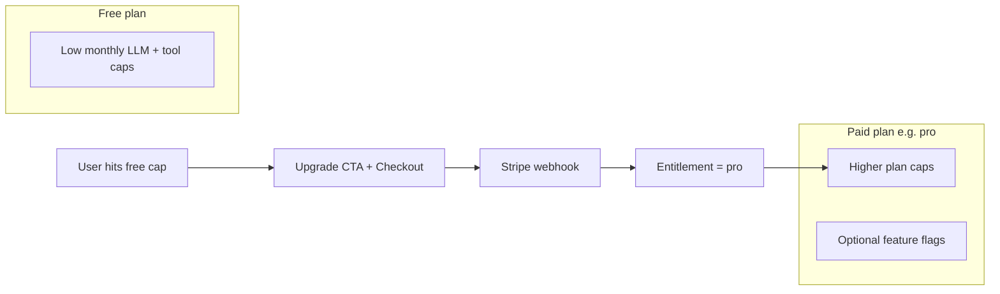
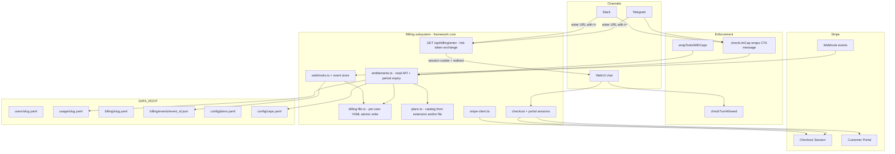
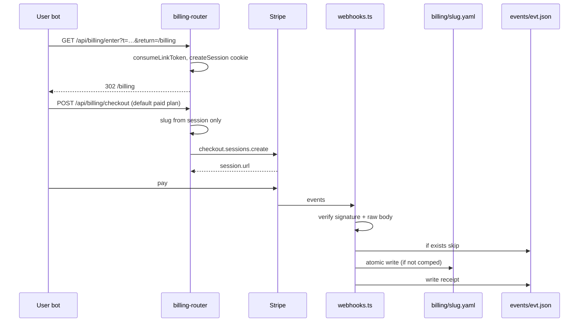
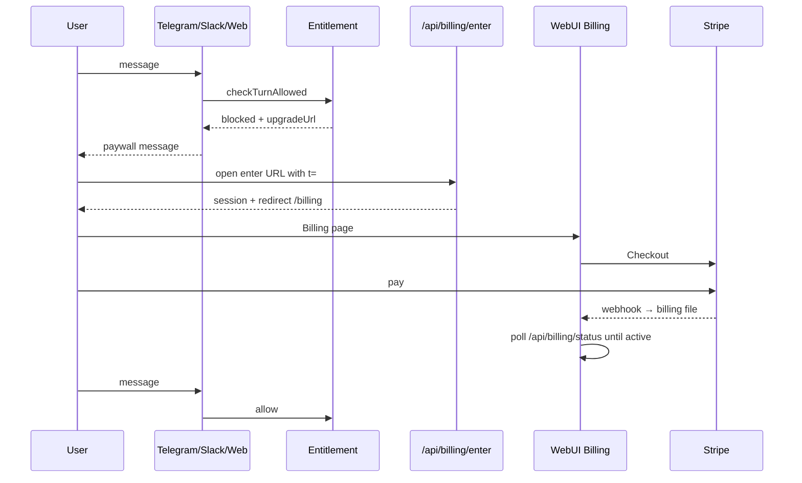

# Utarus Paywall & Stripe Billing Design

| Field | Value |
| --- | --- |
| **Title** | Paywall Solution for the Utarus Agent Framework |
| **Author** | _(TBD)_ |
| **Date** | 2026-07-18 |
| **Status** | Draft (product decisions incorporated) |
| **Scope** | Design only — no implementation in this document |

---

## Overview

Utarus already meters LLM and tool usage per user (`data/usage/<slug>.yaml`) and enforces optional monthly caps from `data/config/caps.yaml` across WebUI, Telegram, and Slack. Today those caps are **admin-ops only**: when a user hits a limit they are told to “Contact an admin to raise it.” There is no subscription, plan, or payment surface.

This design introduces a **billing + entitlement subsystem** integrated with **Stripe**, so domain agents (Binary, Marie, Invage, and future forks) can monetize without re-implementing payment plumbing. The recommended product model is **free tier with usage caps → paid subscription unlocks higher (plan-defined) caps and optional feature gates**. Enforcement reuses the existing cap check points (`checkLlmCap`, `wrapToolsWithCaps`) by resolving **effective caps from entitlements** rather than only from static YAML. Payment state is written exclusively by verified Stripe webhooks (and admin ops); clients never report “I paid.”

As a framework design, Utarus core owns the billing module, webhook handling, entitlement read API, enforcement hooks, SPA link-token exchange for billing entry, and channel-agnostic upgrade messaging. Domain agents supply plan catalog, Stripe price IDs, product copy, and whether billing is enabled for that deployment.

---

## Background & Motivation

### Current state (code-backed)

| Concern | Location | Behavior today |
| --- | --- | --- |
| Caps config | `src/usage/caps.ts`, `data/config/caps.yaml` | `default` + per-slug `overrides`; missing file/key = unlimited; **parsed YAML cached by raw-string equality** (`cachedRaw` / `cachedConfig`) |
| Pre-turn LLM gate | `checkLlmCap(userSlug, isAdmin): string \| null` | Used by Telegram (`src/interfaces/telegram.ts` ~L524), Slack (`src/interfaces/slack/app.ts` ~L908, ~L1052), WebUI chat (`src/webapp/chat/router.ts` ~L372 → HTTP 429 `{ error: 'cap_exceeded', message }`) |
| Tool caps | `wrapToolWithCap` / `wrapToolsWithCaps` in `src/usage/agent-tracking.ts` | Wired when `enforceCaps: !isAdmin` in `src/framework.ts` → `src/agent.ts`; **does not catch** load errors (throws bubble) |
| Usage counters | `src/usage/usage-file.ts` | Monthly period + lifetime at `data/usage/<slug>.yaml`; **no cache**; fail-fast on corrupt files |
| Cap messages | `caps.ts` L96, `agent-tracking.ts` L57 | “Contact an admin to raise it” |
| Cap check error policy | `checkLlmCap` L99–104 | **Fails open** (log + null) on usage/cap load errors |
| Access gate | `src/onboarding/access-gate.ts` | Invite / demo / admin only — **not** payment-related |
| Admins | Env (`TELEGRAM_ADMIN_IDS`, `SLACK_ADMIN_IDS`, `WEBAPP_ADMIN_CREDENTIALS`) + `data/admin_ids.yaml` | Always bypass caps (`isAdmin` short-circuit) |
| User identity | `src/state/types.ts` → `data/users/<slug>.yaml` | Framework-owned `user` / `profile` / `log`; no billing fields |
| Link tokens | `src/webapp/auth.ts` (`createLinkToken`, `buildAuthedUrl`, `tryExchangeLinkToken`) | Short-lived `?t=` tokens; **exchange runs only inside `requireAuth`** |
| SPA auth gap | `src/webapp/server.ts`, `web/src/App.tsx`, `web/src/auth.ts` | SPA HTML (`/`, `/billing`, …) is served **without** `requireAuth`; client boot uses cookies only and **does not forward page `?t=`** to API. BinDrive `/api/files/.../view` works because those routes use `requireAuth`. **Channel “open /billing?t=…” is not sufficient alone.** |
| WebUI 429 client | `web/src/api.ts` `sendMessage` + `fetchWithRetry` | `retryOnPost: true` **retries HTTP 429**; `friendlyHttpError` keeps only `message`/`error` strings — structured fields would be dropped today |
| Domain extension | `src/extension.ts` / `src/framework.ts` | Purpose, tools, skills, channel commands, optional `webUi`; **no billing field today** |
| WebUI shell | `web/src/pages/Shell.tsx`, `src/webapp/webui-manifest.ts` | Admin is **hardcoded** (`path.startsWith('/admin')`); manifest always adds Chat + Admin; domain pages via `DomainWebPageKind` (`notifications` \| `tasks` \| `iframe`) |
| Web stack | `src/webapp/server.ts` | Global `express.json()` first; then SPA static, BinDrive (own parsers), chat, admin, domain routers |

### Pain points

1. **Ops bottleneck** — raising caps requires editing `caps.yaml` per user.
2. **No monetization path** — domain agents cannot charge for higher limits without a one-off Stripe fork.
3. **Cross-channel UX gap** — Telegram/Slack users get a dead-end message; even with a URL, SPA does not exchange link tokens today.
4. **Framework vs product confusion** — if each domain invents its own billing files and webhook routes, fork drift is guaranteed.

### Why now

Usage metering and multi-channel enforcement already exist. The missing pieces are a **trustworthy entitlement layer** fed by Stripe, an **SPA-safe authed entry** for channel deep links, and upgrade surfaces that work where Checkout cannot run natively (chat bots).

---

## Goals & Non-Goals

### Goals

1. Define a complete **paywall + Stripe** design that domain agents can adopt with config only (prices, plan names, copy).
2. Map **plan / subscription status → effective caps** (and optional feature flags) without abandoning `caps.yaml` admin overrides.
3. Specify **enforcement at existing seams**: pre-turn LLM check, tool wrappers, WebUI 429, channel replies — with a unified upgrade message and **channel-appropriate** upgrade URL.
4. Keep **webhook-sourced billing state** as the source of truth for paid entitlements; never trust the client.
5. Respect project rules: **no fallback defaults for missing required config**; fail fast and print errors. Call out the few places payment systems need **retry resilience** (webhooks) vs fail-fast.
6. Support **multi-interface** journeys: WebUI Checkout + Customer Portal; Telegram/Slack magic-link via a **dedicated exchange entrypoint** into WebUI billing.
7. Provide an incremental **PR plan** implementable by a senior engineer.

### Non-Goals

- Implementing Stripe code, UI, or migrations in this change (design only).
- Marketplace / multi-tenant SaaS billing across unrelated products (one agent deployment = one Stripe account).
- Seat-based team billing, invoices for enterprises, tax engines beyond Stripe Tax (optional later).
- Replacing invite-based onboarding; paywall is orthogonal to access gate.
- Metered Stripe usage records (pay-as-you-go token billing) as the primary model.
- Caching entitlement / billing-file resolution “for performance” (project rule: no cache unless asked). Plans catalog may reload like caps by content hash — see Observability/Read policy.
- Changing admin bypass semantics (admins remain unlimited).

---

## Monetization Model Options

### Option A — Free tier + subscription unlocks higher caps (Recommended)

| | |
| --- | --- |
| **Shape** | Every onboarded user starts on plan `free` with low monthly caps. Paying a monthly/yearly Stripe Price upgrades to `pro` / `team` with higher caps (and optional feature gates). |
| **Pros** | Aligns with existing monthly period counters; works identically on Web/Telegram/Slack (usage is global per slug); simple mental model; Checkout + Customer Portal are standard Stripe. |
| **Cons** | Soft ceiling: heavy free users can exhaust caps mid-month; needs clear reset messaging (already in `formatUsageReport`). |
| **Fit** | **Best** for multi-interface personal agents where the scarce resource is LLM/tool spend, not “seats.” |

### Option B — Pay-per-use (metered tokens)

| | |
| --- | --- |
| **Shape** | Stripe metered billing; report token deltas each turn. |
| **Pros** | Fairness proportional to cost. |
| **Cons** | High operational risk; poor UX on Telegram; latency/complexity on every turn; fights fail-fast file I/O model. |
| **Fit** | Poor as primary model; may be a **future add-on** for power tools only. |

### Option C — Seat-based / org subscription

| | |
| --- | --- |
| **Shape** | Charge per human seat or workspace. |
| **Pros** | Familiar B2B. |
| **Cons** | Utarus identity is **per-user slug**, not orgs; seats add a second entity model. |
| **Fit** | Defer until a domain needs multi-user workspaces. |

### Option D — Prepaid credit balance / top-up (Rejected for v1)

| | |
| --- | --- |
| **Shape** | User buys credit packs; each turn debits token-equivalent balance. |
| **Pros** | Familiar for API products; no monthly cliff. |
| **Cons** | Requires atomic balance mutations per turn (race-prone with YAML); different UX from existing monthly caps; complicates multi-channel concurrent turns; weak fit for “chat until monthly reset.” |
| **Fit** | Rejected for v1; subscription + monthly caps reuse the system that already ships. |

### Recommendation

**Primary: Option A (free + subscription → higher caps).**  
Optional later: feature gates on paid plans. Keep `caps.yaml` overrides as **admin comps** that stack above plan defaults.



---

## Proposed Design

### High-level architecture



### Module layout (proposed)

New package-side modules under `src/billing/` (deep module, clear seam):

| Module | Responsibility |
| --- | --- |
| `src/billing/types.ts` | Fail-fast TypeScript shapes for plans, billing state, entitlement, `PaywallBlock` |
| `src/billing/plans.ts` | Resolve plan catalog: `DomainExtension.billing.plans` **wins** over `data/config/plans.yaml`; boot validation |
| `src/billing/billing-file.ts` | Load/save `data/billing/<slug>.yaml` with **atomic tmp+rename**; optional per-slug lock for webhook apply |
| `src/billing/entitlements.ts` | **Read API**: `getEntitlement`, `getEffectiveCap`, `checkTurnAllowed`, period-end demotion |
| `src/billing/messages.ts` | Unified paywall copy; **channel-aware** upgrade URL builder |
| `src/billing/stripe-client.ts` | Stripe SDK wrapper; fail-fast if keys missing when billing enabled |
| `src/billing/checkout.ts` | Create Checkout / Portal sessions; block Checkout when already subscribed |
| `src/billing/webhooks.ts` | Signature verify, **event-id store**, deterministic apply, comp freeze |
| `src/billing/admin.ts` | Comp / revoke / reconcile |
| `src/billing/validate.ts` | `assertBillingConfig()` called from `createFramework` |
| `src/billing/index.ts` | Public exports |
| `src/webapp/billing-router.ts` | HTTP: status, checkout, portal, **enter**, webhook |
| `web/src/pages/Billing.tsx` | User billing UI |
| Admin billing section | Extend `web/src/pages/Admin.tsx` |

Domain agents do **not** fork these files; they configure via `DomainExtension.billing` and env.

### Feature flag & boot validation

Billing is **off** unless explicitly enabled:

```text
UTARUS_BILLING_ENABLED=true
STRIPE_SECRET_KEY=sk_...
STRIPE_WEBHOOK_SECRET=whsec_...
STRIPE_PUBLISHABLE_KEY=pk_...   # required only when WebUI (buildWebApp) mounts billing UI
UTARUS_PUBLIC_BASE_URL=https://agent.example.com
```

#### Where validation runs (mandatory)

Domain hosts (Binary, Marie, Invage) typically call `createFramework` and **never** hit standalone `src/index.ts` `validateConfig`. Therefore:

**`createFramework` MUST call `assertBillingConfig(extension)` when `UTARUS_BILLING_ENABLED=true`.**  
Additionally, `buildWebApp` re-checks that `STRIPE_PUBLISHABLE_KEY` is set (WebUI-only requirement).

| Condition | Required |
| --- | --- |
| Flag not `true` | No billing validation; existing caps-only behavior |
| Flag `true` (any process: bot, web, both) | `STRIPE_SECRET_KEY`, `STRIPE_WEBHOOK_SECRET`, `UTARUS_PUBLIC_BASE_URL`, plans catalog (extension and/or file), `past_due_policy`, unique `stripe_price_id` map |
| Flag `true` **and** `buildWebApp` / user Billing UI | + `STRIPE_PUBLISHABLE_KEY` |
| Flag `true`, headless Telegram/Slack only | Publishable key **not** required |

Missing required values → **throw with explicit list**, process must not start half-configured billing.

No silent defaults for prices, plan ids, or Stripe secrets.

---

## Entitlement Model

### Concepts

| Term | Meaning |
| --- | --- |
| **Plan** | Named product tier (`free`, `pro`, …) with caps + optional features |
| **Billing status** | Lifecycle: `none` \| `active` \| `trialing` \| `past_due` \| `canceled` \| `unpaid` \| `comped` |
| **Entitlement** | Runtime view after **read-time period expiry** |
| **Admin bypass** | Unchanged: `isAdmin === true` → no caps, no paywall |
| **Implicit free** | **Absence of billing file** ⇒ `plan_id: free`, `status: none`, `source: default_free` (no file required until checkout or comp) |

### Status → access policy (write-time labels)

| Stored status | Notes |
| --- | --- |
| No file / `none` | Free |
| `active` / `trialing` | Paid plan from subscription |
| `past_due` | Policy `retain_until_period_end` (**Key Decision**) |
| `canceled` + period not ended | Paid until `current_period_end` |
| `canceled` / `unpaid` after period | Free |
| `comped` | Admin-chosen plan; **overrides Stripe** until revoked |

### Read-time period expiry (required)

`getEntitlement` / `getEffectiveCap` **must** evaluate wall clock, not only stored status:

```
function effectivePlanFromBilling(raw: BillingState | null, now: Date): Entitlement {
  if (!raw) return freeDefault;
  if (raw.status === 'comped') return comp entitlement; // not subject to Stripe period end

  const periodEnded =
    raw.current_period_end != null &&
    Date.parse(raw.current_period_end) < now.getTime();

  // Paid-like statuses after period end → free (even if webhook missed)
  if (periodEnded && raw.status ∈ { canceled, unpaid, past_due }) {
    return freeDefault with source: 'period_expired_read';
  }
  // active / trialing with cancel_at_period_end and period ended → free
  if (periodEnded && raw.cancel_at_period_end === true &&
      raw.status ∈ { active, trialing }) {
    return freeDefault with source: 'period_expired_read';
  }
  // active / trialing with period end in the past and no cancel flag:
  // still treat as paid until webhook says otherwise, OR if period end is
  // authoritative for the billing period, demote when periodEnded.
  // v1 rule: if current_period_end is set and periodEnded, demote to free
  // for all non-comped statuses except when status is active|trialing AND
  // cancel_at_period_end is false — then keep paid (subscription renewing;
  // missed invoice.paid should not instantly free mid-cycle without past_due).
  ...
}
```

**v1 concrete rule (implement this):**

1. If `status === 'comped'` → use `comped_plan_id` / `plan_id`; ignore period end.
2. Else if `current_period_end` is set and `now >= current_period_end` **and** status ∈ `{canceled, unpaid, past_due}` → effective **free**.
3. Else if `current_period_end` is set and `now >= current_period_end` **and** `cancel_at_period_end === true` → effective **free**.
4. Else if status ∈ `{active, trialing}` → paid plan (even if period end is slightly stale; Stripe should refresh period end on renew via webhook).
5. Else if status ∈ `{canceled, unpaid, past_due}` and period **not** ended → **paid plan until end** (implements `past_due_policy: retain_until_period_end` for mid-period grace).
6. Else → free.

**Unit-test matrix (required in PR 1 entitlement tests):**

| Stored status | `current_period_end` | Expected effective plan |
| --- | --- | --- |
| `past_due` | future | **paid** (grace) |
| `past_due` | past | free |
| `canceled` | future | paid |
| `canceled` | past | free |
| `unpaid` | future | paid |
| `unpaid` | past | free |
| `active` | future | paid |
| `comped` | past or future | comp plan |

**Lazy write:** read path **does not require** rewriting the billing file for demotion (pure read). Optional best-effort lazy write is allowed but **must not** be the only demotion mechanism. Reconcile remains repair for Stripe drift, not the sole expiry path.

### Comp vs Stripe precedence (required)

| Rule | Behavior |
| --- | --- |
| **P1** | `status === 'comped'` / `source: admin_comp` **freezes** webhook mutations of `plan_id`, `status`, `current_period_end`, `cancel_at_period_end`, `stripe_subscription_id` (plan fields). |
| **P2** | Webhooks **may still** set/update `stripe_customer_id` linkage while comped (customer created if user later needs Portal). |
| **P3** | Checkout while comped: **blocked** with clear error (“Admin-comped plan active; contact support or wait for revokation”). User is not charged twice. |
| **P4** | `revoke-comp`: clear comp fields; if `stripe_subscription_id` present, run `reconcileBilling(slug)` from Stripe; else set free / delete paid fields. |
| **P5** | Non-comped webhook apply always wins over stale local plan for that customer. |
| **P6 (comp + active Stripe sub)** | **v1 ops-gated, not auto-cancel.** Comp **does not** cancel, pause, or `cancel_at_period_end` the Stripe subscription. Stripe may keep invoicing until an admin cancels via Customer Portal / Stripe Dashboard / explicit reconcile helper. **Admin API/UI:** if billing file (or Stripe) has `stripe_subscription_id` and status would still be billable, **require** body flag `acknowledge_active_subscription: true` (Admin UI checkbox: “I will cancel Stripe billing separately — user may still be charged until then”). Without the flag → **400** with message listing the subscription id. UI shows a blocking warning, not a silent success. Optional later: automated `cancel_at_period_end` on comp — out of v1. |

Encode P1 in `webhooks.ts` apply path: if loaded file has `status === 'comped'`, skip plan/status updates; log `[billing/webhook] skipped plan mutate (comped) slug=…`.

### Relationship to `caps.yaml`

```
effective(K) =
  if isAdmin → unlimited
  else if billing disabled → getCap(slug, K)  // today's caps.ts only
  else:
    planCap = plans[entitlement.plan_id].caps for kind K
    override = caps.yaml overrides.<slug> only (not default)
    if override[K] set → override
    else if planCap set → planCap
    else → unlimited for that key   // FOOTGUN: document; free plan must list every tool product enforces
```

When `UTARUS_BILLING_ENABLED=true`:

- **`caps.yaml` `default` is forbidden** — fail boot if present (avoid dual sources of truth).
- **`overrides.<slug>`** remain admin comps that always win over plan caps.
- Nested `tools` maps merge **per tool key** (same as today’s `getCap`): override can set only `firecrawl` and leave other tools to the plan.

### Enforcement scope for CapKind (v1)

| Kind | Configured on plans? | Enforced in v1? |
| --- | --- | --- |
| `llm_total_tokens` | Yes (required on every plan including free) | **Yes** — pre-turn via `checkTurnAllowed` / `checkLlmCap` |
| `tools.<name>` | Yes for product-relevant tools | **Yes** — tool wrap |
| `llm_cost_usd` | Optional on plans | **No** in v1 (not checked by `checkLlmCap` today; do not add silent enforcement). May be displayed in usage UI only. |

Boot validation when billing on: every plan must include numeric `caps.llm_total_tokens`. Tool keys are not globally required (domains differ), but **omit = unlimited** is documented as a footgun — domain free plans should list every expensive tool.

### Feature gates (API only in v1)

Plans may declare `features: string[]`. Framework exports **`hasFeature(userSlug, flag): boolean`** for domain tools/enforcement.

**v1 product decision:** API only — no WebUI feature-gate examples, no framework tool auto-gated by features, no special Admin UI for flags. Domains that need gates call `hasFeature` themselves. Empty `features: []` is valid. Caps remain the primary paywall.

### Public contracts (PR 2)

Two complementary APIs — **both** land in PR 2:

```ts
/** Structured gate for HTTP / SSE / any caller that needs upgrade_url. */
export interface PaywallBlock {
  code: 'cap_exceeded' | 'billing_state_error';
  message: string;           // user-facing, may embed URL for bot channels
  upgradeUrl?: string;       // channel-aware (see messages.ts)
  planId?: string;
  kind?: CapKind;
  current?: number;
  cap?: number;
}

export function checkTurnAllowed(
  userSlug: string,
  isAdmin: boolean,
  opts?: { channel: 'web' | 'telegram' | 'slack' | 'cli' },
): PaywallBlock | null;

/**
 * Backward-compatible channel helper.
 * Returns checkTurnAllowed(...).message or null.
 * Does NOT strip upgrade info: message text includes URL when channel needs it.
 */
export function checkLlmCap(userSlug: string, isAdmin: boolean): string | null;
```

| Call site | API |
| --- | --- |
| Telegram / Slack text reply | `checkLlmCap` (message includes URL when billing on) **or** `checkTurnAllowed({ channel })` and reply `.message` |
| WebUI REST | `checkTurnAllowed({ channel: 'web' })` → map by `block.code` (see HTTP status table below) |
| Tool wrap | Internal use of effective cap + `formatPaywallMessage`; return tool error content (never throw when billing on) |

**WebUI HTTP status mapping (required):**

| `block.code` | HTTP status | Body fields | Client UX |
| --- | --- | --- | --- |
| `cap_exceeded` | **429** | `error`, `message`, `upgrade_url?`, `plan_id?`, `current?`, `cap?` | Upgrade button when `upgrade_url` present |
| `billing_state_error` | **503** | `error`, `message` only — **no** `upgrade_url` | Generic error / retry; **no** Upgrade CTA (not a paywall) |

### Fail-fast vs fail-open (explicit)

| Path | Policy | Rationale |
| --- | --- | --- |
| Boot, billing on, missing env / plans | **Fail fast** in `createFramework` | Half-config must not run |
| Corrupt `billing/<slug>.yaml` | **Fail closed** when billing on: both LLM gate and tool wrap return stable user-visible error (`billing_state_error`); **do not throw** into pi-agent opaque failures | Prefer not granting free unlimited |
| Corrupt `usage/<slug>.yaml` | Billing **on**: fail closed (same). Billing **off**: keep today’s `checkLlmCap` fail-open | Backward compatible when flag off |
| Tool wrap when billing off | Preserve today’s throw-on-corrupt behavior for tool path | Minimal behavior change |
| Webhook transient errors | Return **5xx** so Stripe retries | Resilience |
| Duplicate webhook | Idempotent event store → 200 | Resilience |
| Malformed `DomainExtension.billing.copy` template | **Fail fast** at boot if provided but missing required placeholders `{current}`, `{cap}`, `{upgradeUrl}` | No half-apply |

---

## Data Model Changes

### Principle

- **Do not put Stripe secrets or full subscription blobs in `UserState`.**
- One billing file per user at `data/billing/<slug>.yaml`.
- Plan catalog is **deployment config**, not per-user.
- **Free users:** no billing file required (implicit free). File created on first Checkout customer linkage or admin comp.

### Plans catalog resolution

1. If `extension.billing?.plans` is set → use it (after schema assert).
2. Else load `data/config/plans.yaml` (must exist when billing on).
3. If both exist → **extension wins** entirely for plan definitions (no deep-merge of plans; avoids ambiguous partial overlays). File may still be used by ops-only deployments without recompile.

### `data/config/plans.yaml` / `DomainExtension.billing.plans`

```yaml
version: 1
past_due_policy: retain_until_period_end   # required when billing on
# Global trial for all paid plans (not per-plan). Framework always passes this to Checkout.
trial_period_days: 7
# Exactly one paid plan is offered in v1 UI / Checkout (free is implicit default).
default_paid_plan_id: pro
plans:
  free:
    display_name: Free
    stripe_price_id: null
    caps:
      llm_total_tokens: 200000            # required
      tools:
        firecrawl: 20
        post_html_report: 5
    features: []
  pro:
    display_name: Pro
    stripe_price_id: price_xxx            # single currency, defined in Stripe Dashboard
    caps:
      llm_total_tokens: 5000000
      tools:
        firecrawl: 500
        post_html_report: 100
    features:                             # domain-facing via hasFeature only in v1
      - html_reports
```

**Catalog rules when billing on (fail-fast):**

- `trial_period_days` required and must be `7` in v1 (constant; no per-plan override).
- `default_paid_plan_id` required; must name a plan with non-null `stripe_price_id`.
- Exactly **one** free plan (`stripe_price_id: null`) and at least the default paid plan; v1 UI ignores additional paid plans even if present in catalog (ops may keep them for Portal/future — Checkout and Upgrade CTA only use `default_paid_plan_id`).

### `data/billing/<slug>.yaml`

```yaml
version: 1
user_slug: alice
stripe_customer_id: cus_...          # optional until first checkout
stripe_subscription_id: sub_...      # optional
plan_id: pro
status: active                       # none | active | trialing | past_due | canceled | unpaid | comped
current_period_end: "2026-08-18T00:00:00.000Z"
cancel_at_period_end: false
comped_by: null                      # admin username when status=comped
comped_plan_id: null                 # plan while comped (may equal plan_id)
updated_at: "2026-07-18T12:00:00.000Z"
last_stripe_event_id: evt_...        # informational only; not sole idempotency
```

**Coherence rules:**

- `user_slug` required and matches filename.
- `plan_id`, `status` required.
- If `status === 'comped'`, `comped_plan_id` or `plan_id` must reference a known plan.
- If `status` ∈ `{active, trialing, past_due}` and not comped, `stripe_subscription_id` required on write from webhook path.
- Unknown top-level keys preserved.

### Event store (required in Stripe PR, not optional)

```text
data/billing/events/<event_id>.json
```

Contents: `{ "id", "type", "processed_at", "user_slug?" }`.  
Presence of file ⇒ event already applied; webhook returns 200 without re-apply.

### Atomic billing writes

Mirror session store pattern in `auth.ts` (`write tmp` → `renameSync`):

```ts
writeFileSync(tmp, yaml);
renameSync(tmp, path);
```

Webhook apply for a slug: **per-slug mutex** (in-process `Map<slug, Promise>`) so concurrent `checkout.session.completed` + `customer.subscription.updated` cannot interleave load→modify→save. Multi-process: document single webhook consumer process as v1 ops constraint; event store still prevents double-apply of same event id.

**Deterministic merge for subscription fields:** always set the full snapshot from the Stripe Subscription object (`status`, `cancel_at_period_end`, `current_period_end`, primary item price → plan_id, `id` → stripe_subscription_id). Never partial-patch individual fields from unordered events without reading Stripe object when ambiguous.

### Optional customer index

Stripe Customer → slug via `metadata.utarus_user_slug` + `stripe_customer_id` on file. Reverse lookup O(users) is fine for **&lt; ~10k users** (stated scale assumption). Add `data/billing/by-customer/<cus_id>` pointer later if needed. No cache layer in v1.

### Migration for existing users

| Situation | Behavior when billing turned on |
| --- | --- |
| Existing users, no billing file | Implicit free |
| Existing unlimited (no caps.yaml) | Free plan caps apply — **breaking unless grandfathered** |
| Existing caps.yaml defaults | Migrate numbers into `plans.free.caps`; remove `default` |
| Per-slug VIP overrides | Keep as `caps.yaml` overrides or `status: comped` |
| Admins | Unchanged bypass |

**Grandfathering:** ops script `scripts/grandfather-billing-comps.mjs` (scheduled in PR plan) writes `comped` files for allowlisted slugs.

### Data layout after change

```text
data/
├── users/<slug>.yaml
├── usage/<slug>.yaml
├── billing/<slug>.yaml
├── billing/events/<event_id>.json
├── config/
│   ├── plans.yaml               # when not using extension.plans only
│   └── caps.yaml                # overrides-only when billing on
└── ...
```

---

## Stripe Integration Surface

### Products to use

| Stripe product | Role |
| --- | --- |
| **Checkout Session** (`mode: subscription`) | free → paid |
| **Customer Portal** | payment method, cancel, invoices, plan changes |
| **Webhooks** | source of truth for non-comped users |
| **Customers** | one per user slug (`metadata.utarus_user_slug`) |

### v1 subscription policy

- **One active subscription per Stripe customer / user slug.**
- If entitlement status ∈ `{active, trialing, past_due}` with `stripe_subscription_id` (and not period-expired free): **`POST /api/billing/checkout` returns 409** with message to open Portal instead.
- **Free + one paid plan** in product UX: Checkout always targets `default_paid_plan_id` (server may ignore body `plan_id` if present and not equal, or accept only that id / omit body entirely).
- Plan manage/cancel: **Customer Portal** (not multi-plan Checkout picker).
- Only free / none / canceled-after-period / period-expired may start Checkout.
- **Trials:** every new paid Checkout gets a **fixed 7-day trial** (`subscription_data.trial_period_days: 7`). Stripe `trialing` maps to **paid caps** (same as `active` in entitlement rules).
- **Currency / tax:** single currency as configured on the Stripe Price in Dashboard; **no Stripe Tax** — do not set `automatic_tax: { enabled: true }` on Checkout.

### Checkout session parameters

```ts
// userSlug ALWAYS from authenticated session — never from request body
// plan always = catalog.default_paid_plan_id in v1
{
  mode: 'subscription',
  customer: existingCusId ?? undefined,
  customer_email: !existingCusId ? profile.contact_email : undefined,
  client_reference_id: userSlug,  // session-derived
  line_items: [{ price: paidPlan.stripe_price_id, quantity: 1 }],
  success_url: `${publicBase}/billing?checkout=success`,
  cancel_url: `${publicBase}/billing?checkout=cancel`,
  // No automatic_tax — single currency from Price; tax out of scope for v1
  metadata: { utarus_user_slug: userSlug, plan_id: paidPlan.id },
  subscription_data: {
    trial_period_days: 7,  // global fixed trial for all paid plans
    metadata: { utarus_user_slug: userSlug, plan_id: paidPlan.id },
  },
}
```

**Client body:** optional / empty in v1 — server selects `default_paid_plan_id`. If body includes `plan_id`, it must equal the default paid plan or the request fails (400).

### Webhook events

| Event | Action |
| --- | --- |
| `checkout.session.completed` | Store customer id; sync subscription if present (respect comp freeze) |
| `customer.subscription.created` | Full subscription snapshot → billing file |
| `customer.subscription.updated` | Full snapshot sync |
| `customer.subscription.deleted` | Free / clear sub (unless comped) |
| `invoice.paid` | Confirm active after past_due |
| `invoice.payment_failed` | Set `past_due` |

Unknown events: verify signature, 200 OK, no apply.

### Secrets & env

| Env | When required |
| --- | --- |
| `STRIPE_SECRET_KEY` | Billing enabled |
| `STRIPE_WEBHOOK_SECRET` | Billing enabled |
| `UTARUS_PUBLIC_BASE_URL` | Billing enabled (Checkout URLs, bot magic links) |
| `STRIPE_PUBLISHABLE_KEY` | Billing enabled **and** WebUI mounts billing UI |
| Plans catalog | Billing enabled |

Prefer explicit `UTARUS_PUBLIC_BASE_URL` over reusing `UTARUS_REPORTS_URL` / `publicBinDriveOrigin()` (Key Decision).

### Customer ↔ user slug mapping

1. Checkout creates/links Customer with `metadata.utarus_user_slug`.
2. Persist `stripe_customer_id` on billing file.
3. Webhook resolves slug: session/subscription metadata → customer metadata → reverse lookup by customer id.
4. Unresolvable → **5xx + log** (Stripe retries); do not invent slug.
5. If customer id already bound to another slug → **fail event** (5xx + alert).



---

## API / Interface Changes

### HTTP routes (`billing-router`)

| Method | Path | Auth | Purpose |
| --- | --- | --- | --- |
| `GET` | `/api/billing/enter` | Link token `t` | **Exchange entrypoint**: consume `t`, set session cookie, redirect to `return` (default `/billing`). Channel upgrade links use this URL. `pathPrefix` for minted tokens: `/api/billing/enter` |
| `GET` | `/api/billing/status` | User session | Entitlement + usage + **default paid plan** card (`default_paid_plan_id`, display_name, caps summary, trial_period_days: 7) — not a multi-plan catalog |
| `POST` | `/api/billing/checkout` | User | Body empty or `{ plan_id }` equal to default paid only → `{ url }`; always 7-day trial; no tax |
| `POST` | `/api/billing/portal` | User | → `{ url }` (requires customer) |
| `POST` | `/api/billing/webhook` | Stripe sig | Raw body |
| `GET` | `/api/billing/config` | Public ok | `{ enabled, publishableKey?, defaultPaidPlan: { id, display_name, caps_summary }, trialPeriodDays: 7 }` — **no `stripe_price_id`** |
| `POST` | `/api/admin/billing/comp` | Admin | `{ slug, plan_id, acknowledge_active_subscription?: boolean }` — required `true` when active Stripe sub exists (P6) |
| `POST` | `/api/admin/billing/revoke-comp` | Admin | `{ slug }` |
| `POST` | `/api/admin/billing/reconcile` | Admin | `{ slug }` |
| `GET` | `/api/admin/billing/:slug` | Admin | Inspect |

### Webhook + middleware order (`buildWebApp`)

Global `express.json()` today breaks Stripe signatures. Required sketch:

```ts
export function buildWebApp(framework: Framework, opts = {}): Express {
  const app = express();
  app.use(cookieParser());

  // 1) Stripe webhook FIRST — raw body only on this path
  if (isBillingEnabled()) {
    app.post(
      '/api/billing/webhook',
      express.raw({ type: 'application/json' }),
      billingWebhookHandler,
    );
  }

  // 2) Normal parsers for everything else
  app.use(express.urlencoded({ extended: false }));
  app.use(express.json({ limit: '10mb' }));

  // 3) Optional: SPA HTML GETs could also tryExchangeLinkToken —
  //    but v1 channel links use /api/billing/enter exclusively (clearer pathPrefix).

  // ... static, bindrive, chat, billing router (status/checkout/portal/enter), admin ...
}
```

Do **not** rely on nested `createBinDriveApp()` parsers for the webhook path.

### SPA magic-link exchange (Issue 1 — design of record)

**Problem:** `tryExchangeLinkToken` only runs inside `requireAuth`. SPA routes are unauthenticated static/fallback. Client never forwards `?t=` on API calls.

**v1 solution (required):** dedicated exchange route:

```text
GET /api/billing/enter?t=<linkToken>&return=/billing
```

Behavior:

1. Validate `return` is a same-origin relative path starting with `/` (allowlist: `/billing` and safe subpaths) — reject open redirects.
2. Resolve the **full request path** for link-token validation — **never** mount-relative `req.path` alone.
   - Prefer registering `app.get('/api/billing/enter', …)` on the root app, **or**
   - If mounted under a router, pass `requestPath(req)` / `` `${req.baseUrl}${req.path}` `` / pathname of `req.originalUrl` so validation sees `/api/billing/enter`.
   - `pathPrefix` on the minted token is `/api/billing/enter`. `consumeLinkToken(t, fullPath)` must use that same full path (existing `tryExchangeLinkToken` uses `req.path`, which is wrong under a mount — enter must not copy that footgun).
3. **Always replace session from the link token identity** — do **not** reuse `tryExchangeLinkToken`’s “already live session → keep cookie and only strip `t`” behavior.
   - `consumeLinkToken` → `createSession(tokenUser)` → set `bindrive_session` cookie (overwrite).
   - If a previous session cookie existed and `prev.slug !== tokenUser.slug` (or type differs), log `[billing/enter] replaced session prev=${prev.slug} next=${tokenUser.slug}`.
   - Rationale: admin or user A opening user B’s upgrade link must become B, or Checkout binds the wrong customer.
4. `302` redirect to `return` **without** `t` in the URL.

Channel `/upgrade` and cap messages mint:

```ts
buildAuthedUrl(publicBase, '/api/billing/enter?return=%2Fbilling', {
  user: { type: 'user', slug, displayName },
  pathPrefix: '/api/billing/enter',
  ttlMs: 60 * 60 * 1000,
  maxUses: 5,
});
// Result: https://host/api/billing/enter?return=%2Fbilling&t=...
```

**Optional later:** middleware on HTML GETs calling `tryExchangeLinkToken` for general SPA deep links — not required for paywall v1 if enter route is used everywhere for billing.

### DomainExtension.billing (lands in PR 1)

```ts
// src/extension.ts
billing?: {
  plans?: PlansCatalog;  // full catalog incl. trial_period_days: 7, default_paid_plan_id; wins over file
  copy?: {
    /** If set, must include {current}, {cap}, {upgradeUrl} or boot fails */
    capHitTemplate?: string;
    upgradeCta?: string;  // single Upgrade CTA label for the default paid plan
  };
  // v1: no multi-plan offer list — Checkout always uses default_paid_plan_id
};
```

### Channel commands

| Channel | Command | Behavior |
| --- | --- | --- |
| All | `/usage` | Report + plan name + upgrade hint if free/near cap |
| Telegram / Slack | `/upgrade` | Magic **enter** URL (not bare `/billing?t=`) |
| WebUI | Nav Billing | SPA page when flag on |

---

## Enforcement Points

### Channel-aware upgrade URLs (`messages.ts`)

| Channel | `upgradeUrl` | Notes |
| --- | --- | --- |
| `web` | `'/billing'` (relative) | Session cookie already present; **do not mint link tokens** on every cap check |
| `telegram` / `slack` / `cli` | Absolute enter URL with `t=` | Mint link token; if `UTARUS_PUBLIC_BASE_URL` missing → message without URL + “ask admin / open WebUI” — **still block** (fail closed on cap), never grant unlimited |
| Token mint frequency | Prefer mint on `/upgrade` and on cap block | Acceptable to mint per block for bots; optional reuse not required v1. Avoid minting for `channel: 'web'`. |

### Unified decision function

```ts
function checkTurnAllowed(
  userSlug: string,
  isAdmin: boolean,
  opts?: { channel?: 'web' | 'telegram' | 'slack' | 'cli' },
): PaywallBlock | null {
  if (isAdmin) return null;
  try {
    const cap = getEffectiveCap(userSlug, 'llm_total_tokens');
    if (cap === undefined) return null;
    const current = loadUsage(userSlug).period_llm.total_tokens;
    if (current < cap) return null;
    const channel = opts?.channel ?? 'cli';
    const upgradeUrl = buildUpgradeUrl(userSlug, channel);
    return {
      code: 'cap_exceeded',
      message: formatPaywallMessage({ current, cap, upgradeUrl, channel }),
      upgradeUrl,
      planId: getEntitlement(userSlug).plan_id,
      kind: 'llm_total_tokens',
      current,
      cap,
    };
  } catch (err) {
    if (!isBillingEnabled()) {
      console.warn(...); // legacy fail-open for checkLlmCap path
      return null;
    }
    return {
      code: 'billing_state_error',
      message: 'Billing/usage state is temporarily unavailable. Please try again or contact support.',
    };
  }
}

function checkLlmCap(userSlug: string, isAdmin: boolean): string | null {
  // Channels that only need text: default channel telegram-like embedding
  const block = checkTurnAllowed(userSlug, isAdmin, { channel: 'telegram' });
  return block ? block.message : null;
}
```

Note: Telegram/Slack call sites may pass their channel explicitly once PR 2 updates them; until then embedding URL in `checkLlmCap` message remains valid.

### Tool wrap fail-closed (billing on)

```ts
execute: async (id, params) => {
  try {
    const cap = getEffectiveCap(userSlug, `tools.${tool.name}`);
    // ... same threshold check ...
  } catch (err) {
    if (isBillingEnabled()) {
      return {
        content: [{ type: 'text', text: '🚫 Billing/usage state error. Please retry or contact support.' }],
        details: { billingError: true },
      };
    }
    throw err; // billing off: preserve throw
  }
}
```

### Call sites

| Interface | File | After |
| --- | --- | --- |
| Telegram | `telegram.ts` | `checkLlmCap` / `checkTurnAllowed({ channel: 'telegram' })` |
| Slack | `slack/app.ts` | same + optional button URL |
| WebUI REST | `chat/router.ts` | `checkTurnAllowed({ channel: 'web' })` → **429** `cap_exceeded` or **503** `billing_state_error` |
| Tool wrap | `agent-tracking.ts` | effective caps + fail-closed when billing on |
| Access gate | `access-gate.ts` | **unchanged** |

### WebUI client contract (Issue 2)

Changes in `web/src/api.ts` and `Chat.tsx` (PR 5, types may land earlier):

1. **`fetchWithRetry` / `sendMessage`:** do **not** retry HTTP 429 on `POST /api/chat/messages` (prefer: never retry 429 on chat POST; or parse body and skip retry when `error === 'cap_exceeded'`). Cap is not transient. **Do not retry 503** for `billing_state_error` more aggressively than other 5xx unless product wants one automatic retry — default: treat as normal 5xx (optional single retry is OK; never map 503 to Upgrade CTA).
2. **Typed errors:**

```ts
export class CapExceededError extends Error {
  readonly code = 'cap_exceeded';
  constructor(
    message: string,
    readonly upgradeUrl?: string,
    readonly planId?: string,
    readonly current?: number,
    readonly cap?: number,
  ) { super(message); }
}

export class BillingStateError extends Error {
  readonly code = 'billing_state_error';
  constructor(message: string) { super(message); }
}
```

3. `sendMessage`: on **429** with `error === 'cap_exceeded'` → `CapExceededError`; on **503** with `error === 'billing_state_error'` → `BillingStateError` (no upgrade fields).
4. `Chat.tsx`: catch `CapExceededError` → error bubble + **Upgrade plan** button; catch `BillingStateError` → error bubble only (retry / support copy, **no** Upgrade button).
5. SSE `cap` event: include `upgrade_url` only for true cap hits; handler renders button when present.

---

## User Journeys

### 1. Free user hits cap → pays → unlocked



### 2. Cancel / downgrade

Portal → cancel at period end → webhook updates → read-time free after `current_period_end`.

### 3. Past-due

`invoice.payment_failed` → `past_due`; retain until period end per policy; Portal link for card update.

### 4. Admin comp

1. Admin API/UI → if active `stripe_subscription_id`, require `acknowledge_active_subscription: true` (P6); UI warns that Stripe may keep charging until cancelled separately.
2. Write `status: comped`, `comped_plan_id` (comp does **not** auto-cancel Stripe in v1).
3. Webhooks do not overwrite plan fields (P1).
4. Checkout blocked (P3).
5. Revoke → reconcile or free (P4).

### 5. Admin bypass

Unchanged.

---

## WebUI Paywall UX (Conceptual)

### Shell routing & manifest (not DomainWebPageKind)

Billing is a **framework page**, same pattern as Admin — **not** a `DomainWebPageKind`.

1. **`buildWebUiManifest`** (`src/webapp/webui-manifest.ts`): when `isBillingEnabled()`, insert framework nav item:

```ts
{ id: 'billing', label: 'Billing', path: '/billing', icon: 'layout-dashboard' /* or credit-card */, order: 50, framework: true }
```

2. **`Shell.tsx`**: special-case before domain `matchRoute`:

```tsx
if (path === '/billing' || path.startsWith('/billing/')) {
  return <BillingPage session={session} />;
}
```

3. Do **not** extend `DomainWebPageKind` with `'billing'`.

### Billing page

1. Current plan, status badge (`active` / `trialing` / free / comped / past_due), period end, trial end if `trialing`, cancel notice.
2. Usage this month (tokens + tools + % of cap).
3. **Single paid upgrade surface (v1):** one card for `default_paid_plan_id` (display name + caps summary from status API — **no** multi-plan picker, **no** price ids). Primary **Upgrade** CTA → `POST /api/billing/checkout` (no plan picker).
4. Manage billing → Portal (when customer exists).
5. **`?checkout=success`:** poll `GET /api/billing/status` every 1–2s for up to ~30s until `status` active/**trialing** or timeout with “payment received, activation pending — refresh soon.”
6. Comped users: show “comped by admin” — no Checkout CTA.
7. Users already `active`/`trialing`/`past_due` with a sub: show Portal, not Upgrade Checkout.

### Chat upgrade CTA

On `CapExceededError` or SSE `cap` with `upgrade_url`: message + primary **Upgrade plan** button (enters Billing / Checkout for the **single** default paid plan).

---

## Channel-Specific UX (Telegram / Slack)

### Constraint

Bots cannot host Checkout. Payment completes in browser.

### Pattern (v1)

Use **`/api/billing/enter`**, not raw SPA `/billing?t=`. See SPA exchange section. Link tokens alone on SPA paths are **insufficient** with today’s `server.ts` / `App.tsx`.

### Telegram / Slack

- Cap and `/upgrade`: enter URL in text; Slack may use Block Kit URL button.
- Missing public base: clear text without link; still enforce cap.

### CLI

Print enter URL when base configured; else point to WebUI.

---

## Security & Privacy Considerations

| Threat | Mitigation |
| --- | --- |
| Client claims “I paid” | Entitlements from billing file + read-time expiry only |
| Webhook forgery | `constructEvent(rawBody, sig, secret)` |
| Replay / duplicate events | **`data/billing/events/<event_id>.json` in PR 3** |
| Concurrent webhook apply | Per-slug mutex + atomic rename |
| Forged body slug | **Slug only from session** on checkout/portal; body `plan_id` optional and must match `default_paid_plan_id` if present |
| Comp/Stripe race | Comp freeze P1–P5 |
| Open redirect on enter | Allowlist relative `return` paths |
| Link token theft | TTL + maxUses; HTTPS; httpOnly session |
| Price ID tampering | Server catalog only; **config API omits price ids** |
| Admin escalation | `requireAdmin` on comp routes |
| PII in logs | Event type + slug + customer id only |

### Idempotency algorithm (PR 3)

1. Verify signature on raw body.
2. If `events/<event_id>` exists → 200.
3. Resolve slug; if fail → 5xx.
4. Load billing file; if `comped`, apply linkage-only rules.
5. Else deterministic full subscription snapshot write (atomic).
6. Write event receipt (atomic).
7. 200.

If crash between 5 and 6, retry re-applies same snapshot (deterministic).

---

## Framework vs Domain Split

| **Utarus core** | **Domain agent** |
| --- | --- |
| `src/billing/*`, webhook, event store | Stripe account & Price objects |
| Entitlement + enforcement hooks | Plan names, price IDs, cap numbers |
| Enter exchange + Billing + Admin billing UI | `DomainExtension.billing` / copy |
| Channel `/upgrade` | Marketing sites outside WebUI |
| Boot validation in `createFramework` | Env flag on/off per deployment |

---

## Observability & Ops

### Read policy (cache)

| Data | Policy |
| --- | --- |
| `usage/<slug>.yaml` | Always fresh disk (today) |
| `billing/<slug>.yaml` | Always fresh disk — **no TTL cache** |
| `plans` catalog | Loaded/validated at boot; may reload like `caps.ts` when file raw string changes (content-hash). Extension-provided plans are fixed for process lifetime. |
| `caps.yaml` | Existing content-hash cache OK |

### Logging

`[billing/webhook]`, `[billing/checkout]`, `[billing/enter]`, cap blocks with `plan_id` / `status`.

### Reconciliation

`reconcileBilling(slug)` retrieves Stripe subscription and overwrites local **unless comped**. Admin API + optional CLI.

### Admin tools (UI scheduled)

Admin WebUI section: search slug, view billing file fields, comp, revoke, reconcile. APIs alone are not enough for enablement ops.

### Scale assumption

File-per-user billing is intended for **&lt; ~10k users** and single-node / single webhook consumer. Above that, concurrency and reverse lookup need redesign (out of scope).

---

## Rollout Plan

1. Merge PR stack with flag **off**.
2. Staging: Stripe test mode, full journey including enter URL from a bot.
3. Migrate free caps; strip caps.yaml `default`.
4. Run `scripts/grandfather-billing-comps.mjs` for allowlist.
5. Register webhook `https://<host>/api/billing/webhook`.
6. Enable flag; monitor 48h.
7. Rollback: `UTARUS_BILLING_ENABLED=false`.

| Flag | Caps source | Upgrade UX |
| --- | --- | --- |
| off | caps.yaml only | Contact admin |
| on | plans + overrides + Stripe + read expiry | Checkout / enter links |

### Risks

| Risk | Severity | Mitigation |
| --- | --- | --- |
| Formerly unlimited users suddenly capped | High | Grandfather script; free caps continuity |
| Webhook delay after Checkout | High | Success-page poll (PR with Billing UI) |
| SPA link without enter route | High | Enter URL only; never ship `/upgrade` without it |
| Dual defaults | Med | Boot fail on caps.yaml default when billing on |
| Concurrent webhook lost update | Med | Event store + per-slug lock + atomic write |
| O(n) customer scan | Low | &lt;10k users assumption |

---

## Alternatives Considered

### 1. Subscription fields on `UserState`

Rejected — pollutes identity; parallel `billing/` like usage.

### 2. Pay-per-use metered as v1

Rejected — multi-channel UX and reliability.

### 3. Lemon Squeezy / Paddle

Deferred — Stripe first; seams keep vendor replaceable.

### 4. Enforce paywall only on WebUI

Rejected — bypass via Telegram.

### 5. Soft paywall (warn only)

Rejected — no monetization teeth.

### 6. Prepaid credits / top-up

Rejected for v1 — races with YAML turn accounting; poorer fit than monthly caps already in tree.

---

## Open Questions

All product questions resolved. Record for implementers:

1. ~~**Trials**~~ → **decided:** fixed **7-day trial for all paid plans** (`subscription_data.trial_period_days: 7`); not per-plan.
2. ~~**Multiple paid tiers in UI**~~ → **decided:** **free + one paid plan**; single Upgrade CTA to `default_paid_plan_id`.
3. ~~**Domain feature gates in v1**~~ → **decided:** **`hasFeature` API only**; no WebUI gate examples in v1.
4. ~~**Currency / Stripe Tax**~~ → **decided:** **single currency** from Stripe Price; **no Stripe Tax** / no `automatic_tax` on Checkout.
5. ~~past_due policy~~ → **decided:** `retain_until_period_end`
6. ~~Public base URL~~ → **decided:** required `UTARUS_PUBLIC_BASE_URL` when billing on
7. ~~Yearly vs monthly~~ → **decided for structure:** catalog may hold multiple paid price ids later; **v1 Checkout only uses `default_paid_plan_id`**

---

## Key Decisions

| Decision | Rationale |
| --- | --- |
| **Primary model: free + subscription → higher caps** | Fits monthly usage/caps and multi-channel agents |
| **Fixed 7-day trial on all paid Checkout sessions** | Product decision; Stripe `trialing` = paid caps (same as active) |
| **Free + one paid plan in v1 UI / Checkout** | Simpler conversion; `default_paid_plan_id` only |
| **Feature gates: `hasFeature` API only in v1** | Caps are primary paywall; domains opt into flags without framework UI |
| **Single currency; no Stripe Tax in v1** | Prices set in Dashboard; avoid tax config complexity |
| **Billing state in `data/billing/<slug>.yaml`** | Parallel to usage; clean identity |
| **Implicit free = no billing file** | Lazy create on checkout/comp |
| **Plans from DomainExtension.billing and/or file; extension wins** | Framework product-agnostic; contract in PR 1 |
| **Effective caps = plan + caps.yaml overrides only when billing on** | Admin escape hatch; no dual default |
| **Read-time period expiry** | Missed webhooks must not grant forever-paid |
| **Comp freezes Stripe plan mutations; revoke reconciles** | Deterministic ops |
| **Mid-period `past_due` retains paid caps until `current_period_end`** | Rule 5 includes `past_due`; implements `retain_until_period_end` |
| **Comp does not auto-cancel Stripe; Admin must ack active sub (P6)** | Avoid silent dual-billing surprise; ops-gated v1 |
| **`cap_exceeded` → HTTP 429; `billing_state_error` → HTTP 503** | Wrong CTA on corrupt state is worse than no CTA |
| **Enter always replaces session from link token; validate full path** | Wrong-user Checkout / mount-relative pathPrefix footgun |
| **One active subscription; Checkout blocked if already subscribed → Portal** | Avoid double subs |
| **Admins always bypass** | Existing invariant |
| **Webhook + event-id store are SoT for non-comped paid state** | Never trust client |
| **Channel upgrades via `GET /api/billing/enter` (not bare SPA `?t=`)** | SPA does not exchange tokens today |
| **Web upgrade URL is relative `/billing` (no token mint)** | Avoid disk write every cap check |
| **Access gate stays invite/demo-only** | Paywall is usage-time |
| **`checkTurnAllowed` structured + `checkLlmCap` string wrapper** | Web needs fields; bots need text |
| **`createFramework` fail-fast validates billing config** | Domain hosts skip `index.ts` validateConfig |
| **Publishable key required only for WebUI billing UI** | Headless bots need secrets + public base + plans only |
| **past_due_policy = retain_until_period_end** | Matches Stripe mental model |
| **UTARUS_PUBLIC_BASE_URL required (not reports URL reuse)** | Avoid coupling |
| **v1 enforces llm_total_tokens + tool caps; not llm_cost_usd** | Matches current enforcement |
| **Feature flag default off** | Safe rollout |
| **No billing-file / entitlement TTL cache; plans boot + optional content-hash reload** | Aligns with project rules + existing caps pattern |
| **Event store + atomic writes in Stripe PR (not deferred)** | Production-safe idempotency |
| **Scale assumption &lt; ~10k users, single webhook consumer** | Honest YAML limits |
| **Billing Shell route hardcoded like Admin; manifest nav when flag on** | Not DomainWebPageKind |

---

## References

- `src/usage/caps.ts`, `usage-file.ts`, `agent-tracking.ts`
- `src/onboarding/access-gate.ts`
- `src/webapp/auth.ts` — sessions, link tokens; exchange only in `requireAuth`
- `src/webapp/server.ts` — SPA without requireAuth; global json parser
- `src/webapp/chat/router.ts` — 429 `cap_exceeded`
- `web/src/api.ts` — 429 retry + string-only errors
- `web/src/pages/Shell.tsx`, `src/webapp/webui-manifest.ts` — Admin special-case
- `src/extension.ts`, `src/framework.ts`, `src/index.ts` validateConfig (standalone only)
- `docs/integration-guide.md`
- Stripe: Checkout, Customer Portal, webhooks, subscriptions

---

## PR Plan

Each PR independently reviewable; billing **disabled** by default. Integration tests with Stripe fixture payloads run even with flag off where handlers are unit-tested.

### PR 1 — Data model, extension type, entitlement read API

- **Title:** `billing: plans catalog, billing YAML, DomainExtension.billing, entitlements`
- **Files:** `src/billing/{types,plans,billing-file,entitlements,validate,index}.ts`, `src/extension.ts` (`billing?`), `createFramework` calls `assertBillingConfig` when flag on (secrets optional until PR 3? **No** — when flag on, full required set for process type; if engineers want code merged with flag off, validation only runs when flag true), exports, `tests/billing-*.test.ts`
- **Dependencies:** none
- **Description:** Fail-fast schemas; extension-wins plans resolution (`trial_period_days: 7`, `default_paid_plan_id`); implicit free; **`hasFeature` API**; **read-time period expiry** including **mid-period `past_due` → paid** (rule 5 + test matrix); `getEffectiveCap`; atomic billing writes. No Stripe SDK.

### PR 2 — Enforcement + fail-closed + dual cap API

- **Title:** `usage: checkTurnAllowed, effective caps, fail-closed when billing on`
- **Files:** `src/usage/caps.ts`, `agent-tracking.ts`, `src/billing/messages.ts` (relative web URLs; bot absolute when base set), Telegram/Slack/WebUI call sites, `tests/usage.test.ts` + billing enforcement tests
- **Dependencies:** PR 1
- **Description:** `checkTurnAllowed` + `checkLlmCap` wrapper; WebUI JSON fields; tool wrap fail-closed when billing on; **no live Stripe required**. Flag off preserves legacy messages and fail-open LLM check.

### PR 3 — Stripe Checkout/Portal + webhook + event store + raw body

- **Title:** `billing: Stripe sessions, signed webhooks, event-id store, boot secrets`
- **Files:** `stripe-client.ts`, `checkout.ts`, `webhooks.ts`, `package.json` (`stripe`), `billing-router` webhook+checkout+portal, `server.ts` middleware order sketch, fixture tests
- **Dependencies:** PR 1 (parallelizable with PR 2)
- **Description:** Signature verify; **durable event store (not deferred)**; per-slug apply lock; comp freeze; checkout block if subscribed; **Checkout always uses `default_paid_plan_id` with `subscription_data.trial_period_days: 7` and no `automatic_tax`**; map webhook `trialing` → paid caps; `assertBillingConfig` includes Stripe secrets when flag on. Integration tests with fixture payloads, flag off safe.

### PR 4 — Enter exchange, status API, `/upgrade`, admin API + Admin UI + grandfather script

- **Title:** `billing: enter link exchange, channel /upgrade, admin billing UI, grandfather script`
- **Files:** `GET /api/billing/enter`, `messages.ts` bot URLs, Telegram/Slack `/upgrade`, admin routes, **`web/src/pages/Admin.tsx` billing section**, `scripts/grandfather-billing-comps.mjs`, status API
- **Dependencies:** PR 1, PR 3 (checkout optional for enter; enter does not need Checkout but upgrade journey does)
- **Description:** Fixes SPA auth gap before shipping bot CTAs. Minimal Admin table: slug search, status, comp, revoke, reconcile.

### PR 5 — User Billing page, success poll, chat CapExceededError (no 429 retry)

- **Title:** `webui: Billing page, success poll, cap_exceeded CTA without 429 retry`
- **Files:** `Billing.tsx`, `Shell.tsx` `/billing` branch, `webui-manifest.ts` conditional nav, `web/src/api.ts` (`CapExceededError`, no 429 retry on chat POST), `Chat.tsx` button, SSE cap fields
- **Dependencies:** PR 2–4
- **Description:** Full browser journey; **single paid Upgrade CTA** (no multi-plan picker); trial/status badges; publishable key check in `buildWebApp`.

### PR 6 — Docs + adoption runbook

- **Title:** `docs: billing adoption, webhook setup, rollout checklist`
- **Files:** `docs/billing.md`, `docs/integration-guide.md`, README data layout, enablement checklist (webhook registration, grandfather, flag flip, rollback)
- **Dependencies:** PR 1–5
- **Description:** No new behavior; operator-facing enablement PR / checklist deliverable.

---

*End of design document.*
