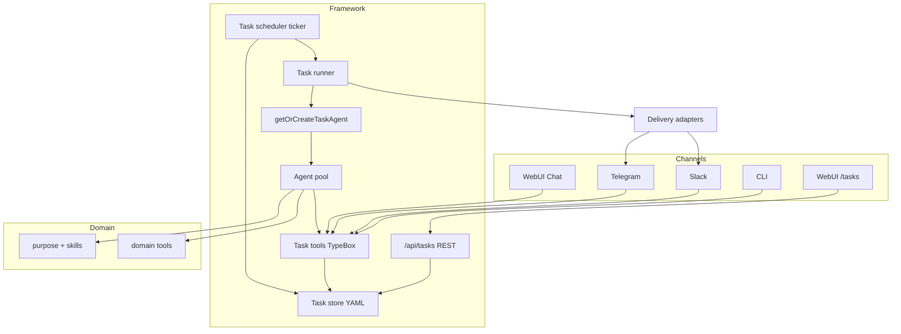
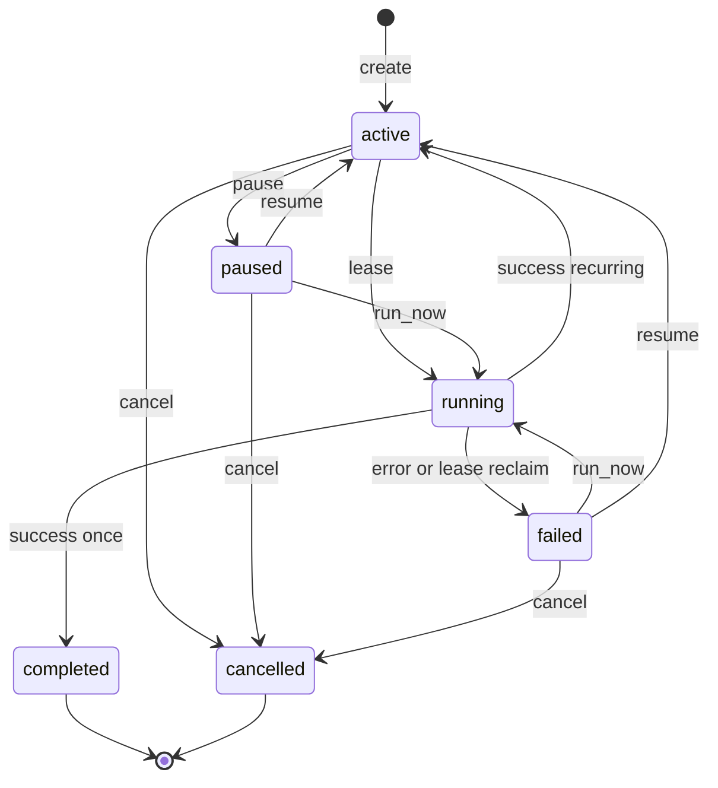
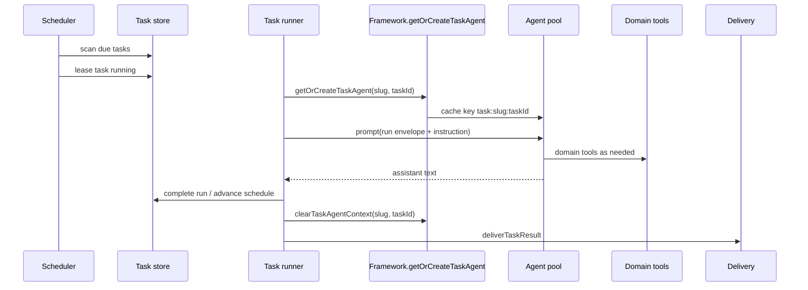

# Framework-Owned Per-User Task List + Conversation Management

| Field | Value |
| --- | --- |
| **Title** | Framework-owned per-user Task List + Conversation Management (Utarus) |
| **Author** | Utarus design (review-revised) |
| **Date** | 2026-07-18 |
| **Status** | Draft (revised after design review) |
| **Scope** | Design only — no implementation in this document |

---

## Overview

Utarus today owns per-user identity, conversation history, usage metering, and (optionally) billing — but **not** scheduled work. User state (`src/state/types.ts`) is limited to `user` / `profile` / `log`. Framework tools in `src/framework.ts` `allTools` cover skill, user-state, invite, firecrawl, reports, BinDrive, and reporting — **no task CRUD**. The WebUI has a shell-only `TasksPage` (`web/src/pages/TasksPage.tsx`) whose data contract is **domain-owned** via `DomainWebPageKind: 'tasks'` (`src/extension.ts`); the empty-state copy still references domain-specific `/daily on`. There is **no scheduler**, no task store, and no system-prompt protocol for managing deferred work.

This design makes **task lists and their execution framework-owned**, so every domain agent (Binary, Marie, Invage, Demo) gets the same per-user task lifecycle without re-implementing storage, tools, or tickers. Users create, list, update, pause, cancel, and run tasks through natural language on WebUI / Telegram / Slack / CLI. A process-local framework scheduler fires due tasks and drives isolated agent turns via a new Framework API (`getOrCreateTaskAgent`). The domain continues to define *what the agent can do when a task runs* (purpose + domain tools); the framework owns *when*, *which user*, and *list/status*.

---

## Background & Motivation

### Current state (code-backed)

| Concern | Location | Behavior today |
| --- | --- | --- |
| User state model | `src/state/types.ts` | `UserState = { user, profile, log }` only — no tasks |
| User YAML I/O | `src/state/state-file.ts` | `data/users/<slug>.yaml`; fail-fast `assertCoherent`; no defaults |
| Framework tools | `src/framework.ts` `allTools` | skill, firecrawl, write/post report, user-state, invite, bindrive, reporting |
| System prompt | `buildSystemPrompt` in `src/framework.ts` | User-state / invite / reporting protocols; **no task protocol** |
| Agent pool | `src/agent.ts` | 24h TTL, max 100 agents; keys via `agentCacheKey` in `framework.ts` |
| Agent key API | `Framework.getOrCreateAgent` | Only bare slug or `web` scope (`AgentChannelScope = 'web'`); **no task key path** |
| Standalone boot | `src/index.ts` `main()` | Calls `defaultFramework()` **separately** for Telegram, Slack, and CLI — **multiple** `createFramework` instances |
| WebUI tasks UI | `web/src/pages/TasksPage.tsx` | Shell list: `GET {apiBase} → { items: TaskItem[] }`; `statusDot` handles `active`/`paused`/`failed\|disabled` only |
| Domain pageKind | `src/extension.ts` | `DomainWebPageKind = 'notifications' \| 'tasks' \| 'iframe'` |
| Manifest | `src/webapp/webui-manifest.ts` | Framework: Chat (+ Billing if on) + domain nav + Admin; tasks only if domain registers route |
| Shell routing | `web/src/pages/Shell.tsx` | Hardcoded Admin/Billing; domain `pageKind === 'tasks'` → `TasksPage` |
| Chat store | `src/webapp/chat/conversation-store.ts` | `data/chats/<slug>/…` |
| Usage | `src/usage/usage-file.ts` | `data/usage/<slug>.yaml`; **creates file on miss**; monthly period; no cache |
| Caps / billing | `src/billing/gate.ts`, `src/usage/agent-tracking.ts` | Pre-turn `checkTurnAllowed`; tool wraps `wrapToolsWithCaps` |
| Paywall channel | `src/billing/types.ts` | `PaywallChannel = 'web' \| 'telegram' \| 'slack' \| 'cli'` — **no `'task'`** |
| Agent run timeout | `src/webapp/chat/run-agent.ts` | `AGENT_RUN_TIMEOUT_MS = 10 * 60 * 1000` (exported) |
| Delivery | Telegram/Slack interfaces | Reactive replies only; Telegraf `bot` local to `startTelegram`; Slack send inside `app.ts` |
| Process model | `docs/webui-integration.md` | WebUI **must** share process with agent pool |
| Mutexes | `src/` | **No** per-user file locks today (task store will introduce its own for task YAML only) |

### Pain points

1. **Every domain reinvents tasks** — Binary/Marie-style “daily check-in” becomes custom YAML, slash commands, and domain APIs; fork drift is guaranteed.
2. **Conversation cannot manage deferred work** — agents have no framework tools to create/pause/cancel scheduled work without inventing data.
3. **Shell UI is a lie without domain wiring** — `TasksPage` exists but has no framework backend; empty copy points at `/daily on`.
4. **No notion of “run at the right time”** — without a framework ticker that drives agent turns, tasks are at best reminder records.

### Product intent

1. Framework provides per-user task lists (not domain agents).
2. Users manage tasks via conversation (NL create/list/update/pause/cancel) and scheduled execution.
3. Design only in this doc.

---

## Goals & Non-Goals

### Goals

1. **Framework-owned task store** with fail-fast validation, no silent defaults, YAML under `DATA_ROOT`.
2. **CRUD + lifecycle tools** callable by the agent (bound to authenticated user slug, like `submit_report`).
3. **System-prompt protocol** so agents re-read before mutate and never invent task fields (including timestamps).
4. **Scheduler that executes work**: when a task is due, framework drives an agent turn and delivers results.
5. **WebUI framework page** at `/tasks` with `/api/tasks`, reusing/extending `TasksPage`.
6. **Domain coexists**: domain tools run *during* execution; domains **must not** ship a second Tasks nav when framework Tasks is present.
7. **Incremental PR plan** implementable against current patterns (TypeBox tools, YAML files, Express routers).
8. **Scale**: same Utarus assumptions — ~&lt;10k users; tens of tasks per user (hard cap below).

### Non-Goals

1. Distributed multi-process scheduler, Redis, Postgres, SQLite, or external job queues (v1 assumes **one Node process** per deployment — same constraint as agent pool + WebUI).
2. Full cron expression language, calendar UIs, multi-user shared tasks, or **weekday / business-day** schedule kinds (Mon–Fri as a single kind is **out of v1**).
3. Guaranteed exactly-once execution across process crashes (v1: at-least-once with run lease + in-memory active-run tracking).
4. Silent retries / backoff with invented parameters (project rule: fail fast, surface error).
5. Replacing domain business logic tools (portfolio, market data, etc.).
6. Slash-command-only task management without NL tools (commands may *call* the same store helpers, but tools are required).
7. Global lock across user-state / domain YAML for interactive chat vs task runs (accepted v1 risk — see Concurrency).
8. Implementing code in this document.

---

## Named constants (fail-fast, no soft “e.g.”)

All implementers **must** use these names and values (or change them only via a design amendment). No silent “pick a number.”

| Constant | Value | Meaning |
| --- | --- | --- |
| `MAX_TASKS_PER_USER` | `50` | Create fails if file already has 50 tasks |
| `MAX_GLOBAL_TASK_RUNS` | `3` | Max concurrent task-run agent turns process-wide |
| `MAX_RESULT_EXCERPT_CHARS` | `2000` | Truncation length for `last_result_excerpt` / run summary |
| `MAX_RECENT_RUNS` | `10` | Max length of `recent_runs[]`; save throws if longer |
| `TASK_TICK_MS` | `30_000` | Scheduler poll interval |
| `AGENT_RUN_TIMEOUT_MS` | `10 * 60 * 1000` | Reuse export from `src/webapp/chat/run-agent.ts` |
| `TASK_LEASE_MS` | `AGENT_RUN_TIMEOUT_MS + 60_000` (= **11 min**) | Disk lease duration; reclaim only after expiry and not in-memory active |
| `TASK_FILE_VERSION` | `1` | `UserTaskFile.version` |

---

## Key Decisions

| # | Decision | Rationale |
| --- | --- | --- |
| **K1** | Store tasks in **`data/tasks/<slug>.yaml`**, not inside `user` YAML | Matches split of usage (`data/usage/`) and chats (`data/chats/`); high-churn scheduler scans must not bloat or race with profile/log mutations; independent coherence validation. **Miss semantics differ from usage-file** (see Data model): tasks do **not** create-on-miss. |
| **K2** | Ubiquitous language: **Task** (durable unit), **Schedule** (timing rule on task), **Run** (one execution attempt). Avoid “Job” as a first-class type. | Aligns with existing `TasksPage` / `TaskItem` naming. |
| **K3** | Tasks are **executable instructions**, not mere reminders | Product requires scheduled execution; framework ticker + agent turn is mandatory for v1. |
| **K4** | Execution uses isolated cache keys `task:<userSlug>:<taskId>` via **new Framework methods** `getOrCreateTaskAgent` / `clearTaskAgentContext` — **not** by extending `AgentChannelScope` | `agentCacheKey` / `getOrCreateAgent` only support bare slug and `web` (`src/framework.ts`). Runner must use public Framework API with the same `systemPrompt` + `allTools`. |
| **K5** | Scheduler is process-local; **module holds one Framework ref**; `startTaskScheduler(fw)` is explicit (never auto-start inside `createFramework`) | Standalone `main()` currently builds multiple Frameworks; auto-start + singleton throw would break second channel. Domain hosts and fixed standalone boot call start once. |
| **K6** | Domain influences **run semantics** only via purpose + domain tools (+ optional `taskRun.enrichTaskPrompt`); framework owns schedule/list/status | Preserves DomainExtension boundary. |
| **K7** | WebUI Tasks is **framework nav + `/api/tasks`**. Domains **must** remove `nav`/`routes` with `pageKind: 'tasks'` in the same upgrade that pulls framework Tasks. Type remains for one major (compile-time dual-support), **not** concurrent product UX. | Prevents two Tasks entries with different backends. |
| **K8** | Recurrence v1: **`once`**, **`daily`**, **`weekly`** only. No cron. No `weekdays` kind. | Daily/weekly covers common cases; Mon–Fri needs product follow-up. |
| **K9** | Failure: `status=failed`, store `last_error`, **no automatic retry** | Project rules: fail fast. |
| **K10** | Task **runs** count toward usage/billing via `checkTurnAllowed` + `attachUsageTracking` with **`PaywallChannel = 'task'`** (union extended). | No free shadow path; CLI channel would lie about upgrade UX. |
| **K11** | **Catch-up:** if `next_run_at <= now` and active, fire **once**, then on success `computeNextRunAt(schedule, max(finished_at, now))` — do **not** replay every missed day. | Correct after downtime without run storms. |
| **K12** | **Lease:** `TASK_LEASE_MS = AGENT_RUN_TIMEOUT_MS + 60s`. Reclaim to `failed`/`run_lease_expired` only if lease expired **and** `!isRunActive(run_id)` (`src/tasks/run-state.ts`). Runner always `beginActiveRun` / `endActiveRun` in `finally`. Scheduler uses `tickRunning` reentrancy guard. | Prevents reclaim racing a live 10-min run; prevents pile-up of ticks; single owner of active-run set. |
| **K13** | **`next_run_at` is never LLM- or client-freeform-authored.** Tools/API compute it via pure `computeNextRunAt` / `computeInitialNextRunAt` from **structured calendar fields only** — including `once` (`run_date` + `time_of_day` + `timezone`). No ISO `run_at` / `next_run_at` tool params. | Prevents inventing timestamps; luxon owns ISO. |
| **K14** | **Web delivery v1** = store result on task + Tasks UI only (`delivery_channel: 'web'` behaves like store-only push). No synthetic chat bubbles. | Avoids inventing conversation ids. |
| **K15** | Task-run agents always use **`enforceCaps: true`** / treat as non-admin for caps, even if the owner is an admin in interactive channels. | Scheduled spend is controlled; ops raise caps/comps if needed. |
| **K16** | Timezone math uses **`luxon`** (new dependency in PR1). No hand-rolled offsets; no Temporal (not available on current Node without polyfill). | Deterministic DST tests. |
| **K17** | Nested `run_task_now` guard uses **runner-scoped tool options** (`activeRunTaskId` on `createTaskTools`), not process env / global ALS required for v1. | Concurrent multi-user runs must not clobber a single env var. |

---

## Terminology

| Term | Definition |
| --- | --- |
| **Task** | Durable, user-owned record of deferred/scheduled work. Source of truth on disk. |
| **Schedule** | Timing rule embedded on the Task (`kind`, `next_run_at`, optional recurrence fields). Not a separate entity. |
| **Run** | One execution attempt of a Task (in-memory during execution; summary on the Task). |
| **Instruction** | Natural-language description of what the agent should do when the Task fires (user-authored). |
| **Delivery channel** | Where run results are pushed (`telegram` \| `slack` \| `web` \| `none`). |
| **Job** | **Not used** in APIs or tools. |

---

## Proposed Design

### Architecture



### Data model

#### Storage location (chosen)

**Path:** `<DATA_ROOT>/tasks/<slug>.yaml`  
**Module (proposed):** `src/tasks/types.ts`, `src/tasks/task-file.ts`, `src/tasks/schedule.ts`, `src/tasks/index.ts`  
**Pattern:** fail-fast coherence like `src/state/state-file.ts` / `src/state/reporting.ts` — pure FS, yaml parse/stringify, `assertValidSlug`.  

**Do not mirror** `src/usage/usage-file.ts` **create-on-miss** behavior. Usage auto-creates counters for every turn; tasks must not silently create empty files on read paths.

**Why not embed in `data/users/<slug>.yaml`:**

| Option | Pros | Cons |
| --- | --- | --- |
| Embed under `UserState.tasks[]` | Single file per user | Races with profile/log tools; scheduler loads every user file; couples coherence |
| **Separate `data/tasks/<slug>.yaml` (chosen)** | Independent validation; scheduler scans task dir only | Extra file; slug must align with existing user |
| One global `data/tasks.yaml` | Simple scan | Write contention; weaker per-user boundaries |
| SQLite / external DB | Query flexibility | New infra; out of scope (non-goal) |

#### File miss / load semantics (normative)

| API | Missing file | Corrupt file | Notes |
| --- | --- | --- | --- |
| `listTasksForUser(slug)` | Return `[]` — **no write** | **throw** | Used by tools list + GET list |
| `loadTaskFile(slug)` | **throw** `Task file not found: …` | **throw** | Used when task id must exist |
| `ensureTaskFileForCreate(slug)` | After `loadState(slug)` proves user exists, create `{ version: 1, user_slug, tasks: [], updated_at }` and write | **throw** if corrupt existing | Only create path |
| `saveTaskFile(file)` | N/A | N/A | Always `assertTaskFileCoherent` first |

**Rule:** Creating a task for a slug with no user state file **fails fast** (`User state file not found` from `loadState`). Deleting a user does **not** auto-delete tasks in v1 (ops may `rm`; cascade is a later product decision).

#### Schema

Scheduler-facing fields that can be “never set” use **required `| null`**, not optional `?`, so YAML always has the key and code never does `?? null` defaults.

```ts
/** Task status lifecycle (v1). */
export type TaskStatus =
  | 'active'    // eligible for scheduler when next_run_at <= now
  | 'paused'    // scheduler skips
  | 'running'   // exclusive lease held by runner
  | 'completed' // one-shot finished successfully (terminal)
  | 'cancelled' // user cancelled (terminal)
  | 'failed';    // last run failed; not auto-retried

export type TaskScheduleKind = 'once' | 'daily' | 'weekly';

export type TaskProvenance = 'chat_tool' | 'api' | 'system';

export type TaskDeliveryChannel = 'telegram' | 'slack' | 'web' | 'none';

export interface TaskSchedule {
  kind: TaskScheduleKind;
  /**
   * ISO-8601 UTC. Always required on the stored Task.
   * Readiness: status === 'active' && Date.parse(next_run_at) <= Date.now().
   * Written only by schedule pure functions / runner — never by the LLM.
   */
  next_run_at: string;
  /**
   * IANA timezone. Required when kind is daily|weekly.
   * Must be absent (key omitted) when kind is once (wall clock already resolved into next_run_at).
   */
  timezone?: string;
  /**
   * HH:mm 24h in `timezone`. Required when kind is daily|weekly.
   * Must be absent when kind is once.
   */
  time_of_day?: string;
  /**
   * 0=Sunday … 6=Saturday (JS getDay) in `timezone`.
   * Required when kind is weekly. Must be absent otherwise.
   */
  day_of_week?: number;
}

export interface TaskRunSummary {
  run_id: string;
  started_at: string;
  finished_at: string | null;  // null only while running entry is not yet terminal — stored entries are terminal with non-null
  ok: boolean;
  error: string | null;        // non-null when ok === false
  result_excerpt: string | null;
  delivery: {
    channel: TaskDeliveryChannel;
    ok: boolean;
    error: string | null;
    /** Per destination detail, e.g. telegram user ids attempted */
    destinations?: Array<{ id: string; ok: boolean; error: string | null }>;
  } | null;
}

export interface Task {
  id: string;
  owner_slug: string;              // must match file path slug
  title: string;                   // non-empty
  instruction: string;             // non-empty
  status: TaskStatus;
  schedule: TaskSchedule;
  last_run_at: string | null;
  last_error: string | null;       // non-null when status === 'failed'
  last_result_excerpt: string | null;
  delivery_channel: TaskDeliveryChannel;
  provenance: TaskProvenance;
  created_at: string;
  updated_at: string;
  domain_tag: string | null;       // opaque to framework; null if unset
  recent_runs: TaskRunSummary[];   // always present; length 0..MAX_RECENT_RUNS
  /** Present iff status === 'running'; absent otherwise */
  run_lease?: {
    run_id: string;
    leased_at: string;
    lease_expires_at: string;
  };
}

export interface UserTaskFile {
  version: typeof TASK_FILE_VERSION; // 1
  user_slug: string;
  tasks: Task[];
  updated_at: string;
}
```

#### Coherence rules (fail-fast, no defaults)

`assertTaskFileCoherent(raw, path)` **throws** if any of:

- Missing/invalid `version === 1`, `user_slug`, `tasks` array, `updated_at`.
- Any task missing required keys (`id`, `owner_slug`, `title`, `instruction`, `status`, `schedule`, `last_run_at`, `last_error`, `last_result_excerpt`, `delivery_channel`, `provenance`, `created_at`, `updated_at`, `domain_tag`, `recent_runs`).
- `owner_slug !== user_slug` or `user_slug` mismatches filename slug.
- Empty `title` or `instruction`.
- `schedule.kind === 'once'` but `timezone` / `time_of_day` / `day_of_week` present.
- `schedule.kind === 'daily'` without valid `timezone` + `time_of_day` (`HH:mm`).
- `schedule.kind === 'weekly'` without valid `timezone` + `time_of_day` + `day_of_week` in `0..6`.
- Invalid ISO `next_run_at` / timestamps; unknown `status` / `kind` / `delivery_channel` / `provenance`.
- `status === 'running'` without valid `run_lease` (`run_id`, `leased_at`, `lease_expires_at`).
- `status !== 'running'` with `run_lease` present.
- **`last_error` non-null if and only if `status === 'failed'`** (biconditional). Empty/null `last_error` when failed → throw. Non-null `last_error` when status is anything else → throw.
- `recent_runs.length > MAX_RECENT_RUNS`.
- `tasks.length > MAX_TASKS_PER_USER` on save (create path rejects earlier with clear error).

#### Lifecycle (normative state machine)

Single machine — no contradictory prose.

**Invariant:** every write path that changes `status` must leave `last_error` satisfying the biconditional above. Any transition **out of** `failed` **must** set `last_error = null` in the **same** `saveTaskFile` as the status change. Any transition **into** `running` must assert `last_error === null` after the write.

| Current status | Action | Next status | Required side effects |
| --- | --- | --- | --- |
| *(none)* | `create` | `active` | Compute `next_run_at`; `last_run_at=null`; `last_error=null`; `last_result_excerpt=null`; `recent_runs=[]` |
| `active` | `pause` | `paused` | Keep `last_error=null` |
| `paused` | `resume` | `active` | Recompute `next_run_at` if past (recurring) or require new structured once fields if past; `last_error=null` |
| `active` \| `paused` \| `failed` | `cancel` | `cancelled` | Terminal; clear `run_lease` if any; **`last_error=null`** (including when leaving `failed`) |
| `running` | `cancel` | **reject** (409 / tool fail) | Wait for run to finish or lease reclaim |
| `active` | scheduler / `run_now` lease | `running` | Set `run_lease` with `TASK_LEASE_MS`; `last_error=null` |
| `paused` | `run_now` lease | `running` | Same lease; `last_error=null` |
| `failed` | `run_now` lease | `running` | Same lease; **atomically `last_error=null`** with status→`running` |
| `completed` | `run_now` | **reject** | Create a new task instead (or future: clone) |
| `cancelled` | any mutate except read | **reject** | Terminal |
| `running` | run success + `once` | `completed` | Clear lease; set `last_run_at`, `last_result_excerpt`; `last_error=null` |
| `running` | run success + daily/weekly | `active` | Clear lease; advance `next_run_at` via K11; `last_error=null` |
| `running` | run failure / timeout / cap | `failed` | Clear lease; set `last_error` non-empty; do **not** advance schedule |
| `failed` | `resume` | `active` | Atomically: `last_error=null`, set/recompute `next_run_at`, `status=active` |
| `failed` | `pause` | **reject** | Use `cancel` or `resume` only |
| `running` + lease expired + not in-memory active | reclaim | `failed` | `last_error='run_lease_expired'` |



#### Schedule computation (tools/API only)

Pure module `src/tasks/schedule.ts` (uses **luxon**):

```ts
/** Initial next_run_at at create/update time. No ISO inputs from callers. */
function computeInitialNextRunAt(input:
  | { kind: 'once'; run_date: string; time_of_day: string; timezone: string }
  // run_date = YYYY-MM-DD; time_of_day = HH:mm; timezone = IANA
  | { kind: 'daily'; timezone: string; time_of_day: string; after?: string }
  | { kind: 'weekly'; timezone: string; time_of_day: string; day_of_week: number; after?: string }
): string;

/** After a successful run: next occurrence strictly after `afterIso`. */
function computeNextRunAt(schedule: TaskSchedule, afterIso: string): string;
```

For `once`, stored `TaskSchedule` still has only `{ kind: 'once', next_run_at }` (no timezone retained on disk after create — wall clock already resolved to UTC ISO). If the user later updates a once task’s time, they pass structured fields again and the tool recomputes.

**Create tool / POST body contract:**

| Kind | Agent/API supplies (structured only) | Tool/server writes |
| --- | --- | --- |
| `once` | `run_date` (`YYYY-MM-DD`), `time_of_day` (`HH:mm`), `timezone` (IANA) — all **required** | `schedule = { kind:'once', next_run_at: computeInitial… }` |
| `daily` | `timezone`, `time_of_day` | `next_run_at = computeInitialNextRunAt({ kind:'daily', …, after: now })` |
| `weekly` | `timezone`, `time_of_day`, `day_of_week` | same with weekly |

**Reject** incomplete inputs. **Never** accept tool/API params named `next_run_at` or free-form ISO `run_at`. REST uses the same structured fields as tools (no privileged ISO shortcut in v1).

**Planned spacing validation (security):** on create/update/advance for `daily`, the computed next occurrence after a given `after` must be the correct wall-clock next day (luxon handles DST; effective gap ~23–25h). For `weekly`, ~6–8 days. This validates **schedule definition / advance output**, **not** “cannot execute if `last_run_at` was &lt; 1 day ago.” Overdue catch-up (K11) is allowed to fire immediately.

#### Example YAML

```yaml
version: 1
user_slug: demo
updated_at: "2026-07-18T12:00:00.000Z"
tasks:
  - id: "a1b2c3d4-e5f6-7890-abcd-ef1234567890"
    owner_slug: demo
    title: Morning portfolio brief
    instruction: >
      Summarize my portfolio risk and any alerts.
      Use domain tools; do not invent holdings.
    status: active
    schedule:
      kind: daily
      next_run_at: "2026-07-19T01:00:00.000Z"
      timezone: Asia/Singapore
      time_of_day: "09:00"
    last_run_at: null
    last_error: null
    last_result_excerpt: null
    delivery_channel: telegram
    provenance: chat_tool
    created_at: "2026-07-18T12:00:00.000Z"
    updated_at: "2026-07-18T12:00:00.000Z"
    domain_tag: null
    recent_runs: []
```

### Conversation management

#### Framework tools

Module: `src/tools/tasks.ts` → `createTaskTools(userSlug: string, opts?: { activeRunTaskId?: string }): AgentTool[]`

- Bound to authenticated slug (like `createReportingTools`).
- `activeRunTaskId` set **only** when tools are built for a task-run agent (runner passes it). Interactive chat omits it.
- If `run_task_now` is called with `task_id === activeRunTaskId` → fail: `cannot_reenter_active_task_run`.

| Tool | PR | Purpose | Key params |
| --- | --- | --- | --- |
| `list_tasks` | PR2 | List | optional `status` |
| `get_task` | PR2 | Full task | `task_id` |
| `create_task` | PR2 | Create | see create contract below |
| `update_task` | PR2 | Mutate title/instruction/schedule fields/delivery | `task_id` + fields; recomputes `next_run_at` when schedule fields change |
| `pause_task` | PR2 | `active` → `paused` | `task_id` |
| `resume_task` | PR2 | `paused`\|`failed` → `active` | `task_id`; for past `once`, require new `run_date`+`time_of_day`+`timezone` |
| `cancel_task` | PR2 | → `cancelled` | `task_id` |
| `run_task_now` | **PR3a** | Immediate execute path | `task_id` |

**`create_task` parameters (TypeBox):**

- `title` (string, non-empty)
- `instruction` (string, non-empty)
- `schedule_kind`: `'once' | 'daily' | 'weekly'`
- `run_date`: optional string `YYYY-MM-DD` — **required when** `schedule_kind === 'once'`
- `timezone`: optional — **required when** once / daily / weekly
- `time_of_day`: optional `HH:mm` — **required when** once / daily / weekly
- `day_of_week`: optional number — **required when** weekly
- `delivery_channel`: **required** enum — **no default**
- `domain_tag`: optional string

Tool validates, calls `ensureTaskFileForCreate`, computes `next_run_at` via luxon, saves. Returns text summary + structured `details.task` (including computed `next_run_at` for confirmation).

#### System-prompt protocol

Add to `buildSystemPrompt` in `src/framework.ts`:

```text
## Tasks (framework-owned)

Every user has a task list at data/tasks/<slug>.yaml. Disk is source of truth.

When the user wants to schedule, list, pause, resume, cancel, or change recurring work:
1. Call list_tasks or get_task BEFORE any mutation (re-read like get_user).
2. Never invent task ids, next_run_at, past run results, or free-form ISO datetimes.
   You never pass next_run_at. The tool always computes it.
3. Use create_task / update_task / pause_task / resume_task / cancel_task / run_task_now.
4. title = short label; instruction = exact work to perform when the task runs (user's words).
5. delivery_channel is required. If the user does not specify, ask once.
   Prefer the current conversation channel only after get_user shows a linked
   telegram_user_ids / slack_user_ids entry for telegram/slack; otherwise ask or use none/web.
6. Schedule fields are structured calendar parts only:
   - once: run_date (YYYY-MM-DD) + time_of_day (HH:mm) + timezone (IANA).
   - daily: timezone + time_of_day.
   - weekly: timezone + time_of_day + day_of_week (0=Sun … 6=Sat).
   If the user is ambiguous about date/time/timezone, ask once — do not guess ISO strings.
7. Weekday / business-day (Mon–Fri) schedules are NOT supported. Ask once whether they want
   daily (including weekends) or a single weekly day.
8. On tool errors, surface the error in plain language. Do not retry with random parameters.
9. After create/update, confirm title, schedule, next run (from tool result only), delivery, and status.
10. Do not claim a task already ran unless get_task / list_tasks shows last_run_at.
```

#### Natural language → tools

| User utterance | Tool path |
| --- | --- |
| “What do I have scheduled?” | `list_tasks` |
| “Tomorrow at 15:00 UTC, summarize my portfolio” | `create_task` once + `run_date` + `time_of_day: "15:00"` + `timezone: "UTC"` (tool → ISO) |
| “Every day at 9am Asia/Singapore, summarize my portfolio” | `create_task` daily + timezone + time_of_day + instruction |
| “Every Monday at 9am Asia/Singapore, …” | `create_task` weekly + `day_of_week: 1` |
| “Every weekday at 9am …” | **Ask once** — daily (incl. weekends) vs pick one weekly day. Do **not** invent five tasks or a weekdays kind. |
| “Pause the daily digest” | `list_tasks` → `pause_task` |
| “Cancel task …” | `cancel_task` |
| “Run it now” | `run_task_now` (after PR3a) |
| “Change it to 8am” | `get_task` → `update_task` with new `time_of_day` |

#### Domain influence at run time



Optional extension:

```ts
// DomainExtension
taskRun?: {
  enrichTaskPrompt?: (ctx: {
    userSlug: string;
    task: Task;
  }) => string | Promise<string>;
};
```

### Framework API for task agents (Issue 1)

```ts
// Framework interface additions
getOrCreateTaskAgent: (userSlug: string, taskId: string) => Agent;
clearTaskAgentContext: (userSlug: string, taskId: string) => boolean;
startTaskScheduler: () => { stop: () => void };
```

Implementation sketch:

```ts
const getOrCreateTaskAgent = (userSlug: string, taskId: string) => {
  if (!userSlug || !taskId) throw new Error('userSlug and taskId are required');
  const cacheKey = `task:${userSlug}:${taskId}`;
  return baseGetOrCreateAgent(cacheKey, userSlug, /* isAdmin */ false, {
    systemPrompt,
    tools: (slug, _admin) =>
      allToolsForTaskRun(slug), // same framework+domain tools; createTaskTools(slug, { activeRunTaskId: taskId })
    enforceCaps: true, // K15
  });
};

const clearTaskAgentContext = (userSlug: string, taskId: string) => {
  return baseClearAgentContext(`task:${userSlug}:${taskId}`);
};
```

- **`AgentChannelScope` is not extended** with `'task'`.
- `FrameworkHandle` for channels stays chat-oriented; task runner uses full `Framework` (or `Pick` including task methods).
- Always `clearTaskAgentContext` after a run completes to free the pool (MAX_AGENTS = 100).

### Execution model

#### What “executed at the right time” means

Scheduler finds tasks with `status === 'active' && Date.parse(schedule.next_run_at) <= Date.now()`, leases them, runs via `getOrCreateTaskAgent`, records result, advances or fails, delivers.

#### Scheduler ↔ Framework lifecycle (Issue 2)

Module `src/tasks/scheduler.ts` owns the ticker only. In-memory active-run tracking lives in **`src/tasks/run-state.ts`** (shared by scheduler reclaim and runner):

```ts
// src/tasks/run-state.ts
const activeRunIds = new Set<string>();

export function beginActiveRun(runId: string): void {
  if (!runId) throw new Error('runId is required');
  if (activeRunIds.has(runId)) {
    throw new Error(`run_id already active: ${runId}`);
  }
  activeRunIds.add(runId);
}

export function endActiveRun(runId: string): void {
  activeRunIds.delete(runId);
}

export function isRunActive(runId: string): boolean {
  return activeRunIds.has(runId);
}
```

```ts
// src/tasks/scheduler.ts
let boundFramework: Framework | null = null;
let intervalHandle: ReturnType<typeof setInterval> | null = null;
let tickRunning = false;

export function startTaskScheduler(fw: Framework): { stop: () => void } {
  if (!fw) throw new Error('Framework is required');
  if (boundFramework && boundFramework !== fw) {
    throw new Error(
      'Task scheduler already bound to a different Framework instance. ' +
      'Use one createFramework() per process and call startTaskScheduler once.',
    );
  }
  if (intervalHandle) {
    // idempotent no-op if same fw already started
    return { stop };
  }
  boundFramework = fw;
  intervalHandle = setInterval(() => {
    void safeTick();
  }, TASK_TICK_MS);
  void safeTick();
  return { stop };
}

async function safeTick(): Promise<void> {
  if (tickRunning) return; // reentrancy guard
  tickRunning = true;
  try {
    await tickOnce(boundFramework!);
  } catch (e) {
    console.error('[tasks/scheduler]', e instanceof Error ? e.message : e);
  } finally {
    tickRunning = false;
  }
}

// Reclaim: status===running && lease_expires_at < now && !isRunActive(run_lease.run_id)
// → failed + last_error='run_lease_expired'
```

**Runner bookkeeping (mandatory):**

```ts
// src/tasks/runner.ts — executeTaskRun
const runId = randomUUID();
// lease write includes runId …
beginActiveRun(runId);
try {
  // getOrCreateTaskAgent, prompt, waitForIdle / timeout abort, delivery, schedule advance
} finally {
  endActiveRun(runId); // ALWAYS — success, fail, timeout, throw
  // then clearTaskAgentContext; final status write if not already written
}
```

PR3a tests must cover timeout/abort/throw paths still call `endActiveRun` (reclaim can proceed after a crashed run once lease expires).

**Boot rules:**

1. **`createFramework` never starts the scheduler.**
2. Domain hosts: after `createFramework`, call `framework.startTaskScheduler()` once (document in `docs/integration-guide.md` / `webui-integration.md` next to `startWebApp`). Start scheduler **after** channel start functions have been *invoked* (so delivery adapters can register), not after their hang promises resolve.
3. **Standalone companion change** (PR3b): refactor `src/index.ts` `main()` to **one** shared framework. Critical: **`startTelegram` must not be awaited** — verified `bot.launch()` resolves only when the bot stops (`src/interfaces/telegram.ts`). Awaiting it hangs forever and never reaches `startTaskScheduler`.

```ts
const framework = await defaultFramework();

// Telegram: fire-and-forget (launch promise hangs for process lifetime)
if (config.telegram.botToken) {
  void framework.startTelegram().catch((err) => {
    console.error('[Telegram] Failed to start:', err instanceof Error ? err.message : err);
  });
}

// Slack: startSlack returns after app.start() in current code — await OK, or void+catch both fine
if (slackConfigured) {
  void framework.startSlack().catch((err) => {
    console.error('[Slack] Failed to start:', err instanceof Error ? err.message : err);
  });
}

// Scheduler after channel start *calls* (adapters register before bot.launch, not after launch resolves)
framework.startTaskScheduler();

if (process.env.TELEGRAM_ONLY === 'true' || process.env.SLACK_ONLY === 'true') {
  console.log('Background mode — CLI disabled. Bot is running.');
  return;
}
await framework.startCli();
```

#### Concurrency with live chat

| Scenario | Behavior |
| --- | --- |
| User chatting while task runs | Different agent keys (`userSlug` / `web:…` vs `task:…`). Parallel LLM allowed. |
| Task YAML writes | Per-slug in-process mutex in `task-file.ts`. |
| Two due tasks same user | **Sequential per `owner_slug`** queue inside runner. |
| Different users | Up to `MAX_GLOBAL_TASK_RUNS` concurrent. |
| User state / domain portfolio YAML | **No lock today.** Accepted v1 risk — same class as overlapping channel turns if a second path ignored `processingUsers`. Do **not** invent a global user lock unless product requires it. Task runs are **not** blocked on interactive `processingUsers`. |
| Nested `run_task_now` same task | Fail via `activeRunTaskId` (K17). |

#### Run envelope

```text
[Channel: task-runner]
[Task id: <uuid>]
[Task title: <title>]
[Owner slug: <slug>]
[Scheduled for: <next_run_at>]
[Delivery: <channel>]

Execute the following user-defined task instruction carefully.
Use tools as needed. Do not invent data. Surface errors clearly.
When finished, write a concise result the user can read.

## Instruction
<instruction>
```

Optional `enrichTaskPrompt` under `## Domain context`.

#### Delivery adapters (concrete)

```ts
// src/tasks/delivery.ts
export type TaskDeliveryAdapter = {
  channel: 'telegram' | 'slack';
  /**
   * Send text to one destination id (telegram numeric id as string, or slack user id).
   * Throws or returns { ok:false, error } — implementers must not swallow without error string.
   */
  send: (params: {
    destinationId: string;
    text: string;
    userSlug: string;
  }) => Promise<{ ok: true } | { ok: false; error: string }>;
};

const adapters = new Map<'telegram' | 'slack', TaskDeliveryAdapter>();

export function registerTaskDeliveryAdapter(adapter: TaskDeliveryAdapter): void {
  if (!adapter?.channel || typeof adapter.send !== 'function') {
    throw new Error('Invalid task delivery adapter');
  }
  adapters.set(adapter.channel, adapter);
}

export async function deliverTaskResult(params: {
  channel: TaskDeliveryChannel;
  userSlug: string;
  text: string;
}): Promise<TaskRunSummary['delivery']> { /* … */ }
```

**Registration (timing is mandatory):**

- **Telegram:** after `new Telegraf(...)` and handler wiring, **before** `bot.launch()` — never “after launch resolves” (launch’s promise only settles when the bot stops).  
  `registerTaskDeliveryAdapter({ channel: 'telegram', send: async ({ destinationId, text }) => { … await bot.telegram.sendMessage(Number(destinationId), html, { parse_mode: 'HTML' }) … } })`  
  using existing `markdownToTelegramHtml` / `splitTelegramHtml`.
- **Slack:** after Bolt `app` is constructed and client is available, before or right after `app.start()` returns (awaiting `startSlack` is OK if it returns after `app.start()` — unlike Telegram).  
  `registerTaskDeliveryAdapter({ channel: 'slack', send: async ({ destinationId, text }) => { const open = await client.conversations.open({ users: destinationId }); await client.chat.postMessage({ channel: open.channel.id, text: mrkdwn… }); } })`.

**Multi-id policy:** load user via `loadState(slug)`. For `telegram`, iterate **all** `telegram_user_ids`; for `slack`, all `slack_user_ids`. Attempt each; record per-destination `{ id, ok, error }`. Delivery overall `ok` if **at least one** destination succeeds. If none linked → `error: 'no_linked_telegram_id'` / `no_linked_slack_id`. Map Telegram 403/bot-blocked → `telegram_forbidden`. Missing adapter → `channel_adapter_not_started`.

| Channel | Behavior |
| --- | --- |
| `telegram` / `slack` | As above |
| `web` | **No push** (K14); store excerpt on task; UI shows it |
| `none` | Store only |

Run success and delivery failure are **independent** fields on `TaskRunSummary.delivery`.

#### Failure handling

1. LLM/tool throw, abort, empty critical path → `status=failed`, `last_error` set.
2. Watchdog: `AGENT_RUN_TIMEOUT_MS`; `agent.abort()`; mark failed.
3. Cap exceeded: `checkTurnAllowed(slug, false, { channel: 'task' })` before prompt → failed with paywall message; no silent skip.
4. **No automatic retry.**
5. Corrupt task file for a slug → log + skip that slug; do not wipe.

#### Usage caps / billing

- Extend `PaywallChannel` with `'task'` in `src/billing/types.ts` and message/upgrade URL helpers (task runs may still build upgrade URL using user’s linked channels or generic WebUI billing path — prefer WebUI billing link when no interactive channel context).
- Runner: `checkTurnAllowed(owner_slug, false, { channel: 'task' })`.
- `enforceCaps: true` always on task agents (K15).

---

## API / Interface Changes

### REST

`src/webapp/tasks-router.ts` → `app.use('/api/tasks', requireAuth, createTasksRouter())` in `buildWebApp`.

| Method | Path | Response |
| --- | --- | --- |
| `GET` | `/api/tasks` | `{ items: TaskItem[] }` |
| `GET` | `/api/tasks/:id` | `{ task: Task }` |
| `POST` | `/api/tasks` | create (same field rules as tool) |
| `PATCH` | `/api/tasks/:id` | update |
| `POST` | `/api/tasks/:id/pause` | pause |
| `POST` | `/api/tasks/:id/resume` | resume |
| `POST` | `/api/tasks/:id/cancel` | cancel |
| `POST` | `/api/tasks/:id/run` | run-now (**requires runner registered** — same as tool; 503 `task_runner_unavailable` if not) |

Ownership: `req.user.slug` only. 404 cross-user. 409 if `running` for conflicting mutate.

`TaskItem` mapping:

```ts
{
  id: task.id,
  title: task.title,
  status: task.status,
  subtitle: task.schedule.kind,
  next_run_at: task.schedule.next_run_at,
  last_run_at: task.last_run_at,
  meta: task.last_error ?? task.last_result_excerpt ?? undefined,
}
```

### WebUI

- Manifest always adds framework nav Tasks (`path: '/tasks'`, `order: 20`, `icon: 'list'`).
- Shell: hardcoded `/tasks` branch like Billing → `<TasksPage apiBase="/api/tasks" … />`.
- **Domain routes with `pageKind: 'tasks'`:** Shell **ignores** domain routes whose path is `/tasks` when framework Tasks is present; integration-guide **requires** domains delete those nav/route entries in the same release.
- Empty copy: _“Nothing scheduled yet. Ask in chat to create a task — e.g. ‘Every day at 9am Asia/Singapore, summarize my account.’”_
- **v1 UI is read-only list** (refresh only). Mutations via chat or REST. Document in PR5.
- `statusDot` must handle full `TaskStatus`:

| status | dot |
| --- | --- |
| `active` | emerald |
| `running` | blue / animate optional |
| `paused` | slate |
| `completed` | slate-300 |
| `cancelled` | slate-300 |
| `failed` | rose |

### DomainExtension

- Optional `taskRun.enrichTaskPrompt`.
- `DomainWebPageKind: 'tasks'` marked `@deprecated` in PR6; **remove in next major after current 1.x line**.
- Domain upgrade checklist: drop tasks nav/routes; drop custom task YAML if migrated; map `/daily` commands to `create_task` store helpers or NL.

---

## Data Model Changes

- **New:** `data/tasks/<slug>.yaml`
- **UserState:** no change
- **Billing types:** `PaywallChannel` includes `'task'`
- **package.json:** add `luxon` (+ `@types/luxon` if needed)

---

## Alternatives Considered

### A1. Embed tasks in `UserState`

Rejected — write contention, scheduler cost, coherence coupling (K1).

### A2. Reminder-only tasks (no agent execution)

Rejected — fails product intent (K3).

### A3. External queue (BullMQ/Redis/cron daemon)

Deferred — infra overhead for single-process &lt;10k users.

### A4. Domain-owned tasks with framework pageKind only

Rejected — status quo pain; product intent #1.

### A5. Cron / weekdays expressions in v1

Deferred — validation and NL complexity; weekdays called out as non-goal.

### A6. Global SQLite / single `tasks.yaml`

Rejected — contention and ops model; stick to per-slug YAML.

### A7. Slash-command-only management (no NL tools)

Rejected — product requires conversation management; commands may wrap the same store but tools + protocol are mandatory.

---

## Security & Privacy Considerations

| Threat | Mitigation |
| --- | --- |
| Cross-user access | Slug-bound tools; REST owner check |
| Instruction abuse | Runs as owning user with their tools/caps |
| Privilege escalation | No client-supplied owner_slug on create |
| Secret leakage in excerpts | Truncate to `MAX_RESULT_EXCERPT_CHARS` |
| Wrong Telegram/Slack target | Only linked ids; send all linked; record per-id errors |
| Resource exhaustion | `MAX_TASKS_PER_USER`, `MAX_GLOBAL_TASK_RUNS`, LLM caps |
| Schedule abuse | Validate planned spacing on advance/create (not “block overdue fire”) |

---

## Observability

| Signal | Approach |
| --- | --- |
| Logs | `[tasks/scheduler]`, `[tasks/runner]`, `[tasks/delivery]` with slug, taskId, runId |
| Metrics | Logs only in v1 |
| User-visible | `failed` + `last_error` on Tasks UI and tools |
| Audit | `recent_runs[]` on task file |

---

## Rollout Plan

1. Always-on framework capability; explicit `startTaskScheduler` (not hidden flag).
2. Domains upgrade Utarus and **must** drop duplicate Tasks nav in the same PR.
3. Rollback = revert package; orphan YAML files are harmless.
4. Demo: ask agent to create a daily `none`-delivery task in tests.

---

## Risks

| Risk | Severity | Mitigation |
| --- | --- | --- |
| Double execution if two processes share DATA_ROOT | High | Single-process doc; lease + in-memory active set |
| Multiple Framework instances in standalone main | High | Companion refactor to one framework (PR3b); startTaskScheduler fails on second different fw |
| Agent context pollution | Medium | `task:` keys + clear after run |
| Timezone/DST bugs | Medium | luxon + unit tests |
| Caps surprise on scheduled runs | Medium | Confirmations; failed + paywall text; K15 documented |
| Domain YAML races chat vs task | Medium (accepted) | Document; sequential tasks per user only |
| Mega-PR execution | Medium | Split PR3a/b/c |
| Two Tasks nav entries | Medium | Hard migration rule K7 |

---

## Open Questions

Resolved into Key Decisions: catch-up (K11), lease (K12), next_run_at ownership (K13), web delivery (K14), admin caps (K15), luxon (K16), recursion guard (K17), Framework task agent API (K4), scheduler binding (K5).

**Remaining (non-blocking for PR1):**

1. **User deletion cascade** — delete `data/tasks/<slug>.yaml` when user removed? Default v1: **no cascade** (ops/manual).
2. **Admin cross-user task list** — out of v1 unless ops requests.
3. **Exactly which WebUI billing URL** to embed in `channel: 'task'` paywall copy — reuse existing upgrade URL builder with `channel: 'web'` fallback vs new template (implementation detail in runner PR; must not use `'cli'`).

---

## PR Plan

### PR1 — Task data model + file I/O + schedule helpers

- **Files:** `src/tasks/types.ts`, `task-file.ts`, `schedule.ts`, `index.ts`, `tests/tasks-file.test.ts`, `tests/tasks-schedule.test.ts`, add `luxon` dependency
- **Deps:** none
- **Acceptance:** coherence fail-fast; miss semantics; `computeInitialNextRunAt` / `computeNextRunAt` DST cases; constants exported

### PR2 — CRUD tools + system prompt (no run_now)

- **Files:** `src/tools/tasks.ts` (without `run_task_now`), `src/framework.ts` (`allTools` + protocol), exports, tests
- **Deps:** PR1
- **Acceptance:** create computes `next_run_at`; weekday protocol text; pause/resume/cancel match lifecycle table; **no** execution

### PR3a — Runner + lease + `run_task_now` (delivery `none` / store only)

- **Files:** `src/tasks/run-state.ts` (`beginActiveRun` / `endActiveRun` / `isRunActive`), `src/tasks/runner.ts` (`finally` always ends active run), Framework `getOrCreateTaskAgent` / `clearTaskAgentContext`, tool `run_task_now`, `PaywallChannel 'task'`, tests with fake/mocked agent if needed
- **Deps:** PR1–2
- **Acceptance:** run_now leases, executes, completes/fails, clears agent; nested reentry fails; caps checked; timeout/throw paths still call `endActiveRun`

### PR3b — Scheduler ticker + process boot

- **Files:** `src/tasks/scheduler.ts` (reclaim via `isRunActive`), `Framework.startTaskScheduler`, standalone `src/index.ts` single-framework boot **without awaiting Telegram launch**, integration-guide note, tick reentrancy tests
- **Deps:** PR3a
- **Acceptance:** due tasks fire; catch-up once; overlapping ticks skip; second different Framework start throws; scheduler starts even when Telegram is enabled

### PR3c — Channel delivery adapters

- **Files:** `src/tasks/delivery.ts`, register in `startTelegram` / `startSlack`, multi-id send, tests with mocked bot/client
- **Deps:** PR3a (PR3b optional parallel)
- **Acceptance:** all linked ids attempted; errors recorded; missing adapter → explicit error

### PR4 — REST `/api/tasks`

- **Files:** `src/webapp/tasks-router.ts`, `server.ts` mount, tests
- **Deps:** PR1 (run endpoint needs PR3a for success; until then run returns `task_runner_unavailable`)
- **Acceptance:** auth ownership; validation parity with tools

### PR5 — WebUI framework Tasks page

- **Files:** `webui-manifest.ts`, `Shell.tsx`, `TasksPage.tsx` (statusDot + empty copy), docs
- **Deps:** PR4
- **Acceptance:** framework nav only; status colors; read-only list; domain `/tasks` route ignored or domains updated

### PR6 — Domain hook + migration

- **Files:** `extension.ts` (`taskRun?`, `@deprecated` on pageKind tasks), integration-guide checklist, examples/demo README
- **Deps:** PR3a, PR5
- **Acceptance:** checklist requires drop domain tasks nav; deprecation note “remove next major after 1.x”

---

## References

| Resource | Path |
| --- | --- |
| User state types | `src/state/types.ts` |
| User state I/O | `src/state/state-file.ts` |
| Framework composition | `src/framework.ts` |
| Domain extension | `src/extension.ts` |
| Agent pool | `src/agent.ts` |
| Reporting pattern (fail-fast store) | `src/tools/reporting.ts`, `src/state/reporting.ts` |
| Usage files (**create-on-miss — do not copy for tasks**) | `src/usage/usage-file.ts` |
| Caps / turn gate | `src/billing/gate.ts`, `src/billing/types.ts` |
| Web agent run / timeout | `src/webapp/chat/run-agent.ts` |
| Standalone multi-framework boot (to fix) | `src/index.ts` `main()` |
| WebUI manifest / Shell / TasksPage | `src/webapp/webui-manifest.ts`, `web/src/pages/Shell.tsx`, `TasksPage.tsx` |
| Integration guides | `docs/integration-guide.md`, `docs/webui-integration.md` |

---

## Appendix: Critical interfaces (normative)

### Task file API

```ts
// src/tasks/task-file.ts
export function taskFilePath(slug: string): string;
/** Throws if missing or corrupt. */
export function loadTaskFile(slug: string): UserTaskFile;
/** ENOENT → []; corrupt → throw; never writes. */
export function listTasksForUser(slug: string): Task[];
/** Requires loadState(slug) success; creates empty file if missing. */
export function ensureTaskFileForCreate(slug: string): UserTaskFile;
export function saveTaskFile(file: UserTaskFile): string;
export function listTaskSlugs(): string[];
export function withTaskFileLock<T>(slug: string, fn: () => Promise<T> | T): Promise<T>;
```

### Runner entry

```ts
export async function executeTaskRun(params: {
  framework: Framework;
  taskId: string;
  ownerSlug: string;
  trigger: 'scheduler' | 'run_now';
}): Promise<void>;
// Must: allocate runId → lease write → beginActiveRun(runId) → try { … } finally { endActiveRun(runId) }
```

### Active-run state

```ts
// src/tasks/run-state.ts — single owner of in-memory run set
export function beginActiveRun(runId: string): void;
export function endActiveRun(runId: string): void;
export function isRunActive(runId: string): boolean;
// Scheduler reclaim: expired lease && !isRunActive(runId) → failed / run_lease_expired
```

### Framework task agent

```ts
// Implemented only via Framework methods — never call baseGetOrCreateAgent from domain code.
framework.getOrCreateTaskAgent(userSlug, taskId);
framework.clearTaskAgentContext(userSlug, taskId);
```
