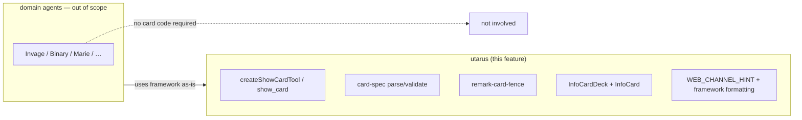
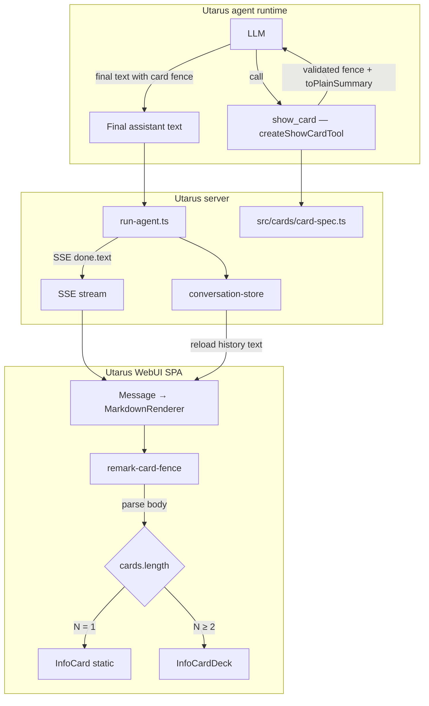
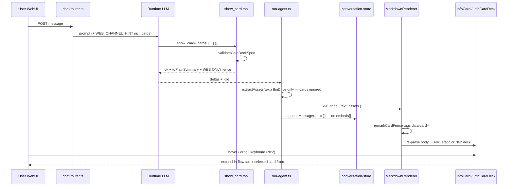
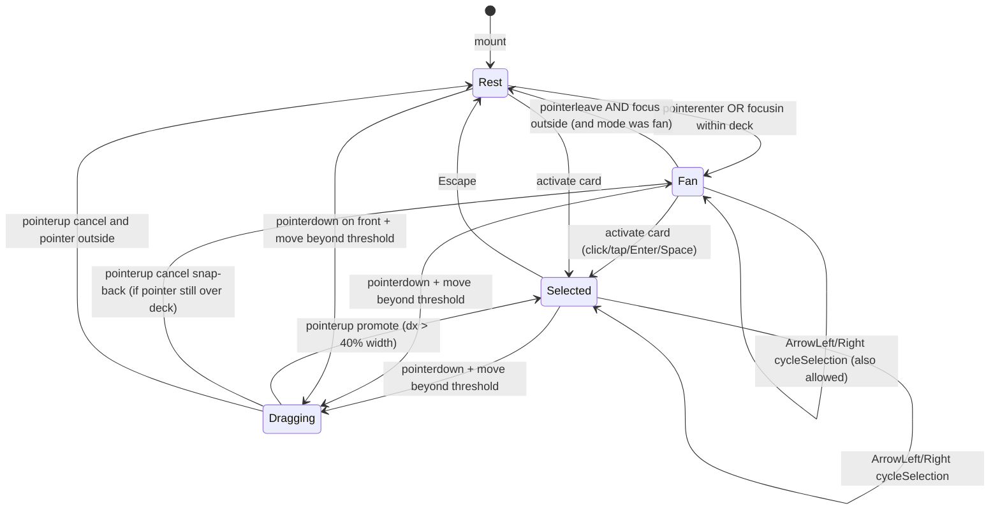

# Inline Info Cards in WebUI Chat

| Field | Value |
|-------|--------|
| **Status** | Implemented (Utarus **1.10.0**) |
| **Agent guide** | [info-cards-agent-guide.md](./info-cards-agent-guide.md) |
| **Author** | — |
| **Date** | 2026-07-20 |
| **Audience** | Utarus framework maintainers |
| **Primary repo** | `utarus` only |
| **Related** | [webui-chat-design.md](./webui-chat-design.md), [webui-chat-maps-design.md](./webui-chat-maps-design.md), [webui-chat-widgets-design.md](./webui-chat-widgets-design.md), [webui-chat-widgets-rich-document-design.md](./webui-chat-widgets-rich-document-design.md) |
| **Depends on** | Maps-style fence pipeline (shipped); chat embeds convention `web/src/embeds/chat-embed.ts` |
| **Revision** | r2 — 2026-07-20: lock `mdast-util-from-markdown` deps; fixed `FAN_STEP_PX=36`; document body `<` pre-pass |

---

## Overview

Utarus WebUI already has three distinct rich-media surfaces:

| Surface | Fence / tool | Host | Durability |
|---------|--------------|------|------------|
| Inline maps | ` ```map ` / `show_map` | `MapEmbed` in thread | Ephemeral (text-only) |
| Mermaid diagrams | free ` ```mermaid ` | `DiagramEmbed` in thread | Ephemeral (text-only) |
| Side-panel widgets | ` ```widget ` / `show_widget` family | `WidgetCard` launcher → panel iframe | Optional durable state |

Agents still lack a **compact, designed “information card”** surface for structured facts (comparisons, profiles, status summaries, option pickers as read-only chrome) that is **inline in the thread**, not a half-screen panel, and not a wall of GFM paragraphs.

This design introduces **Info Cards** as a **platform inline media type** (maps class, not widgets class):

1. A canonical fenced block in message `text` (` ```card ` … ` ``` `).
2. A framework built-in tool (`show_card`, factory `createShowCardTool()`) that validates a closed **card/deck schema** and emits that fence (plus a cross-channel plain-text summary via `toPlainSummary`).
3. SPA remark + React components that render a **static single card** (`N === 1`) or a **poker-style stack/fan deck** (`N ≥ 2`), with hover/focus/drag/touch to draw a card forward for reading.
4. History recovery from stored **text only** — same model as maps/BinDrive; **no** `StoredChatMessage.embeds[]`, **no** `WidgetStateStore`.

**Naming collision:** existing `WidgetCard` (`web/src/components/widgets/WidgetCard.tsx`) is thin **launcher chrome** for side-panel widgets. This feature uses **`InfoCard` / `InfoCardDeck`** and fence language **`card`**. `WidgetCard` is **not** renamed in v1.

**WebUI-first.** Telegram/Slack get a structured plain-text summary. Tools stay channel-agnostic.

---

## Background & Motivation

### Current state (Utarus)

| Layer | Path | Relevant behavior |
|-------|------|-------------------|
| Chat protocol | `src/webapp/chat/types.ts` | `ChatEvent.done` carries `{ text, stopReason, assets }` |
| Message storage | `src/webapp/chat/conversation-types.ts` | `StoredChatMessage.text` only — **no structured embed field** |
| Markdown pipeline | `web/src/components/MarkdownRenderer.tsx` | GFM + math + BinDrive + map/widget/mermaid fences → rehype sanitize → custom `code` branch |
| Chat embed unwrap | `web/src/embeds/chat-embed.ts` | Root of every fence embed must set `data-chat-embed` so `<pre>` chrome unwraps |
| Streaming policy | `MarkdownRenderer` `streaming` prop | Incomplete fences stay as labeled source until reply finishes |
| Maps prior art | `docs/webui-chat-maps-design.md`, `src/maps/map-spec.ts`, `src/tools/show-map.ts` | Dual pure modules + **byte-identical** parity (after header strip); fail-fast; WEB ONLY fence paste |
| Widgets prior art | `docs/webui-chat-widgets-design.md`, `src/widgets/widget-spec.ts` | Dual modules differ only by `utf8Bytes` (`Buffer` vs `TextEncoder`); no source-identity parity test today |
| Mermaid | free fence, client-only `diagram-spec.ts` | No tool (agents free-emit) — **not** a model for closed structured UX |
| Packaging | `web/` cannot import parent `src/` | Dual client/server pure modules + parity tests |
| Built-in tools | `src/tools/*`, registered in `src/framework.ts` | `createShowMapTool()`, `createShowWidgetTools(…)` in `allTools` |
| Lucide | `web/package.json` `lucide-react` `^0.454.0` | Icons are real ESM files under `web/node_modules/lucide-react/dist/esm/icons/*.js` |

### Pain points

1. **Markdown is unstructured presentation.** Key-value facts, badges, multi-option comparisons read poorly as paragraphs or tables — especially on mobile.
2. **Widgets are the wrong host.** Side-panel iframe, instance ids, bridge, and BinDrive state are overkill for a read-only info presentation.
3. **Maps/mermaid are closed or free-source, not structured cards.** Neither provides title/sections/badges/accent tokens.
4. **Multi-item answers need a compact deck UX.** A poker stack keeps vertical footprint small while remaining inspectable.
5. **Free agent HTML is XSS.** Any path that accepts raw HTML/JS into the parent SPA is unacceptable.

### Constraints (project conventions)

- **Verify data model first.**
- **No fallback code / no silent default values.** Invalid card payloads fail fast with a clear error string. Omitted optional fields mean “absent,” not “fill product defaults.”
- **No optimization / no cache** unless explicitly requested.
- Prefer **deep modules**: small agent-facing tool surface; grammar/host stay behind it.
- Align with maps/widgets: dual pure modules; channel-agnostic tools; text-recoverable; WEB ONLY fence paste.

---

## Goals & Non-Goals

### Goals

1. Agents can present **one or more designed information cards** inline in WebUI chat via a framework tool.
2. Expression is **text-recoverable**: reload/history re-renders cards from `StoredChatMessage.text` alone.
3. Framework validates card/deck payloads; **fail fast** on invalid input (unknown keys, oversize, bad types, bad accents, too many cards).
4. **Multi-card decks** (`N ≥ 2`) use **poker-style stack/fan** interaction (draw/peel to inspect). Single cards (`N === 1`) render as static chrome.
5. **Closed content schema** — no freeform HTML/JS; body text uses a **normative mdast allowlist** rendered safely in React.
6. **Cross-channel degrade**: non-web channels get a readable text summary from `toPlainSummary`; never force fence paste on Telegram/Slack.
7. **Disambiguate naming** from `WidgetCard` / ` ```widget `.
8. Incremental, reviewable PRs in the **utarus** repo only.

### Non-Goals (v1)

- Side-panel hosting of info cards, or a new platform **widget kind** for cards.
- Durable card instances (`WidgetStateStore`, `instanceId`, revisions, mid-conversation `update_card`).
- Freeform agent HTML/CSS/JS for card chrome or body.
- Arbitrary remote image URLs in cards (tracking / mixed-content / privacy).
- Interactive form controls inside cards (buttons that POST, inputs, “select this option” RPC).
- Structured `embeds[]` on `StoredChatMessage` / protocol change to `ChatEvent.done`.
- Attachment-strip cards for info cards (not `AssetRef`).
- Overloading `show_widget` / ` ```widget ` for this surface.
- Renaming or rewriting existing `WidgetCard` component.
- Domain-agent ownership (skills/purpose “when to card”) inside the framework.
- Channel-specific tools.
- Expanding package `exports` so `web/` imports server `src/` (dual modules instead).
- Dark-mode agent theming beyond platform CSS variables + optional accent.
- Animations as a performance project (acceptable CSS transitions; no canvas/WebGL).
- Playwright / automated SPA component tests (manual checklist in PR3*; root vitest only today).

---

## Key Decisions

| # | Decision | Rationale |
|---|----------|-----------|
| **K1** | **Info cards are a Utarus platform *inline* media type** (maps/mermaid class), **not** a panel widget kind. | Product intent is thread-inline presentation. Panel widgets already cover interactive durable apps. |
| **K2** | **Canonical expression = fenced `card` block** in assistant `text`. Tool `show_card` is the supported producer; client renders any structurally valid fence (history / hand-edits). | Text-only reconstruction (maps K2/K4). No conversation schema migration. |
| **K3** | **One fence = one deck** always. A single card is a deck of length 1. Multi-card emission is a **JSON array** on field `cards`. **Render path:** `N === 1` → static `InfoCard` only; `N ≥ 2` → `InfoCardDeck` state machine. | Client grouping of adjacent fences is fragile. Static single-card avoids wasted poker chrome and SR noise. |
| **K4** | **Closed structured schema only** — title, optional subtitle/body/fields/badges/footer/accent/icon. **Reject free HTML.** Body is a **markdown subset** validated by mdast allowlist (see Content model). | XSS surface stays at React text + controlled markdown render. |
| **K5** | **Ephemeral message chrome only (v1).** No `instanceId`, no `WidgetStateStore`, no `update_card`. Re-present by emitting a new fence in a new turn. | Maps durability model; cards are presentation, not mutable documents. |
| **K6** | **New tool `show_card`** via **`createShowCardTool(): AgentTool`** — parameterless factory (no env gate). Do **not** overload `show_widget`. Register in `framework.ts` `allTools` next to `createShowMapTool()`. | Different host, durability, security, and UX. Parameterless matches pure validation (unlike maps key). |
| **K7** | **Leave `WidgetCard` as-is.** New components: `InfoCard`, `InfoCardDeck`, `InfoCardError`, `CardBodyMarkdown`. Fence lang `card`. | Avoids rename of shipped widget chrome. |
| **K8** | **Dual pure `card-spec` modules** + parity test: `src/cards/card-spec.ts` and `web/src/cards/card-spec.ts`. **Lockstep policy = widget pattern**, not maps byte-identity: shared logic; only `utf8Bytes` may differ (`Buffer.byteLength` server / `TextEncoder` client). Parity asserts export keys + golden fixture behavioral equality. Optional: source equal after normalizing the `utf8Bytes` helper body. **Do not** require maps-style full file byte-identity. | Cards need UTF-8 byte caps like widgets; Buffer vs TextEncoder necessarily diverge. |
| **K9** | **Fence grammar: line-oriented scalars + last field `cards:` single-line minified JSON array** (mirrors widget `props:` rule). Tool `toFence` always emits fully resolved `version` + `layout` + `cards`. | Deterministic parse; nested structure without a YAML engine. |
| **K10** | **Poker stack interaction (v1, N ≥ 2 only):** explicit UI state `{ visualOrder, selectedDataIndex, mode, drag }`; rest stack; expand-in-flow fan; click/Enter/Space select; pointer drag peel; touch swipe cycle; keyboard roving. Max **8** cards. Pure helpers `toFront` / `cycleSelection`. | Implementable without ambiguity; visual order is UI-only; data `cards[]` never reordered. |
| **K11** | **Platform visual system only** + limited agent tokens: `accent` (hex), `icon` (real Lucide kebab allowlist). No agent CSS / className. Badge tones: parser never invents `tone`; UI maps **absent** tone to neutral CSS. | Consistent brand; fail-fast; no silent parser defaults. |
| **K12** | **Cross-channel: summary-first tool text** from **`toPlainSummary`**, fence under **WEB ONLY**. Non-web prompts: **NEVER paste ` ```card `**. `WEB_CHANNEL_HINT` card bullet ships **with the tool (PR2)**. | Tools channel-agnostic; early adopters get web paste signal immediately. |
| **K13** | **No silent defaults** for required fields. Optional fields omitted → absent. Tool always writes fully resolved fence including `version: 1` and `layout: stack`. Parser never inserts `tone: 'neutral'`. | Project fail-fast rule. |
| **K14** | **Images deferred.** No `imageUrl`. Optional `icon` from **verified Lucide kebab names** present in `lucide-react@^0.454.0`. SPA holds a **static** `Record<CardIconName, LucideIcon>` (no dynamic `import()`). Unknown icon → parse/tool error. | Real icons only; no tracking images. |
| **K15** | **Body markdown subset** validated by **`mdast-util-from-markdown` + node-type allowlist** (same algorithm both modules; dependency locked in K20). Allowed nodes only: `root`, `paragraph`, `text`, `emphasis`, `strong`, `inlineCode`, `link`. Link URL scheme `http:` / `https:` only. Pre-pass forbids `<` immediately followed by letter/`/`/`!`/`?`. Render via `CardBodyMarkdown` only (`p`/`em`/`strong`/`code`/`a`); **no** `rehype-raw`, **no** nested `MarkdownRenderer`. | Closed algorithm for dual-module parity; XSS controlled. |
| **K16** | **Soft prefer ≤1 deck fence per final answer** in tool description only; **no hard server cap** on fences per message. Hard caps are **per deck**. | Matches maps soft prefer. |
| **K17** | **Layout contract = expand-in-flow.** Fan/Selected increases deck **in-flow height** so surrounding markdown reflows; **no** paint-over of following prose. Deck root `isolation: isolate` / local stacking context; z-index stays **below** sticky composer and `QuoteToolbar` (do not use portal z-index tiers). | Avoids broken reading/quote selection under overlapping cards. |
| **K18** | **A11y pattern locked:** `role="group"` on deck + focusable cards with **roving `tabIndex`** (not listbox/option). See A11y section. | Cards are content, not form options. |
| **K19** | **SPA delivery split:** PR3a static single-card path; PR3b multi-card rest + select/keyboard; PR3c fan/drag/touch/reduced-motion. | Independently reviewable PRs; ship value early. |
| **K20** | **Body parse dependency locked:** add **`mdast-util-from-markdown` as a direct dependency** of **both** root `package.json` and `web/package.json`. Both `card-spec` copies import `fromMarkdown` from that package with **no GFM extensions**. Do **not** rely on transitive `web/` deps for the server, and do **not** vendor a separate parser in v1. | Root has no mdast/micromark today; server import fails without an explicit dep. Direct web dep avoids fragile deep transitive imports. |
| **K21** | **Fan geometry constants locked:** `REST_STEP_PX = 14`, `FAN_STEP_PX = 36` (fixed pixels, not % of card width). | Removes implementer ambiguity; PR3c does not re-pick formulas. |

---

## Proposed Design

### Ownership boundary



### High-level architecture



### Sequence: tool → store → render → interact



### Data model first

**Conversation JSON: no changes.** Cards live only inside `StoredChatMessage.text` as fences.

| Layer | Durable? | Where | Notes |
|-------|----------|-------|-------|
| Deck/card content | In chat text only | Fence body | Recovered on history load |
| Interaction UI (`visualOrder`, selection, drag) | Session only | React state in `InfoCardDeck` | Lost on reload — acceptable |
| Widget state store | N/A | — | **Not used** |

No `instanceId`. No revision. No `action: open|update`.

---

### Protocol constants & TypeScript types

Dual modules export identical signatures. **Only allowed source divergence:** `utf8Bytes` implementation (server `Buffer.byteLength(s, 'utf8')`; client `new TextEncoder().encode(s).length`) — same as dual `widget-spec.ts`.

```ts
// src/cards/card-spec.ts  ↔  web/src/cards/card-spec.ts

/** Fence language tag (case-sensitive). */
export const CARD_FENCE_LANG = 'card' as const;

/** Protocol version emitted by tools; client accepts only this value in v1. */
export const CARD_SPEC_VERSION = 1 as const;

export type CardLayout = 'stack'; // v1 only; future: 'row' | 'carousel'

/** Max cards in one deck fence. */
export const CARD_DECK_MAX_CARDS = 8;

/** Max key-value rows per card. */
export const CARD_FIELDS_MAX = 12;

/** Max badges per card. */
export const CARD_BADGES_MAX = 6;

export const CARD_TITLE_MAX = 80;
export const CARD_SUBTITLE_MAX = 120;
export const CARD_BODY_MAX = 800;       // characters after trim
export const CARD_FOOTER_MAX = 160;
export const CARD_FIELD_LABEL_MAX = 40;
export const CARD_FIELD_VALUE_MAX = 200;
export const CARD_BADGE_LABEL_MAX = 24;

/** Max UTF-8 byte length of entire fence body. */
export const CARD_FENCE_BODY_MAX_BYTES = 24 * 1024;

/** Max UTF-8 byte length of the minified `cards` JSON array alone. */
export const CARD_CARDS_JSON_MAX_BYTES = 20 * 1024;

/** Max chars of body first line included in toPlainSummary. */
export const CARD_SUMMARY_BODY_MAX = 120;

/**
 * Plain-text summary hard cap (characters) for tool / non-web degrade.
 * If exceeded, truncate with a final "…" line after complete cards only when possible;
 * otherwise hard-cut mid-stream and append "…".
 */
export const CARD_SUMMARY_MAX_CHARS = 3500;

export type BadgeTone = 'neutral' | 'success' | 'warning' | 'danger' | 'info';

/**
 * Allowlisted icon names = Lucide kebab filenames that exist in
 * lucide-react@^0.454.0 (`dist/esm/icons/<name>.js`).
 * SPA maps each name to a static LucideIcon import (PascalCase component).
 * Fail-fast if unknown.
 */
export const CARD_ICON_ALLOWLIST = [
  'building',
  'home',
  'map-pin',
  'user',
  'users',
  'briefcase',
  'file-text',
  'chart-bar',       // Lucide ChartBar — NOT "chart"
  'check-circle',
  'alert-triangle',
  'info',
  'star',
  'tag',
  'calendar',
  'dollar-sign',     // Lucide DollarSign — NOT "dollar"
  'layers',
] as const;

export type CardIconName = (typeof CARD_ICON_ALLOWLIST)[number];

export interface CardField {
  label: string;
  value: string;
}

export interface CardBadge {
  label: string;
  /**
   * Optional. If present, must be a BadgeTone (else validate error).
   * If omitted, field is absent on the object — parser MUST NOT insert
   * `tone: 'neutral'`. React presentation maps missing tone → neutral CSS.
   */
  tone?: BadgeTone;
}

/**
 * One visual card. All optional fields omitted means absent.
 * No silent product defaults in the parser.
 */
export interface InfoCardSpec {
  title: string;
  subtitle?: string;
  /** Markdown subset (K15) — validated by mdast allowlist. */
  body?: string;
  fields?: CardField[];
  badges?: CardBadge[];
  footer?: string;
  /**
   * Accent color: exactly `#RGB` or `#RRGGBB` (case-insensitive hex).
   * Applied only as CSS custom property `--info-card-accent` after validate.
   */
  accent?: string;
  icon?: CardIconName;
}

export interface InfoCardDeckSpec {
  version: typeof CARD_SPEC_VERSION; // 1
  layout: CardLayout;                // 'stack'
  cards: InfoCardSpec[];             // length 1..CARD_DECK_MAX_CARDS
}

export type CardSpecResult =
  | { ok: true; spec: InfoCardDeckSpec }
  | { ok: false; error: string };
```

**SPA icon map (normative, not in pure modules):**

```ts
// web/src/components/cards/card-icons.ts
import type { LucideIcon } from 'lucide-react';
import {
  Building, Home, MapPin, User, Users, Briefcase, FileText,
  ChartBar, CheckCircle, AlertTriangle, Info, Star, Tag,
  Calendar, DollarSign, Layers,
} from 'lucide-react';
import type { CardIconName } from '../../cards/card-spec.js';

/** Static map — every CARD_ICON_ALLOWLIST key MUST appear. No dynamic import(). */
export const CARD_ICON_MAP: Record<CardIconName, LucideIcon> = {
  building: Building,
  home: Home,
  'map-pin': MapPin,
  user: User,
  users: Users,
  briefcase: Briefcase,
  'file-text': FileText,
  'chart-bar': ChartBar,
  'check-circle': CheckCircle,
  'alert-triangle': AlertTriangle,
  info: Info,
  star: Star,
  tag: Tag,
  calendar: Calendar,
  'dollar-sign': DollarSign,
  layers: Layers,
};
```

Parity/fixture requirement: for every entry in `CARD_ICON_ALLOWLIST`, `CARD_ICON_MAP[name]` is defined (unit test on SPA module or compile-time `satisfies Record<CardIconName, LucideIcon>`).

**Result type is mandatory** for all parse/validate entry points — never throw for agent input validation.

---

### Content model (normative)

#### Per-card fields

| Field | Required | Rules |
|-------|----------|--------|
| `title` | **Yes** | Trim non-empty; max `CARD_TITLE_MAX`; no control chars `[\x00-\x08\x0B\x0C\x0E-\x1F]` |
| `subtitle` | No | Same control-char rule; max `CARD_SUBTITLE_MAX`; empty after trim → **error** if key present |
| `body` | No | Max `CARD_BODY_MAX` chars; control chars rejected; must pass `validateCardBodyMarkdown` |
| `fields` | No | Array length 1..`CARD_FIELDS_MAX` if present (**empty array → error**); each `{ label, value }` required strings with max lengths; no extra keys |
| `badges` | No | Array length 1..`CARD_BADGES_MAX` if present (**empty array → error**); `tone` if present ∈ `BadgeTone`; if omitted, leave absent |
| `footer` | No | Max `CARD_FOOTER_MAX`; control chars rejected |
| `accent` | No | `/^#([0-9a-fA-F]{3}|[0-9a-fA-F]{6})$/` only (reject `#ffff`, `#gg0000`, bare `red`, etc.) |
| `icon` | No | Must be ∈ `CARD_ICON_ALLOWLIST` |

Unknown keys on a card object → **error**. Unknown keys on deck root → **error**.

#### Body markdown subset — normative algorithm (`validateCardBodyMarkdown`)

**Dependency (locked — K20):** both dual modules **must** call the same package API:

```ts
import { fromMarkdown } from 'mdast-util-from-markdown';
// CommonMark only — do NOT pass gfm/micromark GFM extensions
const tree = fromMarkdown(normalized);
```

| Package | Change in PR1 |
|---------|----------------|
| Root `package.json` `dependencies` | **Add** direct `mdast-util-from-markdown` (pin a current semver range, e.g. `^2.0.0` — lock exact version at implement time) |
| `web/package.json` `dependencies` | **Add** the **same** package as a **direct** dependency (do **not** rely on transitive pull-through from `react-markdown` / remark for stable imports) |

**False claim removed:** root utarus does **not** already have mdast/micromark available. Only `web/` had it transitively; server `src/cards/card-spec.ts` would fail `ERR_MODULE_NOT_FOUND` without the root dep. **Do not vendor** a parallel parser in v1 — one shared npm dependency on both packages keeps parity trivial.

Optional: `@types` are not required if the package ships its own types (mdast-util-from-markdown does).

**Steps (deterministic):**

1. If `body` is not a string → error `body must be a string`.
2. Normalize `\r\n` / `\r` → `\n`. Do **not** trim interior blank lines yet.
3. If `body` contains control chars `[\x00-\x08\x0B\x0C\x0E-\x1F]` → error.
4. If `body.trim().length === 0` → error `body is empty` (key present but empty).
5. If `body.length > CARD_BODY_MAX` → error (character length, not bytes).
6. **HTML / tag-like pre-pass (kept, fail-fast):** if body matches `/<[a-zA-Z/!?]/` → error `body must not contain HTML`.  
   **Normative text rule:** the character `<` **immediately followed by** a letter (`A–Z` / `a–z`), `/`, `!`, or `?` is **forbidden** in card body text. This is **intentionally stricter** than CommonMark alone (which would keep e.g. `a<b` as plain `text` with no `html` node). Rationale: belt-and-suspenders against tag injection and ambiguous agent HTML; rare comparisons should use spaces (`a < b`) or words. Verified allowed: `price < 100`, `N<3`, `x <= y`. Rejected: `a<b`, `<b>x</b>`, `<!-- -->`.
7. Parse with `fromMarkdown(normalized)` — **CommonMark defaults only** (no GFM extensions).
8. Walk every node (depth-first). Allowed `node.type` values **only**:
   - `root`
   - `paragraph`
   - `text`
   - `emphasis`
   - `strong`
   - `inlineCode`
   - `link`
9. Any other type (`heading`, `list`, `listItem`, `table`, `code`, `html`, `image`, `thematicBreak`, `blockquote`, `break`, etc.) → error `body contains disallowed markdown construct: <type>`.
10. For each `link` node:
    - `url` must be a non-empty string;
    - parse with `new URL(url)` — on throw → error;
    - `protocol` must be exactly `http:` or `https:` (reject `javascript:`, `data:`, `file:`, empty, relative paths without scheme).
    - `title` if present: string without control chars (optional attribute; may be ignored at render).
11. On success return `{ ok: true, body: normalized }` where `normalized` is the `\n`-normalized input (not re-serialized AST) so render sees the same source.

**Explicit non-goals of validation:** do not rewrite emphasis; do not autolink bare `https://…` outside markdown link syntax (CommonMark without GFM autolink — bare URLs stay plain text). Multiline paragraphs separated by blank lines are **allowed** (multiple `paragraph` children under `root`).

**Render path (`CardBodyMarkdown`):**

- Input: validated body string only.
- Parse again client-side (or accept pre-validated string and parse once in component).
- React component map **only**: `p`, `em`, `strong`, `code` (inline), `a`.
- For `a`: `href` from node URL; `target="_blank"`; `rel="noopener noreferrer"`; never pass through unvalidated href.
- **Forbidden:** `rehype-raw`, nested `MarkdownRenderer`, `img`, `pre`, `ul`/`ol`, `h1`–`h6`, `table`.

#### Deck root

| Field | Required | Rules |
|-------|----------|--------|
| `version` | **Yes** (tool always emits) | Exactly integer `1` |
| `layout` | **Yes** (tool always emits) | Exactly `stack` in v1 |
| `cards` | **Yes** | JSON array, length `[1, CARD_DECK_MAX_CARDS]` |

---

### Canonical fence (source of truth in `text`)

Tool-emitted fences are **fully resolved**:

````markdown
```card
version: 1
layout: stack
cards: [{"title":"Unit 12B","subtitle":"Riverfront Tower","badges":[{"label":"Available","tone":"success"}],"fields":[{"label":"Price","value":"$1.2M"},{"label":"Area","value":"1,240 sqft"}],"accent":"#0ea5e9","icon":"home","footer":"Updated today"}]
```
````

Two-card example (minified `cards` on one line):

````markdown
```card
version: 1
layout: stack
cards: [{"title":"Option A","body":"Lower risk, **stable** yield."},{"title":"Option B","body":"Higher upside; see [memo](https://example.com/m)."}]
```
````

#### Fence parse rules (both `card-spec` copies)

1. Language tag exactly `card` (case-sensitive) — enforced by remark `node.lang === 'card'`.
2. Body UTF-8 size ≤ `CARD_FENCE_BODY_MAX_BYTES`.
3. Lines: ignore empty and `#` full-line comments.
4. `key: value` — first `:` separates; key matches `/^[a-zA-Z][a-zA-Z0-9]*$/`.
5. Unknown keys / duplicates → error.
6. Field `cards` **must be last** (any field after `cards` → error). Value is **this line only**, single-line minified JSON array (embedded newlines in the JSON string value → error at JSON.parse or “fields after props”-style if multi-line split).
7. Multi-line `cards` value (continuation lines without new `key:`) → **error** `cards must be single-line minified JSON`.
8. `cards` JSON byte length ≤ `CARD_CARDS_JSON_MAX_BYTES`.
9. Scalars: `version` must parse as integer `1`; `layout` string `stack` — then `validateCardDeckSpec`.
10. Prefer Result type: `{ ok: true, spec } | { ok: false, error: string }`.

**`toFence(spec)`** always writes:

```
version: 1
layout: stack
cards: <JSON.stringify(spec.cards)>
```

No pretty-print. No omitted required keys.

#### Fail-fast UX

| State | When | Chrome |
|-------|------|--------|
| **Invalid card block** | Parse/validate fails | `InfoCardError`: `Invalid card block: <reason>` |
| **Valid deck N=1** | Parse ok, one card | Static `InfoCard` |
| **Valid deck N≥2** | Parse ok | `InfoCardDeck` |

Never blank. Never fall through to copyable `CodeBlock` once tagged as card. During `streaming === true`, show `EmbedFencePending` labeled **Cards**.

---

### `toPlainSummary` — normative algorithm

Pure function `toPlainSummary(spec: InfoCardDeckSpec): string`. Deterministic; used by `show_card` tool success text (all channels).

**Per-card block** (index `i` 1-based):

```
{i}. {title}{optionalSubtitle}
{optionalFields}
{optionalBadges}
{optionalBodyLine}
```

Where:

1. `optionalSubtitle` = if `subtitle` present → ` — ${subtitle}`, else `""`.
2. For each field in order: a line `  ${label}: ${value}` (two-space indent).
3. If `badges` present: one line `  [` + badges mapped to `label` only (ignore tone) joined by `] [` + `]`  
   Example: `  [Available] [Featured]`.
4. If `body` present: take body, strip markdown markers for summary only with a **simple plain transform** (not full parse):
   - remove `**`, `*`, `` ` ``;
   - replace `[text](url)` with `text`;
   - collapse whitespace/newlines to single spaces;
   - take first `CARD_SUMMARY_BODY_MAX` characters;
   - if truncated, append `…`;
   - emit line `  ${plain}`.
5. Do **not** include `footer`, `accent`, or `icon` in the summary.
6. Cards separated by a single blank line.
7. If the full string length > `CARD_SUMMARY_MAX_CHARS`: keep whole cards from the start until the next card would exceed the cap; if even card 1 exceeds cap, hard-slice card 1 to `CARD_SUMMARY_MAX_CHARS - 1` and append `…`.

**Example** (`N=2`, fields + badge):

```
1. Unit 12B — Riverfront Tower
  Price: $1.2M
  Area: 1,240 sqft
  [Available]

2. Unit 8A — Riverfront Tower
  Price: $980K
  [Waitlist]
```

Golden fixtures in `tests/card-spec.test.ts` must lock this exact shape for representative decks.

---

### Framework tool: `show_card`

**Location:** `src/tools/show-card.ts`  
**Factory:** `export function createShowCardTool(): AgentTool` — **parameterless** (no maps-style env gate; pure validation).  
**Export:** `src/tools/index.ts`  
**Registration:** `src/framework.ts` `allTools` array, **next to** `createShowMapTool()`:

```ts
createShowMapTool(),
createShowCardTool(),
...createShowWidgetTools(widgetRegistry, { … }),
```

**Parameters (TypeBox = shape only; business rules in `validateCardDeckSpec`):**

```ts
{
  // Either pass `cards` (1..8) OR the convenience single-card fields — not both.
  cards?: Array<{
    title: string;
    subtitle?: string;
    body?: string;
    fields?: Array<{ label: string; value: string }>;
    badges?: Array<{ label: string; tone?: BadgeTone }>;
    footer?: string;
    accent?: string;
    icon?: string;
  }>;
  title?: string;
  subtitle?: string;
  body?: string;
  fields?: Array<{ label: string; value: string }>;
  badges?: Array<{ label: string; tone?: BadgeTone }>;
  footer?: string;
  accent?: string;
  icon?: string;
}
```

**Validation execute steps (no coercion):**

1. If `cards` present and any single-card field present → `fail('pass either cards[] or single-card fields, not both')`.
2. Build loose deck object:
   - If `cards` → `{ version: 1, layout: 'stack', cards }`
   - Else if `title` → `{ version: 1, layout: 'stack', cards: [{ title, …optional }] }`
   - Else → `fail('cards or title is required')`
3. `validateCardDeckSpec` → on failure `fail('Invalid card: ' + error)`.
4. `toFence(spec)` + `toPlainSummary(spec)`.
5. Return content ordered:

```text
[Cards — use on all channels]
<toPlainSummary output>

---
WEB ONLY — paste this fence once in your final answer (do not invent fences):

```card
version: 1
layout: stack
cards: […]
```
```

**Tool description (framework-level UX only):**

- Use when structured facts benefit from a designed card (profile, comparison, status, short options).
- Prefer at most one deck fence per final answer.
- Never invent ` ```card ` fences — call `show_card`.
- On web, paste the WEB ONLY fence once; always keep the summary lines for non-web clients.
- On Telegram/Slack, do **not** paste the fence; use the summary only.
- Not for large documents (`rich-document` / reports) or interactive 3D (widgets).

**No enablement env flag in v1.** Rollback = revert release / stop registering the tool.

---

### card-spec packaging (K8)

| Copy | Path | Consumers |
|------|------|-----------|
| Server | `src/cards/card-spec.ts` | `show_card`, pure unit tests |
| Client | `web/src/cards/card-spec.ts` | `remark/card-fence.ts`, `InfoCardDeck` re-parse |

**Exports (identical names both sides):**

- All constants listed above
- `parseCardFenceBody(body: string): CardSpecResult`
- `validateCardDeckSpec(input: unknown): CardSpecResult`
- `validateInfoCardSpec(input: unknown): { ok: true; card: InfoCardSpec } | { ok: false; error: string }`
- `validateCardBodyMarkdown(body: string): { ok: true; body: string } | { ok: false; error: string }`
- `toFence(spec: InfoCardDeckSpec): string`
- `toPlainSummary(spec: InfoCardDeckSpec): string`

**Parity test (`tests/card-spec-parity.test.ts`) — merge-blocking:**

1. `Object.keys(server).sort()` equals `Object.keys(web).sort()`.
2. Golden fixtures: for each body/input, `parse` / `validate` / `toFence` / `toPlainSummary` results deep-equal between server and web.
3. **Source identity (optional soft assert):** after stripping the file header (first 4 lines) and normalizing the `utf8Bytes` function body to a placeholder, remaining source matches — **not** maps-style raw byte-identity of full files.

**Do not** claim maps-style `stripHeader(a) === stripHeader(b)` while `Buffer` vs `TextEncoder` remain.

---

### Frontend: remark → code → InfoCard / InfoCardDeck

#### 1. `web/src/remark/card-fence.ts`

Visit `code` where `lang === 'card'`; set:

| Attribute | Meaning |
|-----------|---------|
| `data-card` | `"1"` valid, `"error"` invalid |
| `data-card-error` | Error message when error |
| `data-card-count` | String integer of `cards.length` |
| `data-card-layout` | `stack` |

Do **not** put full card JSON into discrete attrs. Re-parse body in the React branch (widgets pattern).

#### 2. `MarkdownRenderer.tsx`

- Register `remarkCardFence`.
- `rehype-highlight` `plainText`: add `'card'`.
- Sanitize schema: allow `data-card`, `data-card-error`, `data-card-count`, `data-card-layout` (+ camelCase variants).
- Override `code`:
  - `data-card=error|1` + `streaming` → `EmbedFencePending` label **Cards**
  - error → `InfoCardError`
  - valid → re-`parseCardFenceBody` → if `cards.length === 1` render `<InfoCard card={…} />`; else `<InfoCardDeck spec={…} />`.

#### 3. Component tree

```
(N === 1)
InfoCard                          // static; no deck state machine
├── accent via --info-card-accent
├── icon from CARD_ICON_MAP
├── title, subtitle, badges, fields
├── CardBodyMarkdown
└── footer

(N ≥ 2)
InfoCardDeck
├── deck root role="group" isolation:isolate
├── stack viewport (in-flow height grows in Fan/Selected)
├── InfoCard × N (positioned; z-index from visualOrder)
├── aria-live="polite" region
└── counter chrome: "{n} cards · arrow keys or drag to inspect"
InfoCardError
```

All roots set `{...CHAT_EMBED_PROPS}`.

#### 4. N=1 vs N≥2 (normative)

| `cards.length` | Component | Interaction |
|----------------|-----------|-------------|
| `1` | `InfoCard` only | No fan, drag, roving tabindex, or “cards” plural SR chrome |
| `2..8` | `InfoCardDeck` wrapping `InfoCard`s | Full state machine below |

Fence grammar is identical either way.

#### 5. Poker-stack UI state (N ≥ 2 only) — fully specified

```ts
type DeckMode = 'rest' | 'fan' | 'selected' | 'dragging';

interface DragState {
  pointerId: number;
  originX: number;
  dx: number;
  dataIndex: number; // card being dragged (data index into cards[])
}

interface InfoCardDeckState {
  /**
   * Permutation of data indices [0..N).
   * visualOrder[0] is the back-most card; visualOrder[N-1] is the front-most.
   * Initial value: [0, 1, …, N-1] (last data card starts in front).
   */
  visualOrder: number[];
  /**
   * Selected card as **data index** into cards[] (not visual slot).
   * Initial: visualOrder[N-1] (front card).
   */
  selectedDataIndex: number;
  mode: DeckMode;
  drag: DragState | null;
}
```

**Pure helpers (unit-testable; may live in `web/src/cards/deck-order.ts`):**

```ts
/** Move dataIndex to the front (end of visualOrder). No-op if already front. */
function toFront(visualOrder: number[], dataIndex: number): number[] {
  const without = visualOrder.filter((i) => i !== dataIndex);
  return [...without, dataIndex];
}

/**
 * Cycle selection along visual order.
 * dir +1 → toward front (higher visual index); dir -1 → toward back.
 */
function cycleSelection(
  visualOrder: number[],
  selectedDataIndex: number,
  dir: 1 | -1,
): number {
  const v = visualOrder.indexOf(selectedDataIndex);
  if (v < 0) return selectedDataIndex; // programmer error path — should not happen
  const next = Math.max(0, Math.min(visualOrder.length - 1, v + dir));
  return visualOrder[next]!;
}
```

**Rules:**

- `cards[]` data order is **immutable** after parse (render-source only).
- Keyboard `ArrowLeft` / swipe right → `dir = -1` (toward back); `ArrowRight` / swipe left → `dir = +1` (toward front). Map consistently in both input paths.
- **Bring to front** (click / Enter / Space / successful drag promote):  
  `visualOrder = toFront(visualOrder, dataIndex)`; `selectedDataIndex = dataIndex`; `mode = 'selected'`.  
  Rest-state offsets and z-index are **always derived from current `visualOrder`** (front = highest z-index, largest offset). Promote **does** permute subsequent rest layout.
- z-index: `z = visualOrder.indexOf(dataIndex) + 1`.
- **Geometry constants (K21 — locked, not “pick one”):**
  - `REST_STEP_PX = 14`
  - `FAN_STEP_PX = 36` (fixed pixels — **not** a percentage of card width)
- Horizontal rest offset for slot `v` (0 = back): `offsetX = v * REST_STEP_PX`.
- Fan offset: `offsetX = v * FAN_STEP_PX`.
- Rotation: `rotate = (v - (N-1)/2) * 2deg` in rest/fan; selected front card `rotate = 0`.



**Drag promote threshold:** `|dx| > 0.4 * cardWidth` on pointerup → `toFront` + `selected`. Else snap back; keep previous selection.

#### 6. Layout contract (K17) — expand-in-flow

| Mode | In-flow height | Overflow | Paint outside box? |
|------|----------------|----------|--------------------|
| Rest | Fixed card height + small padding for peek offsets (~11–13rem) | `overflow: visible` only within the **grown** padding box | No — padding reserves peek space |
| Fan / Selected | **Increase** min-height / padding so fanned cards fit **inside** the deck’s border box; surrounding markdown **reflows** | Same | **No** paint over following prose |
| Dragging | Same as Fan height | Same | Card may translate within reserved box; clamp dx so card stays inside padded viewport |

**Rejected alternatives (documented):**

- Clipped fixed viewport with internal scroll — fights poker “fan” readability.
- Portal/modal inspect — heavier; defer if expand-in-flow fails usability.

**Stacking vs chrome:**

- Deck root: `position: relative; isolation: isolate;` local z-index context.
- Do **not** set z-index above sticky thread chrome (`QuoteToolbar`, composer). Cards never cover the composer.
- Quote selection on following text works because deck does not overlap it after reflow.

#### 7. Hit-testing & pointer ownership (normative)

| Mode | Pointer targets |
|------|-----------------|
| **Rest** | Only the **front** card (`visualOrder[N-1]`) has `pointer-events: auto`. All other cards `pointer-events: none` (peeks are visual only). |
| **Fan / Selected** | All cards `pointer-events: auto` so peeks are clickable. |
| **Dragging** | Active card captures pointer via `setPointerCapture(pointerId)` on `pointerdown`; others `pointer-events: none` for the gesture. |

**Scroll vs drag:**

- Deck container default: `touch-action: pan-y` (vertical chat scroll allowed).
- On horizontal drag start (move past threshold): set active card `touch-action: none` for the gesture; `setPointerCapture`.
- If first significant move is vertical → abort drag intent; let the page scroll (do not call preventDefault).
- Threshold: 8px movement before classifying axis.

**Mobile hit targets:** front card interactive surface ≥ 44px height. Back peeks in Rest are **not** required to be 44px (they are not pointer targets). In Fan, each peek’s visible title strip must be at least ~32px tall clickable area.

#### 8. A11y (K18) — locked pattern

**Pattern:** `role="group"` on deck + **roving `tabIndex`** on cards. **Not** `listbox`/`option` (cards are not form options).

| Concern | Spec |
|---------|------|
| Deck container | `role="group"`; `aria-label="Information cards, {N} items"` |
| Cards | No `role="listitem"` required if not using `list`; each card is a `button`-styled focusable element **or** `div` with `tabIndex` and `role="button"` + Enter/Space activation. Prefer **`role="button"`** on each card for activate semantics. |
| Roving tabindex | Exactly one card has `tabIndex={0}`; others `tabIndex={-1}`. The `tabIndex={0}` card is the **selected** card (`selectedDataIndex`). |
| Mount | `selectedDataIndex = visualOrder[N-1]`; that card gets `tabIndex={0}`. Focus does **not** auto-move into the deck on mount (user Tabs in). |
| Tab into deck | Browser focuses the `tabIndex={0}` card. |
| ArrowLeft / ArrowRight | `cycleSelection`; move roving tabindex; **move DOM focus** to the newly selected card; update live region. |
| Home / End | Jump to visual back / front; same focus update. |
| Enter / Space | `toFront(selected)` + `mode = 'selected'`. |
| Escape | `mode = 'rest'`; **blur** the active card (`(document.activeElement as HTMLElement)?.blur()`), returning focus order to the page (next Tab goes to next focusable after the deck). Do not trap focus. |
| Fan open | No separate focus change; live region not required for fan-only hover. |
| Selection change | `aria-live="polite"` region text: `Card {k} of {N}: {title}` where `k = visualOrder.indexOf(selected)+1` (1-based visual position from back… or prefer “selected: {title}” — **lock template:** `"Selected: {title} ({position} of {N})"` with `position = visualOrder.indexOf(selectedDataIndex) + 1`). |
| Drag | No keyboard drag; arrows are the keyboard equivalent of cycling. Document in UI chrome. |
| Single card (N=1) | No group/roving; plain article/section chrome with title as text. |
| `prefers-reduced-motion` | Instant z-index/order updates; no rotate/drag animation; **focus order unchanged**. |

**PR3b acceptance checklist (manual, VoiceOver or equivalent):**

1. Tab into deck lands on front card.  
2. Arrows cycle selection and announce live region.  
3. Enter brings card to front; visual offsets update.  
4. Escape blurs; Tab leaves deck to next control.  
5. N=1 has no “N items” group chrome.

#### 9. Theme / visual design system + accent API (K11 / K13)

Platform Tailwind (align with chat stone palette):

- Card surface: `rounded-xl border bg-white shadow-sm dark:bg-stone-900 dark:border-stone-700`
- Title: `text-sm font-semibold …`
- Badge tones → fixed platform classes only.

**Accent application (normative React API):**

```tsx
// Only after accent passed validateCardDeckSpec / per-card validate.
// Never put agent strings into className.
const style =
  card.accent !== undefined
    ? ({ ['--info-card-accent' as string]: card.accent } as React.CSSProperties)
    : undefined;

<div
  className="info-card … border-l-4 border-l-[color:var(--info-card-accent,theme(colors.stone.300))]"
  style={style}
>
```

CSS uses `var(--info-card-accent)` for left border / top hairline only.  
**Forbidden:** `style={{ borderColor: card.accent }}` freeform without the CSS variable indirection is acceptable **only if** accent is already validated hex — preferred path is still the CSS variable for one styling hook. **Never** `className={card.accent}` or `style={{ ...agentObject }}`.

**Badge tone presentation:**

- Parser: if `tone` omitted → property absent (no insert).
- React: `const tone = badge.tone; // may be undefined`  
  `className={tone === 'success' ? … : tone === 'warning' ? … : /* neutral CSS for undefined or 'neutral' */}`.

#### 10. Framework prompts

**Web channel** (`framework.ts` + **`WEB_CHANNEL_HINT` in `src/webapp/chat/router.ts` — ships in PR2**):

- When `show_card` succeeds, paste WEB ONLY fence once.
- Do not invent ` ```card ` fences; call `show_card`.

**Telegram / Slack:**

- **NEVER paste ` ```card ` fences** — use only `toPlainSummary` lines from the tool result.

---

## API / Interface Changes

| Surface | Change |
|---------|--------|
| Agent tools | **New** `show_card` via `createShowCardTool()` |
| Fence languages | **New** `card` |
| SPA components | **New** `InfoCard`, `InfoCardDeck`, `InfoCardError`, `CardBodyMarkdown`, `card-icons.ts`, optional `deck-order.ts` |
| Pure modules | **New** dual `card-spec` |
| `StoredChatMessage` | **None** |
| Widget registry / panel | **None** |
| `WidgetCard` | **Unchanged** |
| HTTP routes | **None** |
| `WEB_CHANNEL_HINT` | One bullet for cards (PR2) |

---

## Data Model Changes

**None for conversation JSON.** Cards live only inside `text` as fences. No migration.

---

## Alternatives Considered

| Option | Verdict | Trade-offs |
|--------|---------|------------|
| **A. New fence `card` + `show_card` (chosen)** | **Accept** | Clear naming; dual modules small; no panel/state machinery. |
| **B. Platform widget kind `info-card`** | **Reject** | Forces panel host / instance ids; wrong UX. |
| **C. One fence per card + adjacency grouping** | **Reject** | Fragile under streaming/edits. |
| **D. Free HTML in sandboxed iframe** | **Reject** | XSS / complexity. |
| **E. Structured `embeds[]`** | **Defer** | Schema cost. |
| **F. Clipped fixed viewport fan** | **Reject (K17)** | Overlap or unreadable peeks; expand-in-flow chosen. |
| **G. Modal/popover inspect only** | **Defer** | Viable fallback if expand-in-flow UX fails; not v1 default. |
| **H. Maps-style byte-identical dual modules** | **Reject** | UTF-8 helpers must differ (Buffer vs TextEncoder); widget pattern. |
| **I. `show_cards` separate tool** | **Reject** | One tool with `cards[]` or single-card fields. |

---

## Security & Privacy Considerations

| Threat | Severity | Mitigation |
|--------|----------|------------|
| XSS via title/body/fields | **High** | Closed schema; React text; body mdast allowlist; no `rehype-raw` |
| `javascript:` / `data:` links | **High** | Link URL scheme check in `validateCardBodyMarkdown` + render |
| CSS injection via accent | **Medium** | Hex regex only; apply as `--info-card-accent` only; never agent `className` |
| Icon name → arbitrary load | **Low** | Static `CARD_ICON_MAP`; unknown fails at parse |
| Huge payloads | **Medium** | Fence/JSON/string/card count caps |
| Tracking pixels | **High (avoided)** | No images (K14) |
| User-forged fences | **Low** | Render if parse ok; no privileges |
| Nested embeds via body | **Medium** | `CardBodyMarkdown` only — cannot embed map/widget/card |

---

## Observability

| Signal | Where |
|--------|-------|
| Tool ok/fail | Tool chip + logs (`show_card`) |
| Parse errors | `InfoCardError` in thread |
| Metrics | Not v1 |

---

## Rollout Plan

1. PR1: dual `card-spec` + parity.  
2. PR2: `createShowCardTool` + framework prompts + **WEB_CHANNEL_HINT**.  
3. PR3a → PR3b → PR3c: SPA progressive interaction.  
4. PR4: long-form docs.  
5. Staging smoke + TG summary-only.  
6. Domain agents: no required changes.  
7. Rollback: revert release / unregister tool.

---

## Risks

| Risk | Severity | Mitigation |
|------|----------|------------|
| Agent invents fences | Medium | Tool text + WEB_CHANNEL_HINT |
| Fence on Telegram | Medium | Summary-first; NEVER paste prompts |
| Dual module drift | Medium | Behavioral parity + export keys |
| Poker UX gimmicky | Medium | Split PR3; N=1 static; expand-in-flow; keyboard path |
| Body subset too strict | Low | Clear tool errors; fields for structured facts |
| expand-in-flow layout shift | Low | Accept reflow (K17); better than overlap |

---

## Testing Plan

### PR1 pure fixtures (exhaustive — mirror `map-spec.test.ts` / `widget-spec.test.ts`)

| Case | Expect |
|------|--------|
| Valid single card (title only) | ok |
| Valid multi card (2, 8) | ok |
| 9 cards | reject |
| 0 cards / empty array | reject |
| Empty `fields: []` / `badges: []` | reject |
| Unknown card key / deck key | reject |
| Duplicate fence keys | reject |
| Field after `cards` | reject |
| Multi-line `cards` JSON | reject |
| `cards` JSON over `CARD_CARDS_JSON_MAX_BYTES` | reject |
| Fence body over `CARD_FENCE_BODY_MAX_BYTES` (±1 byte boundary) | reject / ok |
| Control chars in title/subtitle/body | reject |
| Invalid accent (`#ffff`, `#gg0000`, `red`, `#12345`) | reject |
| Valid accent `#0ea5e9`, `#abc` | ok |
| Icon allowlist miss (`chart`, `dollar`, `foo`) | reject |
| Icon allowlist hit (`chart-bar`, `dollar-sign`, `home`) | ok |
| Body: `**bold**`, `*italic*`, `` `code` ``, `[t](https://x.com)` | ok |
| Body: HTML `<b>`, image ``, heading `#`, list `- item`, `javascript:` link | reject |
| Body: `a<b` (pre-pass: `<` + letter) | reject |
| Body: `price < 100`, `N<3`, `x <= y` | ok |
| Body: bare URL text (no markdown link) | ok as plain text |
| Body: multiline paragraphs | ok |
| Body: `*italic*` at line start (emphasis, not list — CommonMark) | ok if parses as paragraph+emphasis; list construct → reject |
| `toPlainSummary` title-only / fields / badges / body truncation / multi-card / max chars | golden strings |
| `toFence` round-trip parse | ok |

### PR2 tool tests

| Case | Expect |
|------|--------|
| Convenience single-card fields | ok fence + summary |
| `cards[]` | ok |
| Both forms | fail |
| Neither form | fail |
| Invalid nested card | fail with validate message |

### Parity

- Export keys; all PR1 fixtures equal server vs web; optional utf8Bytes-normalized source compare.

### SPA (manual checklist in PR3a/b/c descriptions)

**PR3a:** single card chrome, body links, accent border, invalid error, streaming pending, history reload, map/widget regression.  
**PR3b:** rest stack, select, keyboard roving, Escape, live region, N=1 still static.  
**PR3c:** fan expand-in-flow (no overlap prose), drag promote, touch swipe, reduced motion, hit-testing Rest vs Fan.

No Playwright required for v1.

---

## Open Questions

Only unresolved product items. Engineering locks are in Key Decisions.

| # | Question | Recommendation if no input |
|---|----------|----------------------------|
| Q1 | Should a later v2 allow **same-origin BinDrive images** on cards? | Defer; keep K14 until a vertical has a concrete need. |
| Q2 | Should decks support a **non-stack** layout (`row` on wide screens)? | Defer; only `stack` validates in v1; `layout` field is forward-compat. |

~~Q3 Soft cap one deck per reply~~ — **Resolved in K16** (tool description soft prefer only).

---

## References

| Resource | Path |
|----------|------|
| Chat design | `docs/webui-chat-design.md` |
| Maps design | `docs/webui-chat-maps-design.md` |
| Widgets design | `docs/webui-chat-widgets-design.md` |
| Stored messages | `src/webapp/chat/conversation-types.ts` |
| Framework tools / formatting | `src/framework.ts` |
| Web channel hint | `src/webapp/chat/router.ts` |
| Markdown pipeline | `web/src/components/MarkdownRenderer.tsx` |
| Chat embed unwrap | `web/src/embeds/chat-embed.ts` |
| Map / widget fence remark | `web/src/remark/map-fence.ts`, `widget-fence.ts` |
| Widget launcher | `web/src/components/widgets/WidgetCard.tsx` |
| Map tool / factory | `src/tools/show-map.ts` (`createShowMapTool`) |
| Widget-spec dual utf8 | `src/widgets/widget-spec.ts`, `web/src/widgets/widget-spec.ts` |
| Map-spec parity | `tests/map-spec-parity.test.ts` |
| Lucide icons | `web/node_modules/lucide-react/dist/esm/icons/` |

---

## Resolved design questions (checklist from brief)

| # | Question | Decision |
|---|----------|----------|
| 1 | New fence vs widget kind? | **` ```card `**, maps-style (K1–K2). |
| 2 | Single vs multi emission? | **One fence = one deck**; `cards[]` or convenience fields (K3). |
| 3 | Content model? | Structured + mdast body subset (K4, K15). |
| 4 | Poker interaction? | Explicit state + expand-in-flow; N≥2 only (K10, K17). |
| 5 | Persistence? | Ephemeral text-only (K5). |
| 6 | Theme? | Platform + hex accent CSS var + real Lucide icons (K11, K14). |
| 7 | Tool surface? | `createShowCardTool` / `show_card` (K6). |
| 8 | Cross-channel? | `toPlainSummary` + WEB ONLY; hint in PR2 (K12). |
| 9 | WidgetCard? | Unchanged; `InfoCard*` (K7). |
| 10 | Size limits? | Protocol constants section. |

---

## PR Plan

Each PR is independently reviewable and mergeable on **utarus** `main`. **No domain-agent PRs required.**

### PR1 — Dual card-spec + parity + pure summary helper

- **Title:** `cards: dual card-spec modules, fence grammar, and parity tests`
- **Files / components:**
  - **`package.json`** (root) — add direct dependency `mdast-util-from-markdown` (K20)
  - **`web/package.json`** — add the same package as a **direct** dependency (K20)
  - `package-lock.json` / `web/package-lock.json` as produced by install
  - `src/cards/card-spec.ts` (new) — imports `fromMarkdown` from `mdast-util-from-markdown`
  - `web/src/cards/card-spec.ts` (new) — same import
  - `tests/card-spec.test.ts` (new) — exhaustive fixtures per Testing Plan (include `a<b` reject; `price < 100` accept)
  - `tests/card-spec-parity.test.ts` (new)
- **Dependencies:** none (first PR of the feature)
- **Description:** Implement types, parse/validate/toFence/toPlainSummary, **mdast body allowlist via explicit dep**, size caps, fail-fast Results. Only `utf8Bytes` may differ across copies. Behavioral parity merge-blocking. No React, no tool. Do **not** claim transitive monorepo availability of mdast.

### PR2 — `show_card` tool + framework prompts + WEB_CHANNEL_HINT

- **Title:** `cards: createShowCardTool, channel paste rules, WEB_CHANNEL_HINT`
- **Files / components:**
  - `src/tools/show-card.ts` (new) — `export function createShowCardTool(): AgentTool`
  - `src/tools/index.ts`
  - `src/framework.ts` — register next to `createShowMapTool()`; Web/Telegram/Slack sections
  - `src/webapp/chat/router.ts` — **add card bullet to `WEB_CHANNEL_HINT` in this PR**
  - `tests/show-card.test.ts` (new)
- **Dependencies:** PR1
- **Description:** Parameterless factory; summary-first tool text; WEB ONLY fence; mutual exclusion of convenience vs `cards[]`. Web turns immediately instructed to paste card fences.

### PR3a — Remark + static card render (single and multi as static stack optional)

- **Title:** `cards: remark-card-fence and static InfoCard render`
- **Files / components:**
  - `web/src/remark/card-fence.ts` (new)
  - `web/src/components/cards/InfoCard.tsx` (new)
  - `web/src/components/cards/InfoCardError.tsx` (new)
  - `web/src/components/cards/CardBodyMarkdown.tsx` (new)
  - `web/src/components/cards/card-icons.ts` (new) — static `CARD_ICON_MAP`
  - `web/src/components/MarkdownRenderer.tsx` — remark, sanitize, plainText, code branch
  - For `N ≥ 2` in this PR only: render a **vertical non-interactive list** of static `InfoCard`s **or** a non-interactive rest stack without state machine (pick vertical list for simplicity; PR3b replaces with deck)
- **Dependencies:** PR1
- **Description:** Parse + visual chrome for one card fully; multi-card readable without fan/drag/keyboard. Streaming pending. Manual smoke checklist in PR body.

### PR3b — InfoCardDeck rest stack + select + keyboard a11y

- **Title:** `cards: InfoCardDeck rest stack, selection, and keyboard a11y`
- **Files / components:**
  - `web/src/components/cards/InfoCardDeck.tsx` (new)
  - `web/src/cards/deck-order.ts` (new) — `toFront`, `cycleSelection` (+ unit tests under root `tests/` if pure)
  - `MarkdownRenderer.tsx` — route `N ≥ 2` to `InfoCardDeck`
- **Dependencies:** PR3a
- **Description:** Implement `visualOrder` / `selectedDataIndex` / `mode` (`rest`|`selected`); click-to-front; roving tabindex; Escape; aria-live. **No** fan expansion, drag, or touch swipe yet. A11y checklist in PR body.

### PR3c — Fan expand-in-flow, drag, touch, reduced motion

- **Title:** `cards: poker fan, drag-to-front, touch swipe, reduced motion`
- **Files / components:**
  - `InfoCardDeck.tsx` (extend)
  - Optional CSS in `web/src/index.css`
- **Dependencies:** PR3b
- **Description:** Fan mode with expand-in-flow height; pointer capture; hit-testing rules; swipe cycle; `prefers-reduced-motion`. Verify no paint-over of following markdown. Manual mobile + desktop checklist.

### PR4 — Long-form platform docs

- **Title:** `cards: platform docs for info cards`
- **Files / components:**
  - `docs/webui-chat-info-cards-design.md` (promote this design)
  - Links from `docs/webui-chat-design.md` / `docs/webui-integration.md`
- **Dependencies:** PR2 (tool stable); PR3c preferred for accurate UX docs (can land after PR3b with “fan TBD” note)
- **Description:** Security caps, naming vs widgets, interaction contract. No domain policy text.

### PR5 (optional) — Demo agent smoke usage

- **Title:** `demo: example show_card usage in purpose / README`
- **Files:** `examples/demo/` purpose or README only
- **Dependencies:** PR2 + PR3a minimum
- **Description:** Single and multi-card examples.

### Out of scope (explicitly not PRs)

- Renaming `WidgetCard`.
- `update_card` / durable state / instance ids.
- Remote images, free HTML, panel hosting.
- Invage / Binary / Marie pin bumps.
- `StoredChatMessage` schema migration.
- Playwright suite (unless later requested).

---

## Implementation checklist

1. PR1: add `mdast-util-from-markdown` to root + web deps; grammar + dual modules + exhaustive fixtures + parity green.  
2. PR2: `createShowCardTool` + framework + **WEB_CHANNEL_HINT**.  
3. PR3a: static render + body markdown + icons.  
4. PR3b: deck state + keyboard a11y.  
5. PR3c: fan/drag/touch polish.  
6. PR4: docs.  
7. Staging smoke: N=1, N=8, keyboard, touch, dark mode, TG summary-only, no prose overlap.  
8. Domain agents inherit on Utarus upgrade.
