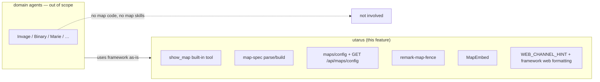
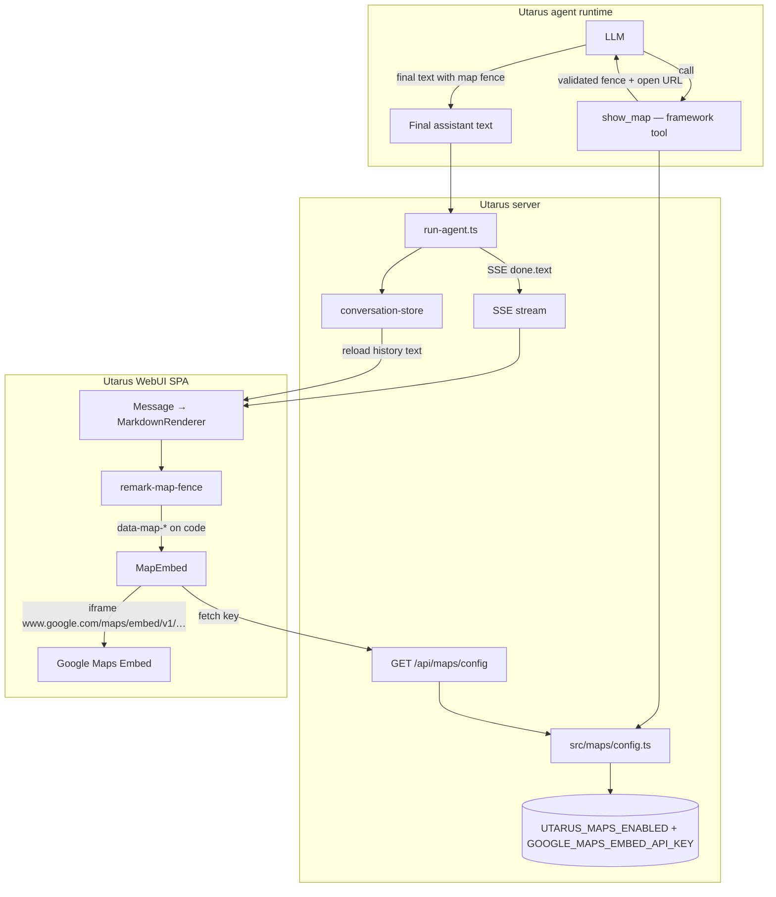
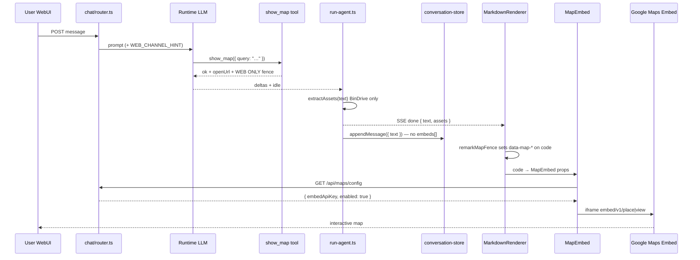

# Maps in WebUI Chat (Utarus Platform Capability)

| Field | Value |
|-------|--------|
| **Status** | Implemented (v1.4.0) |
| **Author** | — |
| **Date** | 2026-07-19 |
| **Audience** | Utarus framework maintainers |
| **Primary repo** | `utarus` only |
| **Related** | [webui-chat-design.md](./webui-chat-design.md) §6–§8, BinDrive asset pipeline, framework built-in tools |
| **Revision** | 2026-07-19 — reframed as **Utarus fundamental platform capability** (not domain agents, not Invage) |

---

## Overview

Utarus WebUI chat already treats rich media as a **platform concern**: GFM markdown, BinDrive file embeds, sandboxed HTML/PDF viewers. Maps belong in that same layer.

This design makes **inline maps a first-class chat media type** in Utarus:

1. A canonical fenced block in message `text` (` ```map ` … ` ``` `).
2. A **framework built-in** tool (`show_map`) that validates input and emits that fence (same class as BinDrive / reporting tools — registered by the framework for every deployment).
3. SPA remark + `MapEmbed` that renders Google Maps Embed when maps are enabled.
4. History recovery from stored **text only** (same model as BinDrive inline embeds).

**Domain agents (Invage, Binary, Marie, demos, forks) do not implement, configure, or document this feature.** There is no `DomainExtension` surface, no domain skill, no domain guidance. When maps are enabled on a Utarus process, every WebUI conversation gets the capability for free.

**WebUI-first v1.** Google Maps Embed only. No multi-provider abstraction. No structured `embeds[]` on `StoredChatMessage`. No geolocation.

---

## Background & Motivation

### Current state (Utarus)

| Layer | Path | Relevant behavior |
|-------|------|-------------------|
| Chat protocol | `src/webapp/chat/types.ts` | `ChatEvent.done` carries `{ text, stopReason, assets: AssetRef[] }` |
| Asset extraction | `src/webapp/chat/extract-assets.ts` | Regex-scans final text for BinDrive `/api/files/…?slug=` → `AssetRef[]` for attachment strip |
| Message storage | `src/webapp/chat/conversation-types.ts` | `StoredChatMessage` has `text` — **no structured embed field**; embeds reconstructed from markdown on render |
| Markdown pipeline | `web/src/components/MarkdownRenderer.tsx` | `remark-gfm` + math + `remark-bindrive-assets` → rehype sanitize → custom components |
| Embed security | `web/src/components/assets/SandboxedIframe.tsx` → `isSafeEmbedUrl` | Same-origin `/api/files/` or `/reports/` only; external URLs never become iframes |
| Web channel hint | `src/webapp/chat/router.ts` `WEB_CHANNEL_HINT` + `src/framework.ts` web formatting | Full GFM; BinDrive URLs as markdown links/images |
| Built-in tools | `src/tools/*`, registered in `src/framework.ts` | Domain-agnostic tools (firecrawl, bindrive, reporting, …) available to every agent instance |
| Packaging | package `exports` → `dist/index.js`; `web/` is separate Vite package with **no** import into parent `src/` | Dual client/server pure modules must be explicit (mirrors dual `AssetKind` types) |

### Pain points

1. **Place context is text-only** — addresses, venues, lat/lng, “where is X” answers cannot show a map.
2. **External links never embed** — correct for security; maps need an explicit allowlisted construction path.
3. **Raw Google Embed URLs are a bad surface** — would push API keys into message text and skip validation.
4. **This is not a domain problem** — any vertical that uses Utarus WebUI benefits; putting map render/tools in a domain repo would fork the SPA or reimplement chat.

### Constraints

- Verify data model first.
- **No fallback code / no fallback default values** — invalid map payloads fail fast with a clear error. Omitted optional fields mean “do not send that param,” not “fill in a product default.”
- No optimization/cache unless explicitly requested.
- **No domain-agent ownership** — no Invage (or other domain) code paths, docs, or PR steps for this capability.

---

## Goals & Non-Goals

### Goals

1. Utarus WebUI can show an **interactive** map (pan/zoom) inline in assistant message markdown.
2. Expression is **text-recoverable**: reload/history re-renders maps from `StoredChatMessage.text` alone.
3. Framework validates map payloads; **fail fast** on invalid input.
4. **API key never appears in chat text** or tool-result strings that are meant to be pasted into messages.
5. Cross-channel: WebUI embed; Telegram/Slack get a place link (no iframe).
6. Security: closed allowlist for map iframe targets; no open redirect; no XSS via map fields; operator CSP `frame-src` documented.
7. Capability is **on by default for the platform when env is configured** — every domain agent process inherits it via Utarus.
8. Incremental, reviewable PRs in the **utarus** repo only.

### Non-Goals (v1)

- Anything in domain agent repositories (Invage, Binary, Marie, …).
- `DomainExtension` hooks, domain skills, or domain system-prompt “when to map” guidance.
- User geolocation / browser Location API.
- Multi-provider maps (Mapbox, Apple, OSM) — Google Maps Embed only.
- Directions, multi-marker itineraries, heatmaps, Street View.
- Static Maps API images stored in BinDrive.
- Structured `embeds[]` / protocol change to `ChatEvent.done` for maps.
- Attachment strip cards for maps (inline only — not `AssetRef`).
- Offline maps / self-hosted tiles.
- Channel-aware tool wrappers (tools remain channel-agnostic).
- Expanding package `exports` so `web/` imports server `src/` (rejected; dual modules instead).

---

## Key Decisions

| # | Decision | Rationale |
|---|----------|-----------|
| **K1** | **Maps are a Utarus platform media type**, same class as GFM and BinDrive embeds. **Zero domain-agent surface.** | Chat protocol, SSE, markdown render, CSP, and built-in tools are framework-owned. Domains must not fork the SPA. |
| **K2** | **Canonical expression = fenced `map` block** in message `text`. Framework tool `show_map` is the supported producer; client renders any structurally valid fence (history / hand-edits). | Text-only reconstruction (like BinDrive URLs). No `StoredChatMessage` schema migration. |
| **K3** | **Google Maps Embed API only (v1)**; interactive pan/zoom; chrome includes “Open in Google Maps”. | Best inline UX. Static API + multi-provider are YAGNI for v1. |
| **K4** | **No `StoredChatMessage.embeds[]` in v1**; recovery from fence in `text`. | Existing pattern for all inline media; zero migration for `data/chats/<slug>/*.json`. |
| **K5** | **Browser Maps Embed key** via `GET /api/maps/config` (session-auth), **HTTP referrer-restricted**; key never in conversation text. | Embed API is designed for client iframe `src`. Fail fast if env key missing when maps are enabled. |
| **K6** | **No product policy for “when to map.”** Framework documents the tool schema and paste rules (web vs non-web). Domain repos do not add map policy. Soft prefer ≤1 fence per reply in the **framework** tool description only as a UX hint, not domain logic. | Platform capability, not vertical product rules. |
| **K7** | **Cross-channel degrade to link.** Tool result leads with markdown link; fence under **WEB ONLY** heading. | Tools are channel-agnostic. Reduces ugly Telegram `<pre><code>` fences. |
| **K8** | **Separate map iframe path** from `SandboxedIframe` / `isSafeEmbedUrl`. New `MapEmbed` + pure URL builder with host/path allowlist. | `isSafeEmbedUrl` rejects all cross-origin URLs by design. |
| **K9** | **Dual pure `map-spec` modules** + **parity test**: `src/maps/map-spec.ts` and `web/src/maps/map-spec.ts`. | `web/` cannot import parent `src/`. Parity test is merge-blocking. |
| **K10** | **Fence grammar is formal, not silent defaults.** Mode omission valid **only** when `query` present (means `place`). `lat`+`lng` only means `view`. Optional fields omitted → param not sent. Tool `toFence` always emits fully resolved fence including `mode`. | Aligns with no silent fallback defaults. |
| **K11** | **iframe `referrerPolicy="strict-origin-when-cross-origin"`**. Forbid `no-referrer` on the map iframe. | Google Embed recommendation; works with HTTP-referrer key restriction. |
| **K12** | **No `sandbox` attribute on the map iframe.** Rely on constructed allowlisted `src` + operator CSP. | Google’s sample has no sandbox; scripts+same-origin would nullify sandbox anyway. |

---

## Proposed Design

### Ownership boundary



### High-level architecture



### Sequence: message → store → render



### Canonical fence (source of truth in `text`)

Tool-emitted fences are **fully resolved** (always include `mode`):

````markdown
```map
mode: place
query: 1 Infinite Loop, Cupertino, CA
zoom: 14
label: Example
```
````

Coords-only:

````markdown
```map
mode: view
lat: 37.3318
lng: -122.0312
zoom: 14
```
````

#### Fence field rules

| Field | Presence | Rules |
|-------|----------|--------|
| `mode` | Optional in raw fence; **required in tool `toFence` output** | Exactly `place` or `view` if present. See decision table. |
| `query` | Conditional | Trim: non-empty, max 200, no control chars `/[\x00-\x08\x0B\x0C\x0E-\x1F]/`. **Reject** URI-scheme form `^[a-zA-Z][a-zA-Z0-9+.-]*:` **except** `place_id:`. Plus codes and free-text addresses allowed. Reject `http:`, `https:`, `javascript:`, `data:`. |
| `lat` | Conditional | Finite number in `[-90, 90]` |
| `lng` | Conditional | Finite number in `[-180, 180]` |
| `zoom` | Optional | If present: integer **`[0, 21]`**. If absent: do not append `zoom` to Google URL. |
| `label` | Optional | Max 80 chars; no control chars. Chrome title only. |

#### Input → resolved mode → Embed URL

| Inputs (after parse) | Resolved `mode` | Embed path + params | Reject if |
|----------------------|-----------------|---------------------|-----------|
| `mode` omitted, `query` present; lat/lng both absent or both present | `place` | `/maps/embed/v1/place?key=…&q={query}` + `&zoom=` only if zoom set. Lat/lng ignored for URL when query present. | Invalid query; only one of lat/lng |
| `mode` omitted, no query, both lat+lng | `view` | `/maps/embed/v1/view?key=…&center={lat},{lng}` + optional zoom | Incomplete coords |
| `mode: place` | `place` | Same as place row | Missing/empty query |
| `mode: view` | `view` | Same as view row | Missing lat/lng. Query if present is chrome-only, not sent as `q` |
| Other combinations | — | — | **error** |
| Unknown key, duplicate key, bad types | — | — | **error** |

**`openUrl`:**

- With `query`: `https://www.google.com/maps/search/?api=1&query={encodeURIComponent(query)}`
- Coords only: `https://www.google.com/maps/search/?api=1&query={lat}%2C{lng}`

#### Parse rules (both `map-spec` copies)

1. Language tag exactly `map` (case-sensitive).
2. Body: lines; ignore empty and `#` comments.
3. `key: value` — first `:` separates; key `[a-z]+`.
4. Unknown keys / duplicates → error.
5. Apply decision table; `mode` always set on success.
6. Prefer Result type: `{ ok: true, spec } | { ok: false, error: string }`.

**`toFence(spec)`** always writes `mode:` plus only set fields.

#### Fail-fast UX (two distinct states)

| State | When | Chrome |
|-------|------|--------|
| **Invalid map block** | Parse/validate fails | `Invalid map block: <reason>` — no iframe |
| **Maps not enabled / config error** | `enabled: false`, fetch fail, or misconfig | `Maps are not enabled on this server` or `Maps configuration error: <reason>` — no iframe |

Never blank iframe. Never conflate parse errors with feature-off.

---

### Framework tool: `show_map`

**Location:** `src/tools/show-map.ts`, exported from `src/tools/index.ts`, registered in `framework.ts` with other **built-in** tools (not via `DomainExtension.tools`).

**Parameters (TypeBox = shape only):**

```ts
// All fields optional at TypeBox layer; cross-field rules in validateMapSpec only.
{
  query?: string;
  lat?: number;
  lng?: number;
  zoom?: number;    // if present: integer 0–21
  label?: string;
  mode?: 'place' | 'view';
}
```

**Validation:**

1. TypeBox: types only.
2. `validateMapSpec` / `parseMapSpec`: all business rules before any fence is emitted.
3. Unit tests cover cross-field cases.

**Enablement:** `isMapsEnabled()` from `src/maps/config.ts`. If false → `fail('Maps are not enabled on this server')`.

**Execute:**

1. Not enabled → fail.
2. `validateMapSpec` → fail with message; no type coercion.
3. `toFence` + `toOpenUrl`.
4. Tool content **ordered**:

```text
[Map link — use on all channels]
[label or query]: <openUrl as markdown link>

---
WEB ONLY — paste this fence once in your final answer (do not invent fences):

```map
mode: place
query: …
```
```

5. Does **not** return the Embed API key.
6. Does **not** call Google network APIs in v1.

**Tool description (framework-level UX only):**

- Use when a concrete place or coordinates would help the user.
- Prefer at most one map fence per final answer.
- Never invent ` ```map ` fences — call `show_map`.
- Always include the map link line.
- On web, also paste the WEB ONLY fence once.
- On Telegram/Slack, do not paste the fence; use the link only.

---

### Map-spec packaging (K9)

| Copy | Path | Consumers |
|------|------|-----------|
| Server | `src/maps/map-spec.ts` | `show_map`, pure URL helpers in server tests |
| Client | `web/src/maps/map-spec.ts` | `remark/map-fence.ts`, URL builder |

**Exports (identical signatures both sides):**  
`parseMapFenceBody`, `validateMapSpec`, `toFence`, `toOpenUrl`, `buildGoogleEmbedUrl`, `isAllowedMapEmbedUrl`.

**Parity test:** `tests/maps/map-spec-parity.test.ts` — import both modules; same golden fixtures; merge-blocking.

**URL allowlist:**

- Construct only: `https://www.google.com/maps/embed/v1/place` or `…/view`
- `isAllowedMapEmbedUrl`: origin `https://www.google.com`, path `^/maps/embed/v1/(place|view)$`
- Never accept agent-/user-supplied full URLs as iframe `src`
- Do not list other Google hosts as iframe targets unless a future smoke proves nested frames need them

---

### Frontend: remark → code → MapEmbed

Aligned with BinDrive: remark sets `data.hProperties` on existing nodes; React branches on attrs.

#### 1. `web/src/remark/map-fence.ts`

Visit `code` where `lang === 'map'`; set:

| Attribute | Meaning |
|-----------|---------|
| `data-map` | `"1"` valid, `"error"` invalid |
| `data-map-error` | Error message when error |
| `data-map-mode` | `place` \| `view` |
| `data-map-query` | Place query |
| `data-map-lat` / `data-map-lng` | Decimal strings |
| `data-map-zoom` | Integer string |
| `data-map-label` | Chrome label |

No free-form JSON blob. Discrete attrs only.

#### 2. `MarkdownRenderer.tsx`

- Register `remarkMapFence` after `remarkGfm`.
- Override `code`: `data-map=error` → `MapError`; `data-map=1` → `MapEmbed`; else `CodeBlock`.
- Invalid fences do **not** fall through to copyable CodeBlock once tagged.

#### 3. rehype-sanitize

Allow the discrete `data-map-*` attrs on `code` (and `pre` if attrs bubble).

#### 4. `MapEmbed` — `web/src/components/assets/MapEmbed.tsx`

- Layout: full width of chrome, `min-h-[280px] h-[320px]`, max-width consistent with chat.
- Config: module-level single in-flight `GET /api/maps/config` (dedupe concurrent maps on one page — not a product cache with TTL).
- iframe: `src` from `buildGoogleEmbedUrl` only if `isAllowedMapEmbedUrl`; `referrerPolicy="strict-origin-when-cross-origin"`; `allowFullScreen`; **no sandbox**.
- Do not reuse `SandboxedIframe`.

#### Streaming / history

- Mid-stream incomplete fences may flash as code — acceptable v1.
- On `done` / reload: MapEmbed / MapError.
- No new `ChatMessage` client field.

---

### Server: `src/maps/config.ts`

```ts
// Conceptual — pure env reads; maps never silently enable
export function isMapsEnabled(): boolean
// true only when UTARUS_MAPS_ENABLED === "true" AND key non-empty after trim

export function getEmbedApiKeyOrThrow(): string

export type MapsHttpConfigResult =
  | { kind: 'disabled' }                      // → 200 { enabled: false }
  | { kind: 'ok'; embedApiKey: string }     // → 200 { enabled: true, embedApiKey }
  | { kind: 'misconfigured'; message: string }; // → 500
```

| `UTARUS_MAPS_ENABLED` | Key non-empty | Tool | `GET /api/maps/config` |
|----------------------|---------------|------|-------------------------|
| not exactly `true` | * | fail “not enabled” | 200 `{ enabled: false }` |
| `true` | no | fail (treat as not usable) | **500** misconfigured |
| `true` | yes | ok | 200 `{ enabled: true, embedApiKey }` |

Tool and HTTP route **must** share this module — no duplicated env checks.

#### Env

| Env var | Meaning |
|---------|---------|
| `GOOGLE_MAPS_EMBED_API_KEY` | Browser key; HTTP referrer restricted to WebUI origin(s) |
| `UTARUS_MAPS_ENABLED` | Exactly `true` to enable; otherwise disabled |

#### `GET /api/maps/config`

- Auth: any logged-in session (user or admin).
- Never log full key.

#### Framework prompts

**Web channel only** (`framework.ts` + `WEB_CHANNEL_HINT`):

- When `show_map` succeeds, paste WEB ONLY fence once; always include the map link.
- Do not invent ` ```map ` fences; call `show_map`.

**Telegram / Slack formatting sections:** do not instruct pasting map fences.

---

## Data Model Changes

**None for conversation JSON.** Maps live only inside `text` as fences.

```
env:
  UTARUS_MAPS_ENABLED=true
  GOOGLE_MAPS_EMBED_API_KEY=AIza...
```

### Ops checklist

1. Enable **Maps Embed API** only on the key.
2. Browser key; HTTP referrer allowlist = production WebUI origin(s) + localhost for dev.
3. Billing/quota alerts on the Google Cloud project.
4. Key rotation: change env only — no chat migration.
5. Rollback: set `UTARUS_MAPS_ENABLED` ≠ `true` → tool fail; SPA shows **Maps are not enabled** for valid historical fences.

---

## Alternatives Considered

| Option | Verdict |
|--------|---------|
| A. Structured `embeds[]` on messages + SSE | Defer — schema/client/hydrate cost |
| B. Special-case `maps.google.com` links only | Rejected as primary; open link still used for chrome / non-web |
| C. Static Maps → BinDrive image | Not v1 |
| D. Domain agent implements map tool/UI | **Rejected** — breaks platform ownership; forks SPA |
| E. Multi-provider abstraction | Rejected for v1 (YAGNI) |
| F. CodeBlock-only detection without remark | Rejected — prefer BinDrive-style `hProperties` + sanitize |

---

## Security & Privacy

| Threat | Severity | Mitigation |
|--------|----------|------------|
| XSS via query/label | High | Discrete data attrs + React text; URL-encode for Google |
| Evil iframe src | High | `buildGoogleEmbedUrl` only; `isAllowedMapEmbedUrl` before set `src` |
| API key in chat history | Medium | Key only from `/api/maps/config` |
| Key abuse / billing | Medium | Referrer restriction; Embed-only API restriction; enable flag; quota alerts |
| Key readable by logged-in users | Medium (accepted for Embed) | Session auth + referrer + API restriction; rotation |
| Sandbox misconception | — | **No sandbox (K12)**; do not claim sandbox mitigates Google origin |
| User location privacy | — | Out of scope; no geolocation |

### CSP (operators; Utarus does not ship CSP today)

```
frame-src 'self' https://www.google.com;
```

---

## Observability

| Signal | Where |
|--------|-------|
| Tool ok/fail | Tool chip + logs |
| Misconfigured enabled+no key | HTTP 500 + server log |
| Client disabled / config error | Distinct chrome copy |
| Metrics | Not v1 |

---

## Rollout Plan

1. Staging: enable env + key; referrer allowlist includes staging origin.
2. Smoke: pan/zoom, open-in-maps, history reload, invalid fence, disabled flag.
3. Telegram/Slack: link-only when tool text is followed.
4. Production + billing alerts.
5. **Domain agents:** no code changes. They pick up maps when they upgrade the Utarus dependency (normal pin bump — not part of this feature’s design work).
6. Rollback: disable env flag.

---

## Open Questions (locked recommendations)

| # | Question | Locked recommendation |
|---|----------|------------------------|
| Q1 | Chrome copy | “Open in Google Maps” |
| Q2 | Soft prefer one map per reply | Framework tool description only; no hard server cap |
| Q3 | Hand-written fences render? | Yes if parse ok; framework hint still says call the tool |
| Q4 | Billing ownership | Operator of the Utarus deployment / Google project |
| Q5 | Zoom when omitted | Omit param; Google chooses |

---

## Risks

| Risk | Severity | Mitigation |
|------|----------|------------|
| Runtime omits fence on web | Medium | Forceful tool text + web hint |
| Fence pasted on Telegram | Medium | Link-first tool text; non-web prompts must not demand fences |
| Dual module drift | Medium | Parity test required in PR1 |
| CSP / region blocks Embed | Medium | Open-in-Maps always available |
| Key misconfiguration | Medium | HTTP 500 when flag on / key missing |

---

## Testing Plan

| Layer | Tests |
|-------|-------|
| Golden fixtures | Both map-spec modules |
| Parity | `tests/maps/map-spec-parity.test.ts` |
| URL builder | Pure tests in Utarus suite |
| `src/maps/config.ts` | Flag/key matrix |
| `show_map` | Success order; invalid; disabled |
| `/api/maps/config` | 401; disabled 200; ok 200; misconfigured 500 |
| SPA | Manual smoke in PR4 (no web Vitest required for v1) |
| Regression | `isSafeEmbedUrl` unchanged |

---

## References

| Resource | Path |
|----------|------|
| Chat design | `docs/webui-chat-design.md` |
| Chat events / AssetRef | `src/webapp/chat/types.ts` |
| Stored messages | `src/webapp/chat/conversation-types.ts` |
| Asset extract | `src/webapp/chat/extract-assets.ts` |
| Run completion | `src/webapp/chat/run-agent.ts` |
| Web channel hint | `src/webapp/chat/router.ts` |
| Framework tools / formatting | `src/framework.ts` |
| Markdown pipeline | `web/src/components/MarkdownRenderer.tsx` |
| BinDrive remark pattern | `web/src/remark/bindrive-assets.ts` |
| Embed security | `web/src/components/assets/SandboxedIframe.tsx` |
| Tool pattern | `src/tools/reporting.ts` |
| Google Maps Embed | https://developers.google.com/maps/documentation/embed/embedding-map |

---

## PR Plan (utarus only)

Each PR is independently reviewable/mergeable on **utarus** `main`. **No domain-agent PRs.**

### PR1 — Dual map-spec + parity + pure URL builder

- **Title:** `maps: dual map-spec modules, grammar, and parity tests`
- **Files:** `src/maps/map-spec.ts`, `web/src/maps/map-spec.ts`, `tests/maps/*`
- **Dependencies:** none
- **Description:** Fence grammar, decision table, `buildGoogleEmbedUrl` / `isAllowedMapEmbedUrl`. Fail-fast Results. No env, no React, no Google network. Parity test merge-blocking.

### PR2 — Shared config + `show_map` + framework prompts

- **Title:** `maps: config helpers, show_map built-in tool, channel instructions`
- **Files:** `src/maps/config.ts`, `src/tools/show-map.ts`, `src/tools/index.ts`, `src/framework.ts`, tests
- **Dependencies:** PR1
- **Description:** Framework-registered tool; link-first tool text; web paste / non-web no-fence instructions. Enablement only via `src/maps/config.ts`.

### PR3 — `GET /api/maps/config`

- **Title:** `maps: session GET /api/maps/config`
- **Files:** maps route mount under `src/webapp/`, tests
- **Dependencies:** **PR2** (shared config — no duplicate enablement logic)
- **Description:** Session auth; 200 disabled / 200 ok / 500 misconfigured.

### PR4 — Remark + MapEmbed + sanitize

- **Title:** `maps: render map fences in WebUI`
- **Files:** `web/src/remark/map-fence.ts`, `MapEmbed.tsx`, `MapError.tsx`, `MarkdownRenderer.tsx`
- **Dependencies:** PR1; PR3 for live key
- **Description:** Exact `data-map-*` path; referrerPolicy; no sandbox; distinct invalid vs disabled chrome.

### PR5 — `WEB_CHANNEL_HINT` + operator docs

- **Title:** `maps: WEB_CHANNEL_HINT and operator docs`
- **Files:** `src/webapp/chat/router.ts`, `docs/` (env, CSP, ops, rollback), optional `.env.example`
- **Dependencies:** PR2 (partial hints); PR4 for CSP accuracy
- **Description:** Complete platform docs. No domain-agent documentation.

### Out of scope (explicitly not PRs)

- Invage / Binary / Marie pin bumps (normal dependency upgrades, not this feature).
- Domain skills, purpose text, or “when to show a map” product rules.
- `DomainExtension` API changes.

---

## Implementation checklist

1. PR1: grammar + dual modules + parity green.  
2. PR2: built-in tool + shared config.  
3. PR3: config endpoint; key never in SSE text.  
4. PR4: SPA render; invalid vs disabled; history reload; BinDrive regression.  
5. PR5: WEB_CHANNEL_HINT + CSP/ops docs.  
6. Staging smoke: pan/zoom, open link, billing alert configured.  
7. Domain agents inherit automatically on next Utarus upgrade — no map feature work in domain repos.
