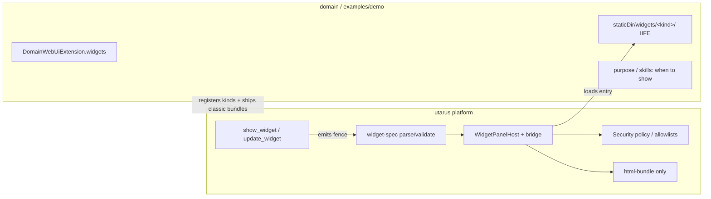
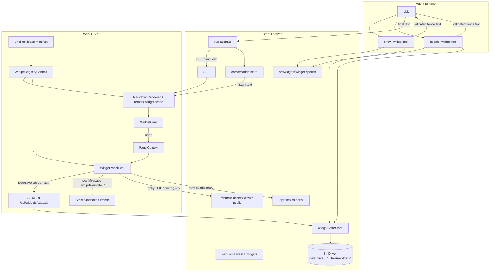
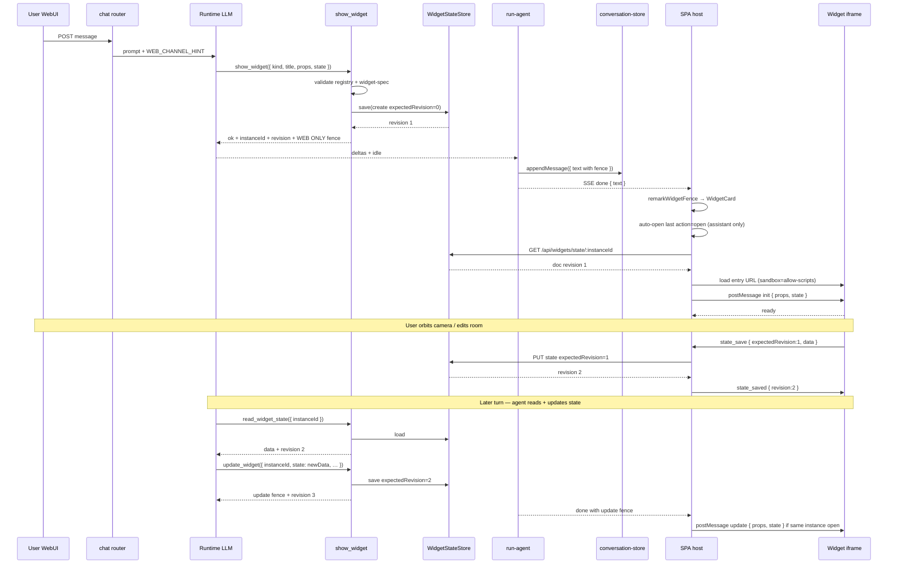

# Agent-Customized Widgets in the WebUI Side Panel

| Field | Value |
|-------|--------|
| **Status** | Implemented (Utarus **1.6.0**) |
| **Author** | — |
| **Date** | 2026-07-19 |
| **Audience** | Utarus framework maintainers + domain-agent authors |
| **Primary repo** | `utarus` (platform) + optional domain packages for widget bundles |
| **Related** | [webui-chat-design.md](./webui-chat-design.md), [webui-chat-maps-design.md](./webui-chat-maps-design.md), [webui-integration.md](./webui-integration.md), AssetPanel / BinDrive |
| **Revision** | 2026-07-20 — r3: **WidgetStateStore** (common load/persist seam, BinDrive-backed); props vs state split; host-mediated state over bridge; agent tools for state; fence carries state pointer not full durable blob |

---

## Overview

Domain agents need **rich interactive visualizations** in chat — 3D floor plans, property galleries, calculators, charts — that go beyond GFM markdown and static HTML reports. Today the right-hand **AssetPanel** only previews BinDrive/report **files** (html/pdf/image) in a sandboxed iframe. There is no structured protocol for typed props, **durable instance state**, lifecycle, agent-driven updates, or domain-shipped interactive bundles.

This design introduces **panel widgets** as a **Utarus platform capability**:

1. A small agent-facing tool surface (`show_widget` / `update_widget` / `read_widget_state`) that validates a **WidgetSpec**, seeds or mutates **durable state**, and emits a text-recoverable fenced `widget` block (card + identity in chat history).
2. A **Widget Panel Host** in the SPA that opens the side panel, resolves a registered **widget kind**, and loads a controlled runtime (sandboxed iframe for domain/agent HTML).
3. A **common `WidgetStateStore` interface** (deep module) for load/persist of widget instance state. **Default adapter: BinDrive** under a reserved path layout. Guests never touch storage directly; the **session-authenticated host** mediates.
4. A **registry + security policy**: platform kind `html-bundle` + domain-registered iframe-bundle kinds — never freeform remote script URLs, never silent defaults, fail-fast validation.
5. A **typed postMessage bridge** for init/update **and** state load/save acknowledgements, so user mutations and agent writes share one durable document.

**Ownership split:** the framework owns the protocol, host, sandbox, **state store**, and security policy. Domains ship widget **kinds** (static classic IIFE bundles under `/domain-assets/<agentKey>/…`) and call the platform tools. Domains must not fork the SPA for chat media or invent per-domain state APIs.

**WebUI-first.** Telegram/Slack degrade to a link + short summary. No multi-panel mosaic in v1.

---

## Background & Motivation

### Current state (Utarus)

| Layer | Path | Relevant behavior |
|-------|------|-------------------|
| Side panel | `web/src/panel.ts`, `web/src/components/AssetPanel.tsx` | `PanelAsset { url, filename, kind }` opened from AssetLink / AttachmentStrip; context default is silent no-op `() => {}` |
| Sandbox | `web/src/components/assets/SandboxedIframe.tsx` | `sandbox="allow-scripts allow-same-origin allow-popups allow-popups-to-escape-sandbox"`; `isSafeEmbedUrl` = same-origin `/api/files/` or `/reports/` only — **does not** allow `/domain-assets/` |
| Chat protocol | `src/webapp/chat/types.ts` | `ChatEvent.done` carries `{ text, stopReason, assets: AssetRef[] }` |
| Message storage | `src/webapp/chat/conversation-types.ts` | `StoredChatMessage.text` only — **no structured embed field**; maps recover from fences |
| Asset extraction | `src/webapp/chat/extract-assets.ts` | Regex BinDrive URLs → attachment strip |
| Maps prior art | `docs/webui-chat-maps-design.md` | Platform fence + `show_map`; dual pure modules; fail-fast; closed allowlists |
| Domain WebUI | `src/extension.ts` `DomainWebUiExtension` | nav, routes, `staticDir` → `/domain-assets/<agentKey>/` (public, no auth), apiRouters; **no widgets field yet** |
| SPA shell | `web/src/pages/Shell.tsx` | Sole consumer of `GET /api/webui/manifest`; types `{ agentKey, productName, defaultPath, nav, routes }`; on fetch failure falls back to chat-only manifest; **no context shares manifest with Chat** |
| HTML reports | `src/tools/post-html-report.ts`, `src/report/publish.ts` | Static dual-publish (public `/reports/` + BinDrive); open in panel as file preview |
| BinDrive | `src/webapp/routes.ts` `/api/files/*`, `src/tools/bindrive.ts` | Session-auth file CRUD under `data/drive/<ownerSlug>/`; agent tools use owner token; SPA uses cookies |
| Packaging | package `exports` → `dist/`; `web/` cannot import parent `src/` | Dual client/server pure modules + parity tests when schemas are shared |

### Pain points

1. **Static HTML reports are not widgets.** `post_html_report` / `write_report` produce files with no typed props, no instance identity, no mid-conversation update path, and no domain bundle reuse.
2. **Agent-authored free HTML is a security footgun.** Dumping LLM-generated `<script>` into the parent SPA would be XSS against the user session. Even sandboxed same-origin iframes with `allow-same-origin` can reach parent cookies/DOM if the document is same-origin.
3. **Domain agents must not fork the SPA.** Vertical features (property floor plans) need a framework-owned panel host and a domain-owned bundle.
4. **Maps pattern is necessary but not sufficient.** Maps are **inline** media with a closed Google Embed surface. Widgets are **panel-scale**, multi-kind, sometimes domain-supplied JS.
5. **No recovery story for interactive UI.** Reloading a conversation re-renders markdown; there is no first-class way to re-open a 3D view from history without re-running the agent.
6. **Widgets have mutable state — props-in-fence is the wrong durability model.** Camera pose, room edits, calculator inputs, selected unit, annotation layers change **after** the agent speaks. Embedding every mutation as a new `update` fence bloates chat history, races with the user, and never lets the widget itself own its document. Utarus must provide a **common load/persist interface**; storage can (and should) sit on BinDrive without each domain inventing file paths or auth.

### Constraints (project conventions)

- **Verify data model first.**
- **No fallback code / no silent default values.** Invalid widget payloads fail fast with a clear error string. Registration fields that affect runtime behavior are **required**, not optional-with-default.
- **No optimization / no cache** unless explicitly requested.
- Prefer **deep modules**: small interface agents see; host/registry/security stay behind it.
- Align with maps: dual pure modules when client and server share grammar; channel-agnostic tools; text-recoverable where practical.

---

## Goals & Non-Goals

### Goals

1. Agents can **open a custom widget in the WebUI side panel** via a framework tool, without domain SPA forks.
2. **Safe isolation** for untrusted or domain-authored HTML/JS (XSS/RCE threat model explicit).
3. **Flexible kinds**: platform `html-bundle` + domain-registered iframe bundles (new kinds without SPA rebuild).
4. **Clear data layers**: agent **props** (bootstrap / overlay) vs durable **state** (instance document) vs ephemeral session UI — with size limits and fail-fast validation; no silent field filling.
5. **Platform `WidgetStateStore`**: one deep interface to **load / save** widget state; default **BinDrive adapter**; host-mediated so strict-sandbox guests never need cookies or freeform `/api/files` paths.
6. **Text-recoverable** widget **cards + identity** in conversation history (` ```widget ` fence in `text`); durable payload lives in the state store, not re-serialized into every fence.
7. **Mid-conversation updates** from agent (tools → store and/or bridge) and from user (guest → bridge → store).
8. **Cross-channel degrade**: non-web channels get a link/summary, not a broken fence dump as the primary UX.
9. **Concrete end-to-end path** for a 3D floor plan demo (Three.js classic IIFE + state-backed geometry/camera) in `examples/demo`.
10. **Incremental PRs**, each reviewable and mergeable.

### Non-Goals (v1)

- Arbitrary agent-supplied remote iframe URLs or CDN script tags.
- Full bidirectional RPC so widgets call arbitrary backend APIs with the user session.
- Multi-widget tiling, floating windows, or widget marketplace.
- Structured `embeds[]` / `widgets[]` column on `StoredChatMessage` (deferred; fence in `text` first — mirrors maps K4).
- Offline / service-worker widget packaging.
- Replacing inline maps or markdown charts with panel widgets.
- Auto-opening the panel on every history load without user action (v1: restore **card** only).
- Channel-specific tools (tools remain channel-agnostic like `show_map`).
- Expanding package `exports` so `web/` imports server `src/` (dual modules instead).
- Product policy for “when to show a floor plan” inside the framework (domain purpose/skills own that).
- **ES module (`type="module"`) domain bundles** under strict sandbox (v1 requires classic IIFE; see K6 / K15).
- **Platform React widget runtimes** (e.g. `json-table`) — v1 ships **iframe-bundle only** for executable kinds; platform runtime switch exists only to fail-fast.
- History-durable binary meshes via signed BinDrive tokens (tokens expire ≤24h).
- Widget → composer “click room → inject chat” (Q7).
- **Server-side JSON Schema / AJV validation of `propsSchema`** (K24 — documentation-only field).
- Requiring utarus bridge handshake inside generic `html-bundle` agent HTML (K22 — load-as-ready).
- Guest widgets calling BinDrive or any session-auth REST **directly** (must go through host bridge + platform store).
- Multi-backend state marketplace (S3, Postgres, etc.) in v1 — only the **interface** is multi-adapter-ready; **one** adapter ships (BinDrive).
- CRDT / OT collaborative multi-user editing of the same widget instance.
- Automatic debounce/throttle policy inside the store (domains/widgets choose when to `state_save`; store is synchronous request/response).

---

## Key Decisions

| # | Decision | Rationale |
|---|----------|-----------|
| **K1** | **Widgets are a Utarus platform panel capability**, not a domain SPA feature. Framework owns host, protocol, security. Domains register **kinds** and ship static bundles. | Same ownership rule as maps/chat: protocol + SPA stay in utarus; domains must not fork WebUI. |
| **K2** | **Canonical expression = fenced `widget` block** in assistant `text`, produced by `show_widget` / `update_widget`. Client renders a **WidgetCard** in the thread; card opens the side panel. | Text-only history recovery (maps/BinDrive pattern). No `StoredChatMessage` schema migration in v1. |
| **K3** | **Side panel is the host surface**, not inline chat chrome. Extend panel model from `PanelAsset` → `PanelContent` union (`file` \| `widget`). Unified `PanelContext` **throws** if used outside provider (replace silent no-op). | Widgets need full half-screen. Fail-fast vs today’s no-op default. |
| **K4** | **Two-tier kind model (v1):** (A) platform kind `html-bundle` (agent-supplied same-origin entry allowlisted), (B) domain-registered **iframe-bundle** kinds under `/domain-assets/<agentKey>/…`. No platform React kinds in v1. | Safety + flexibility without SPA rebuilds. Cutting `json-table` reduces surface. |
| **K5** | **Agent never supplies raw iframe `src` or free CDN script URLs.** Only kind id + props (+ `entry` only for `html-bundle`). Host constructs load URL for registered kinds. | Mirrors maps K8: no open redirect / evil iframe. |
| **K6** | **Strict sandbox for all widget iframes (v1):** `sandbox="allow-scripts"` only — **no** `allow-same-origin`, **no** `allow-popups`, **no** `allow-popups-to-escape-sandbox`, **no** `allow-forms`, **no** `allow-top-navigation`. | Opaque origin isolates cookies/DOM. Popups enable phishing escape; reports keep their separate `report` sandbox — widgets do not inherit it. |
| **K15** | **Domain widget scripts = classic IIFE / non-module only (v1).** Entry HTML uses `<script src="main.js"></script>` (not `type="module"`). Domains **must** ship a build step that bundles Three.js (or any deps) into a single classic script (or non-module multi-script tags with relative `src`). **No CORS on `/domain-assets/` for modules in v1.** ES modules + opaque origin deferred. | Opaque-origin sandboxes break ES module loads without CORS; `express.static` does not send ACAO today. IIFE is the only path that works without ops/CORS complexity. |
| **K7** | **Typed postMessage bridge (v1 subset):** parent → widget `init` / `update`; widget → parent `ready` / `error` / `resize`. Accept guest messages **only if** `event.source === iframe.contentWindow` (primary). Origin is secondary assert (`"null"` for strict). No parent eval. No credential/navigation APIs on the bridge. | Source-window check is the real auth; `"null"` origin alone is forgeable by any opaque frame. |
| **K8** | **Auto-open state machine on assistant `done` only** (see § Panel + bridge state machine). `action: open` replaces any current panel content (file or widget). `action: update` posts to bridge only if that instance is open **and** `supportsUpdate === true`; otherwise card only (or WidgetError for kind morph / orphan). | Predictable UX; no mid-stream SSE type in v1. |
| **K22** | **Host ready policy is keyed on `supportsUpdate`:** `true` → require bridge `ready` within `WIDGET_BRIDGE_READY_TIMEOUT_MS` after `init`; `false` → iframe `load` event alone means ready — **no** `init`/`ready` handshake required, **no** timeout error for missing bridge. Platform `html-bundle` is fixed `supportsUpdate: false`. Domain interactive kinds use `true` and **must** implement the bridge. | Generic agent HTML (reports) never embeds the bridge; requiring ready would 10s-timeout every html-bundle open. |
| **K23** | **`update_widget` fails at tool time when kind has `supportsUpdate === false`.** Error: `Widget kind '<id>' does not support update_widget`. Client never postMessage-updates those kinds. | html-bundle and other static documents are open-only. |
| **K24** | **No server-side `propsSchema` validation in v1.** Field may appear on registrations as **documentation-only** (manifest passthrough for domain authors / future); tool and host enforce **structural** checks only (plain object + global/kind size). No AJV dependency. | Repo has TypeBox only; inventing a JSON Schema engine is out of scope. |
| **K25** | **Kind is immutable per `instanceId` within a conversation.** Client: if a prior assistant `open` exists for the instanceId and a later fence’s `kind` differs → WidgetError `kind mismatch for instanceId …`. Tool description: MUST keep the same kind on update. No server conversation index in v1. | Prevents load-B-with-id-of-A morph. |
| **K26** | **`theme.colorScheme` on init** = `window.matchMedia('(prefers-color-scheme: dark)').matches ? 'dark' : 'light'` at init send time. No other theme keys in v1. Widget may ignore. | Explicit source; not a hardcoded silent `'light'`. |
| **K27** | **Pure `parseWidgetFenceBody` / `validateWidgetSpec` enforce only global `WIDGET_PROPS_MAX_BYTES`.** Kind-level `propsMaxBytes` is enforced in tool execute (and host open after registry lookup) with kind id in the error string. Dual modules stay registry-free. | Maps-style pure parity; registry is not available in client pure parse of raw fence text alone without host context. |
| **K9** | **Dual pure `widget-spec` modules** + parity tests: `src/widgets/widget-spec.ts` and `web/src/widgets/widget-spec.ts`. | Packaging constraint: `web/` cannot import `src/`. |
| **K10** | **Domain registration via `DomainWebUiExtension.widgets`**, exposed on `GET /api/webui/manifest`. Client: **`WidgetRegistryContext`** populated in `Shell.tsx`, consumed by Chat / WidgetCard / WidgetPanelHost. Manifest must include `widgets` array after platform upgrade — missing field is a **hard client error** for widget features (see § Client registry). | Shell already owns manifest fetch; Chat has no access today. |
| **K11** | **Floor-plan demo is domain/example-owned** (`examples/demo` in utarus). Framework does not hardcode real-estate or ship Three.js in the SPA. | Platform stays domain-agnostic. |
| **K12** | **Props are a plain JSON object; max UTF-8 serialized size `WIDGET_PROPS_MAX_BYTES = 256 * 1024`.** Fence grammar: **single-line minified JSON only** for `props` (see § Fence grammar). Total fence body ≤ `WIDGET_FENCE_BODY_MAX_BYTES`. | Deterministic parse; protects store/SSE/postMessage. |
| **K13** | **No silent defaults** for kind, title, props, action, registration runtime fields. Omitted optional fields mean “absent.” Tool always emits fully resolved fence. **Registration requires explicit `sandboxProfile` and `supportsUpdate`.** | Project fail-fast rule; maps K10. |
| **K14** | **Cross-channel: link-first tool text**, fence under WEB ONLY (same as `show_map`). Non-web prompts: **NEVER paste ` ```widget `** (mirror maps in `framework.ts` Telegram/Slack sections). | Tools stay channel-agnostic. |
| **K16** | **Every `WidgetKindRegistration` must set `sandboxProfile` and `supportsUpdate` explicitly.** v1 only allows `sandboxProfile: 'strict'` for widget kinds. `propsMaxBytes` if present must be a positive integer ≤ `WIDGET_PROPS_MAX_BYTES`; if absent, validation uses the **global protocol constant** (not a kind-specific inferred default product policy). | Removes silent optional defaults from Issue 3. |
| **K17** | **`/domain-assets/<agentKey>/` is world-readable** (no session auth — true today). Trust model: domain deployer is trusted for that process; bundles are public static. Do not put secrets in widget static files. | Matches existing `server.ts` mount. |
| **K18** | **Auto-open replaces current panel content** (file preview or other widget). User can re-open files from attachment strip / AssetLink. | One panel; agent intent wins on `action: open`. |
| **K19** | **Update fences render as full WidgetCards** (same component as open), subtitle shows “Updated”. No collapsed-chip variant in v1. | Removes implementer ambiguity. |
| **K20** | **Only assistant-role messages auto-open.** User-authored ` ```widget ` fences may render as cards if parse succeeds, but **never auto-open**; click-open still validates kind against registry. Instance resolve is **per conversation** only. | Prevents user-forged fences from hijacking the panel automatically. |
| **K21** | **v1 floor-plan demo: durable document in WidgetStateStore** — geometry + camera + highlights live in **state.data**; fence does not re-embed full geometry on every user edit. No meshUrl/GLB in v1 demo. | User mutations must survive reopen; chat history is not a state log. |
| **K28** | **Three data layers (normative):** (1) **props** — agent-authored bootstrap/overlay for a fence event; (2) **state** — durable instance document in `WidgetStateStore`; (3) **session UI** — in-memory only (e.g. drag mid-gesture). Kinds with `supportsPersistence: true` use (2) as source of truth after first create. | Props-in-fence alone cannot model user-owned mutable artifacts. |
| **K29** | **`WidgetStateStore` is the deep platform seam** for load/save. Callers (HTTP API, agent tools, future adapters) share one interface. **v1 adapter = BinDrive** under reserved paths. No domain-specific persist APIs. | One place for auth, path safety, size caps, revision checks. |
| **K30** | **Host-mediated persistence only.** Strict-sandbox guest **cannot** read session cookies → cannot call `/api/files` with user auth. Guest sends `state_save` / receives state on `init` via postMessage; **parent SPA** (session cookies) calls `/api/widgets/state/…`. | Preserves K6 isolation; reuses WebUI auth. |
| **K31** | **Fence carries identity + small props, not the durable blob.** Fence fields include `persistence: bindrive` when state-backed. Full `state.data` is **not** required in the fence. Cards reopen by `instanceId` → host loads store. | Avoids history bloat; state survives beyond chat JSON. |
| **K32** | **Optimistic concurrency via `revision`.** Every document has monotonic `revision` starting at `1` on create. `save` requires `expectedRevision` (use `0` only for create-if-absent). Mismatch → fail-fast conflict error (no silent merge). | Multi-writer: user widget + agent tool. |
| **K33** | **Registration requires explicit `supportsPersistence: boolean`.** If `true`, kind must use bridge (`supportsUpdate` may still be true for agent prop overlays — see K34). If `false` (platform `html-bundle`), no store I/O. | No silent persistence. |
| **K34** | **Agent `update_widget` for persistent kinds writes `state.data` (full replace of data, bump revision), optionally also posts bridge `update` if instance open.** Non-persistent kinds keep props-only fence updates (legacy html-bundle path still open-only). | Single durable document; agent and user share store. |
| **K35** | **Canonical BinDrive object key (enforced by store, never freeform agent paths):** `data/drive/<ownerSlug>/_utarus/widgets/<instanceId>/state.json` where `ownerSlug` is the **authenticated WebUI user** (`viewerSlug`) for that session. Prefix `_utarus/` is reserved. | Path traversal impossible at interface; collides neither with user report names nor public `/reports/`. |
| **K36** | **Dedicated REST under session auth:** `GET/PUT /api/widgets/state/:instanceId` (not raw `/api/files` names from the guest). Implementation delegates to `WidgetStateStore`. Agent tools call the same store module in-process (no HTTP self-call required). | Deep module + clear auth boundary. |
| **K37** | **State ownership is user-based (v1).** `ownerSlug` = authenticated user. Sharable/multi-owner state is deferred; BinDrive layout can support other owners later without changing the store interface. | User request 2026-07-20. |
| **K38** | **Any artifact event emits a chat card.** Agent `show_widget` / `update_widget` fences already do. User-driven `state_save` also appends an **assistant** message with an `action: update` widget fence + short summary to the open conversation (when `conversationId` is provided). SPA inserts the returned message into the thread. | Artifacts stay visible in history; user edits are not silent. |

---

## Proposed Design

### Ownership boundary



### High-level architecture



### Sequence: show → seed state → open panel → user save → agent read



---

### Data model first

#### Three layers (K28) — verify this before any other interface

| Layer | Owner | Durable? | Where it lives | Example (floor plan) |
|-------|-------|----------|----------------|----------------------|
| **props** | Agent (tool / fence) | Event snapshot only | Fence + tool args; may seed state once | `{ unitLabel: "12B", units: "metric" }` |
| **state** | Agent **and** user (via store) | **Yes** | `WidgetStateStore` (BinDrive adapter) | rooms polygons, camera, highlightRoomId, annotations |
| **session UI** | Widget JS only | No | iframe memory | pointer drag, hover, temporary gizmo |

**Rules:**

1. After create, **state is source of truth** for persistent kinds. Reopen loads state; fence is not a full state log.
2. **props** on a later `update` fence / agent call may carry a **non-persisted overlay** (e.g. “flash this room”) **or** the agent may write **state** via tools — never both silently merged by the platform without an explicit rule (K34: agent durable writes go to `state.data`).
3. Session UI never crosses the bridge as `state_save` unless the widget chooses to promote it into `state.data`.
4. **Fail-fast:** missing required state for a persistent kind on open → panel error (not empty `{}` invented by the host).

#### Protocol constants (exported, dual modules where shared)

```ts
/** Max UTF-8 byte length of JSON.stringify(props) in a fence / tool overlay. */
export const WIDGET_PROPS_MAX_BYTES = 64 * 1024;

/** Max UTF-8 byte length of JSON.stringify(state.data) in the store. */
export const WIDGET_STATE_DATA_MAX_BYTES = 512 * 1024;

/** Max UTF-8 byte length of entire fence body (all lines). */
export const WIDGET_FENCE_BODY_MAX_BYTES = WIDGET_PROPS_MAX_BYTES + 4 * 1024;

export const WIDGET_TITLE_MAX = 120;
export const WIDGET_SUMMARY_MAX = 200;

/** Parent waits this long for guest `ready` after iframe load + init. */
export const WIDGET_BRIDGE_READY_TIMEOUT_MS = 10_000;

export const WIDGET_KIND_RE = /^[a-z][a-z0-9-]{1,63}$/;
export const WIDGET_INSTANCE_ID_RE =
  /^[0-9a-f]{8}-[0-9a-f]{4}-[1-5][0-9a-f]{3}-[89ab][0-9a-f]{3}-[0-9a-f]{12}$/i;

/** Platform-reserved kind ids — domain may not register these. */
export const PLATFORM_WIDGET_KIND_IDS = ['html-bundle'] as const;

/** Fence field when kind uses WidgetStateStore. v1 only this value. */
export type WidgetPersistence = 'none' | 'bindrive';
```

> **Note on size constants:** props in fences shrink vs the earlier 256 KiB draft because **durable bulk moves to state** (K31). State cap is larger (512 KiB) but still bounded.

#### WidgetSpec (canonical fence / card identity)

```ts
export type WidgetSpecResult =
  | { ok: true; spec: WidgetSpec }
  | { ok: false; error: string };

export interface WidgetSpec {
  /** Stable id for reopen/update/state document. Tool generates UUID if agent omits on show. */
  instanceId: string;
  /** Registered kind id. Pattern: WIDGET_KIND_RE */
  kind: string;
  /** Panel chrome title. 1–WIDGET_TITLE_MAX chars, no control chars. */
  title: string;
  /**
   * Agent bootstrap / overlay. Plain JSON object (not array/null).
   * UTF-8 size of JSON.stringify(props) ≤ WIDGET_PROPS_MAX_BYTES (and kind propsMaxBytes if set).
   * For persistent kinds, props are NOT the durable document — see WidgetStateDocument.
   */
  props: Record<string, unknown>;
  /**
   * Only for kind === 'html-bundle'. Same-origin path; must pass isAllowedWidgetEntryUrl.
   * Omitted for registered domain kinds (entry from registry).
   */
  entry?: string;
  /** Required in every valid fence. */
  action: 'open' | 'update';
  /** Optional one-line summary. Max WIDGET_SUMMARY_MAX. */
  summary?: string;
  /**
   * Required. 'bindrive' when kind.supportsPersistence === true;
   * 'none' when supportsPersistence === false (html-bundle).
   * Tool always emits fully resolved value — never omit.
   */
  persistence: WidgetPersistence;
}
```

#### Widget state document + store interface (K29–K36)

```ts
/** Logical handle — never a freeform filesystem path from agent/guest. */
export interface WidgetStateRef {
  /** v1: only 'bindrive' */
  backend: 'bindrive';
  /** Drive owner = authenticated WebUI user slug (viewerSlug). */
  ownerSlug: string;
  instanceId: string;
}

export interface WidgetStateDocument {
  instanceId: string;
  kind: string;
  /** Monotonic; starts at 1 after successful create. */
  revision: number;
  /** ISO-8601 timestamp of last successful save. */
  updatedAt: string;
  /** Durable kind-defined object. */
  data: Record<string, unknown>;
}

export type WidgetStateLoadResult =
  | { ok: true; doc: WidgetStateDocument }
  | { ok: false; error: string; code: 'not_found' | 'invalid' | 'unauthorized' | 'backend' };

export type WidgetStateSaveResult =
  | { ok: true; doc: WidgetStateDocument }
  | {
      ok: false;
      error: string;
      code: 'conflict' | 'not_found' | 'invalid' | 'unauthorized' | 'too_large' | 'backend';
      /** Present on conflict — caller's expectedRevision lost the race. */
      currentRevision?: number;
    };

/**
 * Deep module: all durable widget I/O goes through this seam.
 * No silent empty documents. No path parameters beyond WidgetStateRef.
 */
export interface WidgetStateStore {
  load(ref: WidgetStateRef): Promise<WidgetStateLoadResult>;

  /**
   * Full replace of `data` (not deep-merge).
   * - expectedRevision === 0: create-if-absent; fail if already exists (code conflict).
   * - expectedRevision >= 1: save only if current revision matches; else conflict.
   * On success: revision becomes expectedRevision+1 for update, or 1 for create.
   */
  save(
    ref: WidgetStateRef,
    input: {
      kind: string;
      data: Record<string, unknown>;
      expectedRevision: number;
    },
  ): Promise<WidgetStateSaveResult>;
}
```

**BinDrive adapter (v1 only shipping adapter):**

```ts
// src/widgets/state-store-bindrive.ts
export function createBinDriveWidgetStateStore(deps: {
  /** Absolute path to data/drive root (same as BinDrive). */
  driveRoot: string;
}): WidgetStateStore;

// On-disk layout (enforced; basename-safe instanceId only):
//   {driveRoot}/{ownerSlug}/_utarus/widgets/{instanceId}/state.json
// File body = JSON.stringify(WidgetStateDocument) UTF-8
// Size of data field enforced before write via WIDGET_STATE_DATA_MAX_BYTES
```

**Path safety (fail-fast):**

- `ownerSlug` / `instanceId` must match existing slug/UUID patterns; reject `..`, `/`, `\`, empty.
- Store **never** accepts a caller-supplied relative file name.
- Listing user BinDrive in the portal may show `_utarus/` — acceptable; document as system folder. Optional later: hide `_`-prefixed dirs in UI (non-goal v1 unless trivial).

**Who holds the store instance:**

| Caller | How |
|--------|-----|
| `GET/PUT /api/widgets/state/:instanceId` | Server constructs `ref` from `req.user.slug` + param; uses process store |
| `show_widget` / `update_widget` / `read_widget_state` | Tools close over `{ viewerSlug, store }` |
| SPA host | `fetch` with session cookie — does **not** import server store |

```ts
// HTTP (session auth, same requireAuth as chat)
// GET  /api/widgets/state/:instanceId  → 200 { doc } | 404 { error, code }
// PUT  /api/widgets/state/:instanceId
//   body: { kind, data, expectedRevision }
//   → 200 { doc } | 409 conflict | 400 invalid | 413 too_large
```

**Kind registration addition:**

```ts
// on WidgetKindRegistration — REQUIRED, no default
supportsPersistence: boolean;
// if true: host loads state on open; guest may state_save; tools seed/update state
// if false: no store I/O; props-only (html-bundle)
```

Platform `html-bundle`: `supportsPersistence: false`, `supportsUpdate: false`.

Domain interactive kinds (floor-plan): `supportsPersistence: true`, `supportsUpdate: true` (agent may write state + bridge notify).

#### Fence grammar (source of truth in `text`)

**Fence keys are camelCase for multi-word fields** (`instanceId`). Maps uses `[a-z]+` only; widgets intentionally use `^[a-zA-Z][a-zA-Z0-9]*$` so `instanceId` is legal. This is **not** silent drift — document both grammars as kind-specific.

Tool-emitted fences are **fully resolved**. **`props` MUST be the last field** and its value is a **single-line minified JSON object** on the same line as `props:`.

````markdown
```widget
action: open
instanceId: 3fa85f64-5717-4562-b3fc-2c963f66afa6
kind: floor-plan-3d
title: Unit 12B floor plan
summary: Interactive 3D layout — 2 bed, 84 m²
persistence: bindrive
props: {"unitLabel":"12B","units":"metric"}
```
````

Agent update after writing new state (fence is a **card event**, not a full state dump):

````markdown
```widget
action: update
instanceId: 3fa85f64-5717-4562-b3fc-2c963f66afa6
kind: floor-plan-3d
title: Unit 12B floor plan
persistence: bindrive
props: {"overlay":{"highlightRoomId":"kitchen"}}
```
````

> Durable rooms/camera live in `WidgetStateDocument.data` under BinDrive. The fence above only identifies the instance and optional overlay props. Tool success text still includes `instanceId:` and `revision:` after store writes.

#### Fence field rules

| Field | Presence | Rules |
|-------|----------|--------|
| `action` | **Required** | Exactly `open` or `update` |
| `instanceId` | **Required** | UUID matching `WIDGET_INSTANCE_ID_RE` |
| `kind` | **Required** | `WIDGET_KIND_RE` |
| `title` | **Required** | Trim non-empty, max 120, no control chars |
| `persistence` | **Required** | Exactly `none` or `bindrive` (tool-resolved from kind registration) |
| `summary` | Optional | Max 200; no control chars; must appear **before** `props` if present |
| `entry` | Optional | Only legal when `kind === 'html-bundle'`; path rules via allowlist; before `props` |
| `props` | **Required**, **must be last field** | Single line: `props: ` + minified JSON object. `JSON.parse` of remainder of that line only. Multi-line JSON → **error**. Trailing fields after props → **error**. |
| Unknown key / duplicate | — | **error** |

#### Deterministic parse algorithm

```
1. Language tag exactly `widget` (case-sensitive).
2. Body UTF-8 byte length ≤ WIDGET_FENCE_BODY_MAX_BYTES else error.
3. Split body into lines; ignore empty lines and lines whose first non-ws char is `#`.
4. For each remaining line in order:
   a. If we have already consumed `props` → error ("fields after props").
   b. Match /^([a-zA-Z][a-zA-Z0-9]*):\s*(.*)$/  (key regex intentional camelCase).
   c. Unknown key / duplicate key → error.
   d. If key === 'props':
        - value = remainder of THIS line only (no continuation).
        - JSON.parse(value); on throw → error with message.
        - must be plain object (!Array.isArray && typeof === 'object' && !== null).
        - UTF-8 byte length of value ≤ WIDGET_PROPS_MAX_BYTES **only** (K27 — pure parse never consults registry / kind propsMaxBytes).
        - mark props consumed.
   e. Else store scalar string/validated field.
5. After all lines: require action, instanceId, kind, title, persistence, props present.
6. Cross-field: entry only if kind === 'html-bundle'; persistence ∈ {none,bindrive}; etc.
7. Return Result — never coerce types (e.g. string "1" is not number).
```

**Kind-level size (tool + host, not pure parse):** after registry lookup, if `reg.propsMaxBytes` is set and `JSON.stringify(props)` UTF-8 length `> reg.propsMaxBytes`, fail with  
`Props exceed propsMaxBytes=<n> for kind '<id>'`  
(tool execute and host open). Pure modules remain registry-free for parity tests.

**Persistence consistency (tool + host):** if `reg.supportsPersistence === true` then fence `persistence` must be `bindrive`; if false, must be `none`. Mismatch → error (tool always emits correct value).

**Tools always minify** `JSON.stringify(props)` on one line via `toFence`. Hand-edited multi-line props fail parse with a clear error — no recovery attempt.

**Golden fixtures (parity, both modules):** empty object `{}`; nested objects/arrays; unicode; exact `WIDGET_PROPS_MAX_BYTES` boundary success; +1 byte fail; props array / null / string fail; duplicate fence keys; field after props; multi-line props; missing action; invalid UUID; unknown key.

#### Registry model

```ts
export type WidgetSandboxProfile = 'strict'; // v1 closed set — 'report' is NOT valid for widget kinds

export type WidgetRuntime = 'iframe-bundle'; // v1: no 'platform' React hosts ship

/**
 * Declared by platform builtins and DomainWebUiExtension.widgets.
 * ALL fields below are required unless marked optional — no silent defaults.
 */
export interface WidgetKindRegistration {
  /** Matches WidgetSpec.kind */
  id: string;
  /** Human label for panel chrome / errors */
  label: string;
  /** v1: only 'iframe-bundle' */
  runtime: WidgetRuntime;
  /**
   * Path relative to /domain-assets/<agentKey>/ for domain kinds.
   * Required when runtime === 'iframe-bundle' AND id is not platform html-bundle.
   * Forbidden characters: '..', leading '/', protocol, backslash.
   * Example: "widgets/floor-plan-3d/index.html"
   * Host builds: `${origin}/domain-assets/${agentKey}/${entryHtml}`
   *
   * For platform kind `html-bundle`, entryHtml is omitted; instance supplies `entry`.
   */
  entryHtml?: string;
  /**
   * OPTIONAL, **documentation-only in v1 (K24)**. Not validated by the tool or host
   * beyond "if present, must be a plain object" at boot (V14). Domain authors may
   * record an intended shape for humans / future validators. **Do not** implement
   * AJV or JSON Schema checking in v1 — repo has no such dependency.
   * Absence means "no documented schema", not "default schema".
   */
  propsSchema?: Record<string, unknown>;
  /**
   * Optional per-kind cap. If present: integer in [1, WIDGET_PROPS_MAX_BYTES],
   * enforced in **tool execute + host open** only (K27). Pure parse always uses global max.
   * If absent: only global WIDGET_PROPS_MAX_BYTES applies.
   */
  propsMaxBytes?: number;
  /**
   * REQUIRED. v1: must be the string 'strict'.
   * Also gates host ready policy (K22): true → bridge ready required; false → load-as-ready.
   */
  sandboxProfile: WidgetSandboxProfile;
  /**
   * REQUIRED.
   * - true: domain interactive widgets; host requires bridge ready; update_widget allowed.
   * - false: static documents (platform html-bundle); load event = ready; update_widget fails at tool.
   */
  supportsUpdate: boolean;
  /**
   * REQUIRED (K33).
   * - true: instance has WidgetStateDocument in WidgetStateStore; host loads on open; guest may state_save.
   * - false: no store I/O; props-only lifetime (html-bundle).
   * If true, supportsUpdate should normally be true (agent can write state); boot allows true+false only if
   * domain documents read-only interactive (v1: if supportsPersistence && !supportsUpdate → throw V19 —
   * agent cannot seed/update state without tools that require supportsUpdate path; keep matrix simple).
   */
  supportsPersistence: boolean;
}
```

**Platform built-in kinds (v1) — fixed registration object (normative):**

```ts
/** Always present in buildWidgetRegistry; domain cannot override or re-register. */
export const PLATFORM_HTML_BUNDLE_KIND: WidgetKindRegistration = {
  id: 'html-bundle',
  label: 'HTML bundle',
  runtime: 'iframe-bundle',
  // entryHtml absent — instance supplies entry
  sandboxProfile: 'strict',
  supportsUpdate: false, // K22/K23: load-as-ready; update_widget fails
  supportsPersistence: false, // K33: no WidgetStateStore
};
```

| kind | runtime | entryHtml | supportsUpdate | supportsPersistence | notes |
|------|---------|-----------|----------------|---------------------|--------|
| `html-bundle` | iframe-bundle | absent | **false** | **false** | Agent-published same-origin HTML. No bridge, no store. Open-only. |

**html-bundle packaging (agent HTML):** documents need **not** include the utarus bridge. Any HTML that already works as a sandboxed report preview is valid `entry` content (subject to entry allowlist). Tool description states: use for static interactive pages published via BinDrive/reports; do **not** call `update_widget` for this kind.

**Cut from v1:** `json-table` and any platform React host; **server-side propsSchema validation** (K24). Host code path:

```ts
function resolveRuntime(reg: WidgetKindRegistration): 'iframe' {
  if (reg.runtime === 'iframe-bundle') return 'iframe';
  throw new Error(`Unsupported widget runtime: ${reg.runtime}`); // fail-fast
}
```

#### Boot validation matrix — `assertWidgetRegistrations`

Called from **`createFramework`** after extension is received (same class as `assertBillingConfig` / `assertLlmConfig`). Also re-checked when building tools. **Fails process boot** with a thrown `Error` message listing the problem — never drops invalid kinds silently.

| # | Rule | On violation |
|---|------|--------------|
| V1 | `widgets` if present must be an array | throw |
| V2 | Each entry is a plain object | throw |
| V3 | `id` matches `WIDGET_KIND_RE` | throw |
| V4 | No duplicate `id` within domain list | throw |
| V5 | Domain `id` not in `PLATFORM_WIDGET_KIND_IDS` | throw (`html-bundle` reserved) |
| V6 | `label` non-empty string max 80 | throw |
| V7 | `runtime` === `'iframe-bundle'` exactly | throw (unknown runtime) |
| V8 | `sandboxProfile` === `'strict'` exactly (required field present) | throw if missing or other value |
| V9 | `supportsUpdate` is boolean (required) | throw if missing or non-boolean |
| V10 | For domain kinds: `entryHtml` required non-empty string | throw |
| V11 | `entryHtml` has no `..`, no leading `/`, no `\\`, no `://`, no `?` or `#` | throw |
| V12 | For platform `html-bundle`: `entryHtml` must be absent | throw if set |
| V13 | If `propsMaxBytes` present: integer `1..WIDGET_PROPS_MAX_BYTES` | throw |
| V14 | If `propsSchema` present: plain object (not array/null) only — **no schema compile / AJV** (K24) | throw if not plain object |
| V15 | If `extension.webUi.widgets` length > 0: `agentKey` non-empty and `staticDir` non-empty and directory exists | throw |
| V16 | For each domain kind: `path.join(staticDir, entryHtml)` exists and is a file | throw (boot-fatal when staticDir configured) |
| V17 | Platform builtins always registered in merged registry (framework, not domain) — must equal `PLATFORM_HTML_BUNDLE_KIND` fields | throw if framework omits or mutates |
| V18 | Platform `html-bundle` has `supportsUpdate === false`, `supportsPersistence === false`, and no `entryHtml` | throw if framework constant wrong |
| V19 | `supportsPersistence` is boolean (required) | throw if missing |
| V20 | If `supportsPersistence === true` then `supportsUpdate === true` (v1) | throw — persistent kinds need tools + bridge |
| V21 | If `supportsPersistence === false` then tools must not accept `state` seed args for that kind | enforced in tool execute, not only boot |

**Precedence:** platform ids reserved; domain collision → boot error. Merged registry = platform builtins ∪ domain widgets; immutable for process lifetime.

```ts
export interface WidgetRegistry {
  /** kind id → registration */
  byId: ReadonlyMap<string, WidgetKindRegistration>;
  agentKey: string | null;
}

export function buildWidgetRegistry(ext: DomainExtension): WidgetRegistry;
export function assertWidgetRegistrations(ext: DomainExtension): void;
```

---

### Client registry discovery (Issue 2)

**Today:** `Shell.tsx` fetches `/api/webui/manifest` into local state; Chat is a child with **no** manifest props/context.

**v1 design:**

```ts
// web/src/widgets/registry-context.ts
export interface WidgetRegistryClient {
  /** From manifest.agentKey — required to build /domain-assets/ URLs */
  agentKey: string | null;
  /** kind id → registration (platform + domain) */
  byId: ReadonlyMap<string, WidgetKindRegistration>;
  /**
   * true only when manifest was loaded successfully AND included a `widgets` array
   * (may be empty). false when using degraded chat-only fallback.
   */
  registryAvailable: boolean;
  /** If registryAvailable is false, human-readable reason for WidgetError chrome */
  unavailableReason: string | null;
}

export const WidgetRegistryContext = createContext<WidgetRegistryClient | null>(null);

export function useWidgetRegistry(): WidgetRegistryClient {
  const ctx = useContext(WidgetRegistryContext);
  if (!ctx) {
    throw new Error('useWidgetRegistry requires WidgetRegistryContext provider (Shell)');
  }
  return ctx;
}
```

**Shell responsibilities:**

1. Fetch manifest (existing).
2. **On success:** require `Array.isArray(data.widgets)`. If `widgets` key missing after platform upgrade expectation — treat as `registryAvailable: false` with reason `manifest missing widgets[]` (fail-fast for widget features; chat/nav still work if other fields ok). Prefer server always sending `widgets: []` once PR2 ships so missing field only happens on version skew.
3. **On fetch failure:** today’s chat-only fallback **must set** `registryAvailable: false`, `unavailableReason: 'webui manifest failed to load: …'`, `byId: empty`. **Do not** invent an empty successful registry.
4. Wrap outlet (including `ChatPage`) in `WidgetRegistryContext.Provider`.

**Consumers:** `WidgetCard`, `WidgetPanelHost`, auto-open logic in Chat. Unknown kind or `!registryAvailable` → WidgetError chrome with reason — never silent no-op open.

**Client manifest type extension:**

```ts
export interface WebUiManifest {
  agentKey: string | null;
  productName: string;
  defaultPath: string;
  nav: ManifestNavItem[];
  routes: ManifestRoute[];
  /** Required once widgets platform ships; server always includes array. */
  widgets: WidgetKindRegistration[];
}
```

---

### Panel host model (client)

```ts
// web/src/panel.ts

export interface PanelFileAsset {
  type: 'file';
  url: string;
  filename: string;
  kind: string; // html | pdf | image | …
}

export interface PanelWidgetInstance {
  type: 'widget';
  spec: WidgetSpec; // validated
}

export type PanelContent = PanelFileAsset | PanelWidgetInstance;

/** @deprecated alias during migration — same shape as PanelFileAsset fields without type */
export type PanelAsset = {
  url: string;
  filename: string;
  kind: string;
};

function panelNotReady(): never {
  throw new Error('PanelContext used outside provider — Chat/Shell must provide PanelContext');
}

export const PanelContext = createContext<(content: PanelContent | null) => void>(
  panelNotReady as (content: PanelContent | null) => void,
);

/** Migration helper for AssetLink / AttachmentStrip */
export function filePanelContent(a: PanelAsset): PanelFileAsset {
  return { type: 'file', url: a.url, filename: a.filename, kind: a.kind };
}
```

**Component strategy (PR4):** Keep filename `AssetPanel.tsx` but implement dual-mode body (`content.type === 'file' | 'widget'`). Call sites:

| Call site | Change |
|-----------|--------|
| `Chat.tsx` | `panelContent` state; provide `PanelContext` |
| `AttachmentStrip` / `AssetLink` | `open(filePanelContent({…}))` or open `{ type:'file', … }` |
| WidgetCard | `open({ type:'widget', spec })` |

Rename to `SidePanel.tsx` is optional cleanup after migration — not required in PR4 if dual-mode is complete.

#### Panel + bridge state machine (on assistant `done`)

Inputs: ordered list of valid widget fences parsed from **this assistant message only** for auto-open decisions; full conversation assistant texts for “latest props” when user clicks a card.

| Event | Condition | Panel behavior |
|-------|-----------|----------------|
| `action: open` fence(s) in assistant done text | `registryAvailable` and kind known | Auto-open **last** `open` fence in that message; **replaces** any current panel content (file or widget) — K18 |
| `action: open` | kind unknown / registry down / parse error | WidgetError card only; **do not** open blank panel |
| `action: update` | panel currently shows **same** `instanceId` **and** `reg.supportsUpdate === true` **and** kind matches prior open | `postMessage` `{ type:'update', props }` (no iframe reload). Card still rendered (K19) |
| `action: update` | same `instanceId` open **and** `reg.supportsUpdate === false` | Card only; **no** postMessage, **no** iframe reload. (Tool should have failed; if fence hand-edited, do not invent reload semantics.) |
| `action: update` | panel open but **different** instanceId | Card only; **do not** switch panel |
| `action: update` | panel closed or shows file | Card only; **do not** auto-open |
| `action: update` orphan | no prior `action: open` for this `instanceId` in **this conversation’s assistant messages** | Render **WidgetError**: `Update without prior open for instanceId …` — do **not** treat as open (fail-fast) |
| `action: update` kind morph | prior open exists for instanceId but fence `kind` ≠ open fence’s `kind` (K25) | Render **WidgetError**: `kind mismatch for instanceId … (open was '<a>', update is '<b>')` |
| User clicks WidgetCard (open or successful update card) | kind known; resolve ok | Open/replace panel with **latest resolved** props for that instanceId in this conversation |
| User clicks orphan / kind-morph error card | — | No panel open |
| History load / conversation switch | — | Cards render; **no** auto-open (Q1) |
| User-role message with widget fence | — | May show card; **never** auto-open (K20) |

**Host open policy (K22 + K30 + K31) — normative:**

```
onOpen(spec, reg):
  if reg.supportsPersistence:
    GET /api/widgets/state/:instanceId  (session cookie)
    if not_found:
      panel error: "Widget state not found for instanceId … (agent must show_widget with initial state first)"
      do NOT invent empty state
      do NOT load iframe
      return
    if other error: panel error with server message; return
    doc = response.doc
  else:
    doc = null

  set iframe.src = entryUrl
  on iframe 'load':
    if reg.supportsUpdate === false:
      mark panel ready immediately
      SKIP init (html-bundle)
    else:
      send init {
        instanceId, kind, props: spec.props, theme,
        state: doc ? { revision: doc.revision, data: doc.data } : null
      }
      // state is non-null iff supportsPersistence (already loaded)
      start timer WIDGET_BRIDGE_READY_TIMEOUT_MS
      on ready (source===contentWindow, matching instanceId): clear timer, mark ready
      on timeout / guest error: panel error banner
```

**Guest → host state_save (persistent kinds only):**

```
on message state_save { instanceId, expectedRevision, data }:
  assert source === contentWindow && instanceId match
  PUT /api/widgets/state/:instanceId { kind: openKind, data, expectedRevision }
  on 200: postMessage state_saved { instanceId, revision }
  on 409: postMessage state_error { instanceId, code:'conflict', currentRevision, message }
  on other: postMessage state_error { … }
  // Host does NOT deep-merge. Host does NOT retry. Widget decides next action.
```

**Latest-spec resolution (client pure function, per conversation only):**

```ts
function resolveWidgetInstance(
  messages: ReadonlyArray<{ role: string; text: string }>,
  instanceId: string,
): WidgetSpecResult
// Scan assistant messages only for fences with that instanceId.
// First action===open establishes kind0 + persistence0.
// Kind morph → error (K25). Persistence morph → error.
// Last valid fence wins for title/props/summary/entry (card chrome + overlay props).
// Durable state is NOT reconstructed from fences — host always loads store when
// persistence === 'bindrive'.
```

**History bloat:** fences stay small (identity + compact props). Durable bulk is in BinDrive state files. Risk shifts to **drive disk growth** under `_utarus/widgets/` — mitigate with size caps + optional later GC (non-goal v1).

---

### Bridge protocol (postMessage)

```ts
export type WidgetHostToGuest =
  | {
      channel: 'utarus-widget';
      type: 'init';
      instanceId: string;
      kind: string;
      props: Record<string, unknown>;
      theme: { colorScheme: 'light' | 'dark' };
      /**
       * Present when supportsPersistence: { revision, data } from store.
       * null only for non-persistent kinds (should not happen if host checks).
       */
      state: { revision: number; data: Record<string, unknown> } | null;
    }
  | {
      channel: 'utarus-widget';
      type: 'update';
      instanceId: string;
      /** Non-persisted overlay from agent fence/tool (optional fields). */
      props: Record<string, unknown>;
      /**
       * If agent wrote the store, host includes the new document snapshot so guest
       * does not need a second round-trip. Omit field entirely if store was not written.
       */
      state?: { revision: number; data: Record<string, unknown> };
    }
  | {
      channel: 'utarus-widget';
      type: 'state_saved';
      instanceId: string;
      revision: number;
    }
  | {
      channel: 'utarus-widget';
      type: 'state_error';
      instanceId: string;
      code: 'conflict' | 'invalid' | 'unauthorized' | 'too_large' | 'backend';
      message: string;
      currentRevision?: number;
    };

export type WidgetGuestToHost =
  | { channel: 'utarus-widget'; type: 'ready'; instanceId: string }
  | { channel: 'utarus-widget'; type: 'error'; instanceId: string; message: string }
  | { channel: 'utarus-widget'; type: 'resize'; instanceId: string; height: number }
  | {
      channel: 'utarus-widget';
      type: 'state_save';
      instanceId: string;
      /** Must match last known revision from init/update/state_saved. */
      expectedRevision: number;
      data: Record<string, unknown>;
    };
```

**Rules (normative):**

1. Ignore messages without `channel === 'utarus-widget'` and a known `type`.
2. **Primary auth:** accept guest → parent messages **only if** `event.source === iframeRef.contentWindow`. If source mismatches, ignore (no error spam).
3. **Secondary assert:** for strict sandbox, `event.origin` must be `"null"`. If source matches but origin is not `"null"`, log and ignore (misconfiguration).
4. `instanceId` must match the open panel instance.
5. No `eval`, no arbitrary method dispatch, no parent DOM API, **no** messages that request credentials, cookies, raw file paths, or parent navigation.
6. **Guest never receives auth tokens.** State I/O is host-mediated only (K30).
7. **Ready / init depends on `supportsUpdate` (K22):**
   - `supportsUpdate === true`: after store load (if persistent) + iframe `load`, parent sends `init` with props + theme + state (K26). If no `ready` within `WIDGET_BRIDGE_READY_TIMEOUT_MS`, panel body shows:  
     `Widget failed to become ready within WIDGET_BRIDGE_READY_TIMEOUT_MS=10000ms`  
     (fail-fast; include constant name and value).
   - `supportsUpdate === false` (including platform `html-bundle`): after iframe `load`, mark ready **immediately**. **Do not** require `ready`. **Do not** send `init` / `update` / state messages. Static agent HTML need not embed any bridge script.
8. **`state_save` allowed only if** open kind has `supportsPersistence === true`. Otherwise ignore and optionally surface host error once.
9. If `postMessage` throws (structured-clone failure), catch and show panel error; not retried silently.
10. Guest `error` → panel error banner with `message` text (only when bridge is in use).
11. `resize` is optional; if absent, iframe uses `height: 100%` of panel body.
12. **`theme.colorScheme` (K26):** computed at init-send time only:  
    `window.matchMedia('(prefers-color-scheme: dark)').matches ? 'dark' : 'light'`.  
    No other theme fields. Not sent when `supportsUpdate === false` (no init).
13. **No automatic debounced save** in the host. Widget decides when to emit `state_save` (e.g. after orbit end, after edit commit).

---

### Security policy module

```ts
export type SandboxProfile = 'strict' | 'report';

/**
 * Exact sandbox attribute strings — call sites do not compose tokens.
 * 'report' is ONLY for legacy AssetPanel file previews (html/pdf), not widgets.
 */
export const SANDBOX_BY_PROFILE: Record<SandboxProfile, string> = {
  strict: 'allow-scripts',
  report:
    'allow-scripts allow-same-origin allow-popups allow-popups-to-escape-sandbox',
};

/**
 * Single shared allowlist for host-built domain entries AND agent-supplied
 * html-bundle entry paths. Used for every widget iframe src.
 *
 * Allows (same origin only):
 * - /domain-assets/<agentKey>/…  where agentKey === ctx.agentKey (no cross-agent)
 * - /api/files/<file>… with slug query === viewerSlug; optional signed t= token
 * - /reports/… public reports
 *
 * Rejects: other origins; javascript:; data:; blob: (agent-supplied);
 * path segments `..`; backslash; agentKey mismatch; missing slug on files;
 * query keys other than `slug`, `t` on /api/files (allowlisted token params only).
 */
export function isAllowedWidgetEntryUrl(
  src: string,
  ctx: { viewerSlug: string; agentKey: string | null },
): boolean;
```

**Notes:**

- **Do not** reuse `isSafeEmbedUrl` for widgets — it rejects `/domain-assets/`.
- Registered kind entries: host builds URL then **must** pass `isAllowedWidgetEntryUrl` (DRY).
- **World-readable static (K17):** anyone who can hit the origin can download domain widget JS. Secrets must not live there.
- MIME: rely on `express.static` defaults; domain `index.html` should be `text/html`, scripts `application/javascript`. No additional MIME rewriting in v1; document that `.html` / `.js` extensions are required for entry and scripts.
- **CDN:** forbidden for agent-specified URLs. Domain IIFE may not fetch remote scripts at runtime in the security model we document (strict CSP recommendation on widget documents: `default-src 'self'; script-src 'self'; connect-src 'none'` for pure offline geometry demos).

#### Classic IIFE packaging (K15) — domain guide

```
staticDir/
  widgets/
    floor-plan-3d/
      index.html      # <script src="./main.js"></script> — NOT type=module
      main.js         # IIFE build: Three.js + viewer + bridge client inlined/bundled
```

```html
<!DOCTYPE html>
<html>
  <head><meta charset="utf-8" /><title>Floor plan</title></head>
  <body>
    <div id="app"></div>
    <script src="./main.js"></script>
  </body>
</html>
```

Domain build (esbuild/rollup/webpack) emits **IIFE** `main.js` that:

1. Listens for `message` events (`channel === 'utarus-widget'`).
2. On `init`: hydrate scene from **`state.data`** (rooms, camera); apply **`props`** overlays (e.g. unitLabel chrome).
3. On `update`: if `state` present, replace durable document; if only `props`, apply overlay (highlight flash) without clobbering rooms unless props intentionally carry them (demo convention: geometry only in state).
4. On user orbit end / room select: `state_save` with full `data` + `expectedRevision`.
5. On `state_saved` / `state_error`: update local revision or show in-widget error (conflict → reload from next agent turn or re-open).
6. Posts `{ channel, type:'ready', instanceId }` after first paint from init.

**Demo registration:**

```ts
{
  id: 'floor-plan-3d',
  label: '3D floor plan',
  runtime: 'iframe-bundle',
  entryHtml: 'widgets/floor-plan-3d/index.html',
  sandboxProfile: 'strict',
  supportsUpdate: true,
  supportsPersistence: true,
}
```

**Demo agent call (conceptual):**

```ts
show_widget({
  kind: 'floor-plan-3d',
  title: 'Unit 12B floor plan',
  props: { unitLabel: '12B', units: 'metric' },
  state: {
    rooms: [{ id: 'living', polygon: [[0,0],[4,0],[4,3],[0,3]] }],
    levels: 1,
    camera: { theta: 0.8, phi: 0.6, radius: 12 },
    highlightRoomId: null,
  },
})
```

**Acceptance (PR7):** open → orbit → state persists → close panel → reopen from card → camera/rooms restored from store **without** re-running agent; `read_widget_state` returns user-mutated camera; history fences stay small (no full geometry dump on every user save).

**Workers / WebGL:** classic Three.js WebGL renderer in main thread only. Worker-based builds unsupported in v1 under opaque origin.

**Deferred (not v1):** CORS for ES modules; dedicated widget origin; meshUrl/GLB in state (would use public dual-publish, not signed tokens, if added later).

---

### Capability model

| Mechanism | Role in v1 |
|-----------|------------|
| **Tool `show_widget`** | Create identity, seed **state** (if persistent), emit open fence |
| **Tool `update_widget`** | Write **state** (persistent) and/or overlay **props**; emit update fence; notify open guest |
| **Tool `read_widget_state`** | Agent reads current durable `state.data` + revision (for reasoning / follow-ups) |
| **`WidgetStateStore` + HTTP** | Common load/persist; BinDrive adapter |
| **Fence in `text`** | Card + identity + small props; **not** full state log |
| **SSE `done.text`** | Transport for fences |
| **Bridge `state_save`** | User/widget mutations → host → store |
| **Structured ChatEvent field** | Not v1 |
| **Domain tools** | May prepare geometry; model still calls platform widget tools |

Deep module seam (agent-facing):

```
show_widget({ kind, title, props, state?, instanceId?, summary?, entry? })
update_widget({ instanceId, kind, title, props?, state?, summary? })
read_widget_state({ instanceId })
  → success / failure text; durable I/O only via WidgetStateStore
```

Deep module seam (runtime):

```
WidgetStateStore.load / save
  ← HTTP /api/widgets/state/:id
  ← agent tools
  ← (never) guest directly
```

---

### Framework tools

**Location:** `src/tools/show-widget.ts`, exported from `src/tools/index.ts`.

**Factory wiring (viewerSlug + registry):**

Pattern matches `createReportingTools(userSlug, isAdmin)` in `framework.ts`: tools that need the authenticated user **close over slug at `allTools(userSlug, …)` time**. Do **not** rely on `getRunContext()` alone for allowlisting (optional extra check is fine; closed-over slug is authoritative).

```ts
// Built once in createFramework after assertWidgetRegistrations(extension)
const widgetRegistry = buildWidgetRegistry(extension); // includes PLATFORM_HTML_BUNDLE_KIND

// Process-lifetime store (BinDrive adapter); same instance used by HTTP router.
const widgetStateStore = createBinDriveWidgetStateStore({ driveRoot });

function allTools(userSlug: string, isAdmin: boolean) {
  return [
    // … existing framework tools …
    ...createReportingTools(userSlug, isAdmin),
    ...createShowWidgetTools(widgetRegistry, {
      viewerSlug: userSlug,
      store: widgetStateStore,
    }),
    // … domain tools …
  ];
}

/**
 * Returns [show_widget, update_widget, read_widget_state].
 * - registry: process-immutable kind map
 * - viewerSlug: authenticated user (owner of state documents)
 * - store: WidgetStateStore (BinDrive adapter in production)
 */
export function createShowWidgetTools(
  registry: WidgetRegistry,
  ctx: { viewerSlug: string; store: WidgetStateStore },
): AgentTool[];
```

Unit tests pass explicit **registry**, **viewerSlug**, and **in-memory store** fixtures (no process singleton). Cross-slug `/api/files` entry must fail.

**Empty viewerSlug:** if `viewerSlug` is `''`:
- any persistent kind → `fail('Cannot persist widget state: no authenticated user slug')`
- `html-bundle` files URL → `fail('Cannot validate widget entry: no authenticated user slug')`

**Parameters:**

```ts
// show_widget
{
  kind: string;           // required
  title: string;          // required
  props: object;          // required plain object (bootstrap / chrome hints; may be {})
  state?: object;         // required when reg.supportsPersistence; initial state.data (create revision 1)
  instanceId?: string;    // optional UUID; tool generates if omitted
  summary?: string;
  entry?: string;         // only html-bundle
}

// update_widget
{
  instanceId: string;     // required
  kind: string;           // required; registered + supportsUpdate
  title: string;          // required (card chrome)
  props?: object;         // optional overlay in fence; default {}
  state?: object;         // if present: full replace of state.data with expectedRevision from current load
  summary?: string;
}
// At least one of props or state should be meaningful; if supportsPersistence and state omitted,
// tool only updates card chrome + props overlay (does not touch store). Fail if both props omitted
// and state omitted? → fail('update_widget requires props and/or state')

// read_widget_state
{
  instanceId: string;     // required
}
```

**Execute (`show_widget`):**

1. `registry.byId.get(kind)` missing → `fail('Unknown widget kind: …')`.
2. If `kind === 'html-bundle'`: require `entry`; validate allowlist; reject `state` if provided.
3. If domain kind: reject `entry` if provided.
4. **No propsSchema validation (K24).**
5. Validate props size (global + kind). Generate `instanceId` if absent.
6. If `reg.supportsPersistence`:
   - require `state` plain object; size ≤ `WIDGET_STATE_DATA_MAX_BYTES`
   - `store.save({ backend:'bindrive', ownerSlug: viewerSlug, instanceId }, { kind, data: state, expectedRevision: 0 })`
   - on conflict/error → `fail(...)` (do not emit fence)
7. `toFence({ action: 'open', persistence: reg.supportsPersistence ? 'bindrive' : 'none', … })`
8. Tool content **must** include:

```text
[Widget — all channels]
instanceId: <uuid>
revision: <n or n/a>
title: <title>
kind: <kind>
<summary or label>

---
WEB ONLY — paste this fence once in your final answer (do not invent fences):

```widget
…
```
```

**Tool description notes (normative copy for implementers):**

- `html-bundle`: for static HTML already published to BinDrive/`/reports/`; page need **not** implement the widget bridge; **do not** call `update_widget` for this kind.
- Domain kinds with `supportsUpdate: true`: after open, use `update_widget` with the **same** `instanceId` and **same** `kind`; never invent fences.

**Execute (`update_widget`):**

1. `registry.byId.get(kind)` missing → fail unknown kind.
2. If `reg.supportsUpdate === false` → **`fail(\`Widget kind '${kind}' does not support update_widget\`)`** (K23).
3. Reject `entry` if provided.
4. Require at least one of `props` or `state` present; default missing `props` to `{}` only when `state` is present (explicit: if agent passes neither → fail).
5. Structural props + size checks when props present.
6. If `state` present:
   - require `reg.supportsPersistence` else fail
   - size ≤ `WIDGET_STATE_DATA_MAX_BYTES`
   - `load` current doc; if not_found → fail (`update_widget` does not create)
   - if `doc.kind !== kind` → fail kind mismatch
   - `save` with `expectedRevision: doc.revision` (full replace of data)
   - on conflict → fail with current revision in message (agent should re-read)
7. `toFence({ action: 'update', persistence: …, props })` — props may be `{}`.
8. Success text includes `instanceId:` and `revision:` (n/a if store not written).
9. Server does **not** scan conversation history for prior open (v1) — client enforces orphan + K25.

**Execute (`read_widget_state`):**

1. Require non-empty `viewerSlug` and valid `instanceId`.
2. `store.load({ backend:'bindrive', ownerSlug: viewerSlug, instanceId })`.
3. not_found / errors → fail with code.
4. Success text: `instanceId`, `kind`, `revision`, `updatedAt`, and minified JSON of `data` (or truncated with clear error if over a **tool response** display cap — fail-fast if over `WIDGET_STATE_DATA_MAX_BYTES` already stored is impossible if save enforced; return full data).

**Enablement:** widgets on whenever WebUI process runs tools. Optional future `UTARUS_WIDGETS_ENABLED` kill switch: maps-style matrix; not required for v1 ship.

---

### Frontend

#### 1. `web/src/remark/widget-fence.ts`

Visit `code` where `lang === 'widget'`; set:

| Attribute | Meaning |
|-----------|---------|
| `data-widget` | `"1"` valid, `"error"` invalid |
| `data-widget-error` | Error message |
| `data-widget-instance-id` | UUID |
| `data-widget-kind` | kind id |
| `data-widget-title` | title |
| `data-widget-action` | open \| update |

**Props:** WidgetCard re-parses fence body from `code` children via `parseWidgetFenceBody` (parity with server). Do not put full JSON in attributes.

#### 2. `MarkdownRenderer.tsx`

Register `remarkWidgetFence`; branch `code` → WidgetError / WidgetCard / map / CodeBlock.

#### 3. WidgetCard + auto-open

- Full card UI for both open and update (K19); update shows subtitle “Updated”.
- Click → resolve latest **spec** (card chrome + overlay props) in conversation → open panel (host **loads state** separately).
- Auto-open only per state machine (assistant done, last open).

#### 4. WidgetPanelHost

```
Header: title | kind badge | revision (optional) | Close
Body:
  - registry miss / unavailable → error string
  - supportsPersistence → GET state first; not_found/error → error string (no iframe)
  - iframe-bundle → iframe[src][sandbox=allow-scripts]
      - supportsUpdate true  → bridge init(props,state) + ready timeout + state_save handler
      - supportsUpdate false → load event = ready (html-bundle); no bridge
  - ready timeout / guest error / state_error → error banner
  - kind propsMaxBytes exceeded at open → error string with kind id
```

#### 5. Streaming

Incomplete fences may flash as code mid-stream — acceptable v1.

---

### Three.js floor-plan sample (end-to-end) — K21

**Target package:** `examples/demo` in the utarus repo (has `DomainExtension` already). Not a separate vague “domain repo” for the platform demo PR.

| Step | Who | What |
|------|-----|------|
| 1 | examples/demo | `webUi.staticDir` + `agentKey` + `widgets: [{ id: 'floor-plan-3d', label: '3D floor plan', runtime: 'iframe-bundle', entryHtml: 'widgets/floor-plan-3d/index.html', sandboxProfile: 'strict', supportsUpdate: true }]` — **no propsSchema required** (K24); optional doc-only object allowed |
| 2 | examples/demo | Build `main.js` as **IIFE** bundling Three.js + viewer + bridge client (no CDN, no `type=module`) |
| 3 | Props contract (minimal, enforced by **viewer** fail-fast, not server schema) | See below — **inline polygons only** |
| 4 | Agent | Calls `show_widget` with kind `floor-plan-3d` and props |
| 5 | Platform | Structural validate, fence, panel, init + ready |
| 6 | Update | `update_widget` with `highlightRoomId` (same kind + instanceId) |

**Minimal props contract (demo viewer documents; server does not AJV-check):**

```ts
// Viewer IIFE should fail-fast with parent postMessage error if shape wrong.
// Documented for agent authors / purpose text — not server-enforced in v1.
{
  levels: number; // integer >= 1
  units: 'metric' | 'imperial';
  rooms: Array<{
    id: string;
    label?: string;
    polygon: Array<[number, number]>; // >= 3 points
  }>;
  highlightRoomId?: string; // must match a room id when present
  camera?: { yaw?: number; pitch?: number; distance?: number };
}
```

**Forbidden in v1 demo props:** `meshUrl`, `glb`, remote texture URLs, signed BinDrive links.

**PR7 acceptance criteria:**

1. User asks for a floor plan → assistant fence + panel opens.  
2. Orbit / pan works (pointer events in iframe).  
3. Follow-up highlight → `update_widget` → highlight without full navigation if panel still open.  
4. Reload conversation → WidgetCard visible → click reopen → same geometry **with no authenticated network dependency**.  
5. Script is classic IIFE under strict sandbox (automated or manual check: no `type=module` in entry HTML).

**Signed URLs (non-demo guidance):** if a future kind needs binaries, dual-publish to public `/reports/` or `/domain-assets/` for history durability. Signed `?t=` is **session-ephemeral only** (≤24h) — not for fences expected to reopen from history days later. `html-bundle` **entry** may be `/reports/…` or signed file view URL if allowlisted; still not for durable mesh-inside-props patterns without public dual-publish.

---

### Persistence / history

| Event | Behavior |
|-------|----------|
| Assistant message with fence | Stored in `StoredChatMessage.text` |
| Reload conversation | WidgetCards reappear; panel not auto-restored |
| User clicks card | Panel opens with latest resolved props (this conversation) |
| Orphan update | WidgetError card |
| Delete conversation | Widgets gone with text |
| Cross-conversation instanceId | Independent resolve scopes |

---

### Cross-channel

| Channel | Behavior |
|---------|----------|
| WebUI | Fence → card + panel |
| Telegram / Slack | Title + summary + optional public link; **NEVER paste widget fences** (framework prompt sections, maps-parallel) |
| CLI | Text only |

**PR6 prompt surfaces (explicit, three places like maps):**

1. `WEB_CHANNEL_HINT` in `src/webapp/chat/router.ts`  
2. Web formatting section in `src/framework.ts`  
3. Telegram + Slack “NEVER paste \`\`\`widget” parallel to existing map lines in `src/framework.ts`

---

## API / Interface Changes

### New tools

- `show_widget`, `update_widget`, `read_widget_state` (framework built-ins)

### New HTTP

- `GET /api/widgets/state/:instanceId` (session auth)
- `PUT /api/widgets/state/:instanceId` body `{ kind, data, expectedRevision }`

### New modules

- `WidgetStateStore` + BinDrive adapter under `src/widgets/`
- `createShowWidgetTools(registry, { viewerSlug, store })` → `show_widget`, `update_widget`, `read_widget_state`

### DomainExtension

```ts
export interface DomainWebUiExtension {
  // existing fields…
  widgets?: WidgetKindRegistration[]; // each registration fully explicit (K16)
}
```

### WebUI manifest

```ts
widgets: WidgetKindRegistration[]; // always present from server after PR2
```

### Client

- `WidgetRegistryContext` from Shell  
- `PanelContent` union; throw-default `PanelContext`  
- Components: WidgetCard, WidgetError, WidgetPanelHost, remark plugin  

### No change (v1)

- `StoredChatMessage` schema  
- `ChatEvent` union  
- `extractAssets`  
- Maps pipeline  
- Report sandbox string for file previews  

---

## Data Model Changes

| Store | Change |
|-------|--------|
| `data/chats/<slug>/*.json` | **None** — fences in `text` (identity + small props only) |
| `data/drive/<userSlug>/_utarus/widgets/<instanceId>/state.json` | **New** — durable `WidgetStateDocument` via BinDrive adapter |
| User YAML | **None** |
| Env | **None** required for v1 |
| Domain static | `widgets/**` IIFE under `staticDir` |
| Conversation index | **None** |

Migration: none for chat JSON. Version skew: old SPA shows fences as code; old server rejects tools if model calls them after pin mismatch. State files are additive under reserved `_utarus/` prefix.

---

## Alternatives Considered

### A. Freeform HTML dump into AssetPanel (status quo extended)

| Pros | Cons |
|------|------|
| Ships today | No typed props/updates/kinds; weak isolation for interactive apps |

**Verdict:** Keep for static reports only.

### B. Typed widget registry + strict sandboxed iframe + fence protocol (**chosen**)

| Pros | Cons |
|------|------|
| Aligns with maps | Dual modules; IIFE packaging burden on domains |
| Domain kinds without SPA rebuild | Strict sandbox limits cookie’d APIs |

**Verdict:** Primary design.

### C. Structured `widgets[]` on messages + SSE

**Verdict:** Defer (schema migration cost).

### D. Web Components in parent SPA

**Verdict:** Rejected — XSS with parent privilege.

### E. Always-open `blob:` / `srcdoc` with parent-injected shell

| Pros | Cons |
|------|------|
| Strong isolation | Vendor size if inlining Three; complex |

**Verdict:** Not v1. Remains a future implementation detail if classic IIFE + opaque sandbox proves insufficient (e.g. combined with domain URL import **after** a CORS design). Does not change K15 for v1.

### F. SSE-only `widget_open` without fences

**Verdict:** Rejected as sole mechanism (not history-recoverable).

### H. Durable state only as ever-growing `update` fences (rejected)

| | |
|--|--|
| Pros | No new storage API |
| Cons | History bloat; user edits never persist unless agent rewrites; races; violates “widgets have state” |

**Rejected** in favor of K28–K36 `WidgetStateStore`.

### I. Guest calls `/api/files` directly with cookies (rejected)

| | |
|--|--|
| Pros | “Simpler” for widget authors who know BinDrive |
| Cons | Requires `allow-same-origin` or cookie leakage into opaque frames (impossible); freeform paths; each domain invents layout |

**Rejected** — host-mediated store only (K30).

### G. ES modules + CORS on `/domain-assets/` under strict sandbox

| Pros | Cons |
|------|------|
| Modern DX for domains | Requires CORS headers + opaque-origin tests; easy to get wrong |

**Verdict:** Deferred after v1 IIFE path ships and is proven.

---

## Security & Privacy Considerations

### Threat model

| Threat | Severity | Mitigation |
|--------|----------|------------|
| XSS into parent SPA | **Critical** | iframe `allow-scripts` only; no parent injection; React chrome |
| Session cookie theft via widget JS | **Critical** | No `allow-same-origin`; no bridge credentials API |
| Evil iframe src | **High** | Host-built / allowlisted entry only; shared `isAllowedWidgetEntryUrl` |
| postMessage spoofing | **High** | **source === contentWindow** primary; instanceId check |
| Popup phishing escape | **High** | No `allow-popups*` on strict widgets |
| Null-origin confusion | **Medium** | Source check mandatory; origin secondary |
| Props / postMessage size DoS | **Medium** | 64 KiB props; 512 KiB state; clone errors surfaced |
| State cross-user access | **Critical** | `ownerSlug` always = session user; instanceId alone never grants other slugs' files |
| World-readable domain bundles | **Medium (accepted)** | K17; no secrets in staticDir |
| User-forged fences | **Medium** | No auto-open on user role (K20); kind still registry-gated on click |
| History bloat via updates | **Low** | Durable bulk in store (K31); small fences |
| Malicious domain bundle | **Medium** | Deployer trust = domain tools trust; sandbox still limits parent impact |
| LLM invents fences | **Low** | Client errors; tool guidance |
| Lost update / race | **Medium** | Revision optimistic concurrency; fail-fast conflict |

### Explicit non-capabilities (v1)

- No parent session cookies in widget document  
- No guest-direct BinDrive / freeform file paths  
- No silent create of empty state on open  
- No deep-merge of state on save (full replace only)
- No popups from widget iframe  
- No agent CDN script URLs  
- No `eval` in parent  
- No bridge navigation/credential APIs  

### CSP (operators)

```
frame-src 'self';
# parent SPA script-src unchanged
# Widget documents (domain index.html) recommended meta CSP:
# default-src 'self'; script-src 'self'; connect-src 'none'; style-src 'self' 'unsafe-inline'
```

Maps still need `frame-src https://www.google.com` when enabled.

### Isolation acceptance tests (PR5 merge gate)

1. Widget iframe script cannot read `window.parent.document` (throws / blocked).  
2. Widget cannot read `document.cookie` of parent session (opaque origin).  
3. Classic script in entry loads and posts `ready`.  
4. Guest cannot complete a state save without host (no direct `/api/files` write from iframe).  
5. `type=module` is **not** required; if a test fixture uses module without CORS, document expected failure (proves why IIFE is mandated).

---

## Observability

| Signal | Where |
|--------|-------|
| Tool ok/fail | Tool chips + result text |
| Invalid fence | WidgetError with parse error |
| Unknown kind | WidgetError |
| Registry unavailable | WidgetError with `unavailableReason` |
| Guest error | Panel banner |
| Ready timeout | Panel error including `WIDGET_BRIDGE_READY_TIMEOUT_MS=10000` |
| State not_found / conflict | Panel / bridge `state_error` with code |
| Disabled (if kill switch later) | Distinct string from invalid |
| Metrics | Not v1 |

---

## Rollout Plan

1. Land platform PRs; dormant without fences/kinds.  
2. Staging: `examples/demo` floor-plan-3d.  
3. Smoke matrix: open + seed state / user state_save / reopen restores state / agent read_widget_state / agent update_widget conflict / orphan update / invalid / unknown kind / user-forged fence / Telegram no fence / strict isolation checks.  
4. Production pin bump for domain agents.  
5. Rollback: remove domain widgets registration and/or revert utarus pin.

---

## Open Questions

| # | Question | Locked recommendation |
|---|----------|------------------------|
| Q1 | Auto-open panel on history load? | **No** — card only |
| Q2 | Deep-merge vs replace on update? | **Full props replace** |
| Q3 | Multiple open fences in one message? | Multiple cards; auto-open **last** `action: open` |
| Q4 | extractAssets list widgets? | **No** |
| Q5 | Platform three-viewer kind? | **Defer** |
| Q6 | Kill-switch env? | Optional later; maps-style fail-fast matrix if added |
| Q7 | Widget → agent click-to-chat? | **Non-goal v1** |

---

## Risks

| Risk | Severity | Mitigation |
|------|----------|------------|
| Domain forgets IIFE build / ships type=module | High | Docs + PR7 acceptance; demo CI can grep entry HTML |
| History bloat from large update fences | Low (after K31) | Durable bulk in store; props cap 64 KiB |
| Drive growth under `_utarus/widgets/` | Medium | State size cap 512 KiB; optional later GC |
| Revision conflicts (user save vs agent update) | Medium | Fail-fast 409; agent `read_widget_state` then retry; widget surfaces state_error |
| Dual module drift | Medium | Parity tests merge-blocking |
| Agents invent fences / orphan updates | Medium | Client orphan error; tool text includes instanceId line |
| Domain ships XSS bundle | Medium | Process trust + strict sandbox |
| PanelContext migration breaks tests relying on no-op | Low | PR4 updates call sites to provider |
| State orphaned when chat deleted | Low | Accept in v1; GC non-goal |

---

## Testing Plan

| Layer | Tests |
|-------|-------|
| Golden fixtures + parity | Both widget-spec modules; fixtures listed in grammar section |
| `assertWidgetRegistrations` | Full V1–V17 matrix |
| `createShowWidgetTools(registry, { viewerSlug })` | Explicit registry **and** viewerSlug fixtures; unknown kind; html-bundle entry allowlist with slug match/mismatch; `update_widget` fails for `html-bundle` (`supportsUpdate: false`); success text has `instanceId:` line; kind propsMaxBytes enforced in tool |
| `isAllowedWidgetEntryUrl` | domain-assets ok; cross-agent reject; `..` reject; files slug; reports; evil schemes |
| Client resolveWidgetInstance | open+update chain; orphan update; **kind morph error (K25)**; user-role ignored for resolve open requirement |
| Host ready (K22) | `supportsUpdate: false` → ready on load (no timeout); `supportsUpdate: true` → ready timeout path |
| PR4 isolation | parent.document / cookie checks (jsdom or manual documented) |
| Integration (PR5) | Tool result fence string → `parseWidgetFenceBody` client (node test, no browser required) |
| Pure parse vs kind cap (K27) | pure module accepts props at global max; tool fails when kind `propsMaxBytes` is smaller |
| SPA smoke | Manual matrix release-blocking if no Playwright in repo |
| Regression | Maps, AssetPanel file preview, `isSafeEmbedUrl` unchanged |

---

## References

| Resource | Path |
|----------|------|
| Chat architecture | `docs/webui-chat-design.md` |
| Maps design | `docs/webui-chat-maps-design.md` |
| Integration | `docs/webui-integration.md` |
| DomainExtension | `src/extension.ts` |
| Panel | `web/src/panel.ts` |
| AssetPanel | `web/src/components/AssetPanel.tsx` |
| Sandbox | `web/src/components/assets/SandboxedIframe.tsx` |
| Shell manifest | `web/src/pages/Shell.tsx` |
| WebUI manifest server | `src/webapp/webui-manifest.ts` |
| Domain static mount | `src/webapp/server.ts` |
| show_map pattern | `src/tools/show-map.ts` |
| Framework boot asserts | `src/framework.ts` |
| examples/demo | `examples/demo/src/extension.ts` |

---

## PR Plan

Each PR is independently reviewable/mergeable on utarus.

### PR1 — Dual widget-spec + entry allowlist + IIFE packaging rules + parity

- **Title:** `widgets: dual widget-spec, fence grammar (incl. persistence), entry allowlist`
- **Files:** `src/widgets/widget-spec.ts`, `web/src/widgets/widget-spec.ts`, entry-url helpers, `tests/widgets/*`
- **Dependencies:** none
- **Description:** Fence fields including required `persistence`; props vs state size constants; `isAllowedWidgetEntryUrl`; Result types; golden + parity. K15 IIFE notes. No React, no tools, no store.

### PR2 — Registration types, boot validation, manifest, client context types

- **Title:** `widgets: DomainWebUiExtension.widgets, supportsPersistence, manifest.widgets`
- **Files:** `src/extension.ts`, `src/widgets/registry.ts`, `src/framework.ts`, `src/webapp/webui-manifest.ts`, Shell + `registry-context.ts`, tests V1–V21
- **Dependencies:** PR1
- **Description:** Explicit registration including `supportsPersistence`; boot-fatal validation; manifest always has `widgets[]`; `WidgetRegistryContext`; platform `html-bundle` (`supportsPersistence: false`).

### PR3 — WidgetStateStore + BinDrive adapter + HTTP API

- **Title:** `widgets: WidgetStateStore (BinDrive) + GET/PUT /api/widgets/state/:instanceId`
- **Files:** `src/widgets/state-store.ts` (interface + types), `src/widgets/state-store-bindrive.ts`, `src/widgets/state-store-memory.ts` (tests only), `src/webapp/widgets-router.ts` (or routes under webapp), wire into server with `requireAuth`, tests for create/load/conflict/too_large/path safety
- **Dependencies:** PR1 (instanceId patterns / size constants)
- **Description:** Deep module only. Path layout `_utarus/widgets/<instanceId>/state.json`. No tools/SPA required. In-memory adapter for unit tests.

### PR4 — Framework tools with registry + viewerSlug + store

- **Title:** `widgets: show_widget / update_widget / read_widget_state`
- **Files:** `src/tools/show-widget.ts`, `src/tools/index.ts`, `src/framework.ts` (`createShowWidgetTools(registry, { viewerSlug, store })`), tests
- **Dependencies:** PR1, PR2, PR3
- **Description:** Seed state on show; full-replace state on update with revision; read_widget_state; fence emits `persistence`; `instanceId` + `revision` lines; html-bundle open-only.

### PR5 — PanelContent, WidgetPanelHost, bridge (incl. state_save), isolation tests

- **Title:** `widgets: Panel host + bridge state mediation + isolation`
- **Files:** `web/src/panel.ts`, AssetPanel dual-mode, `bridge.ts`, `WidgetPanelHost.tsx`, Chat, SPA `fetch` to state API, optional `bridge-iife.js` helper, isolation tests
- **Dependencies:** **PR1 + PR2 + PR3**
- **Description:** Load state before iframe for persistent kinds; init carries state; `state_save` → PUT; dual ready policy; throw-default PanelContext. **Acceptance:** cookie isolation; conflict surfaces `state_error`; html-bundle no bridge.

### PR6 — Remark → WidgetCard, auto-open state machine, resolve-instance

- **Title:** `widgets: fence render, cards, auto-open`
- **Files:** remark-widget-fence, WidgetCard/Error, resolve-instance, Chat done handler, fence-roundtrip test
- **Dependencies:** PR1, PR2, PR5
- **Description:** Cards reopen by instanceId (host loads store); orphan/kind-morph errors; user fences no auto-open.

### PR7 — Channel prompts + docs

- **Title:** `widgets: channel prompts + domain packaging docs (state + IIFE)`
- **Files:** router WEB_CHANNEL_HINT, framework telegram/slack, docs
- **Dependencies:** PR4, PR6
- **Description:** Three prompt surfaces; document props vs state, host-mediated persist, reserved `_utarus/` path.

### PR8 — examples/demo floor-plan-3d (stateful)

- **Title:** `examples/demo: floor-plan-3d IIFE + WidgetStateStore`
- **Files:** `examples/demo` extension + staticDir + IIFE build + skill blurb
- **Dependencies:** PR2–PR7
- **Description:** Geometry/camera in **state**; small props; user orbit persists across reopen; agent `read_widget_state` smoke. Acceptance in Three.js section.

### Out of scope (not these PRs)

- `StoredChatMessage.widgets[]`  
- ES module + CORS  
- Platform `json-table` React host  
- Widget → composer  
- Multi-backend state adapters beyond BinDrive  
- GC of orphaned `_utarus/widgets/*`  
- Replacing post_html_report  

---

## Implementation checklist

1. PR1: grammar + dual modules + `persistence` field + parity.  
2. PR2: registration + `supportsPersistence` + WidgetRegistryContext.  
3. PR3: **WidgetStateStore + BinDrive + HTTP**.  
4. PR4: tools seed/read/update state + fences.  
5. PR5: host load/save mediation + bridge + isolation.  
6. PR6: cards + auto-open.  
7. PR7: prompts + docs.  
8. PR8: demo floor-plan with durable state.  
9. Staging smoke: user edit → reopen → agent read_widget_state.  
