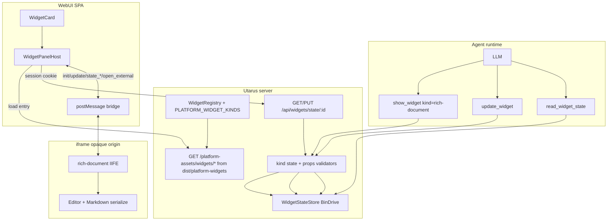
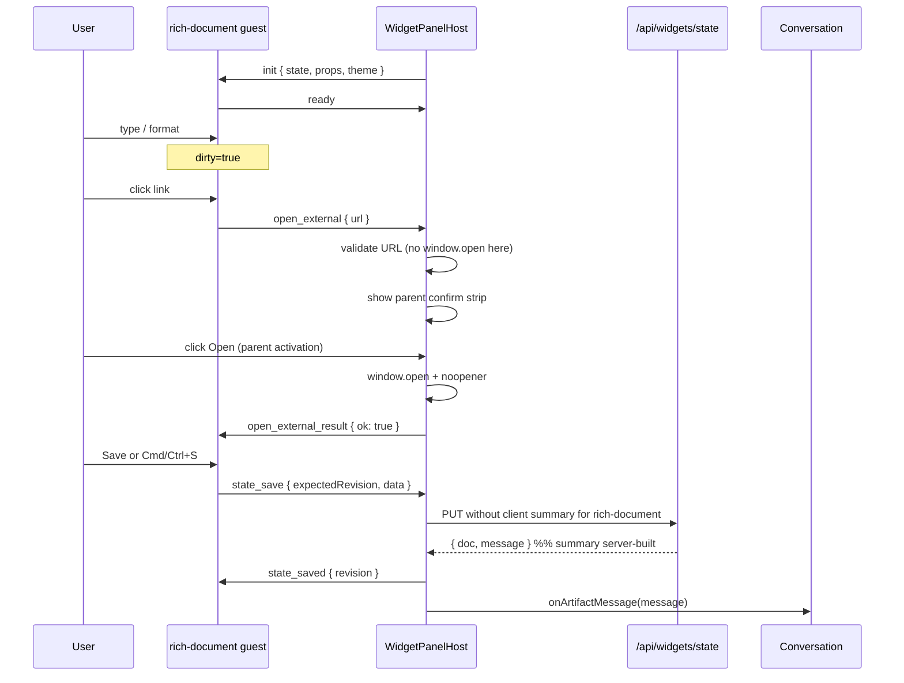
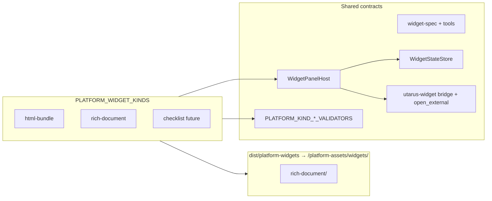

# Standard Platform Gadgets — Rich-Format Document Widget

| Field | Value |
|-------|--------|
| **Status** | Draft |
| **Author** | — |
| **Date** | 2026-07-20 |
| **Audience** | Utarus framework maintainers |
| **Primary repo** | `utarus` (platform) |
| **Related** | [webui-chat-widgets-design.md](./webui-chat-widgets-design.md), [webui-chat-widgets.md](./webui-chat-widgets.md) |
| **Depends on** | Widgets platform shipped in Utarus ≥ **1.6.0** |
| **Revision** | r2 — parent-gesture link UX (confirm strip); single PR1 registration rule; mandatory host props validation; dist resolve + URL caps |

---

## Overview

Domain agents can already register custom **iframe-bundle** widgets (e.g. `floor-plan-3d`) and persist instance state through the platform `WidgetStateStore` (BinDrive). What is missing is a **platform-standard** interactive document gadget: a rich-format editor/viewer that any agent can open with `show_widget`, that the user can edit in the side panel, and that survives reopen via the existing host-mediated state path.

This design adds:

1. A new **platform kind** `rich-document` (reserved id, not domain-registered).
2. A **platform-hosted classic IIFE iframe-bundle** served from `/platform-assets/widgets/rich-document/` under the same **strict sandbox** (`allow-scripts` only) and **utarus-widget bridge** already used by domain kinds.
3. A **canonical durable document** in `state.data` with **Markdown** as the agent-facing serialization format.
4. A bridge extension **`open_external`** plus **parent panel confirm strip** so document links open with a real parent user gesture (popup-blocker safe) without weakening K6 sandbox.
5. An extension path for additional **standard platform kinds** (checklist, spreadsheet, …) without inventing a parallel “gadget” subsystem and without requiring domain `staticDir`.

Terminology: product/protocol term remains **widget**. “Gadget” in the user request is colloquial only — no rename.

---

## Background & Motivation

### Current state (shipped ≥ 1.6.0)

| Layer | Path / behavior |
|-------|-----------------|
| Agent tools | `src/tools/show-widget.ts` — `show_widget` / `update_widget` / `read_widget_state` |
| Fence + card | ````widget` → `web/src/remark/widget-fence.ts` → `WidgetCard` → side panel |
| Panel host | `web/src/components/widgets/WidgetPanelHost.tsx` — loads entry URL, bridge, host-mediated `GET/PUT /api/widgets/state/:id` |
| State store | `src/widgets/state-store.ts` + BinDrive adapter `state-store-bindrive.ts` → `data/drive/<ownerSlug>/_utarus/widgets/<instanceId>/state.json` |
| Registry | `src/widgets/registry.ts` — platform `html-bundle` only; domain kinds under `/domain-assets/<agentKey>/…` |
| Bridge | `web/src/widgets/bridge.ts` — `init` / `update` / `state_saved` / `state_error` ↔ `ready` / `error` / `state_save` / `resize` |
| Caps | props ≤ 64 KiB; `state.data` ≤ 512 KiB; optimistic concurrency via `revision` |
| Demo pattern | `examples/demo/static/widgets/floor-plan-3d/` — explicit Save → `state_save` → K38 chat card |
| SPA / web dist | `resolveWebDistDir()` = `resolve(__dirname, '../../web/dist')` from `src/webapp/server.ts` (compiled: `dist/webapp/` → package-root `web/dist`) |
| npm `files` | `dist`, `src`, `web`, `scripts`, `README.md` — **no** `platform-widgets/` today |

### Pain points

1. **No standard document kind.** Agents that need collaborative notes, specs, meeting minutes, or editable reports must invent per-domain editors and ship static IIFE under `staticDir`.
2. **Agent DX friction.** Domains re-implement the same bridge/Save/state shape for “just a document.”
3. **Platform kinds today are incomplete.** Only `html-bundle` is platform-owned, and it is **open-only** (`supportsUpdate: false`, `supportsPersistence: false`) — unsuitable for editable docs.
4. **Prior non-goal blocked SPA React kinds.** Design K4/K non-goals deferred platform React runtimes (e.g. `json-table`). Any standard gadget must either stay iframe-bundle or deliberately reverse that non-goal with a full host redesign.
5. **Strict sandbox blocks link navigation.** Host iframe is `sandbox="allow-scripts"` only (K6). Clickable `http(s)` links cannot open tabs or top-navigate without a host-mediated path — floor-plan never needed this; documents do.

### Constraints (normative)

- Verify data model first; no silent defaults; fail-fast with clear errors.
- No optimization / cache unless asked.
- Prefer deep modules: small agent-facing surface (`show_widget` family); host/registry/security stay behind it.
- Extend the existing widget platform — do not invent a parallel subsystem.

---

## Goals & Non-Goals

### Goals

1. Ship platform kind **`rich-document`**: rich editing (bold/italic/headings/lists/**clickable** links/code at minimum) in the **side panel**. Links open via host-mediated **`open_external`** → **parent confirm/Open strip** (parent click has user activation; not a synchronous parent `window.open` from `postMessage` alone — see D13).
2. Persist document content via existing **WidgetStateStore / BinDrive** path (host-mediated only).
3. Agents use existing tools with kind `rich-document` — **no required new tools** in v1 (tool **success text** is extended for cross-channel preview — still same tool names).
4. Seed and read content in an **agent-friendly format** (Markdown).
5. Align Save UX with existing bridge + **K38** (user save → assistant chat card) without history spam; **server owns** document save summaries.
6. Establish a **platform-kind packaging and registry pattern** reusable by future standard kinds, including npm-shippable static assets under `dist/platform-widgets/`.
7. Reuse a well-maintained OSS editor where it reduces work without violating sandbox/IIFE constraints; **gate editor choice on a spike** (PR0).
8. Document security (XSS, HTML, links), cross-channel degrade, and an incremental PR plan.

### Non-Goals (this feature)

- CRDT / multi-user real-time collaboration (Yjs, TipTap collab cloud).
- Replacing GFM chat markdown or `post_html_report` with panel documents.
- Platform **React** widget runtime inside the SPA (still deferred; see Alternatives).
- Arbitrary HTML-as-source-of-truth documents.
- Image upload / binary attachments inside the document (v1: links only; images deferred).
- Kind-specific state size > 512 KiB or multi-file document storage (revisit if needed later).
- Auto-open panel on history load without user click (existing widgets v1 policy).
- Convenience tools (`show_document` / `edit_document`) unless later proven necessary by agent evals.
- Debounce/auto-save policy inside `WidgetStateStore` (store remains synchronous request/response).
- Domain ability to override/replace platform `rich-document` implementation.
- Expanding iframe sandbox beyond `allow-scripts` (no `allow-popups`, no `allow-top-navigation*`).
- Runtime env kill switch for platform kinds in v1 (rollback = revert release).

---

## Key Decisions

| # | Decision | Rationale |
|---|----------|-----------|
| **D1** | New platform kind id **`rich-document`**, reserved in `PLATFORM_WIDGET_KIND_IDS`. | Clear product name; kebab-case matches `WIDGET_KIND_RE`; reserved so domains cannot collide. |
| **D2** | **Runtime = platform iframe-bundle (Option A)** under strict sandbox, classic IIFE, same bridge as domain kinds. | Reuses `WidgetPanelHost`, K6 isolation, host-mediated state; does **not** reverse the prior “no platform React kinds” non-goal; packaging matches floor-plan demo. |
| **D3** | Serve platform bundles from **`/platform-assets/widgets/<kindId>/…`**, files emitted to **`dist/platform-widgets/`** and resolved via `__dirname` like `web/dist`. | Symmetric to domain-assets; npm `files` already includes `dist`; published consumers get assets without listing a new top-level folder. |
| **D4** | OSS editor: **TipTap (ProseMirror) MIT core** — **provisional pending PR0 spike**. Prefer TipTap StarterKit + fixed Markdown serialize (prefer stable `prosemirror-markdown` / controlled schema path over early `@tiptap/markdown` if spike shows HTML leakage or API churn). | Rich UX + structured model; Markdown is LLM-friendly; MIT. Contingency: CodeMirror Markdown-only UI with **same** `RichDocumentStateV1` (format unchanged). |
| **D5** | **Canonical `state.data` is Markdown-primary**, not ProseMirror JSON or HTML. Schema versioned: `format: "utarus-rich-document-v1"`. | Agents reason over Markdown; smaller than PM JSON; avoids storing unsanitized HTML; fail-fast schema validation. |
| **D6** | **Explicit Save** (toolbar button + Cmd/Ctrl+S) triggers `state_save`; no continuous auto-save in v1. Dirty indicator in guest UI. | Matches floor-plan pattern; prevents K38 chat-card spam and revision thrash. |
| **D7** | **Reuse existing tool names** — no `show_document`. Purpose/skill text teaches kind + state shape. Cross-channel preview is a **successText** extension on those tools. | Deep module rule; tools already cover seed / full-replace update / read. |
| **D8** | Agent **state updates are full replace** of `state.data` (existing store semantics). No JSON-patch / OT. | Already implemented; conflict = fail-fast with `currentRevision`. |
| **D9** | Product registration: `supportsUpdate: true`, `supportsPersistence: true`, `sandboxProfile: 'strict'`, `runtime: 'iframe-bundle'`, `entryHtml` relative to platform widgets root. **`rich-document` enters product `PLATFORM_WIDGET_KINDS` only in PR3** when validators + dist entry exist (boot integrity). PR1 ships host resolution without product registration. | Avoid half-registered persistent kinds; host plumbing is independently testable with injected maps. |
| **D10** | **No raw HTML in durable state.** ProseMirror/TipTap **schema** forbids raw HTML nodes; paste is filtered/stripped (schema filter; DOMPurify only if paste path still injects HTML). **No** whole-document HTML-tag regex. Links schemes: `http:` / `https:` only. | XSS + agent safety; regex false-positives on `Array<T>`, `a < b`, code fences. |
| **D11** | **Multi-gadget foundation:** `PLATFORM_WIDGET_KINDS[]` + `dist/platform-widgets/` + `PLATFORM_KIND_STATE_VALIDATORS` + boot integrity. | Adding `checklist` later is registration + bundle, not a redesign. |
| **D12** | Keep product term **widget**; no “gadget” type in code/API. | Avoid dual vocabulary. |
| **D13** | **Clickable links via `open_external` + parent confirm strip.** Guest never navigates. On link click guest posts `open_external`; host validates URL then shows panel chrome **“Open `<url>`?” [Open] [Dismiss]**. Only the parent **Open** button (real click → user activation) calls `window.open`. Host does **not** call `window.open` inside the `message` handler. Fail-fast to guest if URL rejected; dismiss is user cancel. K6 sandbox unchanged. | Opaque iframe click activation does **not** transfer across `postMessage`; parent-sync `window.open` is popup-blocked. Confirm strip is one extra click but reliable under default browser popup policy. |
| **D14** | **Platform-kind props validation** is a deliberate exception to K24 documentation-only `propsSchema`: tools **and** host (on every panel open / before iframe `init`) **must** run `validateRichDocumentProps` for `kind === 'rich-document'`. Invalid props → panel error, no `init`. Domain kinds stay structural size only. | Fail-fast for agent-written chrome and history-reopened fences; no silent bogus `mode`. |
| **D15** | **K38 summary for `rich-document` is server-authored.** Router ignores client-supplied `summary` for this kind and builds `Saved document · rev ${revision}` (deterministic). Host must not send “revision pending” placeholders for this kind (omit summary or send empty). | Matches current router preference for client summary — override that preference for this kind. |
| **D16** | **Authoritative validation is server/host.** Guest may pre-check for UX by bundling the same pure `rich-document-state.ts` into the IIFE build. Drift is non-security if server always re-validates. | Packaging: guest cannot import `src/`; compile pure module into platform-widgets bundle inputs. |

---

## Proposed Design

### Architecture



### Ownership boundary

| Layer | Owner |
|-------|--------|
| Kind id, registry entry, entry URL policy | **Utarus platform** |
| IIFE bundle (editor + toolbar + bridge glue) | **Utarus** under `platform-widgets/rich-document/` → build emits `dist/platform-widgets/` |
| Tools, store, REST, fence grammar | **Utarus** (extended successText + validators) |
| Purpose/skills: *when* to open a document | **Domain** + short **platform purpose fragment** once shipped |
| Document content after seed | **User** (via Save) and **Agent** (via tools) share one durable document |

### Runtime choice (research summary)

| Option | Description | Pros | Cons |
|--------|-------------|------|------|
| **A — Platform iframe-bundle** ✅ | Ship classic IIFE under `/platform-assets/…`, strict sandbox, existing host | Reuses 100% of bridge/state/K6; matches domain kinds; fail-fast isolation | Bundle size in guest; no React DOM sharing with SPA; no ES modules in guest; links need `open_external` |
| **B — Platform React runtime in SPA** | Mount React component inside panel (not iframe) | Shared SPA CSS/theme; easier TipTap React bindings | Reverses explicit non-goal; XSS surface if content escapes; new host path, sandbox model, CSP; larger SPA |
| **C — Hybrid** | Viewer in SPA, editor in iframe (or vice versa) | Cherry-pick UX | Two codepaths; version skew; higher complexity for v1 |

**Pick: Option A.** The widget platform was designed for executable kinds as sandboxed IIFE. TipTap core is framework-agnostic (vanilla `Editor`); React bindings are unnecessary inside the guest.

### OSS editor evaluation

| Library | License | Serialization | IIFE / opaque-origin fit | Agent-friendly | Notes |
|---------|---------|---------------|--------------------------|----------------|-------|
| **TipTap + ProseMirror** | MIT (core) | Prefer controlled schema + `prosemirror-markdown` (or pinned `@tiptap/markdown` if spike proves HTML-off) | Good: esbuild `format: 'iife'`, `bundle: true` | Excellent if Markdown is canonical | **Provisional primary** (D4). StarterKit covers bold/italic/headings/lists/code/blockquote. Link extension + protocol allowlist. |
| Quill | BSD-3 | Delta JSON / HTML | Good IIFE history | Weak (HTML/Delta) | HTML durability is XSS-prone. |
| Lexical | MIT | Custom JSON / HTML | Poor without React | Medium | React-first. |
| Milkdown | MIT | Markdown-native | Medium | Excellent | Heavier; less drop-in for minimal toolbar; not chosen for v1 (ecosystem smaller than TipTap). Documented for completeness. |
| CodeMirror 6 | MIT | Source Markdown string | Excellent | Excellent | **Spike-fail contingency**: same `RichDocumentStateV1`; source-mode UX, not WYSIWYG. |
| OverType / minimal MD | MIT | Markdown | Excellent small size | Excellent | Incomplete rich toolbar vs TipTap. |

#### PR0 spike (blocking for D4 lock)

**Before** landing product PRs that ship TipTap as final:

1. Pin exact versions of `@tiptap/core`, starter-kit, extension-link, and chosen markdown path.
2. Build **classic IIFE** (`esbuild`: `format: 'iife'`, `bundle: true`, **no** `external` npm packages, **no** CDN, **no** leftover dynamic `import()`).
3. Load under real host `sandbox="allow-scripts"`; assert `event.origin === "null"` on guest messages; bridge `ready` within timeout.
4. Golden Markdown round-trips for **every row** in the v1 Markdown subset table (bold, italic, H1–H6, lists, fenced code, inline code, blockquote, links, HR).
5. Paste path: paste HTML from clipboard → document must not retain raw HTML in serialized Markdown; schema must not admit `hard_break`/HTML nodes that round-trip as tags.
6. Measure raw IIFE size; hard fail if **> 2 MiB raw**; soft warn if **> 400 KiB gzipped**.
7. System fonts only (no remote `@font-face`); CSS inlined or relative `styles.css` next to `main.js`.

**If spike fails** (unstable markdown, HTML leakage, bundle too large, sandbox break): switch UI to **CodeMirror Markdown source editor** (or TipTap without markdown extension + `prosemirror-markdown` only). **Do not change** `RichDocumentStateV1`.

### How platform standard kinds are served

#### Registry model

```ts
// src/widgets/registry.ts (conceptual)

export const PLATFORM_RICH_DOCUMENT_KIND: WidgetKindRegistration = {
  id: 'rich-document',
  label: 'Rich document',
  runtime: 'iframe-bundle',
  /** Relative to dist/platform-widgets/ root — NOT domain staticDir */
  entryHtml: 'rich-document/index.html',
  sandboxProfile: 'strict',
  supportsUpdate: true,
  supportsPersistence: true,
  /**
   * Documentation-only for domain authors / manifest consumers (K24 still true for domains).
   * Platform kinds additionally run validateRichDocumentProps (D14) — not AJV/propsSchema engine.
   */
  propsSchema: {
    type: 'object',
    description: 'Chrome only. Content lives in state.markdown.',
    properties: {
      mode: { type: 'string', enum: ['edit', 'view'] },
      placeholder: { type: 'string', maxLength: 200 },
    },
    additionalProperties: false,
  },
};

// After PR3 (product enablement) — not in PR1:
export const PLATFORM_WIDGET_KINDS: readonly WidgetKindRegistration[] = [
  PLATFORM_HTML_BUNDLE_KIND,
  PLATFORM_RICH_DOCUMENT_KIND,
];

// dual pure module lockstep in widget-spec.ts — reserved ids (PR1+):
// PLATFORM_WIDGET_KIND_IDS = ['html-bundle', 'rich-document'] as const;
// Note: reserved id list can be a superset of PLATFORM_WIDGET_KINDS ids
// while PR1–PR2 land plumbing before product registration.
```

`buildWidgetRegistry` seeds from `PLATFORM_WIDGET_KINDS`, then overlays domain kinds (cannot use reserved ids in `PLATFORM_WIDGET_KIND_IDS`).

#### Boot integrity (`assertPlatformWidgetIntegrity`)

Called from `buildWidgetRegistry` / process start (fail-fast):

| Check | Rule |
|-------|------|
| Platform constant integrity | Existing html-bundle checks + rich-document flags/entryHtml present |
| Persistent platform kinds | For each `PLATFORM_WIDGET_KINDS` entry with `supportsPersistence === true`, **must** have `PLATFORM_KIND_STATE_VALIDATORS[id]` and `PLATFORM_KIND_PROPS_VALIDATORS[id]` (or shared props validator). Missing → throw: `platform kind '<id>' missing state/props validator`. |
| Entry file on disk | For each platform kind with `entryHtml`, file must exist under `resolvePlatformWidgetsDistDir()`: `{dist}/platform-widgets/{entryHtml}`. Missing → throw with absolute path (same spirit as domain `entryHtml` check). |
| html-bundle exception | `supportsPersistence: false` → no state validator required; no entryHtml required |

**Do not** register `rich-document` in a merge that ships host open without validator + dist entry (see PR plan).

#### Entry URL resolution (host) — **PR1**

Today `WidgetPanelHost` only knows `html-bundle` vs `/domain-assets/...`.

**Normative resolution (land in PR1, not deferred):**

```ts
function resolveWidgetEntryUrl(
  spec: WidgetSpec,
  reg: WidgetKindRegistration,
  registry: WidgetRegistryClient,
): string {
  if (spec.kind === 'html-bundle') {
    if (!spec.entry) throw new Error('html-bundle requires entry');
    return spec.entry;
  }
  if (isPlatformWidgetKind(spec.kind)) {
    if (!reg.entryHtml) throw new Error(`platform kind '${spec.kind}' missing entryHtml`);
    return `/platform-assets/widgets/${reg.entryHtml}`;
  }
  if (!registry.agentKey || !reg.entryHtml) {
    throw new Error('Domain widget missing agentKey or entryHtml');
  }
  return `/domain-assets/${registry.agentKey}/${reg.entryHtml}`;
}
```

Example: `/platform-assets/widgets/rich-document/index.html`

Platform kinds must **not** require `agentKey`.

#### Allowlist update

`isAllowedWidgetEntryUrl` (dual modules) must accept:

```
/platform-assets/widgets/<safe-relative-path>
```

Rules (fail-fast reject):

- No `..`, `\`, `://`, `?`, `#`
- Path prefix exactly `/platform-assets/widgets/`
- Iframe `src` entry must end with `.html`
- Scripts loaded by that HTML use relative paths only (not validated as iframe src)

**Host tightening (PR1 drive-by, in scope):** today’s `WidgetPanelHost` L96–118 soft-fallback accepts any `/domain-assets/` / `/reports/` / `/api/files/` prefix if pure allowlist fails. **Do not extend that bypass to platform URLs.** Prefer: single `isAllowedWidgetEntryUrl` call for all kinds; hard error on false. At minimum, platform paths go only through the pure allowlist.

#### Server mount (exact site)

In `src/webapp/server.ts`:

1. Add `resolvePlatformWidgetsDistDir()` next to `resolveWebDistDir()` — **one helper, ordered candidates**:

```ts
// src/webapp/server.ts
import { existsSync } from 'fs';
import { resolve, dirname } from 'path';
import { fileURLToPath } from 'url';

const __dirname = dirname(fileURLToPath(import.meta.url));

/**
 * Locate built platform widget static root.
 * Candidates (first existing directory wins):
 *  1. production / published: dist/webapp/server.js → ../platform-widgets
 *  2. tsx from src/webapp:     src/webapp → ../../dist/platform-widgets
 */
export function resolvePlatformWidgetsDistDir(): string | null {
  const candidates = [
    resolve(__dirname, '../platform-widgets'),
    resolve(__dirname, '../../dist/platform-widgets'),
  ];
  for (const dir of candidates) {
    if (existsSync(dir)) return dir;
  }
  return null;
}
```

**Normative ship path (D3):** build emits to **`dist/platform-widgets/rich-document/...`**.

| Runtime | Winning candidate |
|---------|-------------------|
| `node dist/webapp/server.js` | `dist/platform-widgets` via `../platform-widgets` |
| `tsx src/webapp/server.ts` | `dist/platform-widgets` via `../../dist/platform-widgets` |

**Unit test:** assert both layouts resolve when the dir exists under each relative path (temp dirs in test).

2. Mount **next to** domain-assets (before SPA catch-all). **Single rule:**

```ts
const platformWidgetsDistDir = resolvePlatformWidgetsDistDir();
// Boot integrity (assertPlatformWidgetIntegrity) already throws if any
// PLATFORM_WIDGET_KINDS entry has entryHtml and the file is missing.
// Mount only when the directory exists; never half-serve.
if (platformWidgetsDistDir !== null) {
  app.use('/platform-assets/widgets', express.static(platformWidgetsDistDir));
}
```

Integrity is the fail-fast for “kind registered but assets missing.” Mount is best-effort static when dir exists (after integrity, dir must exist for kinds with `entryHtml`).

3. SPA catch-all exclude (L211–212 today):

```ts
/^\/(?!api\/|logout|health|domain-assets\/|platform-assets\/).*$/
```

Trust model: **world-readable** static (K17 parity). No secrets in platform widget static.

**Test:** after build, `GET /platform-assets/widgets/rich-document/index.html` returns 200 with guest HTML, **not** SPA `index.html`.

#### Packaging / build (npm-complete)

**Emit path (chosen):** `dist/platform-widgets/` — covered by existing `"files": ["dist", ...]`.

```
platform-widgets/                    # source tree (dev-only; not required in npm files)
  rich-document/
    package.json                     # TipTap etc. as dependencies of THIS nested package
    package-lock.json                # dual lockfile, documented
    src/
      index.html
      main.ts                        # bridge + editor bootstrap
      styles.css                     # no Tailwind from SPA; system fonts
      # rich-document-state may be imported from shared pure file via relative copy or build alias
  scripts/
    build.mjs                        # esbuild iife → ../../dist/platform-widgets/rich-document/
dist/platform-widgets/               # build output (shipped)
  rich-document/
    index.html
    main.js
    styles.css                       # if not inlined
```

**Root scripts (normative):**

```json
{
  "scripts": {
    "build:platform-widgets": "node platform-widgets/scripts/build.mjs",
    "build": "tsc && npm run build:platform-widgets && npm run build:web",
    "prepare": "npm run build",
    "prepack": "npm run build"
  }
}
```

`build.mjs` must:

1. `npm --prefix platform-widgets/rich-document ci` (or `install --include=dev` if no lock yet) — **fail-fast** with clear error if install fails.
2. esbuild bundle TipTap (and markdown path) as **build-time only** — TipTap **must not** appear in root utarus `dependencies` / runtime Node imports.
3. Write pure static assets under `dist/platform-widgets/`.
4. Fail if raw `main.js` > 2 MiB.

**Lockfile strategy:** dual lockfile (`platform-widgets/rich-document/package-lock.json`) is acceptable and documented in README; CI caches that path. Do **not** put TipTap in root runtime deps.

**Q1 answer:** do **not** commit `dist/platform-widgets` unless project later commits `web/dist`; prefer **build on prepare/CI** like web.

### Data model

#### Three layers (unchanged K28)

| Layer | Writer | Durable? | `rich-document` usage |
|-------|--------|----------|------------------------|
| **props** | Agent (fence) | Event snapshot | Chrome only: `mode`, `placeholder`; **never** document body |
| **state** | Agent tools + user Save | Yes (BinDrive) | Canonical document body |
| **session UI** | Guest | No | Cursor, selection, dirty flag, unsaved editor doc |

#### Canonical `state.data` schema (`utarus-rich-document-v1`)

```ts
export interface RichDocumentStateV1 {
  format: 'utarus-rich-document-v1';
  /** Canonical body. UTF-8 Markdown subset (see § Format). Not HTML. Not PM JSON. */
  markdown: string;
}
```

```ts
// src/widgets/kinds/rich-document-state.ts — pure; also compiled into IIFE (D16)
export function validateRichDocumentState(
  data: unknown,
): { ok: true; value: RichDocumentStateV1 } | { ok: false; error: string } {
  if (data === null || typeof data !== 'object' || Array.isArray(data)) {
    return { ok: false, error: 'rich-document state must be a plain object' };
  }
  const o = data as Record<string, unknown>;
  const allowed = new Set(['format', 'markdown']);
  for (const k of Object.keys(o)) {
    if (!allowed.has(k)) {
      return { ok: false, error: `rich-document state unknown field: ${k}` };
    }
  }
  if (o.format !== 'utarus-rich-document-v1') {
    return {
      ok: false,
      error: `rich-document state format must be utarus-rich-document-v1, got ${String(o.format)}`,
    };
  }
  if (typeof o.markdown !== 'string') {
    return { ok: false, error: 'rich-document state.markdown must be a string' };
  }
  // Reject NUL / C0 controls except \n \r \t
  if (/[\x00-\x08\x0B\x0C\x0E-\x1F]/.test(o.markdown)) {
    return { ok: false, error: 'rich-document state.markdown contains control characters' };
  }
  // NO whole-string HTML-tag regex (false positives on Array<T>, a < b, code fences).
  // HTML exclusion is schema + paste path (D10), not this validator.
  // Global size still enforced by validateStateData (UTF-8 of JSON.stringify(data) ≤ 512 KiB).
  return { ok: true, value: { format: 'utarus-rich-document-v1', markdown: o.markdown } };
}
```

**When to call kind validation:**

| Path | Behavior |
|------|----------|
| `show_widget` / `update_widget` with `state` | After `validateStateData`, `validateKindState(kind, state)` |
| `PUT /api/widgets/state` | Same when body.kind is platform-validated |
| Guest pre-save | Optional UX copy via bundled pure module; host/server re-validates (authoritative) |

**No silent coercion.** Missing `format` → error.

#### Props validation (platform exception to K24 — D14)

```ts
export function validateRichDocumentProps(
  props: unknown,
): { ok: true; value: Record<string, unknown> } | { ok: false; error: string } {
  if (props === null || typeof props !== 'object' || Array.isArray(props)) {
    return { ok: false, error: 'rich-document props must be a plain object' };
  }
  const o = props as Record<string, unknown>;
  const allowed = new Set(['mode', 'placeholder']);
  for (const k of Object.keys(o)) {
    if (!allowed.has(k)) {
      // Fail-fast misplaced body keys (Issue 14)
      if (k === 'markdown' || k === 'content' || k === 'html' || k === 'format') {
        return {
          ok: false,
          error: `rich-document props must not include '${k}' — put document body in state.markdown`,
        };
      }
      return { ok: false, error: `rich-document props unknown field: ${k}` };
    }
  }
  if (o.mode !== undefined) {
    if (o.mode !== 'edit' && o.mode !== 'view') {
      return { ok: false, error: `rich-document props.mode must be 'edit' or 'view', got ${String(o.mode)}` };
    }
  }
  if (o.placeholder !== undefined) {
    if (typeof o.placeholder !== 'string') {
      return { ok: false, error: 'rich-document props.placeholder must be a string' };
    }
    if (o.placeholder.length > 200) {
      return { ok: false, error: 'rich-document props.placeholder exceeds 200 characters' };
    }
    if (/[\x00-\x08\x0B\x0C\x0E-\x1F]/.test(o.placeholder)) {
      return { ok: false, error: 'rich-document props.placeholder contains control characters' };
    }
  }
  return { ok: true, value: o };
}
```

**Normative wiring (D14 — not optional):**

| Path | Behavior |
|------|----------|
| `show_widget` / `update_widget` | After size check, `validateKindProps(kind, props)`; fail tool on error |
| **Host panel open** (`WidgetPanelHost` boot, before iframe load / `init`) | For `kind === 'rich-document'`, run `validateRichDocumentProps(spec.props)`; on fail → set panel error string, **do not** set `entryUrl` / **do not** send `init` |
| History reopen | Same host path — fences carry props from chat text; host re-validates |

Domain kinds: **no** this path (K24 remains). Dual pure module for props validator (or host imports shared dual file under `web/src/widgets/kinds/` mirrored from server) so SPA can validate without importing `src/`.

Omitted `mode` → guest session UI uses edit chrome (not written into store/fence by platform). Invalid `mode` → **tool fail** and **panel error** (never silent).

#### Size limits

| Cap | Value | Notes |
|-----|-------|-------|
| `WIDGET_STATE_DATA_MAX_BYTES` | **512 KiB** | UTF-8 byte length of **`JSON.stringify(state.data)`**, not raw markdown length. Envelope keys (`format`, `markdown`) and non-ASCII reduce character budget. Purpose text should say this exactly. |
| `WIDGET_PROPS_MAX_BYTES` | **64 KiB** | Existing |
| Kind-specific raise | **Not in v1** | Multi-file storage out of scope |

#### Example durable document on disk

```json
{
  "instanceId": "3fa85f64-5717-4562-b3fc-2c963f66afa6",
  "kind": "rich-document",
  "revision": 2,
  "updatedAt": "2026-07-20T12:00:00.000Z",
  "data": {
    "format": "utarus-rich-document-v1",
    "markdown": "# Meeting notes\n\n- **Ship** rich-document\n- Link: [design](https://example.com/d)\n\n```ts\nconst x = 1;\n```\n"
  }
}
```

### Markdown format subset (v1)

Supported (must round-trip via editor — golden tests in PR0/PR2):

| Feature | Markdown |
|---------|----------|
| Paragraphs | blank-line separated |
| Headings | `#` … `######` |
| Bold / italic | `**` / `*` |
| Ordered / unordered lists | `1.` / `-` |
| Fenced code | ```` ```lang ```` |
| Inline code | `` `code` `` |
| Blockquote | `>` |
| Links | `[text](url)` — `http:` / `https:` only |
| Horizontal rule | `---` |

**Not supported in v1:**

- Raw HTML in source (schema rejects HTML nodes; paste strips HTML to plain/marks)
- Images `` (deferred)
- Tables (deferred)
- Task lists (later or separate checklist kind)

### Bridge: `open_external` (D13)

#### Why not parent `window.open` in the message handler

Browser **transient user activation** is bound to the browsing context that received the click (the sandboxed iframe). It does **not** transfer to the parent via `postMessage`. A parent `message` listener that immediately calls `window.open` (or synthetic `<a target=_blank>.click()`) is **popup-blocked** under default Chrome/Safari/Firefox policy. Treating that as the primary path would make Goal 1 systematically fail.

**Normative UX:** one extra parent click on a confirm strip (gesture-bearing). Do **not** expand sandbox with `allow-popups`.

#### New guest → host message

```ts
// web/src/widgets/bridge.ts — extend WidgetGuestToHost
| {
    channel: 'utarus-widget';
    type: 'open_external';
    instanceId: string;
    url: string;
  };
```

#### URL validation (host — fail-fast)

| Rule | Detail |
|------|--------|
| Max length | `url.length <= 2048` (JS string length); longer → reject |
| Whitespace / controls | Reject if `/[\s\x00-\x1F\x7F]/` matches |
| Parse | `new URL(url)` must succeed; relative URLs rejected (must be absolute) |
| Scheme | Only `http:` and `https:` |
| Userinfo | Reject if `parsed.username` or `parsed.password` non-empty |
| Host | Any http(s) host allowed after scheme check (including `localhost`); user is responsible for phishing risk — URL is shown in parent chrome before open |

Guest may pre-check the same rules for UX; **host re-validates** (authoritative).

#### Host handling (`WidgetPanelHost`) — confirm strip

1. Accept only if `event.source === iframe.contentWindow` and `instanceId` matches.
2. Run URL validation above; on fail → post `open_external_result` `{ ok: false, error }` and **do not** show strip.
3. On success → store pending URL in host React state; show **panel chrome confirm strip** above the iframe (parent document, not guest):

   ```
   Open external link?
   https://example.com/path…
   [Open]  [Dismiss]
   ```

   - Truncate displayed URL for chrome if needed; full URL remains in `title` attribute and is what `window.open` uses.
   - Auto-focus the strip (scroll into view); **do not** auto-open.
4. **Open** button `onClick` (parent user activation):
   - `const w = window.open(pendingUrl, '_blank', 'noopener,noreferrer');`
   - If `w == null` → still post `open_external_result` `{ ok: false, error: 'popup blocked or open failed' }` (rare after parent gesture; still fail-visible).
   - Else → clear strip; post `{ ok: true }`.
5. **Dismiss** → clear strip; post `{ ok: false, error: 'user dismissed' }` (guest may ignore or show subtle status — not an error banner required).

```ts
| {
    channel: 'utarus-widget';
    type: 'open_external_result';
    instanceId: string;
    ok: boolean;
    error?: string; // required when ok === false
  };
```

**Forbidden in v1:** calling `window.open` synchronously inside the `message` event handler.

#### Guest link UX

- Intercept link clicks in the editor (`editorProps.handleClick` / equivalent).
- `preventDefault` — never navigate `_self` (would unload guest).
- Post `open_external` with absolute href.
- On `open_external_result` with reject (invalid URL): show visible guest error.
- On dismiss: optional quiet status; link text remains in document.

**Sandbox stays** `sandbox="allow-scripts"` only — no K6 change.

### Edit UX



| Behavior | Spec |
|----------|------|
| **Save** | Toolbar **Save** + Cmd/Ctrl+S → one `state_save` |
| **Auto-save** | **Not in v1** |
| **Dirty** | “Unsaved changes” until `state_saved` |
| **Conflict** | Host posts `state_error` with `code: conflict` + `currentRevision`. **v1 UX:** visible error; user closes and reopens card to reload. Agent purpose: after conflict, user reopens; agent must `read_widget_state` before rewrite. Optional later: `state_reload` bridge message (PR5). |
| **K38 card summary (D15)** | Server builds `Saved document · rev ${revision}` for `kind === 'rich-document'`. **Ignore** client `body.summary` for this kind. Host omits summary field (or sends only empty — server still owns). |
| **Spam control** | Explicit save only |

### Agent DX

#### Tool names

No new tools. Behavioral extensions:

| Tool | Change |
|------|--------|
| `show_widget` | Accept `rich-document`; `validateRichDocumentState` + `validateRichDocumentProps`; successText may include markdown preview |
| `update_widget` | Same validators on props/state |
| `read_widget_state` | Unchanged contract |

#### Cross-channel successText (normative API change)

Extend `successText` in `src/tools/show-widget.ts` when `kind === 'rich-document'` and state was written or is known after create:

```
[Widget — all channels]
instanceId: …
revision: …
title: …
kind: rich-document
<summary if provided by agent on open>

--- content preview (rich-document) ---
<first 500 Unicode code points of state.markdown, then "…" if truncated>
--- end preview ---

---
WEB ONLY — paste this fence once…
```

Rules:

- Preview is **only** for `rich-document` (not all kinds).
- Truncation is **code-point** based (not UTF-8 mid-sequence).
- If markdown is empty string, preview section shows `(empty document)`.
- Non-web agents that need full body still use `read_widget_state` (preview is convenience, not substitute).
- Do **not** claim Telegram gets preview without this code change — it is in **PR3**.

#### Tool parameter examples

**Open (seed):**

```json
{
  "kind": "rich-document",
  "title": "Q3 launch plan",
  "summary": "Editable launch checklist and narrative",
  "props": { "mode": "edit" },
  "state": {
    "format": "utarus-rich-document-v1",
    "markdown": "# Q3 launch plan\n\n## Goals\n\n- Ship **rich-document** widget\n"
  }
}
```

**Update body (full replace):**

```json
{
  "instanceId": "3fa85f64-5717-4562-b3fc-2c963f66afa6",
  "kind": "rich-document",
  "title": "Q3 launch plan",
  "state": {
    "format": "utarus-rich-document-v1",
    "markdown": "# Q3 launch plan\n\nUpdated after legal review.\n"
  },
  "props": {}
}
```

**Misuse (must fail):**

```json
{
  "kind": "rich-document",
  "title": "Bad",
  "props": { "markdown": "# no" },
  "state": { "format": "utarus-rich-document-v1", "markdown": "" }
}
```

→ `rich-document props must not include 'markdown' — put document body in state.markdown`

#### Purpose / skill text (suggestion)

```
When the user needs a durable editable document (notes, plan, draft, spec), call show_widget
with kind rich-document, a clear title, optional props.mode ('edit'|'view'), and state:
  { "format": "utarus-rich-document-v1", "markdown": "<GFM subset markdown>" }.
Never put document body in props (props.markdown is an error).
Paste the WEB ONLY ```widget fence once into your final answer. Never invent fences.
To change content later, call update_widget with the same instanceId and full state replace
(UTF-8 JSON size of state.data ≤ 512 KiB).
To inspect user edits after they Save, call read_widget_state.
If a revision conflict occurs, read_widget_state before rewriting; user may need to reopen the card.
On Telegram/Slack: use tool text (includes a short content preview); never paste ```widget fences.
```

#### Update semantics

| Operation | Semantics |
|-----------|-----------|
| Agent `state` | **Full replace** of `data` |
| User Save | Full replace from guest markdown snapshot |
| Patch / diff | **Not supported** |
| Concurrent edit | Optimistic `revision`; loser fails fast |

### Guest implementation sketch

```js
// platform-widgets/rich-document — conceptual IIFE body
(function () {
  var CHANNEL = 'utarus-widget';
  var instanceId = null;
  var revision = 0;
  var dirty = false;
  var editor = null;

  function post(msg) {
    if (window.parent && window.parent !== window) window.parent.postMessage(msg, '*');
  }

  function applyTheme(scheme) {
    document.documentElement.dataset.colorScheme = scheme; // light|dark from init.theme
    // CSS: [data-color-scheme="dark"] { … } system fonts only
  }

  function currentState() {
    return { format: 'utarus-rich-document-v1', markdown: serializeMarkdown(editor) };
  }

  function save() {
    if (!instanceId) return;
    var data = currentState();
    // optional: bundled validateRichDocumentState — host still authoritative
    post({
      channel: CHANNEL,
      type: 'state_save',
      instanceId: instanceId,
      expectedRevision: revision,
      data: data,
    });
  }

  function onLinkClick(url) {
    post({ channel: CHANNEL, type: 'open_external', instanceId: instanceId, url: url });
  }

  window.addEventListener('keydown', function (e) {
    if ((e.metaKey || e.ctrlKey) && e.key === 's') {
      e.preventDefault();
      save();
    }
  });

  window.addEventListener('message', function (ev) {
    var msg = ev.data;
    if (!msg || msg.channel !== CHANNEL) return;
    if (msg.type === 'init') {
      instanceId = msg.instanceId;
      applyTheme(msg.theme && msg.theme.colorScheme);
      if (!msg.state || !msg.state.data) {
        post({
          channel: CHANNEL,
          type: 'error',
          instanceId: instanceId,
          message: 'rich-document requires state on init',
        });
        return;
      }
      revision = msg.state.revision;
      // schema-only editor; setContent from markdown parse
      // props.mode === 'view' → editor.setEditable(false)
      dirty = false;
      post({ channel: CHANNEL, type: 'ready', instanceId: instanceId });
    }
    if (msg.type === 'update') {
      if (msg.state) {
        revision = msg.state.revision;
        // replace content from markdown
        dirty = false;
      }
    }
    if (msg.type === 'state_saved') {
      revision = msg.revision;
      dirty = false;
    }
    if (msg.type === 'state_error') {
      // surface msg.message + code (conflict → reopen guidance)
    }
    if (msg.type === 'open_external_result' && !msg.ok) {
      // surface msg.error
    }
  });
})();
```

**Guest UI chrome (MVP, PR2):**

- Toolbar: Bold, Italic, H1, H2, H3, Bullet list, Ordered list, Code block, Inline code, Blockquote, Link (prompt for URL), Save.
- Status: revision + dirty flag.
- Theme: honor `init.theme.colorScheme` via CSS variables / data attribute.
- Paste: transformHTML / clipboardTextParser strips tags to schema marks/nodes only.

### Multi-gadget foundation



**Validator registry:**

```ts
export const PLATFORM_KIND_STATE_VALIDATORS: Record<string, KindStateValidator> = {
  'rich-document': (data) => {
    const r = validateRichDocumentState(data);
    return r.ok ? { ok: true } : { ok: false, error: r.error };
  },
};

export const PLATFORM_KIND_PROPS_VALIDATORS: Record<string, KindPropsValidator> = {
  'rich-document': (props) => {
    const r = validateRichDocumentProps(props);
    return r.ok ? { ok: true } : { ok: false, error: r.error };
  },
};

export function validateKindState(kind: string, data: unknown) {
  const v = PLATFORM_KIND_STATE_VALIDATORS[kind];
  if (!v) return { ok: true as const }; // domain kinds: size-only
  return v(data);
}

export function validateKindProps(kind: string, props: unknown) {
  const v = PLATFORM_KIND_PROPS_VALIDATORS[kind];
  if (!v) return { ok: true as const };
  return v(props);
}
```

Boot integrity requires every persistent platform kind to appear in both maps.

---

## API / Interface Changes

### Agent tools

| Tool | Change |
|------|--------|
| `show_widget` | Kind `rich-document`; props+state validators; successText content preview for rich-document |
| `update_widget` | Same validators; preview when state written |
| `read_widget_state` | Unchanged |

Tool description string mentions platform kinds and state shape.

### REST

No new routes. `PUT /api/widgets/state/:instanceId`:

- Run `validateKindState(body.kind, body.data)`.
- For `kind === 'rich-document'`: **ignore** client `summary`; set card summary to `Saved document · rev ${doc.revision}` after save (D15).
- Host for rich-document: **omit** `summary` in PUT body (stop sending `Saved (revision pending)`).

### Bridge

| Direction | New types |
|-----------|-----------|
| Guest → host | `open_external` |
| Host → guest | `open_external_result` |

Existing types unchanged. `isWidgetGuestMessage` updated.

### Manifest / host

- `widgets[]` includes `rich-document` with `entryHtml`.
- Host resolves platform entry URLs (PR1).
- Host handles `open_external` with **confirm strip** in PR2 (same PR as guest links).

### Client host allowlist

Platform paths only via pure allowlist; no loose prefix fallback for platform.

---

## Data Model Changes

| Artifact | Change |
|----------|--------|
| `WidgetStateDocument` envelope | Unchanged |
| BinDrive path | Unchanged |
| `state.data` for `rich-document` | `RichDocumentStateV1` |
| Fence grammar | Unchanged |
| Bridge types | + `open_external` / `open_external_result` |
| Tool successText | + optional content preview for rich-document |
| Migration | None |

---

## Alternatives Considered

### 1. Platform React runtime in SPA (Option B)

| Pros | Cons |
|------|------|
| Shared SPA theme | Reverses non-goal; larger security review |

**Rejected for v1.**

### 2. Quill / HTML durable format

| Pros | Cons |
|------|------|
| Mature | HTML/Delta poor for agents; XSS harder |

**Rejected.**

### 3. CodeMirror Markdown source-only as primary UX

| Pros | Cons |
|------|------|
| Tiny; perfect MD fidelity; easy IIFE | Not WYSIWYG rich-format |

**Rejected as sole primary** if TipTap spike passes. **Accepted as spike-fail contingency** with identical `RichDocumentStateV1`.

### 4. Convenience tools `show_document` / `read_document`

| Pros | Cons |
|------|------|
| Slightly nicer prompts | Duplicate surface |

**Rejected for v1.**

### 5. Continuous auto-save

K38 spam / revision churn. **Rejected.**

### 6. ProseMirror JSON as canonical state

LLM-unfriendly; couples storage to editor version. **Rejected.**

### 7. Expand sandbox (`allow-popups` / top-navigation) for links

Weakens K6; phishing escape. **Rejected** in favor of `open_external`.

### 8. Display-only links (no click navigation)

Simpler bridge, but Goal 1 “links” would be misleading. **Rejected** in favor of D13 confirm strip (one parent click, reliable).

### 9. Platform kind hosted under fake domain-assets agentKey

Hack; couples platform to domain staticDir. **Rejected.**

### 10. Milkdown as primary editor

Markdown-native but heavier / smaller ecosystem than TipTap for this host model. **Rejected for v1**; re-evaluate only if TipTap spike fails *and* CodeMirror UX is insufficient.

### 11. Server-rendered Markdown viewer + plain textarea (zero TipTap)

| Pros | Cons |
|------|------|
| Minimal deps; trivial IIFE | Weak rich-format UX; still meets durable schema |

**Spike-fail contingency tier-2** after CodeMirror if even CM is undesirable.

---

## Security & Privacy Considerations

| Threat | Mitigation |
|--------|------------|
| XSS via document HTML | Durable Markdown only; **schema forbids raw HTML nodes**; paste strip; server validates shape (not HTML regex). Opaque origin limits cookie theft. |
| Phishing links | Link mark: `http:`/`https:` only; host re-checks on `open_external` (length/scheme/userinfo); **URL shown in parent confirm strip** before Open; `noopener,noreferrer` on `window.open`. |
| Open iframe URL | Host constructs `/platform-assets/…`; pure allowlist; no loose fallback for platform. |
| State API abuse | Session auth; ownerSlug = viewer; path traversal rejected. |
| Oversized payload | 512 KiB on JSON-serialized `data` fail-fast. |
| Unexpected fields | State/props allowlists; `props.markdown` hard error. |
| World-readable static | Expected; no secrets in dist. |
| Guest calling APIs | Strict sandbox; host mediates state + external open. |
| Popup / navigation escape | No sandbox popups flag; host `window.open` only from parent **Open** button click (user activation), never from bare `message` handler. |

---

## Observability

| Signal | Approach |
|--------|----------|
| Tool failures | Explicit validator error strings |
| Host open failures | Panel error chrome |
| Guest errors | Bridge `error` / `state_error` / `open_external_result` |
| K38 card failure | Existing `cardError` on PUT |
| Metrics | None in v1 |
| Logging | PUT validation failures: kind + code + data byte length (not full markdown) |

---

## Rollout Plan

1. **Always-on when shipped:** no `UTARUS_PLATFORM_WIDGETS` kill switch in v1 (dropped). Rollback = revert release. Existing BinDrive state files remain; unknown kind → fail-fast panel error.
2. **Boot fails** if registered platform persistent kinds lack validator or dist entry — no half-state.
3. **Compat:** ship server + `dist/platform-widgets` + web together (standard utarus release).
4. **Staged PRs:** PR0 spike → PR1 plumbing (mount + host resolve + allowlist + **id reservation only**) → PR2 guest + confirm-strip links → PR3 **product registration** + validators + preview + K38 → PR4 docs → PR5 hardening.

---

## Cross-channel

| Channel | Behavior |
|---------|----------|
| **WebUI** | Fence → card → panel editor; links via `open_external` |
| **Telegram / Slack** | Tool success text: identity fields + **content preview** (PR3 successText change); **never** paste ````widget` fence |
| **Full body on non-web** | `read_widget_state` |
| **Export** | Agent may paste Markdown into chat if user asks |

---

## Open Questions

| # | Question | Resolution in r1 |
|---|----------|------------------|
| Q1 | Commit dist vs build-only? | **Build on prepare/CI**; emit `dist/platform-widgets/`; do not add top-level folder to npm `files`. |
| Q2 | Platform purpose blurb? | **Yes**, short fragment once kind ships. |
| Q3 | View-only enforcement? | **props.mode only**; not a security boundary. |
| Q4 | Cmd-S? | **Yes** (D6). |
| Q5 | Bundle size thresholds? | Warn > 400 KiB gzip; fail > 2 MiB raw. |
| Q6 | DOMPurify vs schema? | Prefer schema + paste filter; DOMPurify only if paste still injects HTML after spike. |
| Q7 | TipTap markdown package? | **Spike decides** between `@tiptap/markdown` (HTML-off) vs `prosemirror-markdown` only. |

---

## Risks

| Risk | Severity | Mitigation |
|------|----------|------------|
| TipTap IIFE / early markdown / HTML paste | **High** until PR0 | Spike gate; pin versions; contingency CodeMirror; golden MD |
| Links popup-blocked if parent opens from message handler | **High** if mis-implemented | D13 confirm strip + PR2 acceptance: real browser open without popup blocked |
| Markdown round-trip loss | Medium | Golden files per subset row |
| Agents put body in props | Medium | **Hard tool error** on props.markdown/content/html/format |
| Intermediate main accepts invalid state | Medium | Boot integrity: no registration without validator; land validation before/with first Save path |
| Dual-module / guest validator drift | Low | Server authoritative; shared pure file in IIFE build |
| 512 KiB surprises | Low | Document JSON UTF-8 byte cap in purpose |
| Conflict UX weak | Low (accepted v1) | Purpose text + reopen; optional state_reload later |

---

## References

- `/Users/zhengqingqiu/projects/utarus/docs/webui-chat-widgets-design.md` — K1–K38, K6 sandbox, K24 propsSchema
- `/Users/zhengqingqiu/projects/utarus/docs/webui-chat-widgets.md` — domain integration
- `/Users/zhengqingqiu/projects/utarus/src/widgets/registry.ts`
- `/Users/zhengqingqiu/projects/utarus/src/widgets/state-store.ts`
- `/Users/zhengqingqiu/projects/utarus/src/tools/show-widget.ts` — `successText` L63–78
- `/Users/zhengqingqiu/projects/utarus/web/src/components/widgets/WidgetPanelHost.tsx` — sandbox L336; entry L81–118; summary L234
- `/Users/zhengqingqiu/projects/utarus/web/src/widgets/bridge.ts`
- `/Users/zhengqingqiu/projects/utarus/src/webapp/server.ts` — `resolveWebDistDir`, SPA catch-all, domain-assets mount
- `/Users/zhengqingqiu/projects/utarus/src/webapp/widgets-router.ts` — client summary preference L126–129
- `/Users/zhengqingqiu/projects/utarus/examples/demo/static/widgets/floor-plan-3d/`
- TipTap Markdown docs (early release note) — https://tiptap.dev/docs/editor/markdown

---

## PR Plan

### PR0 — Editor IIFE + Markdown spike (blocking)

| | |
|--|--|
| **Title** | `spike(widgets): TipTap/prosemirror-markdown IIFE under strict sandbox` |
| **Depends on** | None |
| **Files** | Throwaway or `platform-widgets/rich-document` scaffold; golden MD fixtures; spike notes in PR description |
| **Changes** | Prove D4 or choose contingency (CodeMirror). Pin versions. Measure size. HTML paste behavior. No product registration required. |
| **Merge criteria** | Sandbox load + ready; golden round-trips for full subset table; documented serialize API; go/no-go for TipTap vs contingency. |

### PR1 — Platform mount, allowlist, host entry resolution (no product kind yet)

| | |
|--|--|
| **Title** | `feat(widgets): platform-assets mount, host platform entry resolution` |
| **Depends on** | None (PR0 may run in parallel) |
| **Files** | `src/widgets/widget-spec.ts`, `web/src/widgets/widget-spec.ts` (allowlist + `isPlatformWidgetKind` helper if needed for URL tests), `src/webapp/server.ts` (`resolvePlatformWidgetsDistDir` candidate list, mount, SPA exclude), `web/src/components/widgets/WidgetPanelHost.tsx` (`resolveWidgetEntryUrl` + pure allowlist only), unit/integration tests |
| **Normative registration rule (only this — no alternates):** | |
| | **A.** PR1 adds `'rich-document'` to dual pure **`PLATFORM_WIDGET_KIND_IDS`** (domain reservation / collision fail-fast). |
| | **B.** PR1 does **not** add `rich-document` to product **`PLATFORM_WIDGET_KINDS`** (manifest/registry still only product-registers `html-bundle`). |
| | **C.** PR1 does **not** enable product `supportsPersistence` for rich-document. |
| | **D.** Host/unit tests inject a **test-only** fake `WidgetKindRegistration` map entry for platform entry resolution (no product registration). Tests write a fixture `index.html` under a temp or test `dist/platform-widgets/rich-document/` (or mock `resolvePlatformWidgetsDistDir`). |
| | **E.** Boot integrity for entry files applies only to kinds in **`PLATFORM_WIDGET_KINDS`** with `entryHtml` — PR1 therefore does not require shipping product rich-document dist. |
| | **F.** PR3 is the **only** PR that adds full `PLATFORM_RICH_DOCUMENT_KIND` to `PLATFORM_WIDGET_KINDS` (with validators + real dist). |
| **Changes** | Mount `/platform-assets/widgets`; SPA exclude; allowlist; host `resolveWidgetEntryUrl` for platform kinds; allowlist tighten; dual `PLATFORM_WIDGET_KIND_IDS` reservation. |
| **Merge criteria** | Allowlist accepts platform paths; host unit test opens injected platform kind without `agentKey`; fixture GET 200 ≠ SPA index when mounted; catch-all excludes `platform-assets`; domain registration of id `rich-document` fails as reserved. |

### PR2 — Guest editor IIFE + `open_external` confirm strip + build pipeline

| | |
|--|--|
| **Title** | `feat(widgets): rich-document guest IIFE, open_external confirm strip, platform-widgets build` |
| **Depends on** | PR0 (go decision), PR1 (mount + host resolve) |
| **Files** | `platform-widgets/**`, root `package.json` scripts, `web/src/widgets/bridge.ts`, `WidgetPanelHost.tsx` (`open_external` → confirm strip UI + Open button `window.open`), `dist/platform-widgets` via build |
| **Changes** | Nested package install + esbuild IIFE; toolbar; theme; Cmd-S; Save; dirty; link intercept → `open_external`; host **confirm strip** (never `window.open` in message handler); URL validation caps; `open_external_result`; system fonts; no CDN; compile pure state validator into IIFE for optional pre-check; paste schema filter. |
| **Merge criteria** | Automated **and** real-browser path: `sandbox=allow-scripts`, origin null, ready, bold+list+link; Save posts valid-shaped state; link click shows parent strip; clicking **Open** opens tab **without** “popup blocked” under default popup policy. Bundle size caps. **Do not merge PR2 to main without PR3 in the same release** (product registration + store validators). |

### PR3 — Validators, props fail-fast (tools + host), successText preview, K38, **product registration**

| | |
|--|--|
| **Title** | `feat(widgets): rich-document product registration, validators, tool preview, K38` |
| **Depends on** | PR1; stack with PR2 for product enablement |
| **Files** | `src/widgets/registry.ts` (`PLATFORM_WIDGET_KINDS` + full `PLATFORM_RICH_DOCUMENT_KIND`), `src/widgets/kinds/rich-document-state.ts`, props validator dual module under `web/`, `kind-state-validators.ts`, `show-widget.ts`, `widgets-router.ts`, `WidgetPanelHost.tsx` (**mandatory** props validate on open; omit PUT summary for kind), `assertPlatformWidgetIntegrity`, tests |
| **Changes** | **First time** `rich-document` enters product `PLATFORM_WIDGET_KINDS` with `supportsUpdate/supportsPersistence: true` and `entryHtml`; full state+props validators; integrity requires validators + dist entry; successText preview; D15 K38; host rejects invalid fence props before init. |
| **Merge criteria** | Manifest lists rich-document; tool rejects bad state/props; host open with bad props → panel error no init; PUT card text `Saved document · rev N`; integrity throws if validator or dist entry missing. |

### PR4 — Docs, purpose fragment, smoke

| | |
|--|--|
| **Title** | `docs(widgets): rich-document agent guide and smoke checklist` |
| **Depends on** | PR2, PR3 |
| **Files** | `docs/webui-chat-widgets.md`, design amendment note, framework purpose fragment, optional demo purpose line, e2e smoke |
| **Changes** | Agent examples; cross-channel; conflict guidance; size cap wording (JSON UTF-8 bytes). |
| **Merge criteria** | Smoke: open → edit → Save → card → reopen → `read_widget_state`. |

### PR5 — Hardening (optional follow-up)

| | |
|--|--|
| **Title** | `fix(widgets): rich-document conflict UX and paste hardening follow-ups` |
| **Depends on** | PR2–PR4 |
| **Files** | guest, host, tests |
| **Changes** | Optional `state_reload` on conflict; extra golden cases; CI gzip warn. |
| **Merge criteria** | Security checklist signed off. |

---

## Implementation checklist (for the engineer)

1. **PR0 spike** — lock editor + serialize path; golden MD; sandbox proof.
2. Data model: `RichDocumentStateV1` + props validator; boot integrity.
3. Emit `dist/platform-widgets/`; `resolvePlatformWidgetsDistDir`; mount + SPA exclude.
4. Host: platform entry resolve + pure allowlist only; **mandatory** props validate on open; `open_external` **confirm strip** (Open button only calls `window.open`).
5. Guest IIFE: schema no HTML; toolbar; Save; links → `open_external`; theme; Cmd-S.
6. Tools: validators; successText preview; no new tool names.
7. K38: server summary for rich-document; host omits client summary.
8. Docs + purpose; dual-module `PLATFORM_WIDGET_KIND_IDS` parity tests.

---

*End of design document (r2).*
